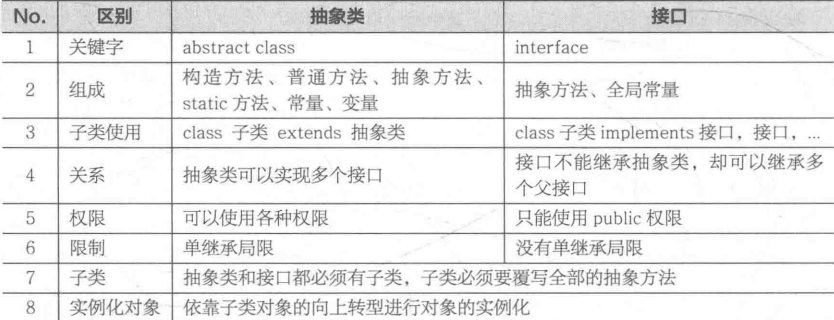

## 接口

### 接口概述

为了解决抽象类单继承的局限，Java提供了接口。如果一个类只是由抽象方法和全局常量组成的，那么在这种情况下不会将其定义为一个抽象类，而只会定义为接口。接口就是一种公共规范标准，只要符合规范，大家都可以通用。

### 接口的使用原则

- 接口必须有子类，但是一个子类可以实现多个接口。（如果子类实现的多个接口中有重名的方法会报错）
- 接口的子类必须重写接口中所有的抽象方法。(如果不想重写全部抽象方法，就定义成抽象类)
- 接口不能实例化（接口没有构造方法），可以利用实现类对象的向上转型进行实例化操作。

```java
interface A{
    public static final String MSG = "HelloWorld!";
    public abstract void print();
}
```

对接口而言，**其组成部分就是抽象方法和全局常量**，所以很多人为了省事不写public abstract和public static final。上式等价于：

```java
interface A{
    String MSG = "HelloWorld!";
    void print();
}
```

即使在接口的方法中没有写上public，其最终的访问权限也是public而不是default，覆写接口方法的子类方法的权限不能低于接口的权限，所以子类的方法必须加上public。既然如此，建议在接口中也写上public以防权限出错。  
如果一个类既要继承抽象类又要实现接口，那么应该采用先继承后实现接口的顺序完成。一个抽象类可以继承一个抽象类或实现若干个接口，但是一个接口却不能继承抽象类。不过一个接口可以使用extends同时继承多个父接口。

```java
interface A{	//父接口
    public abstract void funA();
}
interface B{	//父接口
    public abstract void funB();
}
interface C extends A,B{	//接口多继承
    public void funC();
}
class X implements C{	//实现C接口要覆写全部抽象方法
    public void funA(){}
    public void funB }
    public void funC(){}
}
```

下面是一段模拟usb接口的代码：

```java
//定义一个usb接口，供其他设备使用
public interface USB {
    public static final String VERSION= "USB 3.1";
    public abstract void start();
    void stop(); //接口中的方法默认是public abstract，可以略写
}

//定义u盘，实现usb接口的方法
class Flash implements USB{
    public void start(){
        System.out.println("U盘开始使用");
    }
    public void stop(){	//接口中的stop()方法没写权限，但要知道其默认是public，所以这里的权限也要是public
        System.out.println("U盘停止使用");
    }
}

//定义一个打印机，实现usb接口的方法
public class Printer implements USB{
    public void start(){
        System.out.println("打印机开始工作");
    }
    public void stop(){
        System.out.println("打印机停止工作");
    }
}

//定义计算机类
public class Computer {
    public void plugin(USB u){  //电脑有插入和拔出usb设备的方法
        u.start();
        u.stop();
    }
}

//一个测试类
public class TestUSB{
    public static void main(String[] args) {
        Computer c = new Computer();
        c.plugin(new Flash());
        c.plugin(new Printer());
    }
}
```

程序执行结果：

> U盘开始使用
> U盘停止使用
> 打印机开始工作
> 打印机停止工作



从以上的对象可以看出抽象类的优点比接口更多，但是单继承这一局限完全掩盖了抽象类的优点，所以实际中能用接口就用接口。


### 抽象类和接口的区别

- 抽象类中的方法可以有方法体，就是能实现方法的具体功能，但是接口中的方法不行。

- 抽象类中的成员变量可以是各种类型的，而接口中的成员变量只能是 **public static final** 类型的。

- 接口中不能含有静态代码块以及静态方法(用 static 修饰的方法)，而抽象类是可以有静态代码块和静态方法。

- 一个类只能继承一个抽象类，而一个类却可以实现多个接口。

  > JDK 1.8 以后，接口里可以有静态方法和方法体了。

### 方法名冲突

当同时继承父类和实现了接口的时候，如果父类和接口有重名的方法，子类优先执行父类的方法。

如果同时实现了多个接口，而多个接口中有签名相同的默认方法时，要么重写要么指定要调用的方法。

```java
interface A{
    public default void date(){
		System.out.println("今晚7点-8点陪刘亦菲吃饭看电影");
	}
}
interface B{
    public default void date(){
		System.out.println("今晚7点-8点陪杨幂吃饭看电影");
	}
}

class Me implements A,B{
    @Override
    public void date(){
        A.super.date();//通过: 接口名.super.方法名 法选择保留哪个接口的默认方法。
    } 
    /*或者选择自己完全重写
    @Override
	public void date() {
		System.out.println("自己待着");
	}
    */
}
```

### 接口新特性

随着一些接口被广泛使用，其中的功能可能不够用了，那么就需要添加新的抽象方法。如果一个接口添加了新的抽象方法，那么所有实现此接口的子类都必须覆写此方法，如果一个接口有几十万个子类，那么覆写的任务非常繁重。所以Java引入了新的特性，可以在接口中定义普通方法或静态方法，子类可以根据需要来自行决定是否覆写。
如果要在接口中定义普通方法（默认方法），必须使用public default关键字。如果想要定义静态方法，使用public static关键字。

* 接口的新成员
  * 默认方法（Java8）：默认方法不是抽象方法，所以不强制被重写，但是可以被重写。重写的时候去掉default关键字。public可以省略，default不能省略

  * 静态方法（Java9）：定义格式和普通类中的静态方法完全一样。但是**接口中的静态方法只能通过接口名调用**，不能通过实现类名或者对象名调用。public可以省略，static不能省略。接口的静态方法不能重写。

  * 私有方法（java9）：Java 9中新增了带方法体的私有方法，这其实在Java 8中就埋下了伏笔：Java 8允许在接口中定义带方法体的默认方法和静态方法。这样可能就会引发一个问题：当两个默认方法或者静态方法中包含一段相同的代码实现时，程序必然考虑将这段实现代码抽取成一个共性方法，而这个共性方法是不需要让别人使用的，因此用私有给隐藏起来，这就是Java 9增加私有方法的必然性。

    - 格式1

      private 返回值类型 方法名(参数列表) {   }

      ```java
      private void show() {  
      }
      ```

    - 格式2

      private static 返回值类型 方法名(参数列表) {   }

      ```java
      private static void method() {  
      }
      ```

```java
interface IMessage{
    public abstract void print();	//抽象方法，必须覆写
    public default void fun(){	 //Java的新特性允许在接口中定义普通抽象方法，子类可以根据需要来覆写
        System.out.println("接口中的普通方法");
    }
    public static void show(){
        System.out.println("接口中的静态方法");
    }
}
class MessageImpl implements IMessage{
    public void print(){
        System.out.println("快上车");
    }
}

public class Demo{
    public static void main(String[] args) {
        MessageImpl m = new MessageImpl();
        m.print();
        m.fun();
    }
}
```

### 标记接口

标记接口是没有任何方法和属性的接口.它仅仅表明它的类属于一个特定的类型,供其他代码来测试允许做一些事情。最常用的继承接口就是标记接口。

标记接口作用：简单形象的说就是给某个对象打个标（盖个戳），使对象拥有某个或某些特权。

例如：java.awt.event 包中的 MouseListener 接口继承的 java.util.EventListener 接口定义如下：

```java
package java.util;
public interface EventListener
{}
```

没有任何方法的接口被称为标记接口。标记接口主要用于以下两种目的：

- 建立一个公共的父接口：

  正如EventListener接口，这是由几十个其他接口扩展的Java API，你可以使用一个标记接口来建立一组接口的父接口。例如：当一个接口继承了EventListener接口，Java虚拟机(JVM)就知道该接口将要被用于一个事件的代理方案。

- 向一个类添加数据类型：

  这种情况是标记接口最初的目的，实现标记接口的类不需要定义任何接口方法(因为标记接口根本就没有方法)，但是该类通过多态性变成一个接口类型。

[上一节](https://www.nowcoder.com/tutorial/10001/d03eb3a55c714dd7a27696558c54c7be)

## 经典接口

### Comparable

我们知道基本数据类型的数据（除boolean类型外）需要比较大小的话，使用比较运算符即可，但是引用数据类型是不能直接使用比较运算符来比较大小的。那么，如何解决这个问题呢？

Java 给所有引用数据类型的大小比较，指定了一个标准接口，就是java.lang.Comparable接口：

```java
package java.lang;

public interface Comparable{
    int compareTo(Object obj);
}
```

那么我们想要使得我们某个类的对象可以比较大小，怎么做呢？步骤：

1. 哪个类的对象要比较大小，哪个类就实现Comparable接口，重写 CompareTo 方法。此方法的返回值决定了对象的大小。
   1. this > obj，返回正整数
   2. this < obj，返回负整数
   3. this = obj，返回0

2. 对象比较大小时，通过对象调用compareTo方法，根据方法的返回值决定谁大谁小。

代码示例：

```java
public class TestComparable {
	public static void main(String[] args) {
		Student s1 = new Student(1"张三",89);
		Student s2 = new Student(2,"李四",89);
		if(s1.compareTo(s2)>0){
			System.out.println("s1>s2");
		}else if(s1.compareTo(s2)<0){
			System.out.println("s1<s2");
		}else{
			System.out.println("s1 = s2");
		}
	}
}
class Student implements Comparable{
	private String name;
	private int score;
	
	//省略构造器、get/set、toString等方法

	@Override
	public int compareTo(Object o) {
		//这些需要强制将 o 向下转型为Student类型的变量，才能调用Student类中的属性
		Student stu = (Student) o;
		if(this.score != stu.score){
			return this.score - stu.score;//按成绩大小比较
		}else{//成绩相同，按照姓名排序
			return this.name.CompareTo(stu.name);
		}
	}
	
}
```

##### 练习1：冒泡排序

声明一个Employee员工类，包含编号、姓名、薪资，实现Comparable接口，要求，按照薪资比较大小，如果薪资相同，按照编号比较大小。

声明一个测试类TestEmployee类，在main中创建Employee[]数组，长度为5，并且存储5个员工对象，现在要求用冒泡排序，实现对这个数组进行排序，遍历结果。

```java
class Employee implements Comparable{
	private int id;
	private String name;
	private double salary;
	public Employee(int id, String name, double salary) {
		super();
		this.id = id;
		this.name = name;
		this.salary = salary;
	}
	public Employee() {
		super();
	}
	public int getId() {
		return id;
	}
	public void setId(int id) {
		this.id = id;
	}
	public String getName() {
		return name;
	}
	public void setName(String name) {
		this.name = name;
	}
	public double getSalary() {
		return salary;
	}
	public void setSalary(double salary) {
		this.salary = salary;
	}
	@Override
	public String toString() {
		return "Employee [id=" + id + ", name=" + name + ", salary=" + salary + "]";
	}
	@Override
	public int compareTo(Object o) {
		Employee emp = (Employee) o;
		if(this.getSalary() != emp.getSalary()){
			return Double.compare(this.getSalary(), emp.getSalary());
		}
		return this.id - emp.id;
	}
}
```

```java
public class TestComparable {
	public static void main(String[] args) {
		Employee[] arr = new Employee[5];
		arr[0] = new Employee(1,"张三",13000);
		arr[1] = new Employee(2,"李四",13000);
		arr[2] = new Employee(3,"王五",14000);
		arr[3] = new Employee(4,"赵六",7000);
		arr[4] = new Employee(5,"钱七",9000);
		
		//原顺序
		System.out.println("员工列表：");
		for (int i = 0; i < arr.length; i++) {
			System.out.println(arr[i]);
		}
		//冒泡排序
		for (int i = 1; i < arr.length; i++) {
			for (int j = 0; j < arr.length-i; j++) {
                //因为Employee类型实现了Comparable接口，所以有compareTo()方法
				if(arr[j].compareTo(arr[j+1])>0){
					Employee temp = arr[j];
					arr[j] = arr[j+1];
					arr[j+1] = temp;
				}
			}
		}
		System.out.println("排序后员工列表：");
		for (int i = 0; i < arr.length; i++) {
			System.out.println(arr[i]);
		}
	}
}
```

##### 练习2：自定义数组排序工具类

自定义一个数组工具类MyArrays，它包含一个静态方法，可以给任意对象数组用冒泡排序实现从小到大排序，该怎么定义这个方法呢？

```java
class MyArrays{
	public static void sort(Comparable[] arr){
		//冒泡排序
		for (int i = 1; i < arr.length; i++) {
			for (int j = 0; j < arr.length-i; j++) {
                
				if(arr[j].compareTo(arr[j+1])>0){
					Object temp = arr[j];
					arr[j] = arr[j+1];
					arr[j+1] = temp;
				}
			}
		}
	}
    
    public static void print(Object[] arr){
        for (int i = 0; i < arr.length; i++) {
			System.out.println(arr[i]);
		}
    }
}

```

使用自定义的MyArrays数组工具类，给练习1的员工数组进行排序

```java
public class TestComparable {
	public static void main(String[] args) {
		Employee[] arr = new Employee[5];
		arr[0] = new Employee(1,"张三",13000);
		arr[1] = new Employee(2,"李四",13000);
		arr[2] = new Employee(3,"王五",14000);
		arr[3] = new Employee(4,"赵六",7000);
		arr[4] = new Employee(5,"钱七",9000);
		
		//原顺序
		System.out.println("员工列表：");
		MyArrays.print(arr);
        
        //要求Employee类型必须实现Comparable接口，否则将发生ClassCastException异常
		MyArrays.sort(arr);
        
		System.out.println("排序后员工列表：");
		MyArrays.print(arr);
	}
}
```

> java.util.Arrays数组工具类的public static void sort(Object[] a)就是这么实现的，只不过它使用的排序算法是效率更高快排，而不是冒泡排序，但是无论哪种排序算法，最终都要涉及到两个元素的比较大小，都需要通过元素调用compareTo()方法。

### Comparator

思考：

（1）如果一个类，没有实现Comparable接口，而这个类你又不方便修改（例如：一些第三方的类，你只有.class文件，没有源文件），那么这样类的对象也要比较大小怎么办？

（2）如果一个类，实现了Comparable接口，也指定了两个对象的比较大小的规则，但是此时此刻我不想按照它预定义的方法比较大小，但是我又不能随意修改，因为会影响其他地方的使用，怎么办？

JDK在设计类库之初，也考虑到这种情况了，所以又增加了一个java.util.Comparator接口。

```java
package java.util;

public interface Comparator{
    int compare(Object o1,Object o2);
}
```

那么我们想要比较某个类的两个对象的大小，怎么做呢？步骤：

第一步：编写一个类，我们称之为比较器类型，实现java.util.Comparator接口，并重写方法

* 方法体就是你要如何指定的两个对象的大小

第二步：比较大小时，通过比较器类型的对象调用compare()方法，将要比较大小的两个对象作为compare方法的实参传入，根据方法的返回值决定谁大谁小。

* o1对象大于o2返回正整数
* o1对象小于o2返回负整数
* o1对象等于o2返回零

代码示例：一个没有实现Comparable接口的学生类

```java
class Student{
	private String name;
	private int score;
	public Student(String name, int score) {
		super();
		this.name = name;
		this.score = score;
	}
	public Student() {
		super();
	}
	public String getName() {
		return name;
	}
	public void setName(String name) {
		this.name = name;
	}
	public int getScore() {
		return score;
	}
	public void setScore(int score) {
		this.score = score;
	}
	@Override
	public String toString() {
		return "Student [name=" + name + ", score=" + score + "]";
	}
	
}
```

代码示例：定义定制比较器类

```java
class StudentScoreCompare implements Comparator{

	@Override
	public int compare(Object o1, Object o2) {
		Student s1 = (Student) o1;
		Student s2 = (Student) o2;
		return s1.getScore() - s2.getScore();
	}
	
}
```

代码示例：测试类

```java
import java.util.Comparator;

public class TestComparator {
	public static void main(String[] args) {
		Student stu1 = new Student("张三",89);
		Student stu2 = new Student("李四",78);
		
		StudentScoreCompare ssc = new StudentScoreCompare();
		if(ssc.compare(stu1, stu2)>0){
			System.out.println(stu1 + ">" + stu2);
		}else if(ssc.compare(stu1, stu2)<0){
			System.out.println(stu1 + "<" + stu2);
		}else{
			System.out.println(stu1 + "=" + stu2);
		}
	}
}
```

##### 练习1：冒泡排序

声明一个Employee员工类，包含编号、姓名、薪资，

声明一个测试类，在main中，创建Employee[]数组，长度为5，显示原来顺序结果

声明一个定制比较器EmpSalaryComparator，实现Comparator接口，按照薪资比较大小

声明一个定制比较器EmpIdComparator，实现Comparator接口，按照编号比较大小

在测试类中，分别用这个两个比较器对象，对数组进行排序，并显示排序后结果

员工类示例代码：

```java
class Employee{
	private int id;
	private String name;
	private double salary;
	public Employee(int id, String name, double salary) {
		super();
		this.id = id;
		this.name = name;
		this.salary = salary;
	}
	public Employee() {
		super();
	}
	public int getId() {
		return id;
	}
	public void setId(int id) {
		this.id = id;
	}
	public String getName() {
		return name;
	}
	public void setName(String name) {
		this.name = name;
	}
	public double getSalary() {
		return salary;
	}
	public void setSalary(double salary) {
		this.salary = salary;
	}
	@Override
	public String toString() {
		return "Employee [id=" + id + ", name=" + name + ", salary=" + salary + "]";
	}
}
```

员工薪资定制比较器类型：

```java
class EmpSalaryComparator implements Comparator{

	@Override
	public int compare(Object o1, Object o2) {
		Employee e1 = (Employee) o1;
		Employee e2 = (Employee) o2;
		return Double.compare(e1.getSalary(), e2.getSalary());
	}
	
}
```

员工编号定制比较器类型：

```java
class EmpIdComparator implements Comparator{

	@Override
	public int compare(Object o1, Object o2) {
		Employee e1 = (Employee) o1;
		Employee e2 = (Employee) o2;
		return e1.getId() - e2.getId();
	}
	
}
```

测试类示例代码：

```java
import java.util.Comparator;

public class TestComparator {
	public static void main(String[] args) {
		Employee[] arr = new Employee[5];
		arr[0] = new Employee(1,"张三",13000);
		arr[1] = new Employee(3,"王五",14000);
		arr[2] = new Employee(2,"李四",13000);
		arr[3] = new Employee(4,"赵六",7000);
		arr[4] = new Employee(5,"钱七",9000);
		
		//原顺序
		System.out.println("员工列表：");
		for (int i = 0; i < arr.length; i++) {
			System.out.println(arr[i]);
		}
		
		EmpSalaryComparator ec = new EmpSalaryComparator();
		//冒泡排序
		for (int i = 1; i < arr.length; i++) {
			for (int j = 0; j < arr.length-i; j++) {
				if(ec.compare(arr[j], arr[j+1])>0){
					Employee temp = arr[j];
					arr[j] = arr[j+1];
					arr[j+1] = temp;
				}
			}
		}
		
		System.out.println("按照薪资排序后员工列表：");
		for (int i = 0; i < arr.length; i++) {
			System.out.println(arr[i]);
		}
		
		EmpIdComparator ec2 = new EmpIdComparator();
		//冒泡排序
		for (int i = 1; i < arr.length; i++) {
			for (int j = 0; j < arr.length-i; j++) {
				if(ec2.compare(arr[j], arr[j+1])>0){
					Employee temp = arr[j];
					arr[j] = arr[j+1];
					arr[j+1] = temp;
				}
			}
		}
				
		System.out.println("按照编号排序后员工列表：");
		for (int i = 0; i < arr.length; i++) {
			System.out.println(arr[i]);
		}
	}
}
```

##### 练习2：自定义数组排序工具类

自定义一个数组工具类MyArrays，它包含一个静态方法，可以给任意对象数组用冒泡排序实现从小到大排序，该怎么定义这个方法呢？

```java
class MyArrays{
	public static void sort(Object[] arr,Comparator c){
		//冒泡排序
		for (int i = 1; i < arr.length; i++) {
			for (int j = 0; j < arr.length-i; j++) {
				//这里不需要强制类型转换
				if(c.compare(arr[j], arr[j+1])>0){
					Object temp = arr[j];
					arr[j] = arr[j+1];
					arr[j+1] = temp;
				}
			}
		}
	}
	
    public static void print(Object[] arr){
 		for (int i = 0; i < arr.length; i++) {
			System.out.println(arr[i]);
		}       
    }
}
```

用新工具类，简化练习1测试类的代码

```java
public class TestComparator {
	public static void main(String[] args) {
		Employee[] arr = new Employee[5];
		arr[0] = new Employee(1,"张三",13000);
		arr[1] = new Employee(3,"王五",14000);
		arr[2] = new Employee(2,"李四",13000);
		arr[3] = new Employee(4,"赵六",7000);
		arr[4] = new Employee(5,"钱七",9000);
		
		//原顺序
		System.out.println("员工列表：");
		MyArrays.print(arr);
		
		EmpSalaryComparator ec = new EmpSalaryComparator();
		MyArrays.sort(arr, ec);
		
		System.out.println("按照薪资排序后员工列表：");
		MyArrays.print(arr);
		
		EmpIdComparator ec2 = new EmpIdComparator();
		MyArrays.sort(arr, ec2);
				
		System.out.println("按照编号排序后员工列表：");
		MyArrays.print(arr);
	}
}
```

> java.util.Arrays数组工具类的public static <T> void sort(T[] a, Comparator<? super T> c)就是这做的

### Cloneable

在java.lang.Object类中有一个方法：

```java
protected Object clone()throws CloneNotSupportedException 
```

所有类型都可以重写这个方法，它是获取一个对象的克隆体对象用的，就是造一个和当前对象各种属性值一模一样的对象。当然地址肯定不同。

我们在重写这个方法后时，调用super.clone()，发现报异常CloneNotSupportedException，因为我们没有实现java.lang.Cloneable接口。

```java
class Teacher implements Cloneable{
	private int id;
	private String name;
	
    //构造器、setter、getter略
    
	@Override
	public Object clone() throws CloneNotSupportedException {
		return super.clone();
	}
}
```

```java
public class TestClonable {
	public static void main(String[] args) throws CloneNotSupportedException {
		Teacher src = new Teacher(1,"高老师");
		Object clone = src.clone();
		System.out.println(clone);
		System.out.println(src == clone);
		System.out.println(src.equals(clone));
	}
}
```
