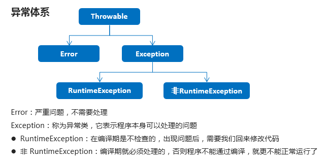

## 异常

### 异常概述

异常是导致程序中断的一种指令流。发生异常时，默认情况下程序会打印异常信息并在发生异常的位置中断，不再执行后面的代码。为了让程序在出现异常之后可以继续执行，必须引入异常处理语句来完善代码编写。  
异常的体系结构



要理解Java异常处理是如何工作的，你需要掌握以下三种类型的异常：

- **检查性异常：**最具代表的检查性异常是用户错误或问题引起的异常，这是程序员无法预见的。例如要打开一个不存在文件时，一个异常就发生了，这些异常在编译时不能被简单地忽略。
- **运行时异常：** 运行时异常是可能被程序员避免的异常。与检查性异常相反，运行时异常可以在编译时被忽略。
- **错误：** 错误不是异常，而是脱离程序员控制的问题。错误在代码中通常被忽略。例如，当栈溢出时，一个错误就发生了，它们在编译也检查不到的。

### try-catch方法处理异常

Java通过try、catch和finally三个关键字组成异常处理格式。
执行流程：

* 程序从try里面的代码开始执行
* 出现异常，就会跳转到对应的catch里面去执行，try代码块未执行的代码将被跳过
* 执行完毕之后，程序还可以继续向下执行
* 如果有些代码必须要被执行，可以将其加到finally块中（无论有没有异常，finally中的代码都将被执行）。

注意事项：

1. try里面定义的变量不能在catch和finally中使用，如果要使用就在try外面定义。
2. 如果finally有return，无论前面的语句有没有return，最终返回的都是finally里的return。如果finally中没有return，其他位置有return，则先执行完finally再去return。

```java
public class TestAbnormal {
    public static void main(String[] args) {
        try{
            System.out.println("计算出发：10/0 = "+(10/0));  //这里出现异常
            System.out.println("计算完毕。");    //出现异常后，将不再执行后面的语句，这条代码被跳过
        }catch (ArithmeticException e){	//处理算术异常
            System.out.println("*****出现异常了*****");
            e.printStockTrace();//异常类中提供了printStackTrace()方法，可以输出异常的完整信息。
        }
        System.out.println("程序结束了。");
    }
}
/*执行结果：
*****出现异常了*****
程序结束了。
java.lang.ArithmeticException: / by zero
	at abnormalTest.TestAbnormal.main(TestAbnormal.java:6)
*/
```

### Throwable成员方法

| 方法名                        | 说明                                   |
| ----------------------------- | -------------------------------------- |
| public String getMessage()    | 返回此 Throwable 的详细信息字符串      |
| public Throwable getCause()   | 返回一个 Throwable 对象代表异常原因    |
| public String toString()      | 返回异常的类名                         |
| public void printStackTrace() | 打印toString()结果和栈层次到System.err |

```java
public class ExceptionDemo02 {
    public static void main(String[] args) {
        System.out.println("开始");
        method();
        System.out.println("结束");
    }

    public static void method() {
        try {
            int[] arr = {1, 2, 3};
            System.out.println(arr[3]); //JVM自动实例化了一个异常类的对象 new ArrayIndexOutOfBoundsException();
            System.out.println("这里能够访问到吗");
        } catch (ArrayIndexOutOfBoundsException e) {
           //e.printStackTrace();

            //public String getMessage():返回此 throwable 的详细消息字符串
//            System.out.println(e.getMessage());
            //结果：Index 3 out of bounds for length 3

            //public String toString():返回此可抛出的简短描述
//            System.out.println(e.toString());
            //java.lang.ArrayIndexOutOfBoundsException: Index 3 out of bounds for length 3

            //public void printStackTrace():把异常的错误信息输出在控制台
            e.printStackTrace();
/*java.lang.ArrayIndexOutOfBoundsException: Index 3 out of bounds for length 3 at com.itheima_02.ExceptionDemo02.method(ExceptionDemo02.java:18)
*/

        }
    }
}
```

为了处理更多的异常类型，一个try可以和多个catch组合。不过每一种类型的异常都编写一条catch语句太过麻烦，如果可以利用子类对象向父类对象自动转型的多态性就可以简化了。

### 编译时异常和运行时异常的区别

- 编译时异常
  - 都是Exception类及其子类
  - 必须显示处理，否则程序就会发生错误，无法通过编译

- 运行时异常
  - 都是RuntimeException类及其子类
  - 无需显示处理，也可以和编译时异常一样处理

当程序运行中出现异常时，JVM会根据异常的类型自动实例化一个对象。如果没有try、catch语句，JVM会默认输出异常的的信息，然后结束程序。如果有try、catch语句，那么只要使用Exception类作为catch的参数就可以接收所有的异常类对象了，因为所有异常类都是Exception类的子类。

```java
public class TestAbnormal {
    public static void main(String[] args) {
        try{
            System.out.println("计算出发：10/0 = "+(10/0));  //这里出现异常
            System.out.println("计算完毕。");    //出现异常后，将不再执行后面的语句，这条代码被跳过
        }catch (Exception e){	//这样就可以处理所有类型的异常了
            System.out.println("*****出现异常了*****");
            e.printStockTrace();//异常类中提供了printStackTrace()方法，可以输出异常的完整信息。
        }
        System.out.println("程序结束了。");
    }
}
```

### thorws方式处理异常

Java 中允许在方法的后面使用 throws 关键字对外声明该方法有可能发生的异常，这样调用者在调用方法时，就明确地知道该方法有异常，并且必须在程序中对异常进行处理，否则编译无法通过。

* 编译时异常必须要进行处理，那么有两种处理方式：try...catch...或者throws，如果采用throws这种方式，将来谁调用谁处理。
* 运行时异常可以不处理，出现问题后再返回修改代码。  
  定义格式  

```java
public void method() throws 异常类名{
    
}
```

示例代码

```java
public class TestThrows {
    public static void main(String[] args) {
    try{
        System.out.println(TestThrows.div(10,0));	//调用此方法必须进行异常处理
    }catch (Exception e){
        System.out.println("出现异常了！！！");
        e.printStackTrace();
    }
    }
    public static int div(int x,int y)throws Exception{	//throws可以告诉调用者潜在的异常信息
        return x/y;
    }
}
```

### 自定义异常

实际开发中，Java提供的异常类并不能满足我们的需要，比如学生的成绩必须在0-100之间，所以我们需要自定义异常。如果想要自定义一个异常类，只要此类继承Exception类即可。

```java
public class ScoreException extends Exception {//Exception是编译时异常，必须进行异常处理

    public ScoreException() {}

    public ScoreException(String message) {
        super(message);	//调用父类Exception类的有参构造方法
    }

}
```

前面的所有异常都是Java定义的，可以使用throw来抛出自定义异常类型。

老师类  

```java
public class Teacher {
    public void checkScore(int score) throws ScoreException {//throws其实是为了提示程序员这里会抛出一个异常
        if(score<0 || score>100) {
            throw new ScoreException("你给的分数有误，分数应该在0-100之间");//这里抛出的异常可以用printStackTrace方法打印
        } else {
            System.out.println("成绩正常");
        }
    }
}
```

测试类

```java
public class Demo {
    public static void main(String[] args) {
        Scanner sc = new Scanner(System.in);
        System.out.println("请输入分数：");
        int score = sc.nextInt();

        Teacher t = new Teacher();
        try {
            t.checkScore(score);//此方法会throw一个异常，所以必须用try-catch语句接受
        } catch (ScoreException e) {
            e.printStackTrace();//此方法继承自Throwable，会打印错误的信息
        }
    }
}
```

常见面试题：请分析throw和throws的区别：

throw：指的是人为抛出一个异常类对象

throws：在方法的声明中使用，表示在调用此方法时必须处理异常。

throws

- 用在方法声明后面，跟的是异常类名
- 表示会抛出异常，需要程序员使用try-catch处理
- 表示的是出现异常的可能性，不一定会真的出现异常

throw

- 用在方法体内，跟的是异常对象名
- 表示抛出异常，由方法体内的语句处理
- 执行throw一定是出现了异常

