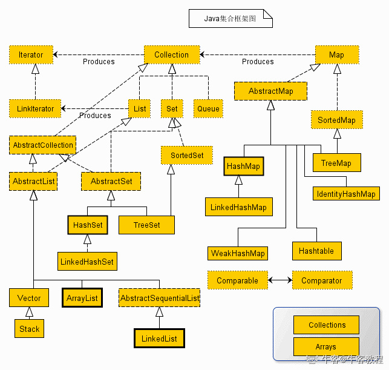
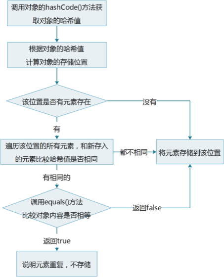
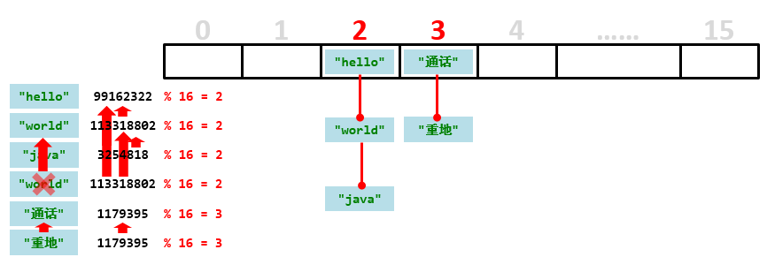

# Java集合框架

容器，就是可以容纳其他Java对象的对象。Java容器里只能放对象，对于基本类型(int, long, float, double等)，需要将其包装成对象类型后(Integer, Long, Float, Double等)才能放到容器里。很多时候拆包装和解包装能够自动完成。这虽然会导致额外的性能和空间开销，但简化了设计和编程。

集合提供一种存储空间可变的存储模型，存储的数据容量可以改变。按照数据的组成可以分为单列集合和双列集合，按照元素能否重复分为可重复集合与不可重复集合。Java提供了多种接口来帮助实现不同的集合需求。  


从上面的集合框架图可以看到，Java 集合框架主要包括两种类型的容器，一种是集合（Collection），存储一个元素集合，另一种是图（Map），存储键/值对映射。Collection 接口又有 3 种子类型，List、Set 和 Queue，再下面是一些抽象类，最后是具体实现类，常用的有 ArrayList、LinkedList、HashSet、LinkedHashSet、HashMap、LinkedHashMap 等等。

集合框架是一个用来代表和操纵集合的统一架构。所有的集合框架都包含如下内容：

- **接口：**是代表集合的抽象数据类型。例如 Collection、List、Set、Map 等。之所以定义多个接口，是为了以不同的方式操作集合对象
- **实现（类）：**是集合接口的具体实现。从本质上讲，它们是可重复使用的数据结构，例如：ArrayList、LinkedList、HashSet、HashMap。
- **算法：**是实现集合接口的对象里的方法执行的一些有用的计算，例如：搜索和排序。这些算法被称为多态，那是因为相同的方法可以在相似的接口上有着不同的实现。

除了集合，该框架也定义了几个 Map 接口和类。Map 里存储的是键/值对。尽管 Map 不是集合，但是它们完全整合在集合中。

## 集合接口

集合框架定义了一些接口。本节提供了每个接口的概述：

| 序号 |                           接口描述                           |
| :--: | :----------------------------------------------------------: |
|  1   | Collection 接口 Collection 是最基本的集合接口，一个 Collection 代表一组 Object，即 Collection 的元素, Java不提供直接继承自Collection的类，只提供继承于的子接口(如List和set)。Collection 接口存储一组不唯一，无序的对象。 |
|  2   | List 接口 List接口是一个有序的 Collection，使用此接口能够精确的控制每个元素插入的位置，能够通过索引(元素在List中位置，类似于数组的下标)来访问List中的元素，第一个元素的索引为 0，而且允许有相同的元素。List 接口存储一组不唯一，有序（插入顺序）的对象。 |
|  3   | Set Set 具有与 Collection 完全一样的接口，只是行为上不同，Set 不保存重复的元素。Set 接口存储一组唯一，无序的对象。 |
|  4   |             SortedSet 继承于Set保存有序的集合。              |
|  5   | Map Map 接口存储一组键值对象，提供key（键）到value（值）的映射。 |
|  6   | Map.Entry 描述在一个Map中的一个元素（键/值对）。是一个Map的内部类。 |
|  7   |        SortedMap 继承于 Map，使 Key 保持在升序排列。         |
|  8   | Enumeration 这是一个传统的接口和定义的方法，通过它可以枚举（一次获得一个）对象集合中的元素。这个传统接口已被迭代器取代。 |

### Set和List的区别

- Set 接口实例存储的是无序的，不重复的数据。List 接口实例存储的是有序的，可以重复的元素。
- Set检索效率低下，删除和插入效率高，插入和删除不会引起元素位置改变 **(实现类有HashSet,TreeSet)**。
- List和数组类似，可以动态增长，根据实际存储的数据的长度自动增长List的长度。查找元素效率高，插入删除效率低，因为会引起其他元素位置改变 **(实现类有ArrayList,LinkedList,Vector)** 。

## Collection

* Collection集合概述

  - 是单列集合的顶层接口，它表示一组对象，这些对象也称为Collection的元素
  - JDK 不提供此接口的任何直接实现，它提供更具体的子接口（如Set和List）实现
* Collection集合的基本使用
  * 创建Collection集合的对象采用多态的方式
  * 具体的实现类采用ArrayList

```java
public class CollectionDemo01 {
    public static void main(String[] args) {
        //创建Collection集合的对象
        Collection<String> c = new ArrayList<String>();//使用了泛型

        //添加元素：boolean add(E e)
        c.add("hello");
        c.add("world");
        c.add("java");

        //输出集合对象
        System.out.println(c);//ArrayList类中重写了toString方法
    }
}
/*执行结果：
[hello,world,java]
*/
```

### Collection集合的常用方法

| 方法名                     | 说明                               |
| -------------------------- | ---------------------------------- |
| boolean add(E e)           | 添加元素                           |
| boolean remove(Object o)   | 从集合中移除指定的元素             |
| void clear()               | 清空集合中的元素                   |
| boolean contains(Object o) | 判断集合中是否存在指定的元素       |
| boolean isEmpty()          | 判断集合是否为空                   |
| int size()                 | 集合的长度，也就是集合中元素的个数 |

### 集合布尔运算

1. A.containsAll(B); 如果A包含集合B的所有元素，返回true
2. A.removeAll(B); A集合变成了 A-B
3. A.retainAll(B); A集合变成了A和B的交集
4. A.addAll(B); A集合变成了A和B的并集

## List

- List集合概述
  - 有序集合(也称为序列)，用户可以精确控制列表中每个元素的插入位置。用户可以通过整数索引访问元素，并搜索列表中的元素
  - 与Set集合不同，列表通常允许重复的元素
- List集合特点
  - 有索引
  - 可以存储重复元素
  - 元素存取有序

### List集合的特有方法

| 方法名                                     | 描述                                         |
| ------------------------------------------ | -------------------------------------------- |
| void add(int index,E element)              | 在此集合中的指定位置插入指定的元素           |
| E remove(int index)                        | 删除指定索引处的元素，返回被删除的元素       |
| boolean remove(Object o)                   | 删除制定的元素，如果此元素重复，只删除第一个 |
| E set(int index,E element)                 | 修改指定索引处的元素，返回被修改的元素       |
| E get(int  index)                          | 返回指定索引处的元素                         |
| default void sort(Comparator<? super E> c) | 根据指定的外部排序器排序列表                 |

```java
package CollectionDemo;

import java.util.ArrayList;
import java.util.List;

public class ListTest {
    public static void main(String[] args) {
        List<String> li = new ArrayList<String>();
        li.add("Hello");
        li.add("World");
        li.add("Java");

        li.remove(0);//这是List类的特有方法
        li.remove("Java");//此方法继承自Collection类
        System.out.println(li);

        li.clear();
        li.add("World");
        li.add(0,"Hello");
        System.out.println(li);
    }
}
/*console：
[World]
[Hello, World]
/
```

### List集合的实现类

- ArrayList集合

  ​	底层是数组结构实现，查询快、增删慢

- LinkedList集合

  ​	底层是链表结构实现，查询慢、增删快

### ArrayList

- ArrayList集合的特点

  ​	底层是数组实现的，长度可以变化

- 泛型的使用

  ​	用于约束集合中存储元素的数据类型

#### ArrayList常用方法

| 方法名                                  | 说明                                   |
| --------------------------------------- | -------------------------------------- |
| public boolean  remove(Object o)        | 删除指定的元素，返回删除是否成功       |
| public E  remove(int  index)            | 删除指定索引处的元素，返回被删除的元素 |
| public E  set(int index,E   element)    | 修改指定索引处的元素，返回被修改的元素 |
| public E  get(int   index)              | 返回指定索引处的元素                   |
| public int  size()                      | 返回集合中的元素的个数                 |
| public boolean  add(E e)                | 将指定的元素追加到此集合的末尾         |
| public void  add(int index,E   element) | 在此集合中的指定位置插入指定的元素     |
| public Object[] toArray                 | 返回一个数组                           |

```java
public class ArrayListDemo02 {
    public static void main(String[] args) {
        //创建集合，用到了泛型
        ArrayList<String> array = new ArrayList<String>();
        //可以把初始大小传给ArrayList：new ArrayList<>(100); 或者 array.ensureCapacity(100);

        //添加元素
        array.add("hello");
        array.add("world");
        array.add("java");

        //public boolean remove(Object o)：删除指定的元素，返回删除是否成功
//        System.out.println(array.remove("world"));
//        System.out.println(array.remove("javaee"));

        //public E remove(int index)：删除指定索引处的元素，返回被删除的元素
//        System.out.println(array.remove(1));

        //IndexOutOfBoundsException
//        System.out.println(array.remove(3));

        //public E set(int index,E element)：修改指定索引处的元素，返回被修改的元素
//        System.out.println(array.set(1,"javaee"));

        //IndexOutOfBoundsException
//        System.out.println(array.set(3,"javaee"));

        //public E get(int index)：返回指定索引处的元素
//        System.out.println(array.get(0));
//        System.out.println(array.get(1));
//        System.out.println(array.get(2));
        //System.out.println(array.get(3)); //？？？？？？ 自己测试
        
        //一旦确定了数组列表的大小不再变了，就可以将多余的空间回收
        //array.trimT

        //public int size()：返回集合中的元素的个数
        System.out.println(array.size());

        //输出集合
        System.out.println("array:" + array);
    }
}
```

#### ArrayList存储学生对象并遍历

创建一个存储学生对象的集合，存储3个学生对象，使用程序实现在控制台遍历该集合，学生的姓名和年龄来自于键盘录入

```java
/*
    思路：
        1:定义学生类，为了键盘录入数据方便，把学生类中的成员变量都定义为String类型
        2:创建集合对象
        3:键盘录入学生对象所需要的数据
        4:创建学生对象，把键盘录入的数据赋值给学生对象的成员变量
        5:往集合中添加学生对象
        6:遍历集合，采用通用遍历格式实现
 */
public class ArrayListTest {
    public static void main(String[] args) {
        //创建集合对象
        ArrayList<Student> array = new ArrayList<Student>();

        //为了提高代码的复用性，我们用方法来改进程序
        addStudent(array);
        addStudent(array);
        addStudent(array);

        //遍历集合，采用通用遍历格式实现
        for (int i = 0; i < array.size(); i++) {
            Student s = array.get(i);
            System.out.println(s.getName() + "," + s.getAge());
        }
    }

    /*
        两个明确：
            返回值类型：void
            参数：ArrayList<Student> array
     */
    public static void addStudent(ArrayList<Student> array) {
        //键盘录入学生对象所需要的数据
        Scanner sc = new Scanner(System.in);

        System.out.println("请输入学生姓名:");
        String name = sc.nextLine();

        System.out.println("请输入学生年龄:");
        String age = sc.nextLine();

        //创建学生对象，把键盘录入的数据赋值给学生对象的成员变量
        Student s = new Student();
        s.setName(name);
        s.setAge(age);

        //往集合中添加学生对象
        array.add(s);
    }
}
```

### LinkedList

#### LinkedList集合的特有方法

| 方法名                    | 说明                                                         |
| ------------------------- | ------------------------------------------------------------ |
| public void addFirst(E e) | 在该列表开头插入指定的元素                                   |
| public void addLast(E e)  | 将指定的元素追加到此列表的末尾                               |
| public E getFirst()       | 返回此列表中的第一个元素                                     |
| public E getLast()        | 返回此列表中的最后一个元素                                   |
| int indexOf(Object o)     | 返回此列表中指定元素第一次出现时的索引，没有此元素则返回-1   |
| int lastIndexOf(Object o) | 返回此列表中指定元素最后一次出现时的索引，没有此元素则返回-1 |
| public E removeFirst()    | 从此列表中删除并返回第一个元素                               |
| public E removeLast()     | 从此列表中删除并返回最后一个元素                             |

## 集合的遍历

**Collection集合没有按照索引查看元素的方法，所以不能使用普通for循环遍历元素**，只能通过下面的两个方法：

- 迭代器
- 增强for循环

List集合有一个get()方法，可以根据索引获取元素，所以有三种方法遍历：

- 迭代器
- 普通for循环
- 增强for循环

### 迭代器

迭代器的介绍

- 迭代器，集合的专用遍历方式
- Iterator<E> iterator()：返回此集合中元素的迭代器，通过集合的iterator()方法得到
- hasNext()检测集合中是否还有下一个元素
- next()返回集合中的下一个元素

Collection集合的遍历

```java
public class IteratorDemo {
    public static void main(String[] args) {
        //创建集合对象
        Collection<String> c = new ArrayList<String>();//使用了泛型就只能接受String对象，如果不写，那么可以接受全部的数据类型，但是容易出现ClassCastException

        //添加元素
        Collecions.addAll(c,"hello","world","java","javaee");

        //Iterator<E> iterator()：返回此集合中元素的迭代器，通过集合的iterator()方法得到
        Iterator<String> it = c.iterator();

        //用while循环改进元素的判断和获取
        while (it.hasNext()) {
            String s = it.next();
            System.out.println(s);
        }
        
        //改成这种写法更好，节省内存，Iterator对象用完就删除了
        for(Iterator<String> it = c.iterator();it.hasNext();){
            String s = it.next();
            System.out.println(s);
        }
    }
}
```

ListIterator：

* 通过List集合的listIterator()方法得到，所以说它是List集合特有的迭代器

- 用于允许程序员沿任一方向遍历的列表迭代器，在迭代期间修改列表，并获取列表中迭代器的当前位置

```java
public class ListIteratorDemo {
    public static void main(String[] args) {
        //创建集合对象
        List<String> list = new ArrayList<String>();

        //添加元素
        list.add("hello");
        list.add("world");
        list.add("java");

        //获取列表迭代器
        ListIterator<String> lit = list.listIterator();
        while (lit.hasNext()) {
            String s = lit.next();
            if(s.equals("world")) {//如果这里用Iterator会出现并发修改异常
                lit.add("javaee");
            }
        }
        System.out.println(list);
    }
}
```

### 增强for循环

JDK5之后引入，本质是调用Iterator迭代器。

```java
public class ForDemo {
    public static void main(String[] args) {
        int[] arr = {1,2,3,4,5};
        for(int i : arr) {
            System.out.println(i);
        }
        
        System.out.println("--------");

        String[] strArray = {"hello","world","java"};
        for(String s : strArray) {
            System.out.println(s);
        }
        
        System.out.println("--------");

        List<String> list = new ArrayList<String>();
        list.add("hello");
        list.add("world");
        list.add("java");

        for(String s : list) {
            System.out.println(s);
        }
        
        System.out.println("--------");

        //内部原理是一个Iterator迭代器
        /*
        for(String s : list) {
            if(s.equals("world")) {
                list.add("javaee"); //ConcurrentModificationException
            }
        }
        */
    }
}
```

### 并发修改异常

代码分析：

```java
public class ListDemo {
    public static void main(String[] args) {
        //创建集合对象
        List<String> list = new ArrayList<String>();
        //添加元素
        list.add("hello");
        list.add("world");
        list.add("java");
        //遍历集合，得到每一个元素，看有没有"world"这个元素，如果有就删除掉这个元素
          Iterator<String> it = list.iterator();
          while (it.hasNext()) {
               String s = it.next();
               if(s.equals("world")) {
                list.remove(s);//抛出并发修改异常ConcurrentModificationException
             }
           }
        //输出集合对象
        System.out.println(list);
    }
}
```

出现异常的原因是集合中删除了元素会导致迭代器预期的迭代次数发生改变，导致迭代器的结果不准确。
为了解决上述问题，可以采用两种方式：

```java
//第一种方式：从业务逻辑上只想将"world"删除，至于后面还有多少字符串并不需要关心，只需找到”world“后跳出循环不再迭代即可，也就是在删除字符串的代码下加一个break就可以了。
while (it.hasNext()) {
      String s = it.next();
       if(s.equals("world")) {
       list.remove(s);
       break;
}
//如果需要在集合的迭代期间对集合中的元素进行删除，可以使用迭代器本身的删除方法，将list.remove()换成it.remove()即可解决这个问题
while (it.hasNext()) {
      String s = it.next();
       if(s.equals("world")) {
       it.remove();
}    
```

## Set

- Set集合的特点
  - 元素存取无序
  - 没有索引、只能通过迭代器或增强for循环遍历（因为存储的顺序和添加的顺序不一样）
  - 不能存储重复元素（自定义的类型必须重写hashCode和equals方法)
  - 相较于Collection没有任何新增方法
  - 有以下实现类：HashSet是基于HashMap的，HashMap基于哈希表，无序；LinkedHashSet基于HashMap，内部还有一个链表记录了添加的顺序，有序；TreeSet是基于TreeMap的，TreeMap基于红黑树，自然排序。
- Set集合的基本使用

```java
import java.util.HashSet;
import java.util.Set;

public class SetTest {
    //Set是一个接口，必须使用多态创建对象
    public static void main(String[] args) {
        Set<String> set = new HashSet<String>();

        set.add("Hello");
        set.add("World");
        set.add("Java");

        //Set不包含重复元素
        set.add("Hello");
        //Set集合存储的顺序会变
        System.out.println(set);

    }
}
/*console:
[Java, Hello, World]
 */
```

### 哈希值

​	是JDK根据对象的地址或者字符串或者数字算出来的int类型的数值

- 如何获取哈希值

  ​	Object类中的public int hashCode()：返回对象的哈希码值

- 哈希值的特点

  - 同一个对象多次调用hashCode()方法返回的哈希值是相同的
  - 默认情况下，不同对象的哈希值是不同的。而重写hashCode()方法，可以实现让不同对象的哈希值相同

```java
package CollectionDemo;

public class HashCodeTest {
    public static void main(String[] args) {
        String s1 = "Hello";
        String s2 = "World";
        String s3 = "Hello";
        System.out.println(s1.hashCode());//69609650
        System.out.println(s2.hashCode());//83766130
        System.out.println(s3.hashCode());//69609650

        System.out.println("重地".hashCode());//1179395
        System.out.println("通话".hashCode());//1179395
    }
}

```

### HashSet集合概述和特点

- HashSet集合的特点

  - 底层数据结构是哈希表
  - 对集合的迭代顺序不作任何保证，也就是说不保证存储和取出的元素顺序一致
  - 没有带索引的方法，所以不能使用普通for循环遍历
  - 由于是Set集合，所以是不包含重复元素的集合

```java
public class HashSetDemo01 {
    public static void main(String[] args) {
        //创建集合对象
        HashSet<String> hs = new HashSet<String>();

        //添加元素
        hs.add("hello");
        hs.add("world");
        hs.add("java");

        hs.add("world");

        //遍历
        for(String s : hs) {
            System.out.println(s);
        }
    }
}
```

HashSet集合保证元素唯一性的图解


Java提供的类可以直接存储成HashSet对象类，但是自己定义的类要重写hashCode方法和equals方法，才能使用，idea可以自动生成这两个函数。

### 哈希表

哈希表是一个长度为16字节的数组，数组中的每个元素是一个链表。先对要存储的内容计算出哈希值，然后对16取余，决定其存放的数组索引。如果两个元素的余数相同，但哈希值不同，以链表形式存储。如果两个元素的哈希值相同，再使用equals方法判断内容是否相同，不同则以链表形式存储。


### LinkedHashSet集合概述和特点

LinkedHashSet集合特点

- 在HashSet基础上多了一个链表，此链表记录元素存储的顺序，所以LinkedHashSet是有序的
- 由链表保证元素有序，也就是说元素的存储和取出顺序是一致的
- 由哈希表保证元素唯一，也就是说没有重复的元素

```java
import java.util.LinkedHashSet;

public class LinkedHashSetDemo {
    public static void main(String[] args) {
        LinkedHashSet<String> lhs = new LinkedHashSet<String>();

        lhs.add("Hello");
        lhs.add("world");
        lhs.add("java");

        lhs.add("world");
        for(String s : lhs){
            System.out.println(s);
        }
    }
}
```

## Set集合排序

集合的排序可以使用 Collections.sort() 方法，但前提是集合对象实现了比较器接口。
也可以使用TreeSet集合，此集合会自动排序。这个集合对于基本数据类型默认采用自然排序，也可以传入外部比较器改变默认排序的方式。

### 比较器接口Comparable和Comparator的使用

* 内部比较器：Comparable<E>接口中有一个抽象方法compareTo，任何类只要重写了这个方法就可以排序了，称为自然排序。常见的包装类都重写了此方法。因为此方法写在类的内部，所以是内部比较器。

  ```java
  Double a = 1.2;
  Double b = 1.9;
  System.out.println(a.compareTo(b));//返回-1表示前者小于后者，返回0表示二者相等，返回1表示前者大于后者。
  ```

  自定义类重写内部比较器：

  ```java
  class Student implements Comparable<Student>{
      public int age;//年龄
      public double height;//身高
      public Student(int age,double height){
  		this.age = age;
          this.height = height;
  	}
  }	
  	//如果使用的是TreeSet类接收Student对象，只要重写了compareTo就不用重写equals和hashCode方法了. 如果用HashSet接收，就还得重写equals和hashCode方法。
      public int compareTo(Student s){
          //按照身高进行比较
          return ((Double)(this.height)).compareTo((Double)s.height);//Double类重写了compareTo方法，直接调用即可
          //return new Double(this.height-s.height).intValue()
          //按照年龄进行比较，下面是降序排列
          //return s.age - this.age;
      }
  
  ```

* 外部比较器：Comparator<E>接口的抽象方法compare可以接收两个对象进行比较，此方法定义在实体类的外面，所以是外部比较器，又称比较器排序。

  ```java
  //外部比较器的实现类
  public class BiJiao implements Comparator<Student>{
      public int compare(Student s1,s2){
          //先比较年龄，年龄相同就比较身高，都相同TreeSet只会添加一个元素
          if(s1.age != s2.age){
              return s1.age - s2.age;
          }else(s1.height != s2.height){
              return ((Double)s1.height).compareTo((Double).s2.height);
          }
          //也可以用下面这种方法写
          //int num = s1.age - s2.age;
          //int num2 = num==0?((Double)s1.height).compareTo((Double).s2.height):num;
          //return num2;
      }
  }
  ```
  
* 外部比较器和内部比较器谁好？
  外部好，因为外部比较器用到了多态，扩展性好，可以依据想要的排序方式选择不同的比较器。

### TreeSet集合概述和特点

- TreeSet集合概述（底层是一个二叉树）

  - 元素有序，具体排序方式取决于构造方法
    - TreeSet()：默认升序排序（包装类有内部比较器，所以不用指定比较器了）
    - TreeSet(Comparator comparator) ：根据指定的比较器进行排序（自定义数据类型必须传入外部比较器）
  - 没有带索引的方法，所以不能使用普通for循环遍历
  - 由于是Set集合，所以不包含重复元素的集合。通过比较器实现的无重复元素，用不着重写hashCode和equals了。

- TreeSet集合基本使用

  ```java
  public class TreeSetDemo01 {
      public static void main(String[] args) {
          //创建集合对象
          TreeSet<Integer> ts = new TreeSet<Integer>();
  
          //添加元素
          ts.add(10);
          ts.add(40);
          ts.add(30);
          ts.add(50);
          ts.add(20);
  		//添加重复元素
          ts.add(30);
  
          //遍历集合
          for(Integer i : ts) {
              System.out.println(i);
          }
      }
  }
  ```

- 案例需求

  - 存储学生对象并遍历，按照年龄从小到大排序，年龄相同时，按照姓名的字母顺序排序

- 实现步骤

  - 用TreeSet集合存储自定义对象，无参构造方法使用的是内部比较器
  - 内部比较器就是让元素所属的类实现Comparable接口，重写compareTo(T o)方法
  - TreeSet有参构造使用的是外部构造器
  - 外部构造器就是Comparator<>的一个实现类，重写了compare方法。

- 代码实现

  - 学生类

    ```java
    public class Student implements Comparable<Student> {
        private int age;
        private String name;
    
        public Student(){}
        public Student(String name,int age){
            this.name = name;
            this.age = age;
        }
    
        public int getAge() {
            return age;
        }
        public void setAge(int age) {
            this.age = age;
        }
        public String getName() {
            return name;
        }
        public void setName(String name) {
            this.name = name;
        }
    
        //重写hashCode和equal方法，确保元素不重复
        @Override
        public boolean equals(Object o) {
            if (this == o) return true;
            if (o == null || getClass() != o.getClass()) return false;
            Student student = (Student) o;
            return age == student.age && name.equals(student.name);
        }
        @Override
        public int hashCode() {
            return Objects.hash(age, name);
        }
    
        //重写内部比较器compareTo方法，确保元素有序
        @Override
        public int compareTo(Student o) {
            //先比较年龄，年龄相同比较姓名
            if(this.getAge() != o.getAge()){
                return this.getAge()-o.getAge();
            }else{
                return this.getName().compareTo(o.getName());
            }
        }
    
        @Override
        public String toString() {
            return "Student{" +
                    "age=" + age +
                    ", name='" + name + '\'' +
                    '}';
        }
    }
    ```
    
  - 外部比较器
  
    ```java
    public class ComparatorDemo01 implements Comparator<Student> {
    
        @Override
        public int compare(Student o1, Student o2) {
            if(o1.getAge() != o2.getAge()){
                return ((Integer)o1.getAge()).compareTo((Integer)o2.getAge());
            }else{
                return o1.getName().compareTo(o2.getName());
            }
        }
    }
    ```
    
  - 测试类
  
    ```java
    package CollectionDemo;
    
    import java.util.Comparator;
    import java.util.TreeSet;
    
    public class StudentTest {
        public static void main(String[] args) {
            /*//创建外部比较器
            Comparator<Student> com = new ComparatorDemo01();
            //传入外部比较器
            TreeSet<Student> students = new TreeSet<Student>(com);*/
    
            /*//使用内部比较器
            TreeSet<Student> students = new TreeSet<>();*/
    
            //使用匿名内部类创建外部比较器
            TreeSet<Student> students = new TreeSet<>(new Comparator<Student>(){
                @Override
                public int compare(Student o1, Student o2) {
                    if(o1.getAge() != o2.getAge()){
                        return ((Integer)o1.getAge()).compareTo((Integer)o2.getAge());
                    }else{
                        return o1.getName().compareTo(o2.getName());
                    }
                }
            });
    
            Student s1 = new Student("Jack",20);
            Student s2 = new Student("Tom",32);
            Student s3 = new Student("Mary",23);
            Student s4 = new Student("Mary",23);
            Student s5 = new Student("Tony",23);
    
            students.add(s1);
            students.add(s2);
            students.add(s3);
            students.add(s4);
            students.add(s5);
    
            for(Student s : students){
                System.out.println(s.getAge()+","+s.getName());
            }
    
            System.out.println(students);
        }
    }
    ```

### 成绩排序案例

- 案例需求

  - 用TreeSet集合存储多个学生信息(姓名，语文成绩，数学成绩)，并遍历该集合
  - 要求：按照总分从高到低出现

- 代码实现

  - 学生类

    ```java
    public class Student {
        private String name;
        private int chinese;
        private int math;
    
        public Student() {
        }
    
        public Student(String name, int chinese, int math) {
            this.name = name;
            this.chinese = chinese;
            this.math = math;
        }
    
        public String getName() {
            return name;
        }
    
        public void setName(String name) {
            this.name = name;
        }
    
        public int getChinese() {
            return chinese;
        }
    
        public void setChinese(int chinese) {
            this.chinese = chinese;
        }
    
        public int getMath() {
            return math;
        }
    
        public void setMath(int math) {
            this.math = math;
        }
    
        public int getSum() {
            return this.chinese + this.math;
        }
    }
    ```

  - 测试类

    ```java
    public class TreeSetDemo {
        public static void main(String[] args) {
            //创建TreeSet集合对象，通过比较器排序进行排序
            TreeSet<Student> ts = new TreeSet<Student>(new Comparator<Student>() {
                @Override
                public int compare(Student s1, Student s2) {
    //                int num = (s2.getChinese()+s2.getMath())-(s1.getChinese()+s1.getMath());
                    //主要条件
                    int num = s2.getSum() - s1.getSum();
                    //次要条件
                    int num2 = num == 0 ? s1.getChinese() - s2.getChinese() : num;
                    int num3 = num2 == 0 ? s1.getName().compareTo(s2.getName()) : num2;
                    return num3;
                }
            });
    
            //创建学生对象
            Student s1 = new Student("林青霞", 98, 100);
            Student s2 = new Student("张曼玉", 95, 95);
            Student s3 = new Student("王祖贤", 100, 93);
            Student s4 = new Student("柳岩", 100, 97);
            Student s5 = new Student("风清扬", 98, 98);
    
            Student s6 = new Student("左冷禅", 97, 99);
    //        Student s7 = new Student("左冷禅", 97, 99);
            Student s7 = new Student("赵云", 97, 99);
    
            //把学生对象添加到集合
            ts.add(s1);
            ts.add(s2);
            ts.add(s3);
            ts.add(s4);
            ts.add(s5);
            ts.add(s6);
            ts.add(s7);
    
            //遍历集合
            for (Student s : ts) {
                System.out.println(s.getName() + "," + s.getChinese() + "," + s.getMath() + "," + s.getSum());
            }
        }
    }
    ```

### 不重复的随机数案例

- 案例需求

  - 编写一个程序，获取10个1-20之间的随机数，要求随机数不能重复，并在控制台输出

- 代码实现

  ```java
  public class SetDemo {
      public static void main(String[] args) {
          //创建Set集合对象
  //        Set<Integer> set = new HashSet<Integer>();
          Set<Integer> set = new TreeSet<Integer>();
  
          //创建随机数对象
          Random r = new Random();
  
          //判断集合的长度是不是小于10
          while (set.size()<10) {
              //产生一个随机数，添加到集合
              int number = r.nextInt(20) + 1;
              set.add(number);
          }
  
          //遍历集合
          for(Integer i : set) {
              System.out.println(i);
          }
      }
  }
  ```

## Collections集合工具类

### Collections概述和使用

- Collections类的作用

  ​	是针对集合操作的工具类

- Collections类常用方法

  | 方法名                                                | 说明                               |
  | ----------------------------------------------------- | ---------------------------------- |
  | public static void sort(List<T> list)                 | 将指定的列表按升序排序             |
  | public static void sort(List<T> list, Comparator com) | 使用指定的外部比较器排序           |
  | public static void reverse(List<?> list)              | 反转指定列表中元素的顺序           |
  | public static void shuffle(List<?> list)              | 使用默认的随机源随机排列指定的列表 |
  | boolean addAll(Collection c,值1,值2,... )             | 将所有指定的元素添加到指定的集合   |

- 示例代码

  ```java
  public class CollectionsDemo01 {
      public static void main(String[] args) {
          //创建集合对象
          List<Integer> list = new ArrayList<Integer>();
  
          //添加元素
          list.add(30);
          list.add(20);
          list.add(50);
          list.add(10);
          list.add(40);
  
          //public static <T extends Comparable<? super T>> void sort(List<T> list)：将指定的列表按升序排序
  //        Collections.sort(list);
  
          //public static void reverse(List<?> list)：反转指定列表中元素的顺序
  //        Collections.reverse(list);
  
          //public static void shuffle(List<?> list)：使用默认的随机源随机排列指定的列表
          Collections.shuffle(list);
  
          System.out.println(list);
      }
  }
  ```

### ArrayList集合存储学生并排序

案例需求

- ArrayList存储学生对象，使用Collections对ArrayList进行排序
- 要求：按照年龄从小到大排序，年龄相同时，按照姓名的字母顺序排序

```java
public class CollectionsDemo{
    public static void main(String[] args) {
        //创建ArrayList集合对象
        ArrayList<Student> array = new ArrayList<Student>();

        //创建学生对象
        Student s1 = new Student("linqingxia", 30);
        Student s2 = new Student("zhangmanyu", 35);
        Student s3 = new Student("wangzuxian", 33);
        Student s4 = new Student("liuyan", 33);

        //把学生添加到集合
        array.add(s1);
        array.add(s2);
        array.add(s3);
        array.add(s4);

        //使用Collections对ArrayList集合排序
        //sort(List<T> list, Comparator<? super T> c)
        Collections.sort(array, new Comparator<Student>() {
            @Override
            public int compare(Student s1, Student s2) {
                //按照年龄从小到大排序，年龄相同时，按照姓名的字母顺序排序
                int num = s1.getAge() - s2.getAge();
                int num2 = num == 0 ? s1.getName().compareTo(s2.getName()) : num;
                return num2;
            }
        });

        //遍历集合
        for (Student s : array) {
            System.out.println(s.getName() + "," + s.getAge());
        }
    }
}
```

## Map

### 概述

- Map集合概述

  ```java
  interface Map<K,V>  K：键的类型；V：值的类型
  ```

- Map集合的特点

  - 键值对映射关系，一个键对应一个值
  - 键不能重复，值可以重复
  - 元素存取无序

- Map集合的基本使用

  ```java
  public class MapDemo01 {
      public static void main(String[] args) {
          //创建集合对象
          Map<String,String> map = new HashMap<String,String>();
  
          //V put(K key, V value) 将指定的值与该映射中的指定键相关联
          map.put("itheima001","林青霞");
          map.put("itheima002","张曼玉");
          map.put("itheima003","王祖贤");
          map.put("itheima003","柳岩");//新的值柳岩将覆盖王祖贤
  
          //输出集合对象
          System.out.println(map);
      }
  }
  /*console:
  {itheima003=柳岩, itheima001=林青霞, itheima002=张曼玉}
  /
  ```

### 常用方法

方法介绍

| 方法名                              | 说明                                 |
| ----------------------------------- | ------------------------------------ |
| V   put(K key,V   value)            | 添加元素                             |
| V   remove(Object key)              | 根据键删除键值对元素                 |
| void   clear()                      | 移除所有的键值对元素                 |
| boolean containsKey(Object key)     | 判断集合是否包含指定的键             |
| boolean containsValue(Object value) | 判断集合是否包含指定的值             |
| boolean isEmpty()                   | 判断集合是否为空                     |
| int size()                          | 集合的长度，也就是集合中键值对的个数 |
| V get(Object key)                   | 根据键获取值                         |
| Set<K> keySet()                     | 获取所有键的集合                     |
| Collection<V>  values()             | 获取所有值的集合                     |
| Set<Map.Entry<K,V>> entrySet()      | 获取所有键值对对象的集合             |

```java
public class MapDemo02 {
    public static void main(String[] args) {
        //创建集合对象
        Map<String,String> map = new HashMap<String,String>();

        //V put(K key,V value)：添加元素
        map.put("张无忌","赵敏");
        map.put("郭靖","黄蓉");
        map.put("杨过","小龙女");

        //V remove(Object key)：根据键删除键值对元素
//        System.out.println(map.remove("郭靖"));
//        System.out.println(map.remove("郭襄"));
       
        //V get(Object key):根据键获取值
//        System.out.println(map.get("张无忌"));

        //void clear()：移除所有的键值对元素
//        map.clear();

        //boolean containsKey(Object key)：判断集合是否包含指定的键
//        System.out.println(map.containsKey("郭靖"));
//        System.out.println(map.containsKey("郭襄"));

        //boolean isEmpty()：判断集合是否为空
//        System.out.println(map.isEmpty());
        
		//Set<K> keySet():获取所有键的集合
//        Set<String> keySet = map.keySet();
//        for(String key : keySet) {
//            System.out.println(key);
//        }
        
        //Collection<V> values():获取所有值的集合
        Collection<String> values = map.values();
        for(String value : values) {
            System.out.println(value);
        }        
        
        //int size()：集合的长度，也就是集合中键值对的个数
        System.out.println(map.size());

        //输出集合对象
        System.out.println(map);
    }
}
```

### Map集合的遍历

- 方法一：通过keySet得到所有key的集合，然后通过get方法得到key对应的value。

```java
public class MapDemo01 {
    public static void main(String[] args) {
        //创建集合对象
        Map<String, String> map = new HashMap<String, String>();

        //添加元素
        map.put("张无忌", "赵敏");
        map.put("郭靖", "黄蓉");
        map.put("杨过", "小龙女");

        //获取所有键的集合。用keySet()方法实现
        Set<String> keySet = map.keySet();
        //遍历键的集合，获取到每一个键。用增强for实现
        for (String key : keySet) {
            //根据键去找值。用get(Object key)方法实现
            String value = map.get(key);
            System.out.println(key + "," + value);
        }
    }
}
```

- 方法二：通过entrySet方法获取每一个键值对，Map.EntrySet<K,V>是定义在Map中的一个内部接口，代表键值对。

```java
public class MapDemo02 {
    public static void main(String[] args) {
        //创建集合对象
        Map<String, String> map = new HashMap<String, String>();

        //添加元素
        map.put("张无忌", "赵敏");
        map.put("郭靖", "黄蓉");
        map.put("杨过", "小龙女");

        //获取所有键值对对象的集合
        Set<Map.Entry<String, String>> entrySet = map.entrySet();
        //遍历键值对对象的集合，得到每一个键值对对象
        for (Map.Entry<String, String> me : entrySet) {
            //根据键值对对象获取键和值
            String key = me.getKey();
            String value = me.getValue();
            System.out.println(key + "," + value);
        }
    }
}
```

### Map集合的案例

HashMap集合练习之键是String值是Student

- 案例需求

  ​	创建一个HashMap集合，键是学号(String)，值是学生对象(Student)。存储三个键值对元素，并遍历

- 代码实现

  - 学生类

    ```java
    public class Student {
        private String name;
        private int age;
    
        public Student() {
        }
    
        public Student(String name, int age) {
            this.name = name;
            this.age = age;
        }
    
        public String getName() {
            return name;
        }
    
        public void setName(String name) {
            this.name = name;
        }
    
        public int getAge() {
            return age;
        }
    
        public void setAge(int age) {
            this.age = age;
        }
    }
    ```

  - 测试类

    ```java
    /*
        需求：
            创建一个HashMap集合，键是学号(String)，值是学生对象(Student)。存储三个键值对元素，并遍历
    
        思路：
            1:定义学生类
            2:创建HashMap集合对象
            3:创建学生对象
            4:把学生添加到集合
            5:遍历集合
                方式1：键找值
                方式2：键值对对象找键和值
     */
    public class HashMapDemo {
        public static void main(String[] args) {
            //创建HashMap集合对象
            HashMap<String, Student> hm = new HashMap<String, Student>();
    
            //创建学生对象
            Student s1 = new Student("林青霞", 30);
            Student s2 = new Student("张曼玉", 35);
            Student s3 = new Student("王祖贤", 33);
    
            //把学生添加到集合
            hm.put("itheima001", s1);
            hm.put("itheima002", s2);
            hm.put("itheima003", s3);
    
            //方式1：键找值
            Set<String> keySet = hm.keySet();
            for (String key : keySet) {
                Student value = hm.get(key);
                System.out.println(key + "," + value.getName() + "," + value.getAge());
            }
            System.out.println("--------");
    
            //方式2：键值对对象找键和值
            Set<Map.Entry<String, Student>> entrySet = hm.entrySet();
            for (Map.Entry<String, Student> me : entrySet) {
                String key = me.getKey();
                Student value = me.getValue();
                System.out.println(key + "," + value.getName() + "," + value.getAge());
            }
        }
    }
    ```

HashMap集合练习之键是Student值是String

- 案例需求

  - 创建一个HashMap集合，键是学生对象(Student)，值是居住地 (String)。存储多个元素，并遍历。
  - 要求保证键的唯一性：如果学生对象的成员变量值相同，我们就认为是同一个对象

- 代码实现

  - 学生类

    ```java
    public class Student {
        private String name;
        private int age;
    
        public Student() {
        }
    
        public Student(String name, int age) {
            this.name = name;
            this.age = age;
        }
    
        public String getName() {
            return name;
        }
    
        public void setName(String name) {
            this.name = name;
        }
    
        public int getAge() {
            return age;
        }
    
        public void setAge(int age) {
            this.age = age;
        }
    	
        //现在的键是学生类对象，这种自定义的类必须重写hashCode方法和equals方法，确保唯一性
        @Override
        public boolean equals(Object o) {
            if (this == o) return true;
            if (o == null || getClass() != o.getClass()) return false;
    
            Student student = (Student) o;
    
            if (age != student.age) return false;
            return name != null ? name.equals(student.name) : student.name == null;
        }
    
        @Override
        public int hashCode() {
            int result = name != null ? name.hashCode() : 0;
            result = 31 * result + age;
            return result;
        }
    }
    ```

  - 测试类

    ```java
    public class HashMapDemo {
        public static void main(String[] args) {
            //创建HashMap集合对象
            HashMap<Student, String> hm = new HashMap<Student, String>();
    
            //创建学生对象
            Student s1 = new Student("林青霞", 30);
            Student s2 = new Student("张曼玉", 35);
            Student s3 = new Student("王祖贤", 33);
            Student s4 = new Student("王祖贤", 33);
    
            //把学生添加到集合
            hm.put(s1, "西安");
            hm.put(s2, "武汉");
            hm.put(s3, "郑州");
            hm.put(s4, "北京");
    
            //遍历集合
            Set<Student> keySet = hm.keySet();
            for (Student key : keySet) {
                String value = hm.get(key);
                System.out.println(key.getName() + "," + key.getAge() + "," + value);
            }
        }
    }
    ```

集合嵌套之ArrayList嵌套HashMap

- 案例需求

  - 创建一个ArrayList集合，存储三个元素，每一个元素都是HashMap
  - 每一个HashMap的键和值都是String，并遍历。

- 代码实现

  ```java
  public class ArrayListIncludeHashMapDemo {
      public static void main(String[] args) {
          //创建ArrayList集合
          ArrayList<HashMap<String, String>> array = new ArrayList<HashMap<String, String>>();
  
          //创建HashMap集合，并添加键值对元素
          HashMap<String, String> hm1 = new HashMap<String, String>();
          hm1.put("孙策", "大乔");
          hm1.put("周瑜", "小乔");
          //把HashMap作为元素添加到ArrayList集合
          array.add(hm1);
  
          HashMap<String, String> hm2 = new HashMap<String, String>();
          hm2.put("郭靖", "黄蓉");
          hm2.put("杨过", "小龙女");
          //把HashMap作为元素添加到ArrayList集合
          array.add(hm2);
  
          HashMap<String, String> hm3 = new HashMap<String, String>();
          hm3.put("令狐冲", "任盈盈");
          hm3.put("林平之", "岳灵珊");
          //把HashMap作为元素添加到ArrayList集合
          array.add(hm3);
  
          //遍历ArrayList集合
          for (HashMap<String, String> hm : array) {
              Set<String> keySet = hm.keySet();
              for (String key : keySet) {
                  String value = hm.get(key);
                  System.out.println(key + "," + value);
              }
          }
      }
  }
  ```

集合嵌套之HashMap嵌套ArrayList

- 案例需求

  - 创建一个HashMap集合，存储三个键值对元素，每一个键值对元素的键是String，值是ArrayList
  - 每一个ArrayList的元素是String，并遍历。

- 代码实现

  ```java
  public class HashMapIncludeArrayListDemo {
      public static void main(String[] args) {
          //创建HashMap集合
          HashMap<String, ArrayList<String>> hm = new HashMap<String, ArrayList<String>>();
  
          //创建ArrayList集合，并添加元素
          ArrayList<String> sgyy = new ArrayList<String>();
          sgyy.add("诸葛亮");
          sgyy.add("赵云");
          //把ArrayList作为元素添加到HashMap集合
          hm.put("三国演义",sgyy);
  
          ArrayList<String> xyj = new ArrayList<String>();
          xyj.add("唐僧");
          xyj.add("孙悟空");
          //把ArrayList作为元素添加到HashMap集合
          hm.put("西游记",xyj);
  
          ArrayList<String> shz = new ArrayList<String>();
          shz.add("武松");
          shz.add("鲁智深");
          //把ArrayList作为元素添加到HashMap集合
          hm.put("水浒传",shz);
  
          //遍历HashMap集合
          Set<String> keySet = hm.keySet();
          for(String key : keySet) {
              System.out.println(key);
              ArrayList<String> value = hm.get(key);
              for(String s : value) {
                  System.out.println("\t" + s);
              }
          }
      }
  }
  ```

统计字符串中每个字符出现的次数

- 案例需求

  - 键盘录入一个字符串，要求统计字符串中每个字符串出现的次数。
  - 举例：键盘录入“aababcabcdabcde”  在控制台输出：“a(5)b(4)c(3)d(2)e(1)”

- 代码实现

  ```java
  public class HashMapDemo {
      public static void main(String[] args) {
          //键盘录入一个字符串
          Scanner sc = new Scanner(System.in);
          System.out.println("请输入一个字符串：");
          String line = sc.nextLine();
  
          //创建HashMap集合，键是Character，值是Integer
  //        HashMap<Character, Integer> hm = new HashMap<Character, Integer>();
          TreeMap<Character, Integer> hm = new TreeMap<Character, Integer>();
  
          //遍历字符串，得到每一个字符
          for (int i = 0; i < line.length(); i++) {
              char key = line.charAt(i);
  
              //拿得到的每一个字符作为键到HashMap集合中去找对应的值，看其返回值
              Integer value = hm.get(key);
  
              if (value == null) {
                  //如果返回值是null：说明该字符在HashMap集合中不存在，就把该字符作为键，1作为值存储
                  hm.put(key,1);
              } else {
                  //如果返回值不是null：说明该字符在HashMap集合中存在，把该值加1，然后重新存储该字符和对应的值
                  value++;
                  hm.put(key,value);
              }
          }
  
          //遍历HashMap集合，得到键和值，按照要求进行拼接
          StringBuilder sb = new StringBuilder();
  
          Set<Character> keySet = hm.keySet();
          for(Character key : keySet) {
              Integer value = hm.get(key);
              sb.append(key).append("(").append(value).append(")");
          }
  
          String result = sb.toString();
  
          //输出结果
          System.out.println(result);
      }
  }
  ```

### Properties

Map接口中还有一个实现类Hashtable，它和HashMap十分相似，区别在于Hashtable是线程安全的。Hashtable存取元素时速度很慢，目前基本上被HashMap类所取代，但Hashtable类有一个子类Properties非常重要。Properties主要用来存储字符串类型的键和值，在实际开发中，经常使用Properties集合来存取应用的配置项。
详见IO流。

