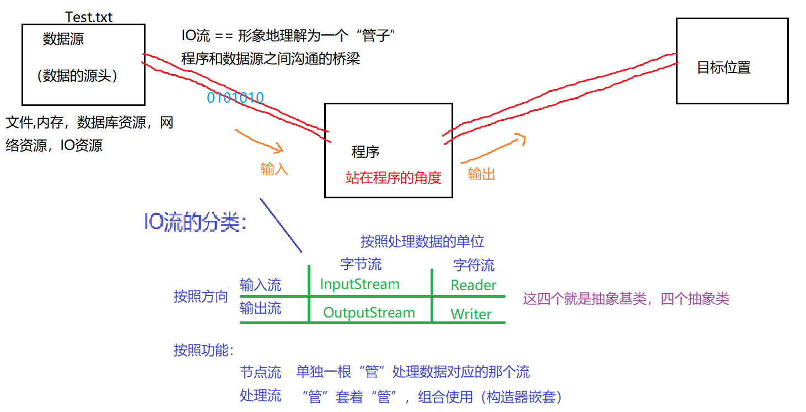
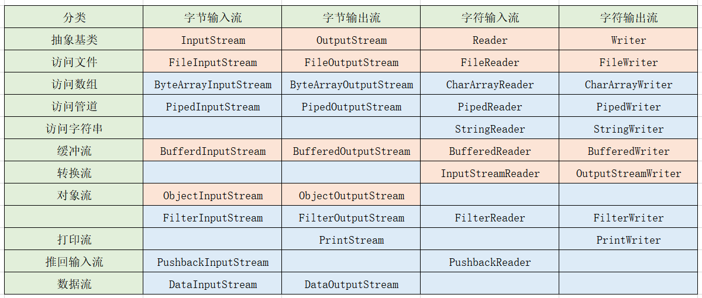
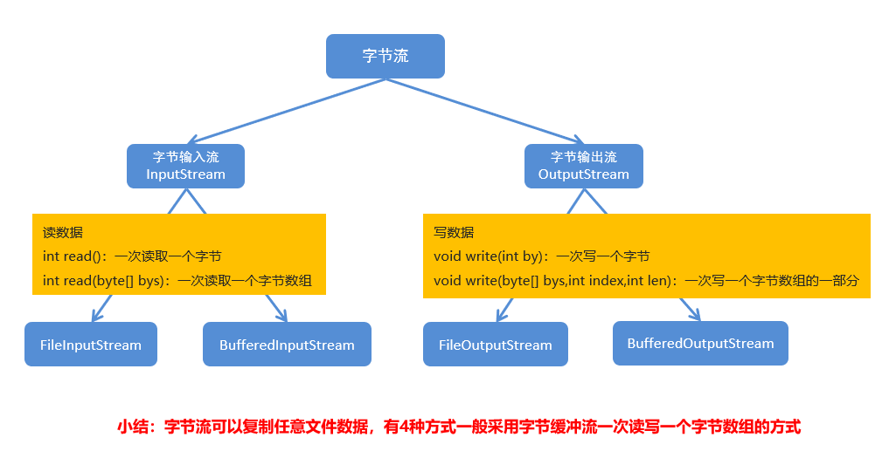
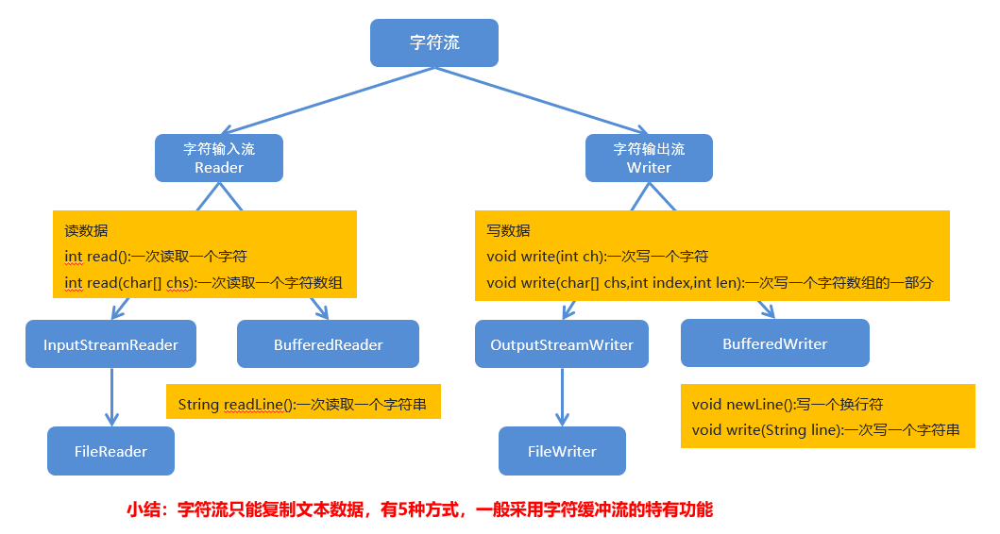

## File类

### 概述和构造方法

- 在java程序中怎么操纵文件和目录 ？
  java程序最擅长的就是操作对象，可以把盘符上的文件/目录封装为一个对象，这个对象就属于File类。有了这个对象，Java程序就可以直接操纵文件了，通过这个对象创建、删除、获取文件。
  对于File而言,其封装的并不是一个真正存在的文件，仅仅是一个路径名而已。它可以是存在的，也可以是不存在的。
  
- File类的构造方法

  | 方法名                            | 说明                                                        |
  | --------------------------------- | ----------------------------------------------------------- |
  | File(String pathname)             | 通过将给定的路径名字符串转换为抽象路径名来创建新的 File实例 |
  | File(String parent, String child) | 从父路径名字符串和子路径名字符串创建新的   File实例         |
  | File(File parent, String child)   | 从父抽象路径名和子路径名字符串创建新的   File实例           |

```java
public class FileDemo01 {
    public static void main(String[] args) {
        //File(String pathname)：通过将给定的路径名字符串转换为抽象路径名来创建新的 File实例。
        File f1 = new File("E:\\itcast\\java.txt");//在windows，dos下，系统默认用“\”作为路径分隔符 ，在unix，url中，使用“/”作为路径分隔符。
        System.out.println(f1);

        //File(String parent, String child)：从父路径名字符串和子路径名字符串创建新的 File实例。
        File f2 = new File("E:\\itcast","java.txt");
        System.out.println(f2);

        //File(File parent, String child)：从父抽象路径名和子路径名字符串创建新的 File实例。
        File f3 = new File("E:\\itcast");
        File f4 = new File(f3,"java.txt");
        System.out.println(f4);
    }
}
```

### 常用方法

- 判断方法

  | 方法名                        | 说明                     |
  | ----------------------------- | ------------------------ |
  | public  boolean isDirectory() | 判断给定的路径是否为目录 |
  | public  boolean isFile()      | 判断给定的路径是否为文件 |
  | public  boolean exists()      | 判断给定的路径是否存在   |

- 获取方法

  | 方法名                           | 说明                                     |
  | -------------------------------- | ---------------------------------------- |
  | public  String getAbsolutePath() | 返回此抽象路径名的绝对路径名字符串       |
  | public  String getPath()         | 返回此抽象路径名的相对路径名字符串       |
  | public File getParentFile()      | 取得当前路径的父路径                     |
  | public   String getName()        | 返回由此抽象路径名表示的文件或目录的名称 |
  | public String[] list()           | 返回此目录中的文件名和目录名的字符串数组 |
  | public File[] listFiles()        | 返回此目录中的文件和目录的File对象数组   |
  | public long length()             | 取得文件大小，以字节为单位返回           |
  | public long lastModified()       | 取得文件最后的修改时间                   |

- 创建方法

  | 方法名                         | 说明                                                       |
  | ------------------------------ | ---------------------------------------------------------- |
  | public boolean createNewFile() | 创建新文件                                                 |
  | public boolean mkdir()         | 创建由此抽象路径名命名的目录                               |
  | public boolean mkdirs()        | 创建由此抽象路径名命名的目录，包括任何必需但不存在的父目录 |

- 删除方法

  | public boolean  delete() | 删除由此抽象路径名表示的文件或目录 |
  | ------------------------ | ---------------------------------- |

- 删除目录时的注意事项

  - 如果一个目录非空，不能直接删除。应该先删除目录中的内容，最后才能删除。
  - 多层目录只会删除一层
  - 在Java中删除目录不走回收站，文件一旦删除就无法恢复，所以删除操作一定要谨慎。
  
- 其他

  | 方法名                             | 描述                      |
  | ---------------------------------- | ------------------------- |
  | public boolean  setWritable(false) | 将文件修改为只读          |
  | public URI  toURI                  | 构造一个表示此路径名的URI |
  |                                    |                           |

  

```java
public class FileDemo02 {
    public static void main(String[] args) throws IOException {
        //需求1：我要在E:\\itcast目录下创建一个文件java.txt
        File f1 = new File("E:\\itcast\\java.txt"); //Linux里这么写路径：E:/itcast/java.txt
        System.out.println(f1.createNewFile());
        System.out.println("--------");

        //需求2：我要在E:\\itcast目录下创建一个目录JavaSE
        File f2 = new File("E:\\itcast\\JavaSE");
        System.out.println(f2.mkdir());
        System.out.println("--------");

        //需求3：我要在E:\\itcast目录下创建一个多级目录JavaWEB\\HTML
        File f3 = new File("E:\\itcast\\JavaWEB\\HTML");
//        System.out.println(f3.mkdir());
        System.out.println(f3.mkdirs());
        System.out.println("--------");

        //需求4：我要在E:\\itcast目录下创建一个文件javase.txt
        File f4 = new File("E:\\itcast\\javase.txt");
//        System.out.println(f4.mkdir());
        System.out.println(f4.createNewFile());
    }
}
```

```java
public class FileDemo04 {
    public static void main(String[] args) {
        //创建一个File对象
        File f = new File("myFile\\java.txt");

//        public boolean isDirectory()：测试此抽象路径名表示的File是否为目录
//        public boolean isFile()：测试此抽象路径名表示的File是否为文件
//        public boolean exists()：测试此抽象路径名表示的File是否存在
        System.out.println(f.isDirectory());
        System.out.println(f.isFile());
        System.out.println(f.exists());

//        public String getAbsolutePath()：返回绝对路径
//        public String getPath()：返回构建路径，你写的什么就返回什么
//        public String getName()：返回由此抽象路径名表示的文件或目录的名称
        System.out.println(f.getAbsolutePath());
        System.out.println(f.getPath());
        System.out.println(f.getName());
        System.out.println("--------");

//        public String[] list()：返回此抽象路径名表示的目录中的文件和目录的名称字符串数组
//        public File[] listFiles()：返回此抽象路径名表示的目录中的文件和目录的File对象数组
        File f2 = new File("E:\\itcast");

        String[] strArray = f2.list();
        for(String str : strArray) {
            System.out.println(str);
        }
        System.out.println("--------");

        File[] fileArray = f2.listFiles();
        for(File file : fileArray) {
//            System.out.println(file);
//            System.out.println(file.getName());
            if(file.isFile()) {
                System.out.println(file.getName());
            }
        }
    }
}
```

```java
public class FileDemo03 {
    public static void main(String[] args) throws IOException {
//        File f1 = new File("E:\\itcast\\java.txt");
        //需求1：在当前模块目录下创建java.txt文件
        File f1 = new File("myFile\\java.txt");
//        System.out.println(f1.createNewFile());

        //需求2：删除当前模块目录下的java.txt文件
        System.out.println(f1.delete());
        System.out.println("--------");

        //需求3：在当前模块目录下创建itcast目录
        File f2 = new File("myFile\\itcast");
//        System.out.println(f2.mkdir());

        //需求4：删除当前模块目录下的itcast目录
        System.out.println(f2.delete());
        System.out.println("--------");

        //需求5：在当前模块下创建一个目录itcast,然后在该目录下创建一个文件java.txt
        File f3 = new File("myFile\\itcast");
//        System.out.println(f3.mkdir());
        File f4 = new File("myFile\\itcast\\java.txt");
//        System.out.println(f4.createNewFile());

        //需求6：删除当前模块下的目录itcast
        System.out.println(f4.delete());
        System.out.println(f3.delete());
    }
}
```

绝对路径和相对路径的区别

- 绝对路径：完整的路径名，不需要任何其他信息就可以定位它所表示的文件。例如：E:\itcast\java.txt
- 相对路径：必须使用取自其他路径名的信息进行解释。例如：myFile\\java.txt

## 递归

### 递归

- 递归的介绍

  - 以编程的角度来看，递归指的是方法定义中调用方法本身的现象
  - 把一个复杂的问题层层转化为一个与原问题相似的规模较小的问题来求解
  - 递归策略只需少量的程序就可描述出解题过程所需要的多次重复计算

- 递归的基本使用

```java
ackage FileTest;

public class DiGui {
    public static void main(String[] args) {
        //斐波那契数列 1 1 2 3 5 8
        System.out.println(f(20));
    }
    public static int f(int i){
        if(i == 1 || i == 2){
            return 1;
        }else{
            return f(i-1)+f(i-2);
        }
    }
}
```

递归的注意事项

- 递归一定要有出口。否则内存溢出
- 递归虽然有出口，但是递归的次数也不宜过多。否则内存溢出

递归求阶乘

```java
package FileTest;

public class DiGui02 {
    public static void main(String[] args) {
        System.out.println("5的阶乘是："+jc(5));
    }

    public static int jc(int n){
        if(n==0||n==1){
            return 1;
        }else{
            return n*jc(n-1);
        }
    }
}

```

### 递归遍历目录

- 案例需求

  ​	给定一个路径(D:\\itcast)，通过递归完成遍历该目录下所有内容，并把所有文件的绝对路径输出在控制台

- 代码实现

  ```java
  package FileTest;
  import java.io.File;
  
  public class FileDemo03 {
      public static void main(String[] args) {
          //根据给定的路径创建一个File对象
          File f = new File("D:\\itcast");
          //调用方法
          getAllFilePath(f);
      }
  
      //定义一个方法，用于获取给定目录下的所有内容，参数为第一步创建的File对象
      public static void getAllFilePath(File f){
          //获取给定的File目录下所有的文件或者目录的File数组
          File[] files = f.listFiles();
          //遍历该File数组，得到每一个File对象
          if(files != null){
              for(File file : files){
                  //判断该File对象是否是目录
                  if(file.isDirectory()){
                      //是：递归调用
                      getAllFilePath(file);
                  }else{
                      //不是：获取绝对路径输出在控制台
                      System.out.println(file.getAbsoluteFile());
                  }
              }
          }
  
      }
  }
  
  ```

## IO流

### 概述

- IO流介绍
  - IO：输入/输出(Input/Output)
  - 流：是一种抽象概念，是对数据传输的总称。也就是说数据在设备间的传输称为流，流的本质是数据传输
  - IO流就是用来处理设备间数据传输问题的。常见的应用：文件复制；文件上传；文件下载
- IO流的分类

  
- IO流的使用场景
  - 如果操作的是纯文本文件，优先使用字符流
  - 如果操作的是图片、视频、音频等二进制文件。优先使用字节流
  - 如果不确定文件类型，优先使用字节流。字节流是万能的流
  
- 常用IO流（红色是重点）
  

### 字节输出流：OutputStream

- 常用方法

  | 方法名                                   | 说明                                 |
  | ---------------------------------------- | ------------------------------------ |
  | void   write(int b)                      | 输出单个字节                         |
  | void   write(byte[] b)                   | 输出全部字节数组数据                 |
  | void   write(byte[] b, int off, int len) | 输出部分字节数据，从off开始到len终止 |

- 常用实现类

  - FileOutputStream(File file)：将内容输出到指定路径，如果文件已存在，则**使用新的内容覆盖旧的内容**
  - FileOutputStream(File file,boolean append)：如果传入true，表示**追加新的内容到文件中**

- 使用字节输出流写数据的步骤

  - 创建字节输出流对象(如果文件不存在，会自动创建，不用手工调用createNewFile()方法)
  - 调用字节输出流对象的写数据方法
  - 数据流输入资源操作，资源操作必须关闭

- 示例代码

  ```java
  package FileTest;
  
  import java.io.FileNotFoundException;
  import java.io.FileOutputStream;
  import java.io.IOException;
  import java.io.OutputStream;
  
  public class IODemo {
      public static void main(String[] args) throws IOException {
          //创建字节输出流对象
          //FileOutputStream(String name)：创建文件输出流以指定的名称写入文件
          OutputStream out = new FileOutputStream("基础语法\\fos.txt");//这里是相对路径
  
           /*
              做了三件事情：
                  A:调用系统功能创建了文件
                  B:创建了字节输出流对象
                  C:让字节输出流对象指向创建好的文件
           */
          
          //void write(int b)：将指定的字节写入此文件输出流
          os.write(97);//这里向文件写入的是字母a而不是数字97，因为是字节流
          
          //void write(byte[] b)：将b.length字节从指定的字节数组写入此文件输出流
  	    //byte[] bys = {97, 98, 99, 100, 101};
          //byte[] getBytes()：返回字符串对应的字节数组
          byte[] bys = "abcde".getBytes();
          os.write(bys);
          
          //void write(byte[] b, int off, int len)：将 len字节从指定的字节数组开始，从偏移量off开始写入此文件输出流
          os.write(2,bys.length);
          
          //最后都要释放资源
          //void close()：关闭此文件输出流并释放与此流相关联的任何系统资源。
          os.close();
      }
  }
  
  ```
  
- 字节流写数据如何换行

  - windows:\r\n
  - linux:\n
  - mac:\r

- 字节流写数据如何追加写入

  - public FileOutputStream(String name,boolean append)

  - 如果第二个参数为true ，则字节以追加方式写入文件的末尾

  - ```java
    public class FileOutputStreamDemo03 {
        public static void main(String[] args) throws IOException {
            //创建字节输出流对象
    //        FileOutputStream fos = new FileOutputStream("myByteStream\\fos.txt");
            FileOutputStream fos = new FileOutputStream("myByteStream\\fos.txt",true);
    
            //写数据
            for (int i = 0; i < 10; i++) {
                fos.write("hello".getBytes());
                fos.write("\r\n".getBytes());
            }
    
            //释放资源
            fos.close();
        }
    }
    ```

### 字节输入流：InputStream

- 实现类

  - FileInputStream(String name)：通过打开与实际文件的连接来创建一个FileInputStream 

- 字节输入流读取数据的步骤

  - 创建字节输入流对象
  - 调用字节输入流对象的读数据方法
  - 释放资源

- 常用方法

  | 方法名             | 说明                                         |
  | ------------------ | -------------------------------------------- |
  | int read()         | 读取单个字节并返回。                         |
  | int read(byte[] b) | 读取数据并存储到字节数组中，同时返回读取长度 |

- 示例代码（下面程序不能运行）

  ```java
  public class FileInputStreamDemo01 {
      public static void main(String[] args) throws IOException {
          //创建字节输入流对象
          //FileInputStream(String name)
          InputStream in = new FileInputStream("myByteStream\\fos.txt");
  
          int by;
          /*
              in.read()：读单个数据
              by=fis.read()：把读取到的数据赋值给by
              by != -1：判断读取到的数据是否是-1 （如果数据读取完了就返回-1）
           */
          while ((by=in.read())!=-1) {	//如果读取到的数据不出-1，就继续读取下一个
              System.out.print((char)by);
          }
          //这种方法也行
         int by = fis.read();
          while(by != -1){
             System.out.print((char)by);
             by = fis.read();
          }
          
         //一次读取一个字节数组的数据
          byte[] bys = new byte[1024]; //1024及其整数倍
          int len;
          while ((len=fis.read(bys))!=-1) {
              System.out.print(new String(bys,0,len));
          }
          
          //释放资源
          fis.close();
      }
  }
  ```

### 字节流复制文本文件

- 案例需求

  ​	把“E:\\itcast\\窗里窗外.txt”复制到模块目录下的“窗里窗外.txt”

- 实现步骤

  - 复制文本文件，其实就把文本文件的内容从一个文件中读取出来(数据源)，然后写入到另一个文件中(目的地)

  - 数据源：

    ​	E:\\itcast\\窗里窗外.txt --- 读数据 --- InputStream --- FileInputStream 

  - 目的地：

    ​	myByteStream\\窗里窗外.txt --- 写数据 --- OutputStream --- FileOutputStream

- 代码实现

  ```java
  public class CopyTxtDemo {
      public static void main(String[] args) throws IOException {
          //根据数据源创建字节输入流对象
          FileInputStream fis = new FileInputStream("E:\\itcast\\窗里窗外.txt");
          //根据目的地创建字节输出流对象
          FileOutputStream fos = new FileOutputStream("myByteStream\\窗里窗外.txt");
  
          //读写数据，复制文本文件(一次读取一个字节，一次写入一个字节)
          int by;
          while ((by=fis.read())!=-1) {
              fos.write(by);
          }
  
          //释放资源
          fos.close();
          fis.close();
      }
  }
  ```

### 字节流复制图片

- 案例需求

  ​	把“E:\\itcast\\mn.jpg”复制到模块目录下的“mn.jpg”

- 实现步骤

  - 根据数据源创建字节输入流对象
  - 根据目的地创建字节输出流对象
  - 读写数据，复制图片(一次读取一个字节数组，一次写入一个字节数组)
  - 释放资源

- 代码实现

  ```java
  public class CopyJpgDemo {
      public static void main(String[] args) throws IOException {
          //根据数据源创建字节输入流对象
          FileInputStream fis = new FileInputStream("E:\\itcast\\mn.jpg");
          //根据目的地创建字节输出流对象
          FileOutputStream fos = new FileOutputStream("myByteStream\\mn.jpg");
  
          //读写数据，复制图片(一次读取一个字节数组，一次写入一个字节数组)
          byte[] bys = new byte[1024];
          int len;
          while ((len=fis.read(bys))!=-1) {
              fos.write(bys,0,len);
          }
  
          //释放资源
          fos.close();
          fis.close();
      }
  }
  ```


### 字节缓冲流

#### 字节缓冲流构造方法

- 字节缓冲流介绍

  - BufferedOutputStream：该类实现缓冲输出流。节约系统资源。

  - BufferedInputStream：实例化将创建一个内部缓冲区数组。 节约系统资源。

- 构造方法：

  | 方法名                                 | 说明                   |
  | -------------------------------------- | ---------------------- |
  | BufferedOutputStream(OutputStream out) | 创建字节缓冲输出流对象 |
  | BufferedInputStream(InputStream in)    | 创建字节缓冲输入流对象 |

```java
public class BufferStreamDemo {
    public static void main(String[] args) throws IOException {
        //字节缓冲输出流：BufferedOutputStream(OutputStream out)
 
        BufferedOutputStream bos = new BufferedOutputStream(new FileOutputStream("myByteStream\\bos.txt"));
        //写数据
        bos.write("hello\r\n".getBytes());
        bos.write("world\r\n".getBytes());
        //写入的数据会存放在缓冲区，当缓冲区满了之后一次性写入文件。可以手动刷新缓冲区
        bos.flush();
        //释放资源。如果之前没有刷新，释放资源时也会自动刷新的。
        bos.close();
    

        //字节缓冲输入流：BufferedInputStream(InputStream in)
        BufferedInputStream bis = new BufferedInputStream(new FileInputStream("myByteStream\\bos.txt"));

        //一次读取一个字节数据
//        int by;
//        while ((by=bis.read())!=-1) {
//            System.out.print((char)by);
//        }

        //一次读取一个字节数组数据
        byte[] bys = new byte[1024];
        int len;
        while ((len=bis.read(bys))!=-1) {
            System.out.print(new String(bys,0,len));
        }

        //释放资源
        bis.close();
    }
}
```

#### 字节流复制视频

- 案例需求

  把“E:\\itcast\\字节流复制图片.avi”复制到模块目录下的“字节流复制图片.avi”

- 实现步骤

  - 根据数据源创建字节输入流对象

  - 根据目的地创建字节输出流对象
  - 读写数据，复制视频
  - 释放资源

- 代码实现

  ```java
  import java.io.*;
  
  /*
      需求：
          把E:\\itcast\\字节流复制图片.avi 复制到模块目录下的 字节流复制图片.avi
  
      思路：
          1:根据数据源创建字节输入流对象
          2:根据目的地创建字节输出流对象
          3:读写数据，复制图片(一次读取一个字节数组，一次写入一个字节数组)
          4:释放资源
  
      四种方式实现复制视频，并记录每种方式复制视频的时间
          1:基本字节流一次读写一个字节             共耗时：64565毫秒
          2:基本字节流一次读写一个字节数组          共耗时：107毫秒
          3:字节缓冲流一次读写一个字节             共耗时：405毫秒
          4:字节缓冲流一次读写一个字节数组          共耗时：60毫秒
   */
  public class CopyAviDemo {
      public static void main(String[] args) throws IOException {
          //记录开始时间
          long startTime = System.currentTimeMillis();
  
          //复制视频
  //        method1();
  //        method2();
  //        method3();
          method4();
  
          //记录结束时间
          long endTime = System.currentTimeMillis();
          System.out.println("共耗时：" + (endTime - startTime) + "毫秒");
      }
  
      //字节缓冲流一次读写一个字节数组
      public static void method4() throws IOException {
          BufferedInputStream bis = new BufferedInputStream(new FileInputStream("E:\\itcast\\字节流复制图片.avi"));
          BufferedOutputStream bos = new BufferedOutputStream(new FileOutputStream("myByteStream\\字节流复制图片.avi"));
  
          byte[] bys = new byte[1024];
          int len;
          while ((len=bis.read(bys))!=-1) {
              bos.write(bys,0,len);
          }
  
          bos.close();
          bis.close();
      }
  
      //字节缓冲流一次读写一个字节
      public static void method3() throws IOException {
          BufferedInputStream bis = new BufferedInputStream(new FileInputStream("E:\\itcast\\字节流复制图片.avi"));
          BufferedOutputStream bos = new BufferedOutputStream(new FileOutputStream("myByteStream\\字节流复制图片.avi"));
  
          int by;
          while ((by=bis.read())!=-1) {
              bos.write(by);
          }
  
          bos.close();
          bis.close();
      }
  
  
      //基本字节流一次读写一个字节数组
      public static void method2() throws IOException {
          //E:\\itcast\\字节流复制图片.avi
          //模块目录下的 字节流复制图片.avi
          FileInputStream fis = new FileInputStream("E:\\itcast\\字节流复制图片.avi");
          FileOutputStream fos = new FileOutputStream("myByteStream\\字节流复制图片.avi");
  
          byte[] bys = new byte[1024];
          int len;
          while ((len=fis.read(bys))!=-1) {
              fos.write(bys,0,len);
          }
  
          fos.close();
          fis.close();
      }
  
      //基本字节流一次读写一个字节
      public static void method1() throws IOException {
          //E:\\itcast\\字节流复制图片.avi
          //模块目录下的 字节流复制图片.avi
          FileInputStream fis = new FileInputStream("E:\\itcast\\字节流复制图片.avi");
          FileOutputStream fos = new FileOutputStream("myByteStream\\字节流复制图片.avi");
  
          int by;
          while ((by=fis.read())!=-1) {
              fos.write(by);
          }
  
          fos.close();
          fis.close();
      }
  }
  
  ```

  

## 字符流

### 字符流和编码

- 字符流的介绍

  由于字节流操作中文不是特别的方便，容易出现乱码问题，所以Java就提供字符流

  字符流 = 字节流 + 编码表

- 中文的字节存储方式

  用字节流复制文本文件时，文本文件也会有中文，但是没有问题，原因是最终底层操作会自动进行字节拼接成中文，如何识别是中文的呢：汉字在存储的时候，无论选择哪种编码存储，第一个字节都是负数

- 什么是字符集

  是一个系统支持的所有字符的集合，包括各国家文字、标点符号、图形符号、数字等。计算机要准确的存储和识别各种字符集符号，就需要进行字符编码，一套字符集必然至少有一套字符编码。常见字符集有ASCII字符集、GBXXX字符集、Unicode字符集等

- 常见的字符集

  - ASCII字符集：

    lASCII：是基于拉丁字母的一套电脑编码系统，用于显示现代英语，主要包括控制字符(回车键、退格、换行键等)和可显示字符(英文大小写字符、阿拉伯数字和西文符号) 

    基本的ASCII字符集，使用7位表示一个字符，共128字符。ASCII的扩展字符集使用8位表示一个字符，共256字符，方便支持欧洲常用字符。是一个系统支持的所有字符的集合，包括各国家文字、标点符号、图形符号、数字等

  - GBXXX字符集：

    GBK：最常用的中文码表。是在GB2312标准基础上的扩展规范，使用了双字节编码方案，共收录了21003个汉字，完全兼容GB2312标准，同时支持繁体汉字以及日韩汉字等

  - Unicode字符集：

    UTF-8编码：可以用来表示Unicode标准中任意字符，它是电子邮件、网页及其他存储或传送文字的应用 中，优先采用的编码。互联网工程工作小组（IETF）要求所有互联网协议都必须支持UTF-8编码。它使用一至四个字节为每个字符编码

    编码规则： 

      128个US-ASCII字符，只需一个字节编码

      拉丁文等字符，需要二个字节编码

      大部分常用字（含中文），使用三个字节编码

      其他极少使用的Unicode辅助字符，使用四字节编码

### 字符串中的编码解码问题

- 相关方法

  | 方法名                                       | 说明                                               |
  | -------------------------------------------- | -------------------------------------------------- |
  | byte[] getBytes()                            | 使用平台的默认字符集将该 String编码为一系列字节    |
  | byte[] getBytes(String charsetName)          | 使用指定的字符集将该 String编码为一系列字节        |
  | new String(byte[] bytes)                     | 使用平台的默认字符集解码指定的字节数组来创建字符串 |
  | new String(byte[] bytes, String charsetName) | 通过指定的字符集解码指定的字节数组来创建字符串     |

- 代码演示

  ```java
  public class StringDemo {
      public static void main(String[] args) throws UnsupportedEncodingException {
          //定义一个字符串
          String s = "中国";
  
          //byte[] bys = s.getBytes(); //[-28, -72, -83, -27, -101, -67]，默认的编码方式就是utf-8
          //byte[] bys = s.getBytes("UTF-8"); //[-28, -72, -83, -27, -101, -67]
          byte[] bys = s.getBytes("GBK"); //[-42, -48, -71, -6]
          System.out.println(Arrays.toString(bys));
  
          //String ss = new String(bys);
          //String ss = new String(bys,"UTF-8");
          String ss = new String(bys,"GBK");
          System.out.println(ss);
      }
  }
  ```

### 字符输出流：Writer

| 方法                                      | 描述                                                       |
| ----------------------------------------- | ---------------------------------------------------------- |
| public void close()                       | 关闭流，但是在关闭之前会先刷新流。一旦关闭，就不能再写数据 |
| public void flush()                       | 强制刷新，刷新之后还可以继续写数据                         |
| public Writer append(CharSequence csq)    | 追加数据                                                   |
| public void write(String str)             | 输出字符串数据                                             |
| public void write(char[] cbuf)            | 输出字符数组数据                                           |
| void write(char[] cbuf, int off, int len) | 写入字符数组的一部分                                       |
| void write(String str, int off, int len)  | 写一个字符串的一部分                                       |

Writer是一个抽象类，要想对文件内容进行输出，可以使用它的实现类：FileWriter。

FileWriter常用方法

| 方法                                         | 描述                                                         |
| -------------------------------------------- | ------------------------------------------------------------ |
| public FileWriter(File file)                 | 设置输出文件                                                 |
| public FileWriter(File file, boolean append) | 设置输出文件以及是否进行数据追加操作                         |
| FileWriter(String fileName)                  | 根据给定的文件名构造一个 FileWriter 对象                     |
| FileWriter(String fileName, boolean append)  | 根据给定的文件名以及指示是否附加写入数据的 boolean 值来构造 FileWriter 对象 |

### 字符输入流：Reader

| 方法                         | 描述                               |
| ---------------------------- | ---------------------------------- |
| public int read()            | 读取单个字符                       |
| public int read(char[] cbuf) | 读取数据到字符数组中，返回读取长度 |
| public long skip(long n)     | 跳过字节长度                       |

Reader是抽象类，常用的实现类是FileReader。
构造方法：public FileReader(File file);

### 字节流和字符流的区别

二者最大的区别是：字节流直接与终端文件进行数据交互，字符流需要将数据经过缓冲区处理才与终端文件数据交互。在使用OutputStream输出数据时即使最后没有关闭输出流，内容也可以正常输出，但是反过来如果使用的是字符输出流Writer，执行到最后如果不关闭流，就表示在缓冲区中处理的内容不会被强制性清空，所以就不会输出数据。如果有特殊情况不能关闭字符输出流，可以使用flush()方法强制情况缓冲区。

### 转换流

字节流和字符流表示两种不同的数据流操作，但是这两种流是可以相互转换的，要实现这种转换可以使用InputStreamReader、OutputStreamReader两个类，这两个类是FileWriter和FileReader的直接父类，虽然他们没有两个子类好用，但是在面对编码转换的问题时，只能用这两个类。

- InputStreamReader：使用指定的编码将字节流转换为字符流。继承自Reader，可以向上转型为Reader类，所以可以将接收到的字节输入流转为字符输入流。

- OutputStreamWriter：使用指定的编码将字节流转换为字符流。继承自Writer，可以向上转型为Writer类，所以可以将接收到的字节输出流转为字符输出流。


- 构造方法

  | 方法名                                              | 说明                                         |
  | --------------------------------------------------- | -------------------------------------------- |
  | InputStreamReader(InputStream in)                   | 使用默认字符编码创建InputStreamReader对象    |
  | InputStreamReader(InputStream in,String chatset)    | 使用指定的字符编码创建InputStreamReader对象  |
  | OutputStreamWriter(OutputStream out)                | 使用默认字符编码创建OutputStreamWriter对象   |
  | OutputStreamWriter(OutputStream out,String charset) | 使用指定的字符编码创建OutputStreamWriter对象 |

- 代码演示

  ```java
  public class ConversionStreamDemo {
      public static void main(String[] args) throws IOException {
          //OutputStreamWriter osw = new OutputStreamWriter(newFileOutputStream("myCharStream\\osw.txt"));
          OutputStreamWriter osw = new OutputStreamWriter(new FileOutputStream("myCharStream\\osw.txt"),"GBK");
          osw.write("中国");
          osw.close();
  
          //InputStreamReader isr = new InputStreamReader(new FileInputStream("myCharStream\\osw.txt"));
          InputStreamReader isr = new InputStreamReader(new FileInputStream("myCharStream\\osw.txt"),"GBK");
          //一次读取一个字符数据
          int ch;
          while ((ch=isr.read())!=-1) {
              System.out.print((char)ch);
          }
          isr.close();
      }
  }
  ```


### 字符流复制Java文件

- 案例需求

  把模块目录下的“ConversionStreamDemo.java” 复制到模块目录下的“Copy.java”

- 实现步骤

  - 根据数据源创建字符输入流对象
  - 根据目的地创建字符输出流对象
  - 读写数据，复制文件
  - 释放资源

- 代码实现

  ```java
  public class CopyJavaDemo01 {
      public static void main(String[] args) throws IOException {
          //根据数据源创建字符输入流对象
          InputStreamReader isr = new InputStreamReader(new FileInputStream("myCharStream\\ConversionStreamDemo.java"));
          //根据目的地创建字符输出流对象
          OutputStreamWriter osw = new OutputStreamWriter(new FileOutputStream("myCharStream\\Copy.java"));
  
          //读写数据，复制文件
          //一次读写一个字符数据
  //        int ch;
  //        while ((ch=isr.read())!=-1) {
  //            osw.write(ch);
  //        }
  
          //一次读写一个字符数组数据
          char[] chs = new char[1024];
          int len;
          while ((len=isr.read(chs))!=-1) {
              osw.write(chs,0,len);
          }
  
          //释放资源
          osw.close();
          isr.close();
      }
  }
  ```

- 改进版

  使用便捷流对象，把模块目录下的“ConversionStreamDemo.java” 复制到模块目录下的“Copy.java”

- 实现步骤

  - 根据数据源创建字符输入流对象

  - 根据目的地创建字符输出流对象
  - 读写数据，复制文件
  - 释放资源

- 代码实现

  ```java
  public class CopyJavaDemo02 {
      public static void main(String[] args) throws IOException {
          //根据数据源创建字符输入流对象
          FileReader fr = new FileReader("myCharStream\\ConversionStreamDemo.java");
          //根据目的地创建字符输出流对象
          FileWriter fw = new FileWriter("myCharStream\\Copy.java");
  
          //读写数据，复制文件
  //        int ch;
  //        while ((ch=fr.read())!=-1) {
  //            fw.write(ch);
  //        }
  
          char[] chs = new char[1024];
          int len;
          while ((len=fr.read(chs))!=-1) {
              fw.write(chs,0,len);
          }
  
          //释放资源
          fw.close();
          fr.close();
      }
  }
  ```


### 字符缓冲流

- 字符缓冲流介绍

  - BufferedWriter：将文本写入字符输出流，缓冲字符，以提供单个字符，数组和字符串的高效写入，可以指定缓冲区大小，或者可以接受默认大小。默认值足够大，可用于大多数用途

  - BufferedReader：从字符输入流读取文本，缓冲字符，以提供字符，数组和行的高效读取，可以指定缓冲区大小，或者可以使用默认大小。 默认值足够大，可用于大多数用途

- 构造方法

  | 方法名                     | 说明                   |
  | -------------------------- | ---------------------- |
  | BufferedWriter(Writer out) | 创建字符缓冲输出流对象 |
  | BufferedReader(Reader in)  | 创建字符缓冲输入流对象 |

- 代码演示

  ```java
  public class BufferedStreamDemo01 {
      public static void main(String[] args) throws IOException {
          //BufferedWriter(Writer out)
          BufferedWriter bw = new BufferedWriter(new FileWriter("myCharStream\\bw.txt"));
          bw.write("hello\r\n");
          bw.write("world\r\n");
          bw.close();
  
          //BufferedReader(Reader in)
          BufferedReader br = new BufferedReader(new FileReader("myCharStream\\bw.txt"));
  
          //一次读取一个字符数据
  //        int ch;
  //        while ((ch=br.read())!=-1) {
  //            System.out.print((char)ch);
  //        }
  
          //一次读取一个字符数组数据
          char[] chs = new char[1024];
          int len;
          while ((len=br.read(chs))!=-1) {
              System.out.print(new String(chs,0,len));
          }
  
          br.close();
      }
  }
  ```

#### 字符缓冲流复制Java文件

- 案例需求

  把模块目录下的ConversionStreamDemo.java 复制到模块目录下的 Copy.java

- 实现步骤

  - 根据数据源创建字符缓冲输入流对象
  - 根据目的地创建字符缓冲输出流对象
  - 读写数据，复制文件，使用字符缓冲流特有功能实现
  - 释放资源

- 代码实现

  ```java
  public class CopyJavaDemo01 {
      public static void main(String[] args) throws IOException {
          //根据数据源创建字符缓冲输入流对象
          BufferedReader br = new BufferedReader(new FileReader("myCharStream\\ConversionStreamDemo.java"));
          //根据目的地创建字符缓冲输出流对象
          BufferedWriter bw = new BufferedWriter(new FileWriter("myCharStream\\Copy.java"));
  
          //读写数据，复制文件
          //一次读写一个字符数据
  //        int ch;
  //        while ((ch=br.read())!=-1) {
  //            bw.write(ch);
  //        }
  
          //一次读写一个字符数组数据
          char[] chs = new char[1024];
          int len;
          while ((len=br.read(chs))!=-1) {
              bw.write(chs,0,len);
          }
  
          //释放资源
          bw.close();
          br.close();
      }
  }
  ```

#### 字符缓冲流特有功能

- 方法介绍

  BufferedWriter：

  | 方法名         | 说明                                         |
  | -------------- | -------------------------------------------- |
  | void newLine() | 写一行行分隔符，行分隔符字符串由系统属性定义 |

  BufferedReader:

  | 方法名            | 说明                                                         |
  | ----------------- | ------------------------------------------------------------ |
  | String readLine() | 读一行文字。 结果包含行的内容的字符串，不包括任何行终止字符如果流的结尾已经到达，则为null |

- 代码演示

  ```java
  public class BufferedStreamDemo02 {
      public static void main(String[] args) throws IOException {
  
          //创建字符缓冲输出流
          BufferedWriter bw = new BufferedWriter(new FileWriter("myCharStream\\bw.txt"));
  
          //写数据
          for (int i = 0; i < 10; i++) {
              bw.write("hello" + i);
              //bw.write("\r\n");
              bw.newLine();
              bw.flush();
          }
  
          //释放资源
          bw.close();
  
          //创建字符缓冲输入流
          BufferedReader br = new BufferedReader(new FileReader("myCharStream\\bw.txt"));
  
          String line;
          while ((line=br.readLine())!=null) {
              System.out.println(line);
          }
  
          br.close();
      }
  }
  ```

#### 字符缓冲流特有功能复制Java文件

- 案例需求

  使用特有功能把模块目录下的ConversionStreamDemo.java 复制到模块目录下的 Copy.java

- 实现步骤

  - 根据数据源创建字符缓冲输入流对象
  - 根据目的地创建字符缓冲输出流对象
  - 读写数据，复制文件，使用字符缓冲流特有功能实现
  - 释放资源

- 代码实现

  ```java
  public class CopyJavaDemo02 {
      public static void main(String[] args) throws IOException {
          //根据数据源创建字符缓冲输入流对象
          BufferedReader br = new BufferedReader(new FileReader("myCharStream\\ConversionStreamDemo.java"));
          //根据目的地创建字符缓冲输出流对象
          BufferedWriter bw = new BufferedWriter(new FileWriter("myCharStream\\Copy.java"));
  
          //读写数据，复制文件
          //使用字符缓冲流特有功能实现
          String line;
          while ((line=br.readLine())!=null) {
              bw.write(line);
              bw.newLine();
              bw.flush();
          }
  
          //释放资源
          bw.close();
          br.close();
      }
  }
  ```

### IO流操作标准异常处理

#### 基本做法

```java
public class CopyFileDemo {
    public static void main(String[] args) {

    }

    //try...catch...finally
    private static void method2() {
        FileReader fr = null;
        FileWriter fw = null;
        try {
            fr = new FileReader("fr.txt");
            fw = new FileWriter("fw.txt");

            char[] chs = new char[1024];
            int len;
            while ((len = fr.read()) != -1) {
                fw.write(chs, 0, len);
            }
        } catch (IOException e) {
            e.printStackTrace();
        } finally {
            if(fw!=null) {
                try {
                    fw.close();
                } catch (IOException e) {
                    e.printStackTrace();
                }
            }
            if(fr!=null) {
                try {
                    fr.close();
                } catch (IOException e) {
                    e.printStackTrace();
                }
            }
        }
    }

    //抛出处理，偷懒做法
    private static void method1() throws IOException {
        FileReader fr = new FileReader("fr.txt");
        FileWriter fw = new FileWriter("fw.txt");

        char[] chs = new char[1024];
        int len;
        while ((len = fr.read()) != -1) {
            fw.write(chs, 0, len);
        }

        fw.close();
        fr.close();
    }
}
```

#### JDK7版本改进（推荐）

```java
public class CopyFileDemo {
    public static void main(String[] args) {

    }

    //JDK7的改进方案，不用close()方法了，可以自动释放资源
    private static void method3() {
        try(FileReader fr = new FileReader("fr.txt");
            FileWriter fw = new FileWriter("fw.txt");){//把创建流的操作放到try后的括号里，就
            char[] chs = new char[1024];
            int len;
            while ((len = fr.read()) != -1) {
                fw.write(chs, 0, len);
            }
        } catch (IOException e) {
            e.printStackTrace();
        }
    }
}
```

#### JDK9版本改进

```java
public class CopyFileDemo {
    public static void main(String[] args) {

    }

    //JDK9的改进方案，不用close()方法了，可以自动释放资源
    private static void method4() throws IOException {//调用方法还是会抛出异常
        FileReader fr = new FileReader("fr.txt");
        FileWriter fw = new FileWriter("fw.txt");
        try(fr;fw){//把需要关闭的资源对象放到try后面的括号里
            char[] chs = new char[1024];
            int len;
            while ((len = fr.read()) != -1) {
                fw.write(chs, 0, len);
            }
        } catch (IOException e) {
            e.printStackTrace();
        }
    }
}
```

## 特殊的IO流

### IO流小结

字节流



字符流



总结：字节流输入和输出都使用byte类型，字符流输入和输出都使用char类型，想要自由的选择类型必须进行类型转换。Java中提供了可以自动进行类型转换的IO类：打印流和扫描流。

### 数据流

前面学习的IO流，在程序代码中，要么将数据直接按照字节处理，要么按照字符处理。那么，如果要在程序中直接处理Java的基础数据类型，怎么办呢？完成这个需求，**可以使用DataOutputStream进行写，随后用DataInputStream进行读取，而且顺序要一致。**这两个流可以保存数据的原始特性，以二进制的形式存储，人看不懂。

示例代码：

```java
public class TestData {
	public void save() throws IOException{
		String name = "巫师";
		int age = 300;
		char gender = '男';
		int energy = 5000;
		double price = 75.5;
		boolean relive = true;
		
		DataOutputStream dos = new DataOutputStream(new FileOutputStream("game.dat"));
		dos.writeUTF(name);
		dos.writeInt(age);
		dos.writeChar(gender);
		dos.writeInt(energy);
		dos.writeDouble(price);
		dos.writeBoolean(relive);
		dos.close();
	}	
	public void reload()throws IOException{
		DataInputStream dis = new DataInputStream(new FileInputStream("game.dat"));
		String name = dis.readUTF();
		int age = dis.readInt();
		char gender = dis.readChar();
		int energy = dis.readInt();
		double price = dis.readDouble();
		boolean relive = dis.readBoolean();
		
		System.out.println(name+"," + age + "," + gender + "," + energy + "," + price + "," + relive);
		
		dis.close();
	}
}
```

### 打印流

字节输出流OutputStream提供的write()方法只能接收byte类型，如果想要输出其他类型的数据必须进行转换，这样效率太低，为此jdk提供了打印流。打印流的核心思想就是先包装一个OutputStream类的对象，然后在打印流的内部自动帮助用户处理好各种数据类型与字节数组的转换操作。也就是说OutputStream的本质功能没有改变，但是操作的形式更加多样化，方便用户使用。这种把普通类修改添加好用的功能的设计模式叫做**装饰设计模式**。

- 打印流分类

  - 字节打印流：PrintStream extends OutputStream
  - 字符打印流：PrintWriter extends OutputWriter

- 打印流的特点

  - 只负责输出数据，不负责读取数据
  - 永远不会抛出IOException
  - 有自己的特有方法

- 字节打印流

  - PrintStream(String fileName)：使用指定的文件名创建新的打印流

  - 使用父类的方法写数据，查看的时候会转码；使用自己的特有方法写数据，查看的数据原样输出。**所以字节打印流使用println可以直接输出字符串。**

  - System.out 默认输出到控制台，可以改变输出语句的目的地

    ​	System.setOut(PrintStream ps)：重新分配“标准”输出流。

- 示例代码

  ```java
  public class PrintStreamDemo {
      public static void main(String[] args) throws IOException {
          //PrintStream(String fileName)：使用指定的文件名创建新的打印流
          PrintStream ps = new PrintStream("myOtherStream\\ps.txt");
  
          //父类的方法
  	   //ps.write(97);//输出结果是a，因为write只接受byte类型的参数，输出时会将byte转换为char
  
          //使用特有方法写数据，会原样输出。
          ps.println(97);
          ps.println(98);
          
          //重新分配了标准输出流
          System.setOut(ps);
          System.out.println("hello world");//不会输出到控制台，而是会写入到文件
          
          //释放资源
          ps.close();
      }
  }
  ```

- 字符打印流构造方法

  | 方法名                                     | 说明                                               |
  | ------------------------------------------ | -------------------------------------------------- |
  | PrintWriter(String fileName)               | 创建一个新的PrintWriter打印，不自动刷新            |
  | PrintWriter(Writer out, boolean autoFlush) | 创建一个新的字符打印流，可以选择是否自动刷新缓冲区 |

- 示例代码

  ```java
  public class PrintWriterDemo {
      public static void main(String[] args) throws IOException {
          //PrintWriter(String fileName) ：使用指定的文件名创建一个新的PrintWriter，而不需要自动执行行刷新
  //        PrintWriter pw = new PrintWriter("myOtherStream\\pw.txt");
  
  //        pw.write("hello");
  //        pw.write("\r\n");
  //        pw.flush();
  //        pw.write("world");
  //        pw.write("\r\n");
  //        pw.flush();
  
  //        pw.println("hello");
          /*
              pw.write("hello");
              pw.write("\r\n");
           */
  //        pw.flush();
  //        pw.println("world");
  //        pw.flush();
  
          //PrintWriter(Writer out, boolean autoFlush)：创建一个新的PrintWriter
          PrintWriter pw = new PrintWriter(new FileWriter("myOtherStream\\pw.txt"),true);
  //        PrintWriter pw = new PrintWriter(new FileWriter("myOtherStream\\pw.txt"),false);
  
          pw.println("hello");
          pw.println("world");
  
          pw.close();
      }
  }
  ```

### 扫描流：Scanner

常用方法

| 方法                                        | 说明                                                        |
| ------------------------------------------- | ----------------------------------------------------------- |
| public Scanner(InputStream source)          | 接收字节输入流对象作为输入流，常用System.in指定键盘为输入源 |
| public boolean hasNext()                    | 判断是否有数据输入                                          |
| public String next()                        | 读取字符串数据                                              |
| public boolean hasNextString()              | 判断是否有指定类型的数据存在                                |
| public 数据类型 nextXxx()                   | 读取指定类型的数据                                          |
| public Scanner useDelimiter(String pattern) | 设置读取的分隔符                                            |

### System类对IO的支持

System类中有三个和IO有关的静态的成员变量

- public static final InputStream in：键盘数据输入。
- public static final PrintStream out：显示器信息输出。
- public static final PrintStream err：显示器错误输出。

以前使用的System.out.println()本质上就是调用了System类中的out常量的println()方法。可以看出Java中的任何输出操作其实都是IO操作。

```java
public class SystemOutDemo {
    public static void main(String[] args) {
        //public static final PrintStream out：标准输出流
        PrintStream ps = System.out;

        //能够方便地打印各种数据值
//        ps.print("hello");
//        ps.print(100);

//        ps.println("hello");
//        ps.println(100);

        //System.out的本质是一个字节输出流
        System.out.println("hello");
        System.out.println(100);

        System.out.println();
//        System.out.print();
    }
}
```

```java
public class SystemInDemo {
    public static void main(String[] args) throws IOException {
        //public static final InputStream in：标准输入流
        
        //System.in本质上是一个字节输入流，在面对中文输入时会出错，所以要使用转换流
//        InputStream is = System.in;

//        int by;
//        while ((by=is.read())!=-1) {
//            System.out.print((char)by);
//        }

        //如何把字节流转换为字符流？用转换流
//        InputStreamReader isr = new InputStreamReader(is);
//        //使用字符流能不能够实现一次读取一行数据呢？可以
//        //但是，一次读取一行数据的方法是字符缓冲输入流的特有方法
//        BufferedReader br = new BufferedReader(isr);
		
        //创建字节输入流System.in--->想要变成字符流需要创建转换流--->想使用更多输入方法就创建字符缓冲流
        BufferedReader br = new BufferedReader(new InputStreamReader(System.in));

        System.out.println("请输入一个字符串：");
        String line = br.readLine();
        System.out.println("你输入的字符串是：" + line);

        System.out.println("请输入一个整数：");
        int i = Integer.parseInt(br.readLine());//字节缓冲流接收的都是字符串类型，想要接收整数必须显示类型转换
        System.out.println("你输入的整数是：" + i);

        //自己实现键盘录入数据太麻烦了，所以Java就提供了一个类供我们使用
        Scanner sc = new Scanner(System.in);
    }
}
```

### 复制Java文件打印流改进版

- 案例需求

  - 把模块目录下的PrintStreamDemo.java 复制到模块目录下的 Copy.java

- 分析步骤

  - 根据数据源创建字符输入流对象
  - 根据目的地创建字符输出流对象
  - 读写数据，复制文件
  - 释放资源

- 代码实现

  ```java
  public class CopyJavaDemo {
      public static void main(String[] args) throws IOException {
          /*
          //根据数据源创建字符输入流对象
          BufferedReader br = new BufferedReader(new FileReader("myOtherStream\\PrintStreamDemo.java"));
          //根据目的地创建字符输出流对象
          BufferedWriter bw = new BufferedWriter(new FileWriter("myOtherStream\\Copy.java"));
  
          //读写数据，复制文件
          String line;
          while ((line=br.readLine())!=null) {
              bw.write(line);
              bw.newLine();
              bw.flush();
          }
  
          //释放资源
          bw.close();
          br.close();
          */
  
          //根据数据源创建字符输入流对象
          BufferedReader br = new BufferedReader(new FileReader("myOtherStream\\PrintStreamDemo.java"));
          //根据目的地创建字符输出流对象
          PrintWriter pw = new PrintWriter(new FileWriter("myOtherStream\\Copy.java"),true);
  
          //读写数据，复制文件
          String line;
          while ((line=br.readLine())!=null) {
              pw.println(line);
          }
  
          //释放资源
          pw.close();
          br.close();
      }
  }
  ```

### 复制目录下的全部pdf文件

步骤

1. 指定目录并遍历得到所有文件名
2. 如果文件名的后缀是pdf，就创建指向此文件的输入流
3. 将目的地文件夹和pdf的文件名合并为文件名，以此文件名创建输出流

```java
package FileTest;

import java.io.*;

public class CopyAllPdfFiles {
    public static void main(String[] args) {
        //根据给定的路径创建一个File对象
        File f = new File("C:\\Users\\shenguopin\\Downloads\\阶段02-JavaWeb");
        //调用方法
        try {
            getAllFilePath(f);
        } catch (FileNotFoundException e) {
            e.printStackTrace();
        } catch (IOException e) {
            e.printStackTrace();
        }
    }

    //定义一个方法，用于获取给定目录下的所有内容，参数为第一步创建的File对象
    public static void getAllFilePath(File f) throws IOException {
        //获取给定的File目录下所有的文件或者目录的File数组
        File[] files = f.listFiles();
        if(files != null){//遍历该File数组，得到每一个File对象
            for(File file : files){
                if(file.isDirectory()){//判断该File对象是否是目录
                    getAllFilePath(file);//是：递归调用
                }else{//不是：获取所有文件名
                    String name = file.getName();
                    if(name.endsWith("pdf")){//后缀是pdf的文件
                        //pdf文件不是字符，只能用字节流
                        BufferedInputStream in = new BufferedInputStream(new FileInputStream(file));//创建所有pdf文件的输入流
                        //创建输出流
                        String copyName = "C:\\Users\\shenguopin\\Desktop\\1\\"+name;
                        BufferedOutputStream out = new BufferedOutputStream(new FileOutputStream(copyName));
                        //开始复制文件
                        byte[] bys = new byte[1024];
                        int len;
                        while((len=in.read(bys))!=-1){
                            out.write(bys,0,len);
                        }
                        in.close();
                        out.close();
                    }
                }
            }
        }
    }
}

```

### 对象序列化流

- 对象序列化介绍

  - 对象序列化：就是将对象保存到磁盘中，或者在网络中传输对象
  - 这种机制就是使用一个字节序列表示一个对象，该字节序列包含：对象的类型、对象的数据和对象中存储的属性等信息
  - 字节序列写到文件之后，相当于文件中持久保存了一个对象的信息
  - 反之，该字节序列还可以从文件中读取回来，重构对象，对它进行反序列化

- 对象序列化流： ObjectOutputStream

  - 将Java对象的原始数据类型和图形写入OutputStream。 可以使用ObjectInputStream读取（重构）对象。可以通过使用流的文件来实现对象的持久存储。 如果流是网络套接字流，则可以在另一个主机上或另一个进程中重构对象 

- 构造方法

  | 方法名                               | 说明                                               |
  | ------------------------------------ | -------------------------------------------------- |
  | ObjectOutputStream(OutputStream out) | 创建一个写入指定的OutputStream的ObjectOutputStream |

- 序列化对象的方法

  | 方法名                       | 说明                               |
  | ---------------------------- | ---------------------------------- |
  | void writeObject(Object obj) | 将指定的对象写入ObjectOutputStream |

- 示例代码

  ```java
  public class ObjectOutputStreamDemo {
      public static void main(String[] args) throws IOException {
          //ObjectOutputStream(OutputStream out)：创建一个写入指定的OutputStream的ObjectOutputStream
          ObjectOutputStream oos = new ObjectOutputStream(new FileOutputStream("myOtherStream\\oos.txt"));
  
          //创建学生类对象
          Student s = new Student("林青霞",30);
  
          //void writeObject(Object obj)：将指定的对象写入ObjectOutputStream
          oos.writeObject(s);
  	oos.flush();
          
          //释放资源
          oos.close();
      }
  }
  ```

- 注意事项

  - **一个对象要想被序列化，该对象所属的类必须必须实现Serializable 接口**
  - Serializable是一个标记接口
  - transient 属性不可被序列化

### 对象反序列化流

- 对象反序列化流： ObjectInputStream

  - ObjectInputStream反序列化先前使用ObjectOutputStream编写的原始数据和对象

- 构造方法

  | 方法名                            | 说明                                           |
  | --------------------------------- | ---------------------------------------------- |
  | ObjectInputStream(InputStream in) | 创建从指定的InputStream读取的ObjectInputStream |

- 反序列化对象的方法

  | 方法名              | 说明                            |
  | ------------------- | ------------------------------- |
  | Object readObject() | 从ObjectInputStream读取一个对象 |

- 示例代码

  ```java
  public class ObjectInputStreamDemo {
      public static void main(String[] args) throws IOException, ClassNotFoundException {
          //ObjectInputStream(InputStream in)：创建从指定的InputStream读取的ObjectInputStream
          ObjectInputStream ois = new ObjectInputStream(new FileInputStream("myOtherStream\\oos.txt"));
  
          //Object readObject()：从ObjectInputStream读取一个对象
          Object obj = ois.readObject();//返回Object类型的对象
  
          Student s = (Student) obj;//强制转型
          System.out.println(s.getName() + "," + s.getAge());
  
          ois.close();
      }
  }
  ```

### serialVersionUID&transient

- serialVersionUID

  - 用对象序列化流序列化了一个对象后，假如我们修改了对象所属的类文件，读取数据会不会出问题呢？
    - 会出问题，会抛出InvalidClassException异常
  - 如果出问题了，如何解决呢？
    - 重新序列化
    - 给对象所属的类加一个serialVersionUID 
      - private static final long serialVersionUID = 42L;

- transient

  - 如果一个对象中的某个成员变量的值不想被序列化，又该如何实现呢？
    - 给该成员变量加transient关键字修饰，该关键字标记的成员变量不参与序列化过程
    - static修饰的属性，也不会被序列化

- 示例代码

  - 学生类

    ```java
    public class Student implements Serializable {
        private static final long serialVersionUID = 42L;
        private String name;
    //    private int age;
        private transient int age;//不想此变量被序列化，加上transient关键字
    
        public Student() {
        }
    
        public Student(String name, int age) {
            this.name = name;
            this.age = age;
        }
    
        //setter、getter略
    
    //    @Override
    //    public String toString() {
    //        return "Student{" +
    //                "name='" + name + '\'' +
    //                ", age=" + age +
    //                '}';
    //    }
    }
    ```
    
  - 测试类
  
    ```java
    public class ObjectStreamDemo {
        public static void main(String[] args) throws IOException, ClassNotFoundException {
    //        write();
            read();
        }
    
        //反序列化
        private static void read() throws IOException, ClassNotFoundException {
            ObjectInputStream ois = new ObjectInputStream(new FileInputStream("myOtherStream\\oos.txt"));
            Object obj = ois.readObject();
            Student s = (Student) obj;
            System.out.println(s.getName() + "," + s.getAge());
            ois.close();
        }
    
        //序列化
        private static void write() throws IOException {
            ObjectOutputStream oos = new ObjectOutputStream(new FileOutputStream("myOtherStream\\oos.txt"));
            Student s = new Student("林青霞", 30);
            oos.writeObject(s);
            oos.close();
        }
    }
    ```

### Externalizable接口

除了Serializable接口之外，还可以实现java.io.Externalizable接口，但是要求重写：

void readExternal(ObjectInput in) 
void writeExternal(ObjectOutput out)

关于哪些属性序列化和反序列化，由程序员自己定。**虽然可以自己决定任意属性的输出和读取，但是还是建议不要输出静态的和transient属性。**

学生类：

```java
public class Student implements Externalizable{
	private static String school = "atguigu";
	private String name;
	private transient int age;
	private int score;
	
	//构造方法、setter、getter略
	
    @Override
	public String toString() {
		return "Student [name=" + name +",age =" +age + ", score=" + score +",schoool = " + school+ "]";
	}
	
	//下面两个方法不是程序员手动调用，而是在对象被序列化和反序列时，IO流自动调用
	@Override
	public void writeExternal(ObjectOutput out) throws IOException {
		//在这个方法中，程序员自己定，哪些属性需要序列化，及其顺序
		out.writeUTF(school);
		out.writeUTF(name);
		out.writeInt(score);
		out.writeInt(age);
	}
	@Override
	public void readExternal(ObjectInput in) throws IOException, ClassNotFoundException {
		//读取的顺序要与写的顺序一致
		school = in.readUTF();
		name = in.readUTF();
		score = in.readInt();
		age = in.readInt();
	}
	
}
```

测试类

```java
/*
 * 类通过实现 java.io.Serializable 接口以启用其序列化功能。未实现此接口的类将无法使其任何状态序列化或反序列化。
 * 		序列化接口没有方法或字段，仅用于标识可序列化的语义。
 * 
 * java.io.Externalizable 实例类的唯一特性是可以被写入序列化流中，该类负责保存和恢复实例内容。 
 */
public class TestExternalizable {
		
	@Test
	public void out()throws IOException{
		Student student = new Student("张三", 23, 89);
		Student.setSchool("尚硅谷");
		
		FileOutputStream fos = new FileOutputStream("stu.dat");
		ObjectOutputStream oos = new ObjectOutputStream(fos);
		
		oos.writeObject(student);
		
		oos.close();
		fos.close();
	}
    
    @Test
	public void in()throws IOException, ClassNotFoundException{
		FileInputStream fis = new FileInputStream("stu.dat");
		ObjectInputStream ois = new ObjectInputStream(fis);
		
		Object obj = ois.readObject();
		
		System.out.println(obj);
		
		ois.close();
		fis.close();
	}
}

```

### Properties集合

- Properties介绍

  该类是一个Map体系的集合类, 主要用于读取Java的配置文件，在Java中，其配置文件常为.properties文件，是以键值对的形式进行参数配置的。存储键值对的文本文件的内容必须按照如下的格式：

  ```
  name1 = jack
  name2:tom
  ```

- 常用方法

  | 方法名                                       | 说明                             |
  | -------------------------------------------- | -------------------------------- |
  | load(InputStream inStream)                   | 从输入流中读取属性列表（键值对） |
  | String getProperty(String key)               | 通过键获取值                     |
  | Object setProperty(String key, String value) | 设置集合的键和值，都是String类型 |
  | store (OutputStream out, String comments)    | 将键值对写入配置文件             |
  | Set\<String> stringPropertyNames()           | 获取键的集合，类型是字符串       |
  
- Properties基本使用

  ```java
  public class PropertiesDemo01 {
      public static void main(String[] args) {
          //创建集合对象
  //        Properties<String,String> prop = new Properties<String,String>(); //错误，此类无泛型，只能接收Object
          Properties prop = new Properties();
  
          //存储元素
          prop.put("itheima001", "林青霞");
          prop.put("itheima002", "张曼玉");
          prop.put("itheima003", "王祖贤");
  
          //遍历集合
          Set<Object> keySet = prop.keySet();
          for (Object key : keySet) {
              Object value = prop.get(key);
              System.out.println(key + "," + value);
          }
      }
  }
  ```

- 示例代码

  ```java
  public class PropertiesDemo02 {
      public static void main(String[] args) {
          //创建集合对象
          Properties prop = new Properties();
  
          //Object setProperty(String key, String value)：设置集合的键和值，都是String类型，底层调用Hashtable方法put
          prop.setProperty("itheima001", "林青霞");
          /*
          其实put方法和setProperty方法的底层完全一样，只是setProperty的参数只能是String类型，而put方法是Object类型
              Object setProperty(String key, String value) {
                  return put(key, value);
              }
              Object put(Object key, Object value) {
                  return map.put(key, value);
              }
           */
          prop.setProperty("itheima002", "张曼玉");
          prop.setProperty("itheima003", "王祖贤");
  
          //String getProperty(String key)：使用此属性列表中指定的键搜索属性
  //        System.out.println(prop.getProperty("itheima001"));
  //        System.out.println(prop.getProperty("itheima0011"));//null
  
  //        System.out.println(prop);
  
          //Set<String> stringPropertyNames()：从该属性列表中返回一个不可修改的键集，其中键及其对应的值是字符串
          Set<String> names = prop.stringPropertyNames();
          for (String key : names) {
  //            System.out.println(key);
              String value = prop.getProperty(key);
              System.out.println(key + "," + value);
          }
      }
  }
  ```

#### Properties和IO流相结合的方法

- 和IO流结合的方法

  | 方法名                                        | 说明                                                         |
  | --------------------------------------------- | ------------------------------------------------------------ |
  | void load(InputStream inStream)               | 从输入字节流读取属性列表（键和元素对）                       |
  | void load(Reader reader)                      | 从输入字符流读取属性列表（键和元素对）                       |
  | void store(OutputStream out, String comments) | 将此属性列表（键和元素对）写入此Properties表中，以适合于使用load(InputStream)方法的格式写入输出字节流 |
  | void store(Writer writer, String comments)    | 将此属性列表（键和元素对）写入此Properties表中，以适合使用load(Reader)方法的格式写入输出字符流 |

- 示例代码

  ```java
  public class PropertiesDemo03 {
      public static void main(String[] args) throws IOException {
          //把集合中的数据保存到文件
  //        myStore();
  
          //把文件中的数据加载到集合
          myLoad();
  
      }
  
      private static void myLoad() throws IOException {
          Properties prop = new Properties();
  
          //void load(Reader reader)：
          FileReader fr = new FileReader("myOtherStream\\fw.txt");
          prop.load(fr);
          fr.close();
  
          System.out.println(prop);
      }
  
      private static void myStore() throws IOException {
          Properties prop = new Properties();
  
          prop.setProperty("itheima001","林青霞");
          prop.setProperty("itheima002","张曼玉");
          prop.setProperty("itheima003","王祖贤");
  
          //void store(Writer writer, String comments)：
          FileWriter fw = new FileWriter("myOtherStream\\fw.txt");
          prop.store(fw,null);
          fw.close();
      }
  }
  ```
  

#### 类加载器加载 properties

```java
public class TestProperties {
    public static void main(String[] args) throws IOException {
        //需要把properties文件直接放在src下,不在包中
        InputStream is = ClassLoader.getSystemClassLoader().getResourceAsStream("hello.properties");
        Properties prop = new Properties();
        prop.load(is);

        is.close();
        System.out.println(prop);
    }
}
```

