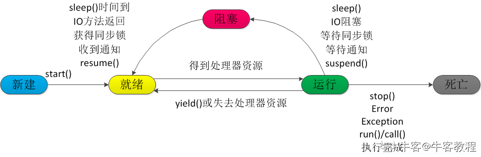

# Java 多线程编程

## 线程的生命周期

下图显示了一个线程完整的生命周期。



- new:

  使用 **new** 关键字和 **Thread** 类或其子类建立一个线程对象后，该线程对象就处于新建状态。它保持这个状态直到程序 **start()** 这个线程。

- runnable:

  当线程对象调用了start()方法之后，该线程就进入就绪状态。就绪状态的线程处于就绪队列中，要等待JVM里线程调度器的调度。

- running:

  如果就绪状态的线程获取 CPU 资源，就可以执行 **run()**，此时线程便处于运行状态。处于运行状态的线程最为复杂，它可以变为阻塞状态、就绪状态和死亡状态。

- blocked:

  如果一个线程执行了sleep（睡眠）、suspend（挂起）等方法，失去所占用资源之后，该线程就从运行状态进入阻塞状态。在睡眠时间已到或获得设备资源后可以重新进入就绪状态。可以分为三种：

  - 等待阻塞：运行状态中的线程执行 wait() 方法，使线程进入到等待阻塞状态。
  - 同步阻塞：线程在获取 synchronized 同步锁失败(因为同步锁被其他线程占用)。
  - 其他阻塞：通过调用线程的 sleep() 或 join() 发出了 I/O 请求时，线程就会进入到阻塞状态。当sleep() 状态超时，join() 等待线程终止或超时，或者 I/O 处理完毕，线程重新转入就绪状态。

- terminated:

  一个运行状态的线程完成任务或者其他终止条件发生时，该线程就切换到终止状态。

## 线程的优先级

每一个 Java 线程都有一个优先级，这样有助于操作系统确定线程的调度顺序。

Java 线程的优先级是一个整数，其取值范围是 1 （Thread.MIN_PRIORITY ） - 10 （Thread.MAX_PRIORITY ）。

默认情况下，每一个线程都会分配一个优先级 NORM_PRIORITY（5）。

具有较高优先级的线程对程序更重要，并且应该在低优先级的线程之前分配处理器资源。但是，线程优先级不能保证线程执行的顺序，而且非常依赖于平台。

## 创建一个线程

Java 提供了三种创建线程的方法：

- 通过实现 Runnable 接口；
- 通过继承 Thread 类本身；
- 通过 Callable 和 Future 创建线程。

### 通过实现 Runnable 接口来创建线程

创建线程需要指定线程应该执行的任务，也就是说构造器的参数应该是一个方法。但是 Java 中不支持函数参数，所以提供了一个 Runnable 函数式接口来传入任务函数。

Thread 定义了几个构造方法，下面的这个是我们经常使用的：`Thread(Runnable threadOb, String threadName)`。threadOb 是一个实现 Runnable 接口类型，可以传入一个实现类的对象，或者使用 lambda 函数。threadName 指定新线程的名字。

```java
class RunnableDemo implements Runnable {
   private Thread t;
   private String threadName;

   RunnableDemo( String name) {
      threadName = name;
      System.out.println("Creating " +  threadName );
   }

   public void run() {
      System.out.println("Running " +  threadName );
      try {
         for(int i = 4; i > 0; i--) {
            System.out.println("Thread: " + threadName + ", " + i);
            // 让线程睡眠一会
            Thread.sleep(50);
         }
      }catch (InterruptedException e) {
         System.out.println("Thread " +  threadName + " interrupted.");
      }
      System.out.println("Thread " +  threadName + " exiting.");
   }

   public void start () {
      System.out.println("Starting " +  threadName );
      if (t == null) {
         t = new Thread (this, threadName);
         t.start ();
      }
   }
}

public class TestThread {
   public static void main(String args[]) {
      RunnableDemo R1 = new RunnableDemo( "Thread-1");
      R1.start();

      RunnableDemo R2 = new RunnableDemo( "Thread-2");
      R2.start();
   }   
}
```

运行结果：

```
Creating Thread-1
Starting Thread-1
Creating Thread-2
Starting Thread-2
Running Thread-1
Thread: Thread-1, 4
Running Thread-2
Thread: Thread-2, 4
Thread: Thread-1, 3
Thread: Thread-2, 3
Thread: Thread-1, 2
Thread: Thread-2, 2
Thread: Thread-1, 1
Thread: Thread-2, 1
Thread Thread-1 exiting.
Thread Thread-2 exiting.
```

### 通过继承Thread来创建线程

创建一个线程的第二种方法是创建一个新的类，该类继承 Thread 类，然后创建一个该类的实例。

该方法尽管被列为一种多线程实现方式，但是本质上也是实现了 Runnable 接口的一个实例。因为 Thread 类 implement 了 Runnable 接口。

```java
class ThreadDemo extends Thread {
   private Thread t;
   private String threadName;

   ThreadDemo( String name) {
      threadName = name;
      System.out.println("Creating " +  threadName );
   }

   public void run() {
      System.out.println("Running " +  threadName );
      try {
         for(int i = 4; i > 0; i--) {
            System.out.println("Thread: " + threadName + ", " + i);
            // 让线程睡眠一会
            Thread.sleep(50);
         }
      }catch (InterruptedException e) {
         System.out.println("Thread " +  threadName + " interrupted.");
      }
      System.out.println("Thread " +  threadName + " exiting.");
   }

   public void start () {
      System.out.println("Starting " +  threadName );
      if (t == null) {
         t = new Thread (this, threadName);
         t.start ();
      }
   }
}

public class TestThread {

   public static void main(String args[]) {
      ThreadDemo T1 = new ThreadDemo( "Thread-1");
      T1.start();

      ThreadDemo T2 = new ThreadDemo( "Thread-2");
      T2.start();
   }   
}
```

### Thread 方法

下表列出了Thread类的一些重要方法：

| **序号** |                         **方法描述**                         |
| :------: | :----------------------------------------------------------: |
|    1     | **public void start()** 使该线程开始执行；**Java** 虚拟机调用该线程的 run 方法。 |
|    2     | **public void run()** 如果该线程是使用独立的 Runnable 运行对象构造的，则调用该 Runnable 对象的 run 方法；否则，该方法不执行任何操作并返回。 |
|    3     | **public final void setName(String name)** 改变线程名称，使之与参数 name 相同。 |
|    4     | **public final void setPriority(int priority)** 更改线程的优先级。 |
|    5     | **public final void setDaemon(boolean on)** 将该线程标记为守护线程或用户线程。 |
|    6     | **public final void join(long millisec)** 等待该线程终止的时间最长为 millis 毫秒。 |
|    7     |            **public void interrupt()** 中断线程。            |
|    8     | **public final boolean isAlive()** 测试线程是否处于活动状态。 |

测试线程是否处于活动状态。 上述方法是被Thread对象调用的。下面的方法是Thread类的静态方法。

| **序号** |                         **方法描述**                         |
| :------: | :----------------------------------------------------------: |
|    1     | **public static void yield()** 暂停当前正在执行的线程对象，并执行其他线程。 |
|    2     | **public static void sleep(long millisec)** 在指定的毫秒数内让当前正在执行的线程休眠（暂停执行），此操作受到系统计时器和调度程序精度和准确性的影响。 |
|    3     | **public static boolean holdsLock(Object x)** 当且仅当当前线程在指定的对象上保持监视器锁时，才返回 true。 |
|    4     | **public static Thread currentThread()** 返回对当前正在执行的线程对象的引用。 |
|    5     | **public static void dumpStack()** 将当前线程的堆栈跟踪打印至标准错误流。 |

### 通过 Callable 和 Future 创建线程

- 创建 Callable 接口的实现类，并实现 call() 方法，该 call() 方法将作为线程执行体，并且有返回值。
- 创建 Callable 实现类的实例，使用 FutureTask 类来包装 Callable 对象，该 FutureTask 对象封装了该 Callable 对象的 call() 方法的返回值。
- 使用 FutureTask 对象作为 Thread 对象的 target 创建并启动新线程。
- 调用 FutureTask 对象的 get() 方法来获得子线程执行结束后的返回值。

```java
public class CallableThreadTest implements Callable<Integer> {
    public static void main(String[] args)  {  
        CallableThreadTest ctt = new CallableThreadTest();  
        FutureTask<Integer> ft = new FutureTask<>(ctt);  
        for(int i = 0;i < 100;i++)  {  
            System.out.println(Thread.currentThread().getName()+" 的循环变量i的值"+i); 
            if(i==20)  {  
                new Thread(ft,"有返回值的线程").start();  
            }  
        }  
        try  {  
            System.out.println("子线程的返回值："+ft.get());  
        } catch (InterruptedException e)  {  
            e.printStackTrace();  
        } catch (ExecutionException e)  {  
            e.printStackTrace();  
        }  
    }
    @Override  
    public Integer call() throws Exception  {  
        int i = 0;  
        for(;i<100;i++)  {  
            System.out.println(Thread.currentThread().getName()+" "+i);  
        }  
        return i;  
    }  
}
```

## 创建线程的三种方式的对比

- 采用实现 Runnable、Callable 接口的方式创建多线程时，线程类只是实现了 Runnable 接口或 Callable 接口，还可以继承其他类。
- 使用继承 Thread 类的方式创建多线程时，编写简单，如果需要访问当前线程，则无需使用 Thread.currentThread() 方法，直接使用 this 即可获得当前线程。

## 线程的几个主要概念

在多线程编程时，你需要了解以下几个概念：

- 线程同步
- 线程间通信
- 线程死锁
- 线程控制：挂起、停止和恢复

## 中断线程

> https://www.liaoxuefeng.com/wiki/1252599548343744/1306580767211554

## 守护线程

Java程序入口就是由JVM启动`main`线程，`main`线程又可以启动其他线程。当所有线程都运行结束时，JVM退出，进程结束。

如果有一个线程没有退出，JVM进程就不会退出。所以，必须保证所有线程都能及时结束。

## 多线程的使用

有效利用多线程的关键是理解程序是并发执行而不是串行执行的。例如：程序中有两个子系统需要并发执行，这时候就需要利用多线程编程。

通过对多线程的使用，可以编写出非常高效的程序。不过请注意，如果你创建太多的线程，程序执行的效率实际上是降低了，而不是提升了。

请记住，上下文的切换开销也很重要，如果你创建了太多的线程，CPU 花费在上下文的切换的时间将多于执行程序的时间！
