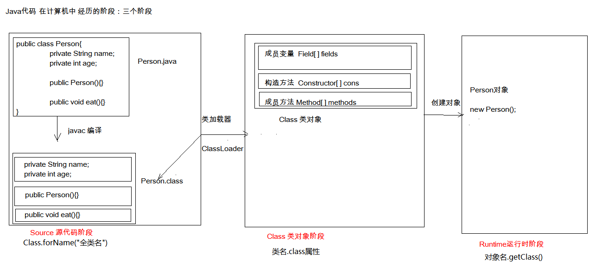
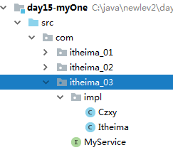
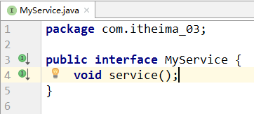
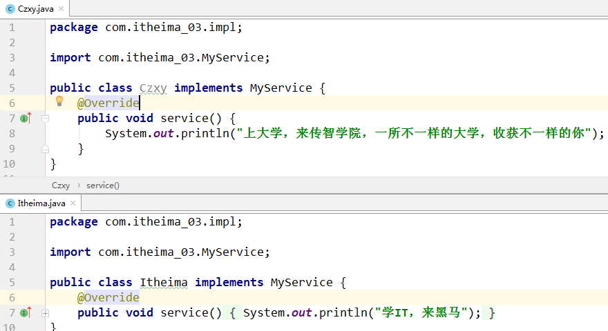
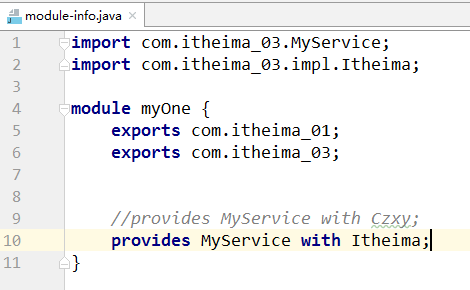
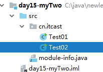
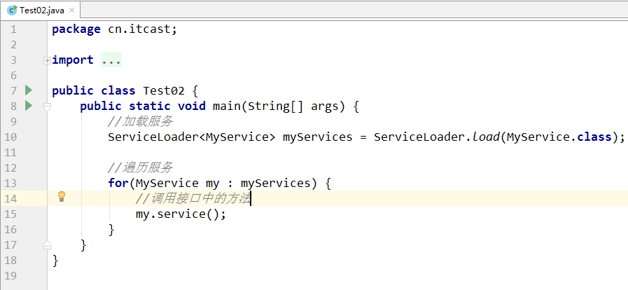
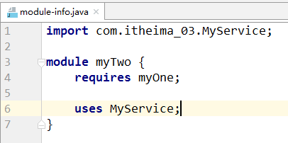

## 类加载

### 类的加载过程

- 类加载的描述
  - 当程序要使用某个类时，如果该类还未被加载到内存中，则系统会通过类的加载，类的连接，类的初始化这三个步骤来对类进行初始化。如果不出现意外情况，JVM将会连续完成这三个步骤，所以有时也把这三个步骤统称为类加载或者类初始化
- 类的加载
  - 就是指将class文件读入内存，并为之创建一个 java.lang.Class 对象
- 类的连接
  - 验证：验证合法性、版本是否正确
  - 准备：负责为类的静态变量分配内存，并设置默认值
  - 解析：将类的二进制数据中的符号引用替换为直接引用
- 类的初始化
  - 在该阶段，主要就是对静态变量进行初始化

### 类初始化

类的初始化步骤

- 假如类还未被加载和连接，则程序先加载并连接该类
- 假如该类的直接父类还未被初始化，则先初始化其直接父类
- 假如类中有初始化语句，则系统依次执行这些初始化语句
- 注意：在执行第2个步骤的时候，系统对直接父类的初始化步骤也遵循初始化步骤1-3

类的初始化时机
- 创建类的实例
- 调用类的静态资源
- 使用反射方式来强制创建某个类或接口对应的java.lang.Class对象
- 初始化某个类的子类
- 直接使用java.exe命令来运行某个主类

哪些使用类的操作，但是不会导致类的初始化？

* 使用类的静态常量（static  final）
* 通过子类调用父类的静态变量，静态方法，只会导致父类初始化，不会导致子类初始化，即只有声明静态成员的类才会初始化
* 用某个类型声明数组并创建数组对象时，不会导致这个类初始化

### 类加载器

#### 类加载器的作用

- 负责将.class文件加载到内存中，并为之生成对应的 java.lang.Class 对象。虽然我们不用过分关心类加载机制，但是了解这个机制我们就能更好的理解程序的运行！

#### JVM的类加载机制

- 全盘负责：就是当一个类加载器负责加载某个Class时，该Class所依赖的和引用的其他Class也将由该类加载器负责载入，除非显示使用另外一个类加载器来载入
- 父类委托：就是当一个类加载器负责加载某个Class时，先让父类加载器试图加载该Class，只有在父类加载器无法加载该类时才尝试从自己的类路径中加载该类
- 缓存机制：保证所有加载过的Class都会被缓存，当程序需要使用某个Class对象时，类加载器先从缓存区中搜索该Class，只有当缓存区中不存在该Class对象时，系统才会读取该类对应的二进制数据，并将其转换成Class对象，存储到缓存区

#### Java中的内置类加载器

- Bootstrap ClassLoader：引导类加载器也叫根类加载器。负责加载jre/rt.jar核心库，它不是Java代码实现的，也不是ClassLoader的子类，获取它的对象时往往返回null。
- Extension ClassLoader: 扩展类加载器，负责加载jre/lib/ext扩展库。
- Platform ClassLoader：平台类加载器可以看到所有平台类 ，平台类包括由平台类加载器或其祖先定义的Java SE平台API，其实现类和JDK特定的运行时类
- System ClassLoader：也被称为Application Classloader，负责加载项目的classpath路径下的类。自定义的类由此加载器加载。
- 类加载器的继承关系：System的父加载器为Platform，而Platform的父加载器为Bootstrap
- 自定义类加载器：tomcat中提供了。

#### 类加载器的双亲委托模式

下一级的类加载器，如果接到任务时，会先搜索是否加载过，如果没有，会先把任务往上传。如果都没有加载过，一直到根加载器，如果根加载器在它负责的路径下没有找到，会往回传。如果一路回传到最后一级都没有找到，那么会报 ClassNotFoundException 或 NoClassDefError ，如果在某一级找到了，就直接返回Class对象。

#### ClassLoader 中的两个方法

- 方法分类

  | 方法名                                              | 说明                       |
  | --------------------------------------------------- | -------------------------- |
  | public static ClassLoader getSystemClassLoader()    | 返回用于委派的系统类加载器 |
  | public InputStream getResourceAsStream(String name) | 加载某一个资源文件         |

- 示例代码

  ```java
  public class ClassLoaderDemo {
      public static void main(String[] args) {
          //static ClassLoader getSystemClassLoader()：获取系统类加载器
          ClassLoader systemClassLoader = ClassLoader.getSystemClassLoader();
         //通过系统类加载器加载资源文件
         InputStream is = systemClassLoader.getResourceAsStream(jdbc.properties);
          Properties prop = new Properties();
          prop.load(is);
      }
  }
  ```

## 反射

### 概述

Java反射机制是在运行状态中，对于任意一个类，都能够知道这个类的所有属性和方法；对于任意一个对象，都能够调用它的任意一个方法和属性；这种动态获取的信息以及动态调用对象的方法的功能称为Java语言的反射机制。
编译时，类加载器会把源文件用到的类加载到JVM中，然后再内存中产生一个java.lang.Class对象，这个对象会被放入到字节码信息中。这个Class对象就像一面镜子，可以透过它看到原来的类的信息，这种机制就是反射。

反射的优点：

1. 可以在程序运行过程中操作这些对象
2. 可以解耦合，提高程序的可拓展性

简单地说：正常的做法是通过实例变量操作成员变量和成员方法，反射是通过成员变量和成员方法操作实例变量。

### 获取Class类对象

- 类名.class
  基本数据类型、数组、枚举、接口、注解都可以这样获取class对象
- 对象名.getClass()
- Class.forName(全类名)

```java
//获取字节码信息的4中方式
public class Test {
    public static void main(String[] args) throws ClassNotFoundException {
        //方式一：对象.getClass()
        Person p = new Person();
        Class cls1 = p.getClass();

        //方式二：类名.class属性
        Class<Person> cls2 = Person.class;
        System.out.println(cls1==cls2);//true，同一个字节码文件(*.class)在一次程序运行过程中，只会被加载一次，不论通过哪一种方式获取的Class对象都是同一个。

        //前两种方式不常用
        //方式三：使用Class类的静态方法forName(String className)，最常用
        Class cls3 = Class.forName("ReflectDemo.Person");//参数是类的完整名称，含包名

        //方式四：利用类的加载器，了解即可
        ClassLoader loader = Test.class.getClassLoader();
        Class cls4 = loader.getClass();
    }
}
```

以下类型被加载时都会产生Class对象

1. 类
2. 接口
3. 注解
4. 数组
5. 基本数据类型
6. void

```java
//各种类型的元素都会产生Class文件
public class Test02 {
    public static void main(String[] args) {
        Class<String> c1 = String.class;
        Class<Runnable> c2 = Runnable.class;
        Class<Override> c3 = Override.class;

        int[] arr1 = {1,2,3};
        Class<? extends int[]> c4 = arr1.getClass();
        int[] arr2 = {3,4,5};
        Class<? extends int[]> c5 = arr2.getClass();
        System.out.println(c4==c5);//true 同一个元素类型的数组,得到的字节码就是同一个

        Class<Integer> c6 = int.class;
        Class<Void> c7 = void.class;
    }
}
```


### 获取构造器和创建对象

获取构造器的方法：返回值都是Constructor类的对象。

| 方法名                                                       | 说明                                     |
| ------------------------------------------------------------ | ---------------------------------------- |
| Constructor<?>[] getConstructors()                           | 返回所有public的构造方法对象的数组       |
| Constructor<?>[] getDeclaredConstructors()                   | 返回所有构造方法（任意修饰符）对象的数组 |
| Constructor<T> getConstructor(Class<?>... parameterTypes)    | 返回单个public修饰的有参构造方法         |
| Constructor<T> getDeclaredConstructor(Class<?>... parameterTypes) | 返回单个任意修饰符的有参构造方法         |

获取了类的构造器之后就可以创建实例化对象了。

| 方法名                           | 说明                       |
| -------------------------------- | -------------------------- |
| T newInstance(Object...initargs) | 根据指定的构造方法创建对象 |

用到的类

```java
package ReflectDemo;

//Person作为父类
public class Person {
    //属性
    private int age;
    public String name;
    //方法
    private void eat(){
        System.out.println("Person---eat");
    }
    public void sleep(){
        System.out.println("Person---sleep");
    }
}
package ReflectDemo;

import java.util.Comparator;

//Student作为子类
public class Student extends Person implements Comparator {
    //属性：四种修饰符都有
    private int sno;//学号
    double height;//身高
    protected double weight;//体重
    public double score;//成绩
    //方法：四种修饰符都有，还有重载
    public String showInfo(){
        return "我是一名三好学生";
    }
    public String showInfo(int a,int b){
        return "重载方法====我是一名三好学生";
    }
    private void work(){
        System.out.println("我以后会找工作--》成为码农  程序员 程序猿  程序媛");
    }
    void happy(){
        System.out.println("做人最重要的就是开心每一天");
    }
    protected int getSno(){
        return sno;
    }
    //构造器
    public Student(){
        System.out.println("空参构造器");
    }
    private Student(int sno){
        this.sno = sno;
    }
    Student(int sno,double weight){
        this.sno = sno;
        this.weight = weight;
    }
    public Student(double height,double weight){
        this.height=height;
        this.weight=weight;
    }
    protected Student(int sno,double height,double weight){
        this.sno = sno;
    }

    @Override
    public String toString() {
        return "Student{" +
                "sno=" + sno +
                ", height=" + height +
                ", weight=" + weight +
                ", score=" + score +
                '}';
    }

    @Override
    public int compare(Object o1, Object o2) {
        return 0;
    }
}

```

通过Class操作上面的类

```java
package ReflectDemo;

import java.lang.reflect.Constructor;
import java.lang.reflect.InvocationTargetException;

public class ConstructorTest {
    public static void main(String[] args) throws NoSuchMethodException, InvocationTargetException, InstantiationException, IllegalAccessException {
        //获取字节码信息：
        Class cls = Student.class;

        //通过字节码信息可以获取构造器：
        //getConstructors只能获取当前运行时类的被public修饰的构造器数组
        Constructor[] c1 = cls.getConstructors();
        for(Constructor c:c1){
            System.out.println(c);//public ReflectDemo.Student()
        }
        //getDeclaredConstructors:获取运行时类的任意修饰符的构造器
        Constructor[] c2 = cls.getDeclaredConstructors();
        for (Constructor c:c2) {
            System.out.println(c);//所有的构造器都被获取了
        }

        //获取指定的构造器
        //getConstructor()：获取无参构造器
        Constructor con = cls.getConstructor();
        System.out.println(con);
        //得到有两个参数的构造器
        Constructor con2 = cls.getConstructor(double.class, double.class);
        System.out.println(con2);//public ReflectDemo.Student(double,double)
        //获取一个参数的非public的构造器
        Constructor con3 = cls.getDeclaredConstructor(int.class);
        System.out.println(con3);//private ReflectDemo.Student(int)

        //有了构造器就可以创建对象了
        Object o = con2.newInstance(170.6, 150.0);
        System.out.println(o);//Student{sno=0, height=170.6, weight=150.0, score=0.0}
        //无参的构造器其实不用获取，直接用Class.newInstance就可以生成实例化对象
        Object o1 = cls.newInstance();//已过时
        System.out.println(o1);// Student{sno=0, height=0.0, weight=0.0, score=0.0}
        
        //强制通过private构造器实例化变量
        con3.setAccessible(true);
        Object o2con3.newInstance(20);

    }
}

```

### 获取属性并赋值

获取属性的方法：返回值都是Field类的对象

| 方法名                              | 说明                                         |
| ----------------------------------- | -------------------------------------------- |
| Field[] getFields()                 | 返回所有public修饰的属性（包含父类的）的数组 |
| Field[] getDeclaredFields()         | 返回本类任意修饰符的属性数组                 |
| Field getField(String name)         | 返回指定的public的属性                       |
| Field getDeclaredField(String name) | 返回指定的任意修饰符的属性                   |

获取了Field对象后就可以操作属性了

| 方法                                      | 描述                                   |
| ----------------------------------------- | -------------------------------------- |
| public void set(Object obj, Object value) | 为对象的属性赋值                       |
| get(Object obj)                           | 获取对象的值                           |
| setAccessible(true)                       | 暴力反射，忽略访问权限修饰符的安全检查 |

```java
package ReflectDemo;

import java.lang.reflect.Field;
import java.lang.reflect.Modifier;

public class FieldsTest {
    public static void main(String[] args) throws NoSuchFieldException, InstantiationException, IllegalAccessException {
        //获取运行时类的字节码信息：
        Class cls = Student.class;
        //获取属性：
        //getFields：获取运行时类和父类中被public修饰的属性
        Field[] fields = cls.getFields();
        for(Field f:fields){
            System.out.println(f);
        }
        System.out.println("---------------------");
        //getDeclaredFields：获取运行时类中的所有属性
        Field[] declaredFields = cls.getDeclaredFields();
        for(Field f:declaredFields){
            System.out.println(f);
        }
        System.out.println("---------------------");
        //获取指定的属性：
        Field score = cls.getField("score");
        System.out.println(score);
        Field sno = cls.getDeclaredField("sno");
        System.out.println(sno);
        System.out.println("---------------------");
        //获取属性的具体声明：
        //获取修饰符
        int modifiers = sno.getModifiers();
        System.out.println(modifiers);//2,因为private底层的数值就是2：public static final int PRIVATE= 0x00000002;
        System.out.println(Modifier.toString(modifiers));//private
        //获取属性的数据类型：
        Class type = sno.getType();
        System.out.println(type.getName());//int
        //获取属性的名字：
        String name = sno.getName();
        System.out.println(name);//sno
        System.out.println("-------------------------------");
        //给属性赋值：(给属性设置值，必须要有对象)
        Object obj = cls.newInstance();
        Field sco = cls.getField("score");
        sco.set(obj,98);//给obj这个对象的score属性赋值
        System.out.println(obj);
        //暴力反射，强行操作私有化属性
        Field sno1 = cls.getDeclaredField("sno");
        sno1.setAccessible(true);
        sno1.set(obj,41919);//如果是静态变量就不需要obj了，传入一个null即可
        System.out.println(sno1.get(obj));
        
    }
}
```

### 获取方法并调用

```java
package com.zhaoss.test03;
import java.lang.annotation.Annotation;
import java.lang.reflect.InvocationTargetException;
import java.lang.reflect.Method;
import java.lang.reflect.Modifier;
public class Test03 {
    public static void main(String[] args) throws NoSuchMethodException, IllegalAccessException, InstantiationException, InvocationTargetException {
        //获取字节码信息：
        Class cls = Student.class;
        //获取方法：
        //getMethods:获取运行时类的方法还有所有父类中的方法（被public修饰）
        Method[] methods = cls.getMethods();
        for(Method m:methods){
            System.out.println(m);
        }
        System.out.println("-----------------------");
        //getDeclaredMethods:获取运行时类中的所有方法：
        Method[] declaredMethods = cls.getDeclaredMethods();
        for(Method m:declaredMethods){
            System.out.println(m);
        }
        System.out.println("-----------------------");
        //获取指定的方法：
        Method showInfo1 = cls.getMethod("showInfo");
        System.out.println(showInfo1);
        Method showInfo2 = cls.getMethod("showInfo", int.class, int.class);//重载的方法要传入参数
        System.out.println(showInfo2);
        Method work = cls.getDeclaredMethod("work",int.class);
        System.out.println(work);
        System.out.println("-----------------------");
        //获取方法的具体结构：
        /*
        @注解
        修饰符 返回值类型  方法名(参数列表) throws XXXXX{}
         */
        //名字：
        System.out.println(work.getName());
        //修饰符：
        int modifiers = work.getModifiers();
        System.out.println(Modifier.toString(modifiers));
        //返回值：
        System.out.println(work.getReturnType());
        //参数列表：
        Class[] parameterTypes = work.getParameterTypes();
        for(Class c:parameterTypes){
            System.out.println(c);
        }
        //获取注解：
        Method myMethod = cls.getMethod("myMethod");
        Annotation[] annotations = myMethod.getAnnotations();
        for(Annotation a:annotations){
            System.out.println(a);
        }
        //获取异常：
        Class[] exceptionTypes = myMethod.getExceptionTypes();
        for(Class c:exceptionTypes){
            System.out.println(c);
        }
        //调用方法：
        Object o = cls.newInstance();
        myMethod.invoke(o);//调用o对象的mymethod方法，注意反射调用方法的格式是：方法对象.invoke(实例化对象)，以前是：实例化对象.方法名()
        System.out.println(showInfo2.invoke(o,12,45));;
    }
}

```

### 获取类的父类、接口、包、注解

```java
package com.zhaoss.test03;
import java.lang.annotation.Annotation;
public class Test04 {
    public static void main(String[] args) {
        //获取字节码信息：
        Class cls = Student.class;
        //获取运行时类的接口：
        Class[] interfaces = cls.getInterfaces();
        for(Class c:interfaces){
            System.out.println(c);
        }
        //得到父类的接口：
        //先得到父类的字节码信息：
        Class superclass = cls.getSuperclass();
        //得到接口：
        Class[] interfaces1 = superclass.getInterfaces();
        for(Class c:interfaces1){
            System.out.println(c);
        }
        //获取运行时类所在的包：
        Package aPackage = cls.getPackage();
        System.out.println(aPackage);
        System.out.println(aPackage.getName());
        //获取运行类的注解：
        Annotation[] annotations = cls.getAnnotations();
        for(Annotation a:annotations){
            System.out.println(a);
        }
    }
}

```

### 反射的案例

#### 越过泛型检查

- 案例需求

  - 通过反射技术，向一个泛型为Integer的集合中添加一些字符串数据

- 代码实现

  ```java
  public class ReflectTest01 {
      public static void main(String[] args) throws Exception {
          //创建集合
          ArrayList<Integer> array = new ArrayList<Integer>();
  
          array.add(10);
          array.add(20);
  
          Class<? extends ArrayList> c = array.getClass();
          Method m = c.getMethod("add", Object.class);
  
          m.invoke(array,"hello");
          m.invoke(array,"world");
          m.invoke(array,"java");
  
          System.out.println(array);
      }
  }
  ```

#### 通过反射创建数组

```java
import java.lang.reflect.Array;

public class ReflectArray {
    public static void main(String[] args) throws InstantiationException, IllegalAccessException {
        Object o = Array.newInstance(String.class,5);
        Array.set(o,0,"蔡徐坤");
        Array.set(o,1,"肖战");

        Object o1 = Array.get(o, 1);
        System.out.println(o1);
    }
}

```

#### 模拟框架

- 案例需求

  - 通过反射运行配置文件中指定类的指定方法

- 代码实现

  ```java
  package ReflectDemo;
  
  import java.io.FileReader;
  import java.lang.reflect.Constructor;
  import java.lang.reflect.Method;
  import java.util.Properties;
  
  public class Testo4 {
      public static void main(String[] args) throws Exception {
          //传统方式调用方法
          Student student = new Student();
          student.showInfo();
  
          //新方式：将要使用的类和方法名放入class.txt中，通过反射调用。
          Properties prop = new Properties();
          FileReader fr = new FileReader("D:\\Code\\javaSE\\基础语法\\class.txt");
          prop.load(fr);
          fr.close();
  
          String className = prop.getProperty("className");//获取了类名
          String methodName = prop.getProperty("methodName");//获取了方法名
  
          Class<?> c = Class.forName(className);//创建反射
          Constructor<?> con = c.getConstructor();//获取构造器
          Object o = con.newInstance();//创建对象
          Method m = c.getMethod(methodName);//获取方法的对象
          m.invoke(o);//调用方法
  
      }
  }
  ```

* 配置文件class.txt，注意没有双引号，键和值用“=”或者“:”分割，里面任意添加空格

  ```
  className=ReflectDemo.Student
  methodName=showInfo
  ```


## 模块化

### 模块化概述

Java语言随着这些年的发展已经成为了一门影响深远的编程语言，无数平台，系统都采用Java语言编写。但是，伴随着发展，Java也越来越庞大，逐渐发展成为一门“臃肿” 的语言。而且，无论是运行一个大型的软件系统，还是运行一个小的程序，即使程序只需要使用Java的部分核心功能， JVM也要加载整个JRE环境。
为了给Java“瘦身”，让Java实现轻量化，Java 9正式的推出了模块化系统。Java被拆分为N多个模块，并允许Java程序可以根据需要选择加载程序必须的Java模块，这样就可以让Java以轻量化的方式来运行。
其实，Java 7的时候已经提出了模块化的概念，但由于其过于复杂，Java 7，Java 8都一直未能真正推出，直到Java 9才真正成熟起来。对于Java语言来说，模块化系统是一次真正的自我革新，这种革新使得“古老而庞大”的Java语言重新焕发年轻的活力

### 模块的基本使用

1. 在项目中创建两个模块。一个是myOne,一个是myTwo

2. 如果想要在myTwo模块中使用myOne模块中的类，必须配置module-info.java文件

3. 在myOne模块中src目录下，创建module-info.java，并写入以下内容

   ```java
   module myOne{
       exports com.itheima_01;//这样其他模型就能用myOne块的这个包了
   }
   ```

4. 在myTwo模块中src目录下，创建module-info.java，并写入以下内容

   ```java
   module myTwo{
       requires myOne;//这样就能用myOne模块导出的包了
   }
   ```

5. 测试类

   ```java
   import com.itheima_01;//导入模块1的包
   public class Test{
       Student student = new Student();//使用导入包的类
   }
   ```

### 模块服务的基本使用

1. 在myOne模块中新建一个包，提供一个接口和两个实现类

   

   

   

2. 在myOne模块中修改module-info.java文件，添加以下内容

   

3. 在myTwo模块中新建一个测试类

   

   

4. 在myTwo模块中修改module-info.java文件，添加以下内容

   
