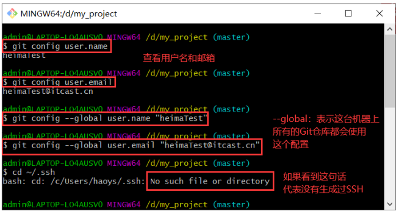
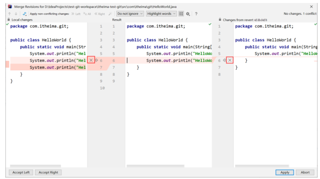

### Git和SVN比较

SVN是集中式版本控制系统，版本库是集中放在中央服务器的，而开发人员工作的时候，用的都是自己的电脑，所以首先要从中央服务器下载最新的版本，然后开发，开发完后，需要把自己开发的代码提交到中央服务器。
Git是开源分布式版本控制系统，分为本地仓库和远程仓库，每一个客户端都保存了完整的历史记录。

### Git使用

在想要使用git的文件夹中单击右键，选择git bash进入命令行工具。
git --version查看版本
TortoiseGit：小乌龟GitGUI管理软件。

#### 本地仓库

工作目录Working Tree：代码存放位置，里面的代码经常发生变动
本地历史仓库Repository：存放不同版本的代码
暂存区Index：代码提交到仓库之前的临时存储空间

#### 常用命令

| 命令                     | 作用                                           |
| ------------------------ | ---------------------------------------------- |
| git init                 | 初始化，创建 git 仓库                          |
| git status               | 查看 git 状态 （文件是否进行了添加、提交操作） |
| git add 文件名           | 添加，将指定文件添加到暂存区                   |
| git commit -m '提交信息' | 提交，将暂存区文件提交到历史仓库               |
| git log                  | 查看日志（ git 提交的历史日志）                |

步骤：

1. 创建工作目录，初始化本地git仓库
   git init
2. 新建一个text.txt文件（暂不执行添加操作）
3. 使用status命令，查看状态
   git status
   看到text.txt显示为红色
4. 使用add命令添加，并查看状态
   git add text.txt
   text.txt变为绿色了
5. 使用commit命令，提交到本地历史仓库。此命令会把所有添加的文件都一起提交了。
   git commit -m 'commit text.txt firstly'
6. 使用log命令，查看日志
   git log
   多了一条黄色的文件标识
7. 修改text.txt文件
8. 添加并提交，查看日志
   git add text.txt
   git commit -m 'commit text.txt secondly'

#### 历史版本切换

git reflog：查看所有分支的所有操作记录（包括已经被删除的commit记录的操作）

git reset --hard 版本的唯一标识

#### 分支管理

在开始时经常面临新的需求，不得不停下手头正在进行的工作。这是就可以开始一个新的分支，在新分支中进行新的开发，在原有的分支继续进行原来的开发。当开发完成后，可以将两个分支合并。

Git中有两个指针，head指向当前的分支，master指向当前的代码版本。创建分支：git branch 分支名
切换分支：git checkout 分支名
查看所有分支：git branch
查看文件：ls

合并分支：git merge 分支名
删除分支：git branch -d 分支名

#### 远程仓库

1. 创建本地仓库
2. 创建或修改文件，添加（add）文件到暂存区，提交（commit）到本地仓库
3. 创建远程仓库
4. 推送到远程仓库

推送代码前，需要ssh公钥。生成公钥的步骤：

1. 设置Git账户

   1. git config user.name（查看git账户）

   2. git config user.email（查看git邮箱）

   3. git config --global user.name “账户名”（设置全局账户名）

   4. git config --global user.email “邮箱”（设置全局邮箱）

   5. cd ~/.ssh（查看是否生成过SSH公钥）

      

2. 生成SSH公钥

   1. 生成命令: ssh-keygen –t rsa –C “邮箱” ( 注意：这里需要敲3次回车)
   2. 查看命令: cat ~/.ssh/id_rsa.pub

3. 设置账户公钥
   复制生成的ssh公钥，粘贴到远程仓库。

4. 公钥测试：ssh -T git@github.com

推送到远程仓库

1. 复制远程仓库的URL，自定义仓库名称
   git remote add 远程仓库名称 远程仓库URL
   git remote -v 查看远程库信息
2. 推送
   git push -u 远程仓库名称 分支名 （注意还要输入一次yes）
   
   

先有远程仓库，本地仓库为空

1. 将远程仓库的代码，克隆到本地仓库
   克隆命令：git clone 仓库地址
   
2. 创建新文件，添加并提交到本地仓库
3. 本地仓库更新，推送至远程仓库（注意要先提交到本地仓库）
4. 项目拉取更新
   拉取命令：git pull 远程仓库名 分支名

#### 代码冲突

两个程序员操作同一个文件,其中一个程序员在修改文件后,push到远程仓库,另一个程序员应该先pull将最新的代码更新到本地仓库后,在修改代码,之后push到远程仓库,结果他没有先pull将最新的代码更新到本地仓库,而是直接将自己的代码push到远程仓库,这样就可能会导致代码冲突。

发生代码冲突，Git会阻止提交，程序员必须修改冲突之后才可以提交。

## IDEA集成Git

### IDEA中配置Git

1. File -> Settings

2. Version Control -> Git -> 指定git.exe存放目录

3. 点击Test测试

### 创建本地仓库

1. VCS->Import into Version Control->Create Git Repository

   

2. 选择工程所在的目录,这样就创建好本地仓库了

   

3. 点击git后边的对勾,将当前项目代码提交到本地仓库

   注意: 项目中的配置文件不需要提交到本地仓库中,提交时,忽略掉即可

   

### 版本切换

+ 方式一: 控制台Version Control->Log->Reset Current Branch...->Reset

  这种切换的特点是会抛弃原来的提交记录

  

+ 方式二:控制台Version Control->Log->Revert Commit->Merge->处理代码->commit

  这种切换的特点是会当成一个新的提交记录,之前的提交记录也都保留

  

  

  ​		

### 分支管理

+ 创建分支

  VCS->Git->Branches->New Branch->给分支起名字->ok

  

+ 切换分支

  idea右下角Git->选择要切换的分支->checkout

  

+ 合并分支

  VCS->Git->Merge changes->选择要合并的分支->merge

  

  处理分支中的代码

  

  

  

+ 删除分支

  idea右下角->选中要删除的分支->Delete

  

### 本地仓库推送到远程仓库

1. VCS->Git->Push->点击master Define remote

   

2. 将远程仓库的路径复制过来->Push

   

### 远程仓库克隆到本地仓库

File->Close Project->Checkout from Version Control->Git->指定远程仓库的路径->指定本地存放的路径->clone

