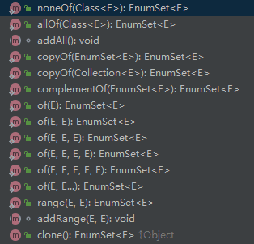
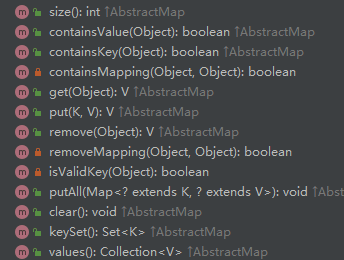

## 单例设计模式

饿汉式

```java
//饿汉式：创建对象实例的时候直接初始化  空间换时间
public class SingletonOne {
	//1、创建类中私有构造
	private SingletonOne(){}
	
	//2、创建该类型的私有静态实例
	private static SingletonOne instance = new SingletonOne();
	
	//3、创建公有静态方法返回静态实例对象
	public static SingletonOne getInstance(){
		return instance;
	}
}

```

懒汉式

```java
//懒汉式：类内实例对象创建时并不直接初始化，直到第一次调用get方法时，才完成初始化操作
//时间换空间
public class SingletonTwo {
	//1、创建私有构造方法
	private SingletonTwo(){}
	
	//2、创建静态的该类实例对象
	private static SingletonTwo instance=null;
	
	//3、创建开放的静态方法提供实例对象
	public static SingletonTwo getInstance(){
		if(instance==null)
			instance=new SingletonTwo();
		
		return instance;
	}
}
```

比较：

1. 饿汉式在类加载时创建实例，速度快，但占用空间。懒汉式在第一次使用时实例化，节省空间，但第一次创建需要时间。
2. 饿汉式是线程安全的，懒汉式在第一次使用时实例化，存在线程风险

单例模式中的类成员是否需要加final修饰？

从语法层面说：饿汉式，加入final修饰对于模式实现本身没有影响。懒汉式加入final修饰会报错，因为懒汉式在定义成员变量未实例化。
从应用层面说：如果饿汉式的代码不仅涉及创建对象及返回的功能，还包含其他的功能，譬如资源回收等，就不能用final修饰，会影响功能实现。
总结：懒汉式不能加入final，如果在饿汉式代码中，对类实例只涉及创建和返回方法，可以加入final修饰。

## 多例设计模式

如果我们想要定义一个学生类，其中保存了学生的性别属性：`private String sex;`。为了限制学生的性别只能有两种情况，我们可以把性别定义成一个类：`private Gender sex;`。然后通过Gender这个类来限制只能有两种性别。

```java
public class Gender{
    private String info;
    public final static Gender man = new Gender("男");
    public final static Gender woman = new Gender("女");
    
    private Gender(String info){
        this.info = info;
    };
    
}
```

一年有四个季节:

```java
public class Season{
    public final static SPRING = new Season("春天");
    public final static SUMMER = new Season("夏天");
    public final static AUTUMN = new Season("秋天");
    public final static WINTER = new Season("冬天");
    
    private String desc;
    
    private Season(String desc){
        this.desc = desc;
    }
}
```

## 枚举


测试类：

```java
package com.example;

import static com.example.Sex.MAN;
import static com.example.Sex.WOMAN;

/**
 * @author shenguopin
 * @date 2021/9/3 15:32
 */
public class Test {
    public static void main(String[] args) {
        Sex sex = MAN;

        switch (sex){
            case MAN:
                System.out.println("顶天立地");
                sex.run();
                break;
            case WOMAN:
                System.out.println("婀娜多姿");
                sex.run();
                break;
        }
    }
}

```

枚举是 Java 1.5 时引入的关键字，它表示一种特殊类型的类，继承自 java.lang.Enum。我们来新建一个枚举 PlayerType：

```java
public enum PlayerType {
    TENNIS,
    FOOTBALL,
    BASKETBALL
}
```

看一下反编译后的字节码：

```java
public final class PlayerType extends Enum
{

    public static PlayerType[] values()
    {
        return (PlayerType[])$VALUES.clone();
    }

    public static PlayerType valueOf(String name)
    {
        return (PlayerType)Enum.valueOf(com/cmower/baeldung/enum1/PlayerType, name);
    }

    private PlayerType(String s, int i)
    {
        super(s, i);
    }

    public static final PlayerType TENNIS;
    public static final PlayerType FOOTBALL;
    public static final PlayerType BASKETBALL;
    private static final PlayerType $VALUES[];

    static 
    {
        TENNIS = new PlayerType("TENNIS", 0);
        FOOTBALL = new PlayerType("FOOTBALL", 1);
        BASKETBALL = new PlayerType("BASKETBALL", 2);
        $VALUES = (new PlayerType[] {
            TENNIS, FOOTBALL, BASKETBALL
        });
    }
}
```

看到没？Java 编译器帮我们做了很多隐式的工作，不然手写一个枚举就没那么省心省事了。

- 要继承 Enum 类；
- 要写构造方法；
- 要声明静态变量和数组；
- 要用 static 块来初始化静态变量和数组；
- 要提供静态方法，比如说 `values()` 和 `valueOf(String name)`。

“确实，作为开发者，我们的代码量减少了，枚举看起来简洁明了。”三妹说。

“既然枚举是一种特殊的类，那它其实是可以定义在一个类的内部的，这样它的作用域就可以限定于这个外部类中使用。”我说。

```java
public class Player {
    private PlayerType type;
    public enum PlayerType {
        TENNIS,
        FOOTBALL,
        BASKETBALL
    }
    
    public boolean isBasketballPlayer() {
      return getType() == PlayerType.BASKETBALL;
    }

    public PlayerType getType() {
        return type;
    }

    public void setType(PlayerType type) {
        this.type = type;
    }
}
```

PlayerType 就相当于 Player 的内部类。

由于枚举是 final 的，所以可以确保在 Java 虚拟机中仅有一个常量对象，基于这个原因，我们可以使用“==”运算符来比较两个枚举是否相等，参照 `isBasketballPlayer()` 方法。

“那为什么不使用 `equals()` 方法判断呢？”三妹问。

```java
if(player.getType().equals(Player.PlayerType.BASKETBALL)){};
```

“我来给你解释下。”

“==”运算符比较的时候，如果两个对象都为 null，并不会发生 `NullPointerException`，而 `equals()` 方法则会。

另外， “==”运算符会在编译时进行检查，如果两侧的类型不匹配，会提示错误，而 `equals()` 方法则不会。


“枚举还可用于 switch 语句，和基本数据类型的用法一致。”我说。

```java
switch (playerType) {
        case TENNIS:
            return "网球运动员费德勒";
        case FOOTBALL:
            return "足球运动员C罗";
        case BASKETBALL:
            return "篮球运动员詹姆斯";
        case UNKNOWN:
            throw new IllegalArgumentException("未知");
        default:
            throw new IllegalArgumentException(
                    "运动员类型: " + playerType);

    }
```

“如果枚举中需要包含更多信息的话，可以为其添加一些字段，比如下面示例中的 name，此时需要为枚举添加一个带参的构造方法，这样就可以在定义枚举时添加对应的名称了。”我继续说。

```java
public enum PlayerType {
    TENNIS("网球"),
    FOOTBALL("足球"),
    BASKETBALL("篮球");

    private String name;

    PlayerType(String name) {
        this.name = name;
    }
}
```

“get 了吧，三妹？”

“嗯，比较好理解。”

“那接下来，我就来说点不一样的。”

“来吧，我准备好了。”

“EnumSet 是一个专门针对枚举类型的 Set 接口（后面会讲）的实现类，它是处理枚举类型数据的一把利器，非常高效。”我说，“从名字上就可以看得出，EnumSet 不仅和 Set 有关系，和枚举也有关系。”

“因为 EnumSet 是一个抽象类，所以创建 EnumSet 时不能使用 new 关键字。不过，EnumSet 提供了很多有用的静态工厂方法。”


“来看下面这个例子，我们使用 `noneOf()` 静态工厂方法创建了一个空的 PlayerType 类型的 EnumSet；使用 `allOf()` 静态工厂方法创建了一个包含所有 PlayerType 类型的 EnumSet。”

```java
public class EnumSetTest {
    public enum PlayerType {
        TENNIS,
        FOOTBALL,
        BASKETBALL
    }

    public static void main(String[] args) {
        EnumSet<PlayerType> enumSetNone = EnumSet.noneOf(PlayerType.class);
        System.out.println(enumSetNone);

        EnumSet<PlayerType> enumSetAll = EnumSet.allOf(PlayerType.class);
        System.out.println(enumSetAll);
    }
}
```

“来看一下输出结果。”

```java
[]
[TENNIS, FOOTBALL, BASKETBALL]
```

有了 EnumSet 后，就可以使用 Set 的一些方法了，见下图。



“除了 EnumSet，还有 EnumMap，是一个专门针对枚举类型的 Map 接口的实现类，它可以将枚举常量作为键来使用。EnumMap 的效率比 HashMap 还要高，可以直接通过数组下标（枚举的 ordinal 值）访问到元素。”

“和 EnumSet 不同，EnumMap 不是一个抽象类，所以创建 EnumMap 时可以使用 new 关键字。”

```java
EnumMap<PlayerType, String> enumMap = new EnumMap<>(PlayerType.class);
```

有了 EnumMap 对象后就可以使用 Map 的一些方法了，见下图。



和 HashMap（后面会讲）的使用方法大致相同，来看下面的例子。

```java
EnumMap<PlayerType, String> enumMap = new EnumMap<>(PlayerType.class);
enumMap.put(PlayerType.BASKETBALL,"篮球运动员");
enumMap.put(PlayerType.FOOTBALL,"足球运动员");
enumMap.put(PlayerType.TENNIS,"网球运动员");
System.out.println(enumMap);

System.out.println(enumMap.get(PlayerType.BASKETBALL));
System.out.println(enumMap.containsKey(PlayerType.BASKETBALL));
System.out.println(enumMap.remove(PlayerType.BASKETBALL));
```

“来看一下输出结果。”

```text
{TENNIS=网球运动员, FOOTBALL=足球运动员, BASKETBALL=篮球运动员}
篮球运动员
true
篮球运动员
```

“除了以上这些，《Effective Java》这本书里还提到了一点，如果要实现单例的话，最好使用枚举的方式。”我说。

“等等二哥，单例是什么？”三妹没等我往下说，就连忙问道。

“单例（Singleton）用来保证一个类仅有一个对象，并提供一个访问它的全局访问点，在一个进程中。因为这个类只有一个对象，所以就不能再使用 `new` 关键字来创建新的对象了。”

“Java 标准库有一些类就是单例，比如说 Runtime 这个类。”

```java
Runtime runtime = Runtime.getRuntime();
```

“Runtime 类可以用来获取 Java 程序运行时的环境。”

“关于单例，懂了些吧？”我问三妹。

“噢噢噢噢。”三妹点了点头。

“通常情况下，实现单例并非易事，来看下面这种写法。”

```java
public class Singleton {  
    private volatile static Singleton singleton; 
    private Singleton (){}  
    public static Singleton getSingleton() {  
    if (singleton == null) {
        synchronized (Singleton.class) { 
        if (singleton == null) {  
            singleton = new Singleton(); 
        }  
        }  
    }  
    return singleton;  
    }  
}
```

“要用到 volatile、synchronized 关键字等等，但枚举的出现，让代码量减少到极致。”

```java
public enum EasySingleton{
    INSTANCE;
}
```

“就这？”三妹睁大了眼睛。

“对啊，枚举默认实现了 Serializable 接口，因此 Java 虚拟机可以保证该类为单例，这与传统的实现方式不大相同。传统方式中，我们必须确保单例在反序列化期间不能创建任何新实例。”我说。
