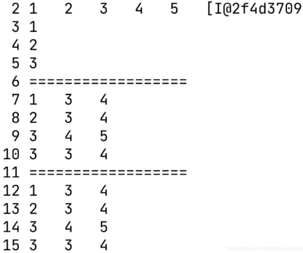

# Java数组

```java
public class Array {
    public static void main(String[] args) {
        int[] arr = {1,2,3,4,5};//java也支持c语言的这种写法：int arr[5];
        for(int x:arr){//foreach循环
            System.out.print(x + "\t");
        }
        System.out.println(arr);//这样打印的就是数组的地址

        //动态初始化，只给定数组长度，由系统给出默认初始化值
        int[] nums;//声明一个数组，在栈中存放一个地址
        nums = new int[3];//创建一个数组，在堆里开辟空间，栈的地址指向堆
        nums[0]=1;
        nums[1]=2;
        nums[2]=3;
        for(int i = 0; i < nums.length; i ++){//数组属于Arrays类，里面有许多方法
            System.out.println(nums[i]);
        }

        //多维数组
        int[][] matrix = {{1,3,4},{2,3,4},{3,4,5},{3,3,4}};
        //打印二维数组
        System.out.println("==================");
        for(int i = 0; i < matrix.length; i ++){
            for(int j = 0; j < matrix[0].length; j ++){
                System.out.print(matrix[i][j] + "\t");
            }
            System.out.println();
        }
        //也可以使用foreach语句打印
        System.out.println("==================");
        for(int[] ints:matrix){
            for(int num:ints) {
                System.out.print(num+"\t");
            }
            System.out.println();
        }
    }
}
```
**运行结果如下：**



数组除了用于保存基本数据类型的变量，还可以保存引用数据类型的变量，称为对象数组。

```java
public class Person {
    String name;
    
    public Person(String name) {
        this.age = age;
    }
}

public class ClassArray {
    public static void main(String[] args) {
        Person[] persons = new Person[]{new Person("Jack"),new Person("Mary"),new Person("Tom")};//静态初始化
        //动态初始化：Person[] persons = new Person[3];persons[0]= new Person("Jack");
    }
}
```

## Arrays 类

java.util.Arrays 类能方便地操作数组，它提供的所有方法都是静态的。

具有以下功能：

- 给数组赋值：通过 fill 方法。

- 对数组排序：通过 sort 方法,按升序。

- 比较数组：通过 equals 方法比较数组中元素值是否相等。

- 查找数组元素：通过 binarySearch 方法能对排序好的数组进行二分查找法操作。

  具体说明请查看下表：

  | 序号 |                          方法和说明                          |
  | :--: | :----------------------------------------------------------: |
  |  1   | **public static int binarySearch(Object[] a, Object key)** 用二分查找算法在给定数组中搜索给定值的对象(Byte,Int,double等)。数组在调用前必须排序好的。如果查找值包含在数组中，则返回搜索键的索引；否则返回 (-(*插入点*) - 1)。 |
  |  2   | **public static boolean equals(long[] a, long[] a2)** 如果两个指定的 long 型数组彼此*相等*，则返回 true。如果两个数组包含相同数量的元素，并且两个数组中的所有相应元素对都是相等的，则认为这两个数组是相等的。换句话说，如果两个数组以相同顺序包含相同的元素，则两个数组是相等的。同样的方法适用于所有的其他基本数据类型（Byte，short，Int等）。 |
  |  3   | **public static void fill(int[] a, int val)** 将指定的 int 值分配给指定 int 型数组指定范围中的每个元素。同样的方法适用于所有的其他基本数据类型（Byte，short，Int等）。 |
  |  4   | **public static void sort(Object[] a)** 对指定对象数组根据其元素的自然顺序进行升序排列。同样的方法适用于所有的其他基本数据类型（Byte，short，Int等）。 |