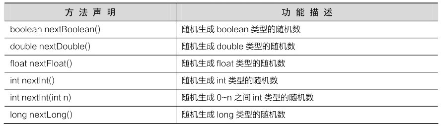
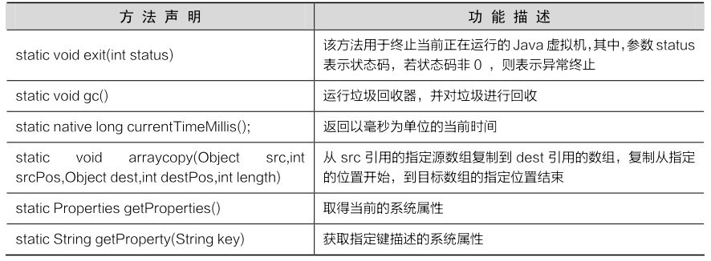
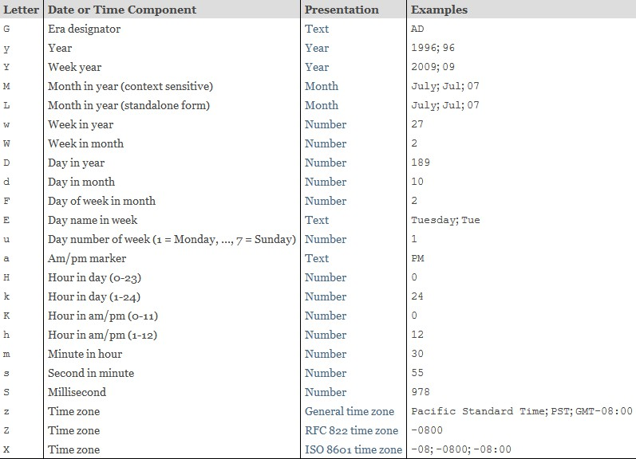
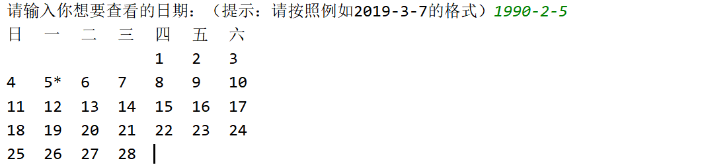

## API概述

API (Application Programming Interface) ：应用程序编程接口。Java中的API指的就是 JDK 中提供的各种功能的 Java类，这些类将底层的实现封装了起来，我们不需要关心这些类是如何实现的，只需要学习这些类如何使用即可，我们可以通过帮助文档来学习这些API如何使用。

## String类

String 类代表字符串，Java 程序中的所有字符串文字（例如“abc”）都被实现为此类的实例。也就是说，Java 程序中所有的双引号字符串，都是 String 类的对象。String 类在 java.lang 包下，所以使用的时候不需要导包！

### String类的特点

- 字符串不可变，它们的值在创建后不能被更改
- 虽然 String 的值是不可变的，但是它们可以被共享
- 字符串效果上相当于字符数组( char[] )，但是底层原理是字节数组( byte[] )

### 创建String对象的两种方式

- 通过构造方法创建

  ​	通过 new 创建的字符串对象，每一次 new 都会申请一个内存空间，虽然内容相同，但是地址值不同

- 直接赋值方式创建

  ​	以""方式给出的字符串，只要字符序列相同(顺序和大小写)，无论在程序代码中出现几次，JVM 都只会建立一个 String 对象，并在字符串池中维护

### 字符串的比较

#### ==号的作用

- 比较基本数据类型：比较的是具体的值
- 比较引用数据类型：比较的是对象地址值

#### equals方法的作用

```java
public boolean equals(String s) //比较两个字符串内容是否相同、区分大小写
```

对于String类，如果使用new关键字创建，则相当于引用数据类型，此时用==比较的是对象地址值。如果直接用字符串常量赋值，相当于基本数据类型，此时用==比较的是具体的值。为了避免出错，建议都用equals方法比较。

示例

```java
public class StringDemo02 {
    public static void main(String[] args) {
        //构造方法的方式得到对象
        char[] chs = {'a', 'b', 'c'};
        String s1 = new String(chs);
        String s2 = new String(chs);

        //直接赋值的方式得到对象
        String s3 = "abc";
        String s4 = "abc";

        //比较字符串对象地址是否相同
        System.out.println(s1 == s2); //false
        System.out.println(s1 == s3); //false
        System.out.println(s3 == s4); //true
        System.out.println("--------");

        //比较字符串内容是否相同
        //下面全是true
        System.out.println(s1.equals(s2));
        System.out.println(s1.equals(s3));
        System.out.println(s3.equals(s4));
    }
}
```

### String常用方法

| 序号 |                           方法描述                           |
| :--: | :----------------------------------------------------------: |
|  1   | char charAt(int index) 返回指定索引处的 char 值。 |
|  2   | int compareTo(Object o) 把这个字符串和另一个对象比较。 |
|  3   | int compareTo(String anotherString) 按字典顺序比较两个字符串。 |
|  4   | int compareToIgnoreCase(String str) 按字典顺序比较两个字符串，不考虑大小写。 |
|  5   | [String concat(String str)](https://www.nowcoder.com/tutorial/10001/abb27a6c3f5c425e9988d6646df98675) 将指定字符串连接到此字符串的结尾。 |
|  6   | [boolean contentEquals(StringBuffer sb)](https://www.nowcoder.com/tutorial/10001/f2301f9c3c0c457e8694dc9baf0b09e2) 当且仅当字符串与指定的StringBuffer有相同顺序的字符时候返回真。 |
|  7   | [static String copyValueOf(char[\] data)](https://www.nowcoder.com/tutorial/10001/68c65730913a47b7be2eda197c193455) 返回指定数组中表示该字符序列的 String。 |
|  8   | [static String copyValueOf(char[\] data, int offset, int count)](https://www.nowcoder.com/tutorial/10001/68c65730913a47b7be2eda197c193455) 返回指定数组中表示该字符序列的 String。 |
|  9   | [boolean endsWith(String suffix)](https://www.nowcoder.com/tutorial/10001/727ec08e7ef54143be8d61ca13152119) 测试此字符串是否以指定的后缀结束。 |
|  10  | [boolean equals(Object anObject)](https://www.nowcoder.com/tutorial/10001/416c763de4fa49b6a3b4940f4e6c3727) 将此字符串与指定的对象比较。 |
|  11  | [boolean equalsIgnoreCase(String anotherString)](https://www.nowcoder.com/tutorial/10001/b6775e64f52d420dba7ecccc515b6d66) 将此 String 与另一个 String 比较，不考虑大小写。 |
|  12  | [byte[\] getBytes()](https://www.nowcoder.com/tutorial/10001/35a74216bb2c4817b59885987244f2e3) 使用平台的默认字符集将此 String 编码为 byte 序列，并将结果存储到一个新的 byte 数组中。 |
|  13  | [byte[\] getBytes(String charsetName)](https://www.nowcoder.com/tutorial/10001/35a74216bb2c4817b59885987244f2e3) 使用指定的字符集将此 String 编码为 byte 序列，并将结果存储到一个新的 byte 数组中。 |
|  14  | [void getChars(int srcBegin, int srcEnd, char[\] dst, int dstBegin)](https://www.nowcoder.com/tutorial/10001/082e32c35f2042bd9daa5006deacf8ea) 将字符从此字符串复制到目标字符数组。 |
|  15  | [int hashCode()](https://www.nowcoder.com/tutorial/10001/bd6c0aa7f00e4f6fbd3518eaf8d52b71) 返回此字符串的哈希码。 |
|  16  | [int indexOf(int ch)](https://www.nowcoder.com/tutorial/10001/22c16f81651c41b8aefd9ce815881357) 返回指定字符在此字符串中第一次出现处的索引。 |
|  17  | [int indexOf(int ch, int fromIndex)](https://www.nowcoder.com/tutorial/10001/22c16f81651c41b8aefd9ce815881357) 返回在此字符串中第一次出现指定字符处的索引，从指定的索引开始搜索。 |
|  18  | [int indexOf(String str)](https://www.nowcoder.com/tutorial/10001/22c16f81651c41b8aefd9ce815881357) 返回指定子字符串在此字符串中第一次出现处的索引。 |
|  19  | [int indexOf(String str, int fromIndex)](https://www.nowcoder.com/tutorial/10001/22c16f81651c41b8aefd9ce815881357) 返回指定子字符串在此字符串中第一次出现处的索引，从指定的索引开始。 |
|  20  | [String intern()](https://www.nowcoder.com/tutorial/10001/5351fc0462964dceb67bea2968f10612) 返回字符串对象的规范化表示形式。 |
|  21  | [int lastIndexOf(int ch)](https://www.nowcoder.com/tutorial/10001/727e8ca880dc4f2c9475b7120232ba8a) 返回指定字符在此字符串中最后一次出现处的索引。 |
|  22  | [int lastIndexOf(int ch, int fromIndex)](https://www.nowcoder.com/tutorial/10001/727e8ca880dc4f2c9475b7120232ba8a) 返回指定字符在此字符串中最后一次出现处的索引，从指定的索引处开始进行反向搜索。 |
|  23  | [int lastIndexOf(String str)](https://www.nowcoder.com/tutorial/10001/727e8ca880dc4f2c9475b7120232ba8a) 返回指定子字符串在此字符串中最右边出现处的索引。 |
|  24  | [int lastIndexOf(String str, int fromIndex)](https://www.nowcoder.com/tutorial/10001/727e8ca880dc4f2c9475b7120232ba8a) 返回指定子字符串在此字符串中最后一次出现处的索引，从指定的索引开始反向搜索。 |
|  25  | [int length()](https://www.nowcoder.com/tutorial/10001/df47315427264f6a8125911bde82e62c) 返回此字符串的长度。 |
|  26  | [boolean matches(String regex)](https://www.nowcoder.com/tutorial/10001/0a6d84ac7b16496da8a19d274c42bb48) 告知此字符串是否匹配给定的正则表达式。 |
|  27  | [boolean regionMatches(boolean ignoreCase, int toffset, String other, int ooffset, int len)](https://www.nowcoder.com/tutorial/10001/434414e45e8b4174b4cfe7428981c75c) 测试两个字符串区域是否相等。 |
|  28  | [boolean regionMatches(int toffset, String other, int ooffset, int len)](https://www.nowcoder.com/tutorial/10001/434414e45e8b4174b4cfe7428981c75c) 测试两个字符串区域是否相等。 |
|  29  | [String replace(char oldChar, char newChar)](https://www.nowcoder.com/tutorial/10001/e685c458cd8941e38ad7e289c36ab13a) 返回一个新的字符串，它是通过用 newChar 替换此字符串中出现的所有 oldChar 得到的。 |
|  30  | [String replaceAll(String regex, String replacement)](https://www.nowcoder.com/tutorial/10001/d2c4bcab7cee44d9bbb01afff83578d8) 使用给定的 replacement 替换此字符串所有匹配给定的正则表达式的子字符串。 |
|  31  | [String replaceFirst(String regex, String replacement)](https://www.nowcoder.com/tutorial/10001/3d5d53674c6e440485539f7ef9aa48e2) 使用给定的 replacement 替换此字符串匹配给定的正则表达式的第一个子字符串。 |
|  32  | String[\] split(String regex) 根据给定正则表达式的匹配拆分此字符串。 |
|  33  | [String[\] split(String regex, int limit)](https://www.nowcoder.com/tutorial/10001/84aa81e9342b43c29787cd6bea756b8e) 根据匹配给定的正则表达式来拆分此字符串。 |
|  34  | [boolean startsWith(String prefix)](https://www.nowcoder.com/tutorial/10001/9136e0b21b264725949734623c59cf9d) 测试此字符串是否以指定的前缀开始。 |
|  35  | [boolean startsWith(String prefix, int toffset)](https://www.nowcoder.com/tutorial/10001/9136e0b21b264725949734623c59cf9d) 测试此字符串从指定索引开始的子字符串是否以指定前缀开始。 |
|  36  | [CharSequence subSequence(int beginIndex, int endIndex)](https://www.nowcoder.com/tutorial/10001/0a5d73cbeec84057a81d3dc2457cad2a) 返回一个新的字符序列，它是此序列的一个子序列。 |
|  37  | [String substring(int beginIndex)](https://www.nowcoder.com/tutorial/10001/eb8b6ed9247e4255b5945a4d0fd1dda8) 返回一个新的字符串，它是此字符串的一个子字符串。 |
|  38  | [String substring(int beginIndex, int endIndex)](https://www.nowcoder.com/tutorial/10001/eb8b6ed9247e4255b5945a4d0fd1dda8) 返回一个新字符串，它是此字符串的一个子字符串。 |
|  39  | [char[\] toCharArray()](https://www.nowcoder.com/tutorial/10001/5db0efd2e8704988ab7610e5e4d4e314) 将此字符串转换为一个新的字符数组。 |
|  40  | [String toLowerCase()](https://www.nowcoder.com/tutorial/10001/954a2d3e8049414286bf16f4583decdd) 使用默认语言环境的规则将此 String 中的所有字符都转换为小写。 |
|  41  | [String toLowerCase(Locale locale)](https://www.nowcoder.com/tutorial/10001/954a2d3e8049414286bf16f4583decdd) 使用给定 Locale 的规则将此 String 中的所有字符都转换为小写。 |
|  42  | [String toString()](https://www.nowcoder.com/tutorial/10001/806cd8280f124065a54d262ed4b04468) 返回此对象本身（它已经是一个字符串！）。 |
|  43  | [String toUpperCase()](https://www.nowcoder.com/tutorial/10001/335b543bb6e547cb8c20eb670cf6aedc) 使用默认语言环境的规则将此 String 中的所有字符都转换为大写。 |
|  44  | [String toUpperCase(Locale locale)](https://www.nowcoder.com/tutorial/10001/335b543bb6e547cb8c20eb670cf6aedc) 使用给定 Locale 的规则将此 String 中的所有字符都转换为大写。 |
|  45  | [String trim()](https://www.nowcoder.com/tutorial/10001/46b58aa6dab648aca6d14291e4f3c761) 返回字符串的副本，忽略前导空白和尾部空白。 |
|  46  | [static String valueOf(primitive data type x)](https://www.nowcoder.com/tutorial/10001/344e1dc1dbe2430f8626efb75a3db807) 返回给定data type类型x参数的字符串表示形式。 |

### 使用正则表达式

boolean matchers(String regExp)：判断字符串是否匹配给定的正则表达式

String replaceAll(String regex, String replacement)： 将字符串中匹配的子串替换成新的子串

String[] split(String regex) ：用正则表达式分割字符串，返回数组

```java
/*
* 匹配身份证号码
* \d{15}|\d{17}[\dxX] regex
* 因为字符串会把'\'当成转义字符，所以要改成'\\'才行
*/
String s = "342622199909091001";
if(s.matches("\\d{15}|\\d{17}[\\dxX]")) {
    sout("身份证号码有效");
} else {
    sout("身份证号码格式不正确");
}
```

#### Pattern Matcher

Pattern类用于创建一个正则表达式，也可以说是创建一个匹配模式，可以通过两个静态方法创建：compile(String regex) 和compile(String regex, int flags)，其中regex是正则表达式，flags为可选模式(如：Pattern.CASE_INSENSITIVE 忽略大小写)

```java
Pattern pattern = Pattern.compile("Java");
System.out.println(pattern.pattern());//返回此模式的正则表达式即Java
```

Pattern类还有两个根据匹配模式拆分输入序列的方法：split(CharSequence input) 和split(CharSequence input, int limit)，其中limit为返回元素的个数。

```java
Pattern pattern = Pattern.compile("Java");
String test="123Java456Java789Java";
String[] result = pattern.split(test);
for(String s : result)
    System.out.println(s);
//console
//123
//456
//789
```

在细说一下split(CharSequence input， int limit)，当limit值大于所能返回的字符串的最多个数或者为负数，返回的字符串个数将不受限制，但结尾可能包含空串，而当limit=0时与split(CharSequence input)等价，但结尾的空串会被丢弃。

```java
Pattern pattern = Pattern.compile("Java");
String test = "123Java456Java789Java";

String[] result = pattern.split(test,2);
for(String s : result)
System.out.println(s);

result = pattern.split(test,10);
System.out.println(result.length);//4, 多了一个空串

result = pattern.split(test,-2);
System.out.println(result.length);//4

result = pattern.split(test,0);
System.out.println(result.length);//3, 结尾的空串都丢弃了
```

Pattern类也自带一个静态匹配方法matches(String regex, CharSequence input)，但只能进行全字符串匹配并且只能返回是否匹配上的boolean值

```java
String test1 = "Java";
String test2 = "Java123456";

System.out.println(Pattern.matches("Java",test1));//返回true
System.out.println(Pattern.matches("Java",test2));//返回false
```

最后就要过渡到Matcher类了，Pattern类中的matcher(CharSequence input)会返回一个Matcher对象。Matcher类提供了对正则表达式的分组支持,以及对正则表达式的多次匹配支持，要想得到更丰富的正则匹配操作,那就需要将Pattern与Matcher联合使用。

```java
Pattern pattern = Pattern.compile("Java");
String test = "123Java456Java789Java";
Matcher matcher = pattern.matcher(test);
```

Matcher类提供了三个返回boolean值得匹配方法：matches()，lookingAt()，find()，find(int start)，其中matches()用于全字符串匹配，lookingAt从字符串最开头开始匹配满足的子串，find可以对任意位置字符串匹配, 其中start为起始查找索引值。

```java
Pattern pattern = Pattern.compile("Java");
String test1 = "Java";
String test2 = "Java1234";
String test3 = "1234Java"
Matcher matcher = pattern.matcher(test1);
System.out.println(matcher.matches());//返回true
matcher = pattern.matcher(test2);
System.out.println(matcher.matches());//返回false

matcher = pattern.matcher(test2);
System.out.println(matcher.lookingAt())://返回true
matcher = pattern.matcher(test3);
System.out.println(matcher.lookingAt());//返回false

matcher = pattern.matcher(test1);
System.out.println(matcher.find());//返回true
matcher = pattern.matcher(test2);
System.out.println(matcher.find());//返回true
matcher = pattern.matcher(test3);
System.out.println(matcher.find(2));//返回true
matcher = pattern.matcher(test3);
System.out.println(matcher.find(5));//返回false
```

这里介绍下组的概念：组是用括号划分的正则表达式，可以根据组的编号来引用这个组。组号为0表示整个表达式，组号为1表示被第一对括号括起的组，依次类推，例如A(B(C))D，组0是ABCD，组1是BC，组2是C。

Matcher类提供了start()，end()，group()分别用于返回字符串的起始索引，结束索引，以及匹配到到的字符串。

```java
Pattern pattern = Pattern.compile("Java");
String test = "123Java456";

Matcher matcher = pattern.matcher(test);
matcher.find();
System.out.println(matcher.start());//返回3
System.out.println(matcher.end());//返回7
System.out.println(matcher.group());//返回Java
```

Matcher类提供了start(int gropu)，end(int group)，group(int i)，groupCount()用于分组操作

```java
Pattern pattern = Pattern.compile("(Java)(Python)");
String test = "123JavaPython456";
Matcher matcher = pattern.matcher(test);
matcher.find();
System.out.println(matcher.groupCount());//返回2

System.out.println(matcher.group(1));//返回第一组匹配到的字符串"Java"，注意起始索引是1
System.out.println(matcher.start(1));//返回3，第一组起始索引
System.out.println(matcher.end(1));//返回7 第一组结束索引

System.out.println(matcher.group(2));//返回第二组匹配到的字符串"Python"
System.out.println(matcher.start(2));//返回7，第二组起始索引
System.out.println(matcher.end(2));//返回13 第二组结束索引
```

Matcher类还提供region(int start, int end)(不包括end)方法用于设定查找范围，并提供regionStrat()和regionEnd()用于返回起始和结束查找的索引

```java
Pattern pattern = Pattern.compile("Java");
String test = "123JavaJava";
Matcher matcher = pattern.matcher(test);
matcher.region(7, 11);
System.out.println(matcher.regionStart());//返回7
System.out.println(matcher.regionEnd());//返回11
matcher.find();
System.out.println(matcher.group());//返回Java
```

Matcher类提供了两种用于重置当前匹配器的方法:reset()和reset(CharSequence input)

```java
Pattern pattern = Pattern.compile("Java");
        String test = "Java";
        Matcher matcher = pattern.matcher(test);

        matcher.find();
        System.out.println(matcher.group());//返回Java

        matcher.reset();//从起始位置重新匹配

        matcher.find();
        System.out.println(matcher.group());//返回Java

        matcher.reset("Python");
        System.out.println(matcher.find());//返回false
```

最后说一下Matcher类的匹配方法：replaceAll(String replacement) 和 replaceFirst(String replacement)，其中replaceAll是替换全部匹配到的字符串，而replaceFirst仅仅是替换第一个匹配到的字符串。

```java
Pattern pattern = Pattern.compile("Java");
        String test = "JavaJava";
        Matcher matcher = pattern.matcher(test);
        System.out.println(matcher.replaceAll("Python"));//返回PythonPython
        System.out.println(matcher.replaceFirst("python"));//返回PythonJava
```

还有两个方法appendReplacement(StringBuffer sb, String replacement) 和 appendTail(StringBuffer sb)也很重要，appendReplacement允许直接将匹配的字符串保存在另一个StringBuffer中并且是渐进式匹配，并不是只匹配依次或匹配全部，而appendTail则是将未匹配到的余下的字符串添加到StringBuffer中。


## StringBuilder类

StringBuilder 是一个可变的字符串类，我们可以把它看成是一个容器，这里的可变指的是 StringBuilder 对象中的内容是可变的。StringBuilder 类在 Java 5 中被提出，它和 StringBuffer 之间的最大不同在于 StringBuilder 的方法不是线程安全的。

### StringBuilder类的构造方法

- 常用的构造方法

  | 方法名                             | 说明                                       |
  | ---------------------------------- | ------------------------------------------ |
  | public StringBuilder()             | 创建一个空白可变字符串对象，不含有任何内容 |
  | public StringBuilder(String   str) | 根据字符串的内容，来创建可变字符串对象     |

```java
public class StringBuilderDemo01 {
    public static void main(String[] args) {
        //public StringBuilder()：创建一个空白可变字符串对象，不含有任何内容
        StringBuilder sb = new StringBuilder();
        System.out.println("sb:" + sb);
        System.out.println("sb.length():" + sb.length());

        //public StringBuilder(String str)：根据字符串的内容，来创建可变字符串对象
        StringBuilder sb2 = new StringBuilder("hello");
        System.out.println("sb2:" + sb2);
        System.out.println("sb2.length():" + sb2.length());
    }
}
```

### StringBuilder类常用方法

| 序号 |                           方法描述                           |
| :--: | :----------------------------------------------------------: |
|  1   | public StringBuffer append(各种类型) 将指定的字符串追加到此字符序列。 |
|  2   | public StringBuffer reverse() 将此字符序列用其反转形式取代。 |
|  3   | public delete(int start, int end) 移除此序列的子字符串中的字符。 |
|  4   | public insert(int offset, int i) 将 int 参数的字符串表示形式插入此序列中。 |
|  5   | replace(int start, int end, String str) 使用给定字符串中的字符替换此序列的子字符串中的字符 |

```java
public class StringBuilderDemo01 {
    public static void main(String[] args) {
        //创建对象
        StringBuilder sb = new StringBuilder();

        //public StringBuilder append(任意类型)：添加数据，并返回对象本身
//        StringBuilder sb2 = sb.append("hello");
//
//        System.out.println("sb:" + sb);
//        System.out.println("sb2:" + sb2);
//        System.out.println(sb == sb2);

//        sb.append("hello");
//        sb.append("world");
//        sb.append("java");
//        sb.append(100);

        //链式编程
        sb.append("hello").append("world").append("java").append(100);

        System.out.println("sb:" + sb);

        //public StringBuilder reverse()：返回相反的字符序列
        sb.reverse();
        System.out.println("sb:" + sb);
    }
}
```

下面的列表里的方法和 String 类的方法类似：

| 序号 |                           方法描述                           |
| :--: | :----------------------------------------------------------: |
|  1   |                int capacity() 返回当前容量。                 |
|  2   | char charAt(int index) 返回此序列中指定索引处的 `char` 值。  |
|  3   | void ensureCapacity(int minimumCapacity) 确保容量至少等于指定的最小值。 |
|  4   | void getChars(int srcBegin, int srcEnd, char[] dst, int dstBegin) 将字符从此序列复制到目标字符数组 `dst`。 |
|  5   | int indexOf(String str) 返回第一次出现的指定子字符串在该字符串中的索引。 |
|  6   | int indexOf(String str, int fromIndex) 从指定的索引处开始，返回第一次出现的指定子字符串在该字符串中的索引。 |
|  7   | int lastIndexOf(String str) 返回最右边出现的指定子字符串在此字符串中的索引。 |
|  8   | int lastIndexOf(String str, int fromIndex) 返回 String 对象中子字符串最后出现的位置。 |
|  9   |              int length() 返回长度（字符数）。               |
|  10  | void setCharAt(int index, char ch) 将给定索引处的字符设置为 `ch`。 |
|  11  |      void setLength(int newLength) 设置字符序列的长度。      |
|  12  | CharSequence subSequence(int start, int end) 返回一个新的字符序列，该字符序列是此序列的子序列。 |
|  13  | String substring(int start) 返回一个新的 `String`，它包含此字符序列当前所包含的字符子序列。 |
|  14  | String substring(int start, int end) 返回一个新的 `String`，它包含此序列当前所包含的字符子序列。 |
|  15  |     String toString() 返回此序列中数据的字符串表示形式。     |

### StringBuilder和String相互转换

- StringBuilder转换为String

  ​        public String toString()：通过 toString() 就可以实现把 StringBuilder 转换为 String

- String转换为StringBuilder

  ​        public StringBuilder(String s)：通过构造方法就可以实现把 String 转换为 StringBuilder


```java
public class StringBuilderDemo02 {
    public static void main(String[] args) {
        /*
        //StringBuilder 转换为 String
        StringBuilder sb = new StringBuilder();
        sb.append("hello");

        //String s = sb; //这个是错误的做法

        //public String toString()：通过 toString() 就可以实现把 StringBuilder 转换为 String
        String s = sb.toString();
        System.out.println(s);
        */

        //String 转换为 StringBuilder
        String s = "hello";

        //StringBuilder sb = s; //这个是错误的做法

        //public StringBuilder(String s)：通过构造方法就可以实现把 String 转换为 StringBuilder
        StringBuilder sb = new StringBuilder(s);

        System.out.println(sb);
    }
}
```

## ArrayList

### 概述

### ArrayList类概述

- 什么是集合

  ​	提供一种存储空间可变的存储模型，存储的数据容量可以发生改变

- ArrayList集合的特点

  ​	底层是数组实现的，长度可以变化

- 泛型的使用

  ​	用于约束集合中存储元素的数据类型

### ArrayList常用方法

| 方法名                                   | 说明                                   |
| ---------------------------------------- | -------------------------------------- |
| public boolean  remove(Object o)         | 删除指定的元素，返回删除是否成功       |
| public E   remove(int   index)           | 删除指定索引处的元素，返回被删除的元素 |
| public E   set(int index,E   element)    | 修改指定索引处的元素，返回被修改的元素 |
| public E   get(int   index)              | 返回指定索引处的元素                   |
| public int   size()                      | 返回集合中的元素的个数                 |
| public boolean   add(E e)                | 将指定的元素追加到此集合的末尾         |
| public void   add(int index,E   element) | 在此集合中的指定位置插入指定的元素     |

```java
public class ArrayListDemo02 {
    public static void main(String[] args) {
        //创建集合，用到了泛型
        ArrayList<String> array = new ArrayList<String>();

        //添加元素
        array.add("hello");
        array.add("world");
        array.add("java");

        //public boolean remove(Object o)：删除指定的元素，返回删除是否成功
//        System.out.println(array.remove("world"));
//        System.out.println(array.remove("javaee"));

        //public E remove(int index)：删除指定索引处的元素，返回被删除的元素
//        System.out.println(array.remove(1));

        //IndexOutOfBoundsException
//        System.out.println(array.remove(3));

        //public E set(int index,E element)：修改指定索引处的元素，返回被修改的元素
//        System.out.println(array.set(1,"javaee"));

        //IndexOutOfBoundsException
//        System.out.println(array.set(3,"javaee"));

        //public E get(int index)：返回指定索引处的元素
//        System.out.println(array.get(0));
//        System.out.println(array.get(1));
//        System.out.println(array.get(2));
        //System.out.println(array.get(3)); //？？？？？？ 自己测试

        //public int size()：返回集合中的元素的个数
        System.out.println(array.size());

        //输出集合
        System.out.println("array:" + array);
    }
}
```

### ArrayList存储学生对象并遍历

创建一个存储学生对象的集合，存储3个学生对象，使用程序实现在控制台遍历该集合，学生的姓名和年龄来自于键盘录入

```java
/*
    思路：
        1:定义学生类，为了键盘录入数据方便，把学生类中的成员变量都定义为String类型
        2:创建集合对象
        3:键盘录入学生对象所需要的数据
        4:创建学生对象，把键盘录入的数据赋值给学生对象的成员变量
        5:往集合中添加学生对象
        6:遍历集合，采用通用遍历格式实现
 */
public class ArrayListTest {
    public static void main(String[] args) {
        //创建集合对象
        ArrayList<Student> array = new ArrayList<Student>();

        //为了提高代码的复用性，我们用方法来改进程序
        addStudent(array);
        addStudent(array);
        addStudent(array);

        //遍历集合，采用通用遍历格式实现
        for (int i = 0; i < array.size(); i++) {
            Student s = array.get(i);
            System.out.println(s.getName() + "," + s.getAge());
        }
    }

    /*
        两个明确：
            返回值类型：void
            参数：ArrayList<Student> array
     */
    public static void addStudent(ArrayList<Student> array) {
        //键盘录入学生对象所需要的数据
        Scanner sc = new Scanner(System.in);

        System.out.println("请输入学生姓名:");
        String name = sc.nextLine();

        System.out.println("请输入学生年龄:");
        String age = sc.nextLine();

        //创建学生对象，把键盘录入的数据赋值给学生对象的成员变量
        Student s = new Student();
        s.setName(name);
        s.setAge(age);

        //往集合中添加学生对象
        array.add(s);
    }
}
```

## Math

Math类用来进行数学运算，无构造方法，所有方法都是静态的，可以通过类名直接调用。  
常用方法  

| 方法名    方法名                               | 说明                                           |
| ---------------------------------------------- | ---------------------------------------------- |
| public static int   abs(int a)                 | 返回参数的绝对值                               |
| public static double ceil(double a)            | 返回大于或等于参数的最小double值，等于一个整数 |
| public static double floor(double a)           | 返回小于或等于参数的最大double值，等于一个整数 |
| public   static int round(float a)             | 按照四舍五入返回最接近参数的int                |
| public static int   max(int a,int b)           | 返回两个int值中的较大值                        |
| public   static int min(int a,int b)           | 返回两个int值中的较小值                        |
| public   static double pow (double a,double b) | 返回a的b次幂的值                               |
| public   static double random()                | 返回值为double的正值，[0.0,1.0)                |

## Scanner

ava.util.Scanner 是 Java5 的新特征，我们可以通过 Scanner 类来获取用户的输入。

下面是创建 Scanner 对象的基本语法：`Scanner sc = new Scanner(System.in);`

### next()

```java
import java.util.Scanner; 

public class ScannerDemo {
    public static void main(String[] args) {
        Scanner scan = new Scanner(System.in);
        // 从键盘接收数据

        // next方式接收字符串
        System.out.println("next方式接收：");
        // 判断是否还有输入
        if (scan.hasNext()) {
            String str1 = scan.next();
            System.out.println("输入的数据为：" + str1);
        }
        scan.close();
    }
}
```

console:

```java
$ javac ScannerDemo.java
$ java ScannerDemo
next方式接收：
nowcoder com
输入的数据为：nowcoder
```

### nextLine()

```java
import java.util.Scanner;

public class ScannerDemo {
    public static void main(String[] args) {
        Scanner scan = new Scanner(System.in);
        // 从键盘接收数据

        // nextLine方式接收字符串
        System.out.println("nextLine方式接收：");
        // 判断是否还有输入
        if (scan.hasNextLine()) {
            String str2 = scan.nextLine();
            System.out.println("输入的数据为：" + str2);
        }
        scan.close();
    }
}
```

console:

```java
$ javac ScannerDemo.java
$ java ScannerDemo
nextLine方式接收：
nowcoder com
输入的数据为：nowcoder com
```

### next和nextLine区别

next():

- 1、一定要读取到有效字符后才可以结束输入。
- 2、对输入有效字符之前遇到的空白，next() 方法会自动将其去掉。
- 3、只有输入有效字符后才将其后面输入的空白作为分隔符或者结束符。
- next() 不能得到带有空格的字符串。

nextLine()：

- 1、以Enter为结束符,也就是说 nextLine()方法返回的是输入回车之前的所有字符。
- 2、可以获得空白。

如果要输入 int 或 float 类型的数据，在 Scanner 类中也有支持，但是在输入之前最好先使用 hasNextXxx() 方法进行验证，再使用 nextXxx() 来读取：

```java
import java.util.Scanner;

public class ScannerDemo {
    public static void main(String[] args) {
        Scanner scan = new Scanner(System.in);
        // 从键盘接收数据
        int i = 0;
        float f = 0.0f;
        System.out.print("输入整数：");
        if (scan.hasNextInt()) {
            // 判断输入的是否是整数
            i = scan.nextInt();
            // 接收整数
            System.out.println("整数数据：" + i);
        } else {
            // 输入错误的信息
            System.out.println("输入的不是整数！");
        }
        System.out.print("输入小数：");
        if (scan.hasNextFloat()) {
            // 判断输入的是否是小数
            f = scan.nextFloat();
            // 接收小数
            System.out.println("小数数据：" + f);
        } else {
            // 输入错误的信息
            System.out.println("输入的不是小数！");
        }
        scan.close(); //关闭流
    }
}
```

## Random

可以用Math.random()生成一个随机数，介于0.0到1.0之间，但这其实是一个伪随机数。Java提供了Random类，可以传入种子，这样就能生成一个真的随机数了。而且Random类提供的方法可以生成各种类型的随机数。


```java
import java.util.Random;

public class Test02 {
    public static void main(String[] args) {
        //返回带正号的 double 值，该值大于等于 0.0 且小于 1.0。
        System.out.println("随机数："+Math.random());
        //Random类
        //（1）利用带参数的构造器创建对象：
        Random r1 = new Random(System.currentTimeMillis());//传入当前时间作为随机数种子
        int i = r1.nextInt();
        System.out.println(i);
        //（2）利用空参构造器创建对象：
        Random r2 = new Random();//无参构造默认调用系统的时间戳作为种子
        System.out.println(r2.nextInt(10));//返回[0,10)之间均匀分布的 int 值。
        System.out.println(r2.nextDouble(5));//返回[0.0,5.0)之间均匀分布的 double 值。
    }
}

```

## System



实例：在控制台输出1-10000，计算这段代码执行了多少毫秒

```java
public class SystemDemo {
    public static void main(String[] args) {
        // 获取开始的时间节点
        long start = System.currentTimeMillis();
        for (int i = 1; i <= 10000; i++) {
            System.out.println(i);
        }
        // 获取代码运行结束后的时间节点
        long end = System.currentTimeMillis();
        System.out.println("共耗时：" + (end - start) + "毫秒");
    }
}
```

**垃圾回收机制**
除了等待Java虚拟机进行自动垃圾回收外，还可以通过调用System.gc()方法来通知Java虚拟机立即进行垃圾回收。当一个对象在内存中被释放时，它的public void finalize()方法会被自动调用，因此可以在类中通过定义finalize()方法来观察对象何时被释放。

```java
class Person{
    public void finalize(){//此方法会在垃圾回收前被调用
        System.out.println("对象被当做垃圾回收了。。。");
    }
}
public class Demo{
    public static void main(String[] args){
        //创建了两个实例化对象
        Person p1 = new Person();
        Person p2 = new Person();
        //让对象成为垃圾
        p1=null;
        p2=null;
       //调用方法进行垃圾回收
        System.gc();
        for(int i = 0; i < 10000; i ++){}//延长程序执行时间
    }
}
```

## Runtime

Runtime类用于表示虚拟机运行时的状态，它用于封装JVM虚拟机进程。每次使用java命令启动虚拟机都对应一个Runtime实例，并且只有一个实例，因此该类采用单例模式进行设计，对象不可以直接实例化。若想在程序中获得一个Runtime实例，只能通过以下方式。
`Runtime run = Runtime.getRuntime();`

## Arrays

* Arrays的常用方法

  | 方法名                                 | 说明                                      |
  | -------------------------------------- | ----------------------------------------- |
  | public static String toString(int[] a) | 返回指定数组的内容的字符串表示形式        |
  | public static void sort(int[] a)       | 按照数字顺序排列指定的数组                |
  | public static ArrayList<T> asList(T…a) | 将传入的多个数据包装成ArrayLIst集合并返回 |

* 工具类设计思想

  1、构造方法用 private 修饰（没法创建对象了）

  2、成员用 public static 修饰
  
* 注意
  自定义类型的数组要使用Arrays.sort()，那么此类必须实现Comparable，重写compareTo方法，或者给Arrays.sort()方法传入一个外部比较器Comparator。

## 时间日期类

### util.Date类

封装了一个毫秒值，表示现在的时间点。无参构造封装当前的时间到类中，有参构造可以指定毫秒值。

| 方法名                         | 说明                                                  |
| ------------------------------ | ----------------------------------------------------- |
| public long getTime()          | 获取的是日期对象从1970年1月1日 00:00:00到现在的毫秒值 |
| public void setTime(long time) | 设置时间，给的是毫秒值                                |

```java
public class DateDemo02 {
    public static void main(String[] args) {
        //创建日期对象
        Date d = new Date();

        //public long getTime():获取的是日期对象从1970年1月1日 00:00:00到现在的毫秒值
//        System.out.println(d.getTime());
//        System.out.println(d.getTime() * 1.0 / 1000 / 60 / 60 / 24 / 365 + "年");

        //public void setTime(long time):设置时间，给的是毫秒值
//        long time = 1000*60*60;
        long time = System.currentTimeMillis();//此方法等同于Data类提供的getTime方法
        d.setTime(time);

        System.out.println(d);
    }
}
```

### sql.Date

一般使用util.Date，sql.Date是专为数据库sql语句提供的，只有日期没有时间。
sql.Date没有无参构造，只有Date(long date)的构造方法。所以可以用new util.Date().getTime()获得当前日期的毫秒值作为参数传入sql.Date()中。下面的语句可以将util.Date转为数据库专用的sql.Date

`java.sql.Date date = new java.sql.Date(util.Date(getTime()));`

### SimpleDateFormat类

- SimpleDateFormat类概述

  ​	SimpleDateFormat是一个具体的类，用来设置接受日期的格式。设置好了格式之后，就可以用Date类生成想要的日期。

- SimpleDateFormat类构造方法

  | 方法名                                  | 说明                                                   |
  | --------------------------------------- | ------------------------------------------------------ |
  | public SimpleDateFormat()               | 构造一个SimpleDateFormat，使用默认模式和日期格式       |
  | public SimpleDateFormat(String pattern) | 构造一个SimpleDateFormat使用给定的模式和默认的日期格式 |

- SimpleDateFormat类的常用方法

  - 格式化(从Date到String)
    - public final String format(Date date)：将日期格式化成日期/时间字符串
  - 解析(从String到Date)
    - public Date parse(String source)：从给定字符串的开始解析文本以生成日期
  
- 设置格式
  

```java
import java.text.DateFormat;
import java.text.ParseException;
import java.text.SimpleDateFormat;
import java.util.Date;

public class DateDemo {
    public static void main(String[] args) {
        //SimpleDateFormat extends DataFormat
        //格式化的标准参见jdk文档
        DateFormat df = new SimpleDateFormat("yyyy/MM/dd HH:mm:ss");

        //String --> Date
        try {
            Date d = df.parse("2020/07/10 14:25:30");
            System.out.println(d);//Fri Jul 10 14:25:30 GMT+08:00 2020
        } catch (ParseException e) {
            e.printStackTrace();
        }

        //Date --> String
        Date d = new Date();//返回当前日期
        String currentDate = df.format(new Date());//格式化
        System.out.println(currentDate);//2021/07/10 15:02:12
    }
}

```


### Calendar类

Date类提供的方法大部分都已经过时，现在常用Calendar类代替Date类。Calendar类是抽象类，不能用new来创建对象，它提供了一个getInstance()方法来返回一个实例化对象。

- Calendar类常用方法

  | 方法名                                             | 说明                                                   |
  | -------------------------------------------------- | ------------------------------------------------------ |
  | public int get(int field)                          | 返回给定日历字段的值                                   |
  | public abstract void add(int   field, int amount)  | 根据日历的规则，将指定的时间量添加或减去给定的日历字段 |
  | public final void set(int year,int month,int date) | 设置当前日历的年月日                                   |

- 示例代码

  ```java
  import java.util.Calendar;
  import java.util.Date;
  
  public class CalendarDemo {
      public static void main(String[] args) {
          //抽象类不能使用new关键字创建实例化对象
          Calendar cal = Calendar.getInstance();
  
          //常用方法，get()
          System.out.println(cal.get(Calendar.YEAR));//2021
          System.out.println(cal.get(Calendar.MONTH));//6
          System.out.println(cal.get(Calendar.DATE));//10 这里的DATE和DATE_OF_MONTH是一样的
          System.out.println(cal.get(Calendar.DAY_OF_WEEK));//7
          System.out.println(cal.getActualMaximum(Calendar.DAY_OF_MONTH));//获取当月最大天数
  
          //set()
          cal.set(Calendar.YEAR,1949);
          cal.set(Calendar.MONTH,10);
          cal.set(Calendar.DATE,1);
          System.out.println(cal);
  
          java.sql.Date da = new java.sql.Date.valueOf("2021-4-20");
          cal.setTime(da);
          System.out.println(cal);
      }
  }
  
  ```

  

### 日历项目



```java
import java.util.Calendar;
import java.util.Scanner;

public class Test08 {
    //这是一个main方法，是程序的入口：
    public static void main(String[] args) {
        //录入日期的String：
        Scanner sc = new Scanner(System.in);
        System.out.print("请输入你想要查看的日期：（提示：请按照例如2012-5-6的格式书写）");
        String strDate = sc.next();
        /*System.out.println(strDate);*/
        //String--->Calendar:
        //String-->Date:
        java.sql.Date date = java.sql.Date.valueOf(strDate);
        //Date--->Calendar:
        Calendar cal = Calendar.getInstance();
        cal.setTime(date);
        //后续操作：
        //星期提示：
        System.out.println("日\t一\t二\t三\t四\t五\t六\t");
        //获取本月的最大天数：
        int maxDay = cal.getActualMaximum(Calendar.DATE);
        //获取当前日期中的日：
        int nowDay = cal.get(Calendar.DATE);
        //将日期调为本月的1号：
        cal.set(Calendar.DATE,1);
        //获取这个一号是本周的第几天：
        int num = cal.get(Calendar.DAY_OF_WEEK);
        /*System.out.println(num);*/
        //前面空出来的天数为：
        int day = num - 1;
        //引入一个计数器：
        int count = 0;//计数器最开始值为0
        //在日期前将空格打印出来：
        for (int i = 1; i <= day; i++) {
            System.out.print("\t");
        }
        //空出来的日子也要放入计数器：
        count = count + day;
        //遍历：从1号开始到maxDay号进行遍历：
        for (int i = 1; i <= maxDay ; i++) {
            if(i == nowDay){//如果遍历的i和当前日子一样的话，后面多拼一个*
                System.out.print(i+"*"+"\t");
            }else{
                System.out.print(i+"\t");
            }
            count++;//每在控制台输出一个数字，计数器做加1操作
            if(count%7 == 0){//当计数器的个数是7的倍数的时候，就换行操作
                System.out.println();
            }
        }
    }
}

```

### JDK1.8之后

JDK1.0中使用java.util.Date类  --》第一批日期时间API
JDK1.1引入Calendar类   --》第二批日期时间API
JDK1.8新增日期时间API --》第三批日期时间API

缺陷：
可变性 : 像日期和时间这样的类应该是不可变的。
偏移性 : Date中 的年份是从1900开始的，而月份都从0开始。
格式化 : 格式化只对Date有用，Calendar则不行。
此外：不能处理闰秒等。

可以说，对日期和时间的操作一直是Java程序员最痛苦的地方之一。第三次引入的API是成功的，并且java 8中引入的java.time API 已经纠正了过去的缺陷，将来很长一段时间内它都会为我们服务。

Java 8 吸收了 Joda-Time 的精华，以一个新的开始为 Java 创建优秀的 API。新的 java.time 中包含了所有关于时钟（Clock），本地日期（LocalDate）、本地时间（LocalTime）、本地日期时间（LocalDateTime）、时区（ZonedDateTime）和持续时间（Duration）的类。

* java.time – 包含值对象的基础包
* java.time.chrono – 提供对不同的日历系统的访问。
* java.time.format – 格式化和解析时间和日期
* java.time.temporal – 包括底层框架和扩展特性
* java.time.zone – 包含时区支持的类

#### 本地日期时间：LocalDate、LocalTime、LocalDateTime

| 方法                                                         | **描述**                                                     |
| ------------------------------------------------------------ | ------------------------------------------------------------ |
| now() / now(ZoneId zone)                                     | 静态方法，根据当前时间创建对象/指定时区的对象                |
| of()                                                         | 静态方法，根据指定日期/时间创建对象                          |
| getDayOfMonth()/getDayOfYear()                               | 获得月份天数(1-31) /获得年份天数(1-366)                      |
| getDayOfWeek()                                               | 获得星期几(返回一个 DayOfWeek 枚举值)                        |
| getMonth()                                                   | 获得月份, 返回一个 Month 枚举值                              |
| getMonthValue() / getYear()                                  | 获得月份(1-12) /获得年份                                     |
| getHours()/getMinute()/getSecond()                           | 获得当前对象对应的小时、分钟、秒                             |
| withDayOfMonth()/withDayOfYear()/withMonth()/withYear()      | 将月份天数、年份天数、月份、年份修改为指定的值并返回新的对象 |
| with(TemporalAdjuster  t)                                    | 将当前日期时间设置为校对器指定的日期时间                     |
| plusDays(), plusWeeks(), plusMonths(), plusYears(),plusHours() | 向当前对象添加几天、几周、几个月、几年、几小时               |
| minusMonths() / minusWeeks()/minusDays()/minusYears()/minusHours() | 从当前对象减去几月、几周、几天、几年、几小时                 |
| plus(TemporalAmount t)/minus(TemporalAmount t)               | 添加或减少一个 Duration 或 Period                            |
| isBefore()/isAfter()                                         | 比较两个 LocalDate                                           |
| isLeapYear()                                                 | 判断是否是闰年（在LocalDate类中声明）                        |
| format(DateTimeFormatter  t)                                 | 格式化本地日期、时间，返回一个字符串                         |
| parse(Charsequence text)                                     | 将指定格式的字符串解析为日期、时间                           |

```java
	@Test
	public void test7(){
		LocalDate now = LocalDate.now();
		LocalDate before = now.minusDays(100);
		System.out.println(before);//2019-02-26
	}
	
	@Test
	public void test06(){
		LocalDate lai = LocalDate.of(2019, 5, 13);
		LocalDate go = lai.plusDays(160);
		System.out.println(go);//2019-10-20
	}
	
	@Test
	public void test05(){
		LocalDate lai = LocalDate.of(2019, 5, 13);
		System.out.println(lai.getDayOfYear());
	}
	
	
	@Test
	public void test04(){
		LocalDate lai = LocalDate.of(2019, 5, 13);
		System.out.println(lai);
	}
	
	@Test
	public void test03(){
		LocalDateTime now = LocalDateTime.now();
		System.out.println(now);
	}
	
	@Test
	public void test02(){
		LocalTime now = LocalTime.now();
		System.out.println(now);
	}
	
	@Test
	public void test01(){
		LocalDate now = LocalDate.now();
		System.out.println(now);
	}
```

#### 指定时区日期时间：ZonedDateTime

常见时区ID：

```java
Asia/Shanghai
UTC
America/New_York
```

```java
import java.time.ZoneId;
import java.time.ZonedDateTime;

public class TestZonedDateTime {
	public static void main(String[] args) {
		ZonedDateTime t = ZonedDateTime.now();
		System.out.println(t);
		
		ZonedDateTime t1 = ZonedDateTime.now(ZoneId.of("America/New_York"));
		System.out.println(t1);
	}
}
```

#### 持续日期/时间：Period和Duration

Period:用于计算两个“日期”间隔

```java
public static void main(String[] args) {
		LocalDate t1 = LocalDate.now();
		LocalDate t2 = LocalDate.of(2018, 12, 31);
		Period between = Period.between(t1, t2);
		System.out.println(between);
		
		System.out.println("相差的年数："+between.getYears());//1年
		System.out.println("相差的月数："+between.getMonths());//又7个月
		System.out.println("相差的天数："+between.getDays());//零25天
		System.out.println("相差的总数："+between.toTotalMonths());//总共19个月
	}
```

Duration:用于计算两个“时间”间隔

```java
	public static void main(String[] args) {
		LocalDateTime t1 = LocalDateTime.now();
		LocalDateTime t2 = LocalDateTime.of(2017, 8, 29, 0, 0, 0, 0);
		Duration between = Duration.between(t1, t2);
		System.out.println(between);
		
		System.out.println("相差的总天数："+between.toDays());
		System.out.println("相差的总小时数："+between.toHours());
		System.out.println("相差的总分钟数："+between.toMinutes());
		System.out.println("相差的总秒数："+between.getSeconds());
		System.out.println("相差的总毫秒数："+between.toMillis());
		System.out.println("相差的总纳秒数："+between.toNanos());
		System.out.println("不够一秒的纳秒数："+between.getNano());
	}
```

#### DateTimeFormatter：日期时间格式化

该类提供了三种格式化方法：

预定义的标准格式。如：ISO_DATE_TIME;ISO_DATE

本地化相关的格式。如：ofLocalizedDate(FormatStyle.MEDIUM)

自定义的格式。如：ofPattern(“yyyy-MM-dd hh:mm:ss”)

```java
	@Test
	public void test10(){
		LocalDateTime now = LocalDateTime.now();
		
//		DateTimeFormatter df = DateTimeFormatter.ofLocalizedDateTime(FormatStyle.LONG);//2019年6月6日 下午04时40分03秒
		DateTimeFormatter df = DateTimeFormatter.ofLocalizedDateTime(FormatStyle.SHORT);//19-6-6 下午4:40
		String str = df.format(now);
		System.out.println(str);
	}
	@Test
	public void test9(){
		LocalDateTime now = LocalDateTime.now();
		
		DateTimeFormatter df = DateTimeFormatter.ISO_DATE_TIME;//2019-06-06T16:38:23.756
		String str = df.format(now);
		System.out.println(str);
	}
	
	@Test
	public void test8(){
		LocalDateTime now = LocalDateTime.now();
		
		DateTimeFormatter df = DateTimeFormatter.ofPattern("yyyy年MM月dd日 HH时mm分ss秒  SSS毫秒  E 是这一年的D天");
		String str = df.format(now);
		System.out.println(str);
	}
```

