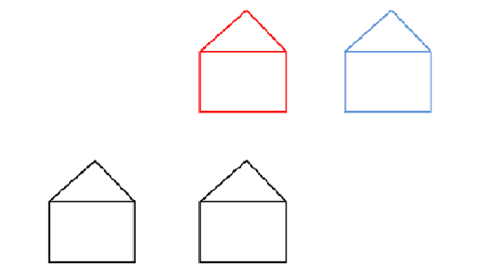
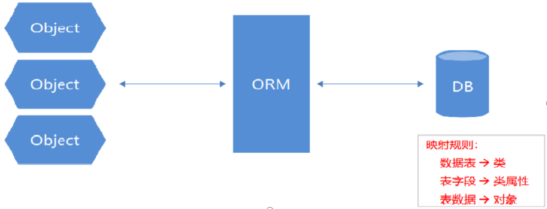
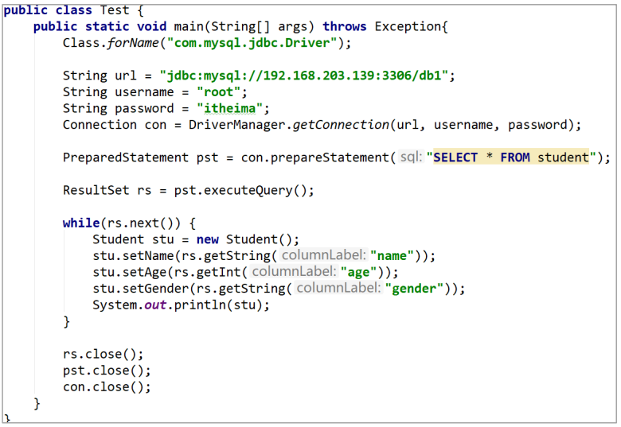
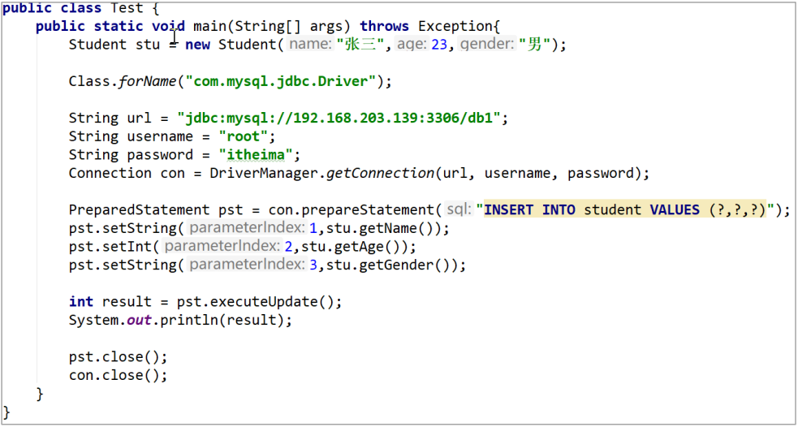
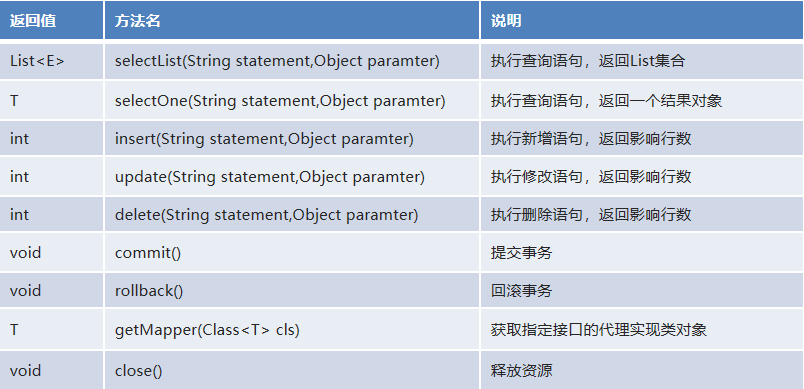
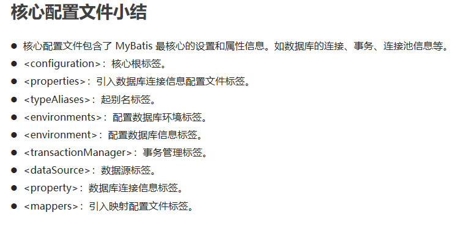

### 一.Mybatis快速入门

#### 1.1 框架介绍

* 框架是一款半成品软件，我们可以基于这个半成品软件继续开发，来完成我们个性化的需求！

* 如图:

  

 

#### 1.2 ORM介绍

* ORM(Object Relational Mapping)： 对象关系映射

* 指的是持久化数据和实体对象的映射模式，为了解决面向对象与关系型数据库存在的互不匹配的现象的技术。

* 如图:

  

* 具体映射关系如下图:


#### 1.3 原始jdbc操作（查询数据）



#### 1.4原始jdbc操作（插入数据）



#### 1.5 原始jdbc操作的分析

* 原始 JDBC 的操作问题分析 

  ​    1.频繁创建和销毁数据库的连接会造成系统资源浪费从而影响系统性能。

    2. sql 语句在代码中硬编码，如果要修改 sql 语句，就需要修改 java 代码，造成代码不易维护。
    3. 查询操作时，需要手动将结果集中的数据封装到实体对象中。
    4. 增删改查操作需要参数时，需要手动将实体对象的数据设置到 sql 语句的占位符。 

* 原始 JDBC 的操作问题解决方案 

  ​    1.使用数据库连接池初始化连接资源。 

  2. 将 sql 语句抽取到配置文件中。 
  3. 使用反射、内省等底层技术，将实体与表进行属性与字段的自动映射    

#### 1.6 什么是Mybatis

mybatis 是一个优秀的基于java的持久层框架，它内部封装了jdbc，使开发者只需要关注sql语句本身，而不需要花费精力去处理加载驱动、创建连接、创建statement等繁杂的过程。

mybatis通过xml或注解的方式将要执行的各种 statement配置起来，并通过java对象和statement中sql的动态参数进行映射生成最终执行的sql语句。

最后mybatis框架执行sql并将结果映射为java对象并返回。采用ORM思想解决了实体和数据库映射的问题，对jdbc 进行了封装，屏蔽了jdbc api 底层访问细节，使我们不用与jdbc api 打交道，就可以完成对数据库的持久化操作。

MyBatis官网地址：<http://www.mybatis.org/mybatis-3/> 

#### 1.7  Mybatis的快速入门

**MyBatis开发步骤：**

①添加MyBatis的jar包

②创建Student数据表

③编写Studentr实体类 

④编写映射文件StudentMapper.xml

⑤编写核心文件MyBatisConfig.xml

⑥编写测试类

##### 1.7.1  环境搭建

1)导入MyBatis的jar包

* mysql-connector-java-5.1.37-bin.jar
* mybatis-3.5.3.jar
* log4j-1.2.17.jar

2)  创建student数据表


3) 编写Student实体

```java
public class Student {
    private Integer id;
    private String name;
    private Integer age;
    //省略get个set方法
}
```

4)编写StudentMapper.xml映射文件

```xml
<?xml version="1.0" encoding="UTF-8" ?>
<!--MyBatis的DTD约束-->
<!DOCTYPE mapper
        PUBLIC "-//mybatis.org//DTD Mapper 3.0//EN"
        "http://mybatis.org/dtd/mybatis-3-mapper.dtd">

<!--
    mapper：核心根标签
    namespace属性：名称空间
-->
<mapper namespace="StudentMapper">
    <!--
        select：查询功能的标签
        id属性：唯一标识
        resultType属性：指定结果映射对象类型
        parameterType属性：指定参数映射对象类型
    -->
    <select id="selectAll" resultType="student">
        SELECT * FROM student
    </select>
</mapper>
```

5) 编写MyBatis核心文件

```xml
<?xml version="1.0" encoding="UTF-8" ?>
<!--MyBatis的DTD约束-->
<!DOCTYPE configuration PUBLIC "-//mybatis.org//DTD Config 3.0//EN" "http://mybatis.org/dtd/mybatis-3-config.dtd">

<!--configuration 核心根标签-->
<configuration>

    <!--引入数据库连接的配置文件-->
    <properties resource="jdbc.properties"/>

    <!--配置LOG4J-->
    <settings>
        <setting name="logImpl" value="log4j"/>
    </settings>

    <!--起别名-->
    <typeAliases>
        <typeAlias type="com.itheima.bean.Student" alias="student"/>
        <!--<package name="com.itheima.bean"/>-->
    </typeAliases>

    <!--environments配置数据库环境，环境可以有多个。default属性指定使用的是哪个-->
    <environments default="mysql">
        <!--environment配置数据库环境  id属性唯一标识-->
        <environment id="mysql">
            <!-- transactionManager事务管理。  type属性，采用JDBC默认的事务-->
            <transactionManager type="JDBC"></transactionManager>
            <!-- dataSource数据源信息   type属性 连接池-->
            <dataSource type="POOLED">
                <!-- property获取数据库连接的配置信息 -->
                <property name="driver" value="${driver}" />
                <property name="url" value="${url}" />
                <property name="username" value="${username}" />
                <property name="password" value="${password}" />
            </dataSource>
        </environment>
    </environments>

    <!-- mappers引入映射配置文件 -->
    <mappers>
        <!-- mapper 引入指定的映射配置文件   resource属性指定映射配置文件的名称 -->
        <mapper resource="StudentMapper.xml"/>
    </mappers>
</configuration>

```

##### 1.7.2编写测试代码

```java
/*
    控制层测试类
 */
public class StudentController {
    //创建业务层对象
    private StudentService service = new StudentServiceImpl();

    //查询全部功能测试
    @Test
    public void selectAll() {
        List<Student> students = service.selectAll();
        for (Student stu : students) {
            System.out.println(stu);
        }
    }
}
```

#### 1.8 知识小结

* 框架       

   框架是一款半成品软件，我们可以基于框架继续开发，从而完成一些个性化的需求。

* ORM        

  对象关系映射，数据和实体对象的映射。

* MyBatis       

   是一个优秀的基于 Java 的持久层框架，它内部封装了 JDBC。

  

### 二. MyBatis的相关api

#### 2.1 Resources

* org.apache.ibatis.io.Resources：加载配置文件的工具类。

* 核心方法

  

#### 2.2 构建器SqlSessionFactoryBuilder

* org.apache.ibatis.session.SqlSessionFactoryBuilder：获取 SqlSessionFactory 工厂对象的功能类

* 核心方法

  

* 通过加载mybatis的核心文件的输入流的形式构建一个SqlSessionFactory对象

```java
String resource = "org/mybatis/builder/mybatis-config.xml"; 
InputStream inputStream = Resources.getResourceAsStream(resource); 
SqlSessionFactoryBuilder builder = new SqlSessionFactoryBuilder(); 
SqlSessionFactory factory = builder.build(inputStream);
```

其中， Resources 工具类，这个类在 org.apache.ibatis.io 包中。Resources 类帮助你从类路径下、文件系统或一个 web URL 中加载资源文件。

#### 2.3 工厂对象SqlSessionFactory

* org.apache.ibatis.session.SqlSessionFactory：获取 SqlSession 构建者对象的工厂接口。

* 核心api

  


#### 2.4 SqlSession会话对象

* org.apache.ibatis.session.SqlSession：构建者对象接口。用于执行 SQL、管理事务、接口代理。

* 核心api

  

SqlSession 实例在 MyBatis 中是非常强大的一个类。在这里你会看到所有执行语句、提交或回滚事务和获取映射器实例的方法。

### 三.MyBatis 映射配置文件

#### 3.1 映射配置文件介绍

* 映射配置文件包含了数据和对象之间的映射关系以及要执行的 SQL 语句

  


#### 3.2 查询功能

* <select>：查询功能标签。

* 属性        

   id：唯一标识， 配合名称空间使用。     

   parameterType：指定参数映射的对象类型。       

   resultType：指定结果映射的对象类型。

* SQL 获取参数:        #{属性名}

* 示例

  

#### 3.3 新增功能 

- <insert>：新增功能标签。

- 属性        

  id：唯一标识， 配合名称空间使用。     

  parameterType：指定参数映射的对象类型。       

  resultType：指定结果映射的对象类型。

- SQL 获取参数:        #{属性名}

* 示例


#### 3.4 修改功能

- <update>：修改功能标签。

- 属性        

  id：唯一标识， 配合名称空间使用。     

  parameterType：指定参数映射的对象类型。       

  resultType：指定结果映射的对象类型。

- SQL 获取参数:        #{属性名}

* 示例


#### 3.5 删除功能

- <delete>：查询功能标签。

- 属性        

  id：唯一标识， 配合名称空间使用。     

  parameterType：指定参数映射的对象类型。       

  resultType：指定结果映射的对象类型。

- SQL 获取参数:        #{属性名}

* 示例

  

* 总结： 大家可以发现crud操作，除了标签名称以及sql语句不一样之外，其他属性参数基本一致。

#### 3.6 映射配置文件小结


### 四.Mybatis核心配置文件介绍

#### 4.1 核心配置文件介绍

核心配置文件包含了 MyBatis 最核心的设置和属性信息。如数据库的连接、事务、连接池信息等。

如下图:

~~~xml
<?xml version="1.0" encoding="UTF-8" ?>
<!--MyBatis的DTD约束-->
<!DOCTYPE configuration PUBLIC "-//mybatis.org//DTD Config 3.0//EN" "http://mybatis.org/dtd/mybatis-3-config.dtd">

<!--configuration 核心根标签-->
<configuration>

    <!--environments配置数据库环境，环境可以有多个。default属性指定使用的是哪个-->
    <environments default="mysql">
        <!--environment配置数据库环境  id属性唯一标识-->
        <environment id="mysql">
            <!-- transactionManager事务管理。  type属性，采用JDBC默认的事务-->
            <transactionManager type="JDBC"></transactionManager>
            <!-- dataSource数据源信息   type属性 连接池-->
            <dataSource type="POOLED">
                <!-- property获取数据库连接的配置信息 -->
                <property name="driver" value="com.mysql.jdbc.Driver" />
                <property name="url" value="jdbc:mysql:///db1" />
                <property name="username" value="root" />
                <property name="password" value="root" />
            </dataSource>
        </environment>
    </environments>

    <!-- mappers引入映射配置文件 -->
    <mappers>
        <!-- mapper 引入指定的映射配置文件   resource属性指定映射配置文件的名称 -->
        <mapper resource="StudentMapper.xml"/>
    </mappers>
</configuration>
~~~

#### 4.2 数据库连接配置文件引入

* properties标签引入外部文件

  ~~~xml
      <!--引入数据库连接的配置文件-->
      <properties resource="jdbc.properties"/>
  ~~~

* 具体使用，如下配置

  ~~~xml
    <!-- property获取数据库连接的配置信息 -->
      <property name="driver" value="${driver}" />
      <property name="url" value="${url}" />
      <property name="username" value="${username}" />
      <property name="password" value="${password}" />
  ~~~

  

#### 4.3 起别名

* <typeAliases>：为全类名起别名的父标签。

* <typeAlias>：为全类名起别名的子标签。

* 属性      

   type：指定全类名      

   alias：指定别名

* <package>：为指定包下所有类起别名的子标签。(别名就是类名)

* 如下图：

  

* 具体如下配置

  ~~~xml
      <!--起别名-->
      <typeAliases>
          <typeAlias type="com.itheima.bean.Student" alias="student"/>
          <!--<package name="com.itheima.bean"/>-->
      </typeAliase
  ~~~

#### 4.4 总结



### 五.Mybatis传统方式开发

#### 5.1 Dao 层传统实现方式

* 分层思想：控制层(controller)、业务层(service)、持久层(dao)。

* 调用流程

  

#### 5.2 LOG4J的配置和使用

* 在日常开发过程中，排查问题时难免需要输出 MyBatis 真正执行的 SQL 语句、参数、结果等信息，我们就可以借助 LOG4J 的功能来实现执行信息的输出。

* 使用步骤：

  


