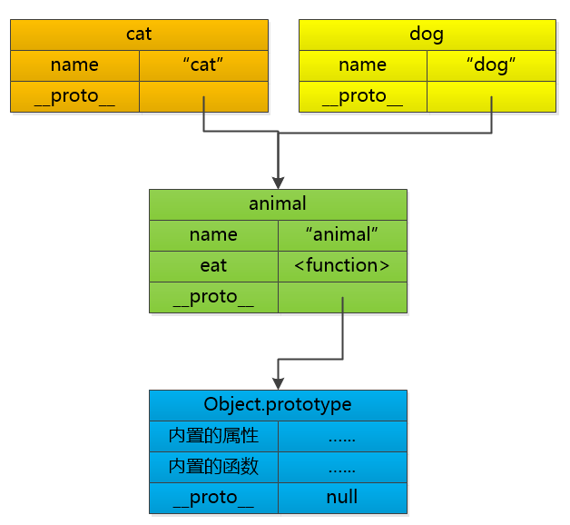
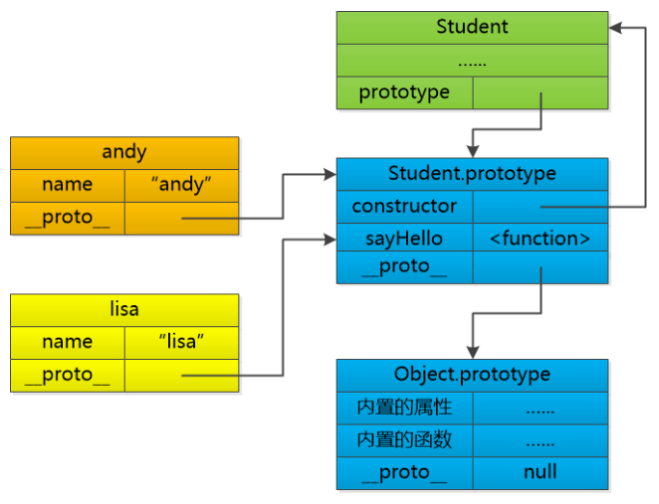

## 简介

ECMAScript是一种语言标准，而JavaScript是网景公司对ECMAScript标准的一种实现。那为什么不直接把JavaScript定为标准呢？因为JavaScript是网景的注册商标。

最新版ECMAScript 6标准（简称ES6）已经在2015年6月正式发布了，所以，讲到JavaScript的版本，实际上就是说它实现了ECMAScript标准的哪个版本。

## 快速入门

### 引入

通常我们都把JavaScript代码放到`<head>`中：

```html
<html>
<head>
  <script>
    alert('Hello, world');
  </script>
</head>
<body>
  ...
</body>
</html>
```

第二种方法是把JavaScript代码放到一个单独的`.js`文件，然后在HTML中通过`<script src="..."></script>`引入这个文件：

```html
<html>
<head>
  <script src="/static/js/abc.js"></script>
</head>
<body>
  ...
</body>
</html>
```

可以在同一个页面中引入多个`.js`文件，还可以在页面中多次编写`<script> js代码... </script>`，浏览器按照顺序依次执行。

有时会看对这样的写法：`<script type="text/javascript">`。但这是多余的。

### 数据类型

#### Number

JavaScript不区分整数和浮点数，统一用Number表示，以下都是合法的Number类型：

```javascript
123; // 整数123
0.456; // 浮点数0.456
1.2345e3; // 科学计数法表示1.2345x1000，等同于1234.5
-99; // 负数
NaN; // NaN表示Not a Number，当无法计算结果时用NaN表示
Infinity; // Infinity表示无限大，当数值超过了JavaScript的Number所能表示的最大值时，就表示为Infinity
```

#### 字符串

字符串是以单引号'或双引号"括起来的任意文本。

ES6 支持多行字符串，使用反引号：

```
`这是一个
多行
字符串`;
```

ES6 支持模板字符串：

```
var name = '小明';
var age = 20;
var message = `你好, ${name}, 你今年${age}岁了!`;
alert(message);
```

字符串常见操作：

```javascript
var s = 'Hello, world!';
s.length; // 13
s[0]; // 'H'
s.toUpperCase()
s.toLowerCase()
s.indexOf("world") //7
s.indexOf("WORLD") //-1
s.substring(0, 5)// hello
```

字符串是不可变的，如果对字符串的某个索引赋值，不会有任何错误，但是，也没有任何效果：

```javascript
var s = 'Test';
s[0] = 'X';
alert(s); // s仍然为'Test'
```

#### 布尔值

JavaScript把`null`、`undefined`、`0`、`NaN`和空字符串`''`视为`false`，其他值一概视为`true`

### 比较运算符

JavaScript在设计时，有两种比较运算符：

1. 第一种是`==`比较，它会自动转换数据类型再比较，很多时候，会得到非常诡异的结果；

2. 第二种是`===`比较，它不会自动转换数据类型，如果数据类型不一致，返回`false`，如果一致，再比较。

由于JavaScript这个设计缺陷，*不要*使用`==`比较，始终坚持使用`===`比较。

另一个例外是`NaN`这个特殊的Number与所有其他值都不相等，包括它自己，唯一能判断`NaN`的方法是通过`isNaN()`函数：

```javascript
NaN = Nan //false
isNaN(0 / 0) //true
```

### null 和 undefined

JavaScript的设计者希望用`null`表示一个空的值，而`undefined`表示值未定义。事实证明，这并没有什么卵用，区分两者的意义不大。大多数情况下，我们都应该用`null`。`undefined`仅仅在判断函数参数是否传递的情况下有用。

### 数组

https://www.liaoxuefeng.com/wiki/1022910821149312/1023020967732032

JavaScript的数组可以包括任意数据类型。而且对数组的操作非常自由，可以在使用中随意更改数组的大小：

```javascript
var arr = [1, 2, 3.14, 'Hello', null, true];
arr.length; // 3
arr.length = 6;
arr; // arr变为[1, 2, 3, undefined, undefined, undefined]
arr.length = 2;
arr; // arr变为[1, 2]
arr[5] = 'x';
arr; // arr变为[1, 2, 3, undefined, undefined, 'x'] 没有索引越界异常
```

另一种创建数组的方法是通过`Array()`函数实现，不推荐这种方式：

```javascript
new Array(1, 2, 3); // 创建了数组[1, 2, 3]
```

数组常用的方法：

```javascript
var arr = [10, 20, '30', 'xyz'];
arr.indexOf(10); // 元素10的索引为0

//slice()截取Array的部分元素，然后返回一个新的Array：
arr = ['A', 'B', 'C', 'D', 'E', 'F', 'G'];
arr.slice(0, 3); // 从索引0开始，到索引3结束，但不包括索引3: ['A', 'B', 'C']
arr.slice(3); // 从索引3开始到结束: ['D', 'E', 'F', 'G']
var aCopy = arr.slice() //复制一个新数组

//push和pop
var arr = [1, 2];
arr.push('A', 'B'); // 返回Array新的长度: 4
arr; // [1, 2, 'A', 'B']
arr.pop(); // pop()返回'B'
arr; // [1, 2, 'A']

//unshift和shift
var arr = [1, 2];
arr.unshift('A', 'B'); // 向头部添加元素，返回Array新的长度: 4
arr; // ['A', 'B', 1, 2]
arr.shift(); // 从头部删除元素，'A'
arr; // ['B', 1, 2]

//排序
var arr = ['B', 'C', 'A'];
arr.sort();
arr; // ['A', 'B', 'C']
arr.reverse();


//splice()方法是修改Array的“万能方法”，它可以从指定的索引开始删除若干元素，然后再从该位置添加若干元素
var arr = ['Microsoft', 'Apple', 'Yahoo', 'AOL', 'Excite', 'Oracle'];
// 从索引2开始删除3个元素,然后再添加两个元素:
arr.splice(2, 3, 'Google', 'Facebook'); // 返回删除的元素 ['Yahoo', 'AOL', 'Excite']
arr; // ['Microsoft', 'Apple', 'Google', 'Facebook', 'Oracle']
// 只删除,不添加:
arr.splice(2, 2); // ['Google', 'Facebook']
arr; // ['Microsoft', 'Apple', 'Oracle']
// 只添加,不删除:
arr.splice(2, 0, 'Google', 'Facebook'); // 返回[],因为没有删除任何元素
arr; // ['Microsoft', 'Apple', 'Google', 'Facebook', 'Oracle']\


//concat()方法把当前的Array和另一个Array连接起来，并返回一个新的Array
var arr = ['A', 'B', 'C'];
var added = arr.concat([1, 2, 3]);
added; // ['A', 'B', 'C', 1, 2, 3]
arr; // ['A', 'B', 'C']
//实际上，concat()方法可以接收任意个元素和Array，并且自动把Array拆开，然后全部添加到新的Array里
var arr = ['A', 'B', 'C'];
arr.concat(1, 2, [3, 4]); // ['A', 'B', 'C', 1, 2, 3, 4]

//join
var arr = ['A', 'B', 'C', 1, 2, 3];
arr.join('-'); // 'A-B-C-1-2-3'
```

### 对象

http://mp.weixin.qq.com/s?__biz=MzAxOTc0NzExNg==&mid=2665513786&idx=1&sn=6f51ad314e3ef3e1575e032568477f3a&chksm=80d67b79b7a1f26f88899ccaa48c150745c3010e9b1f21a3e1e326dc5b6767b74f50db3e10f2&scene=21#wechat_redirect

JavaScript 创建对象时不需要类的存在。JavaScript的对象（也就是原型）是一组由键-值组成的无序集合，例如：

```javascript
var person = {
    name: 'Bob',
    age: 20,
    zipcode: null,
    'middle name': 'tom'
};
```

JavaScript对象的键都是字符串类型，值可以是任意数据类型。

要获取一个对象的属性，我们用`对象变量.属性名`的方式；还可以随意为对象增加属性：

```javascript
person.name; // 'Bob'
person.zipcode; // null
person.country = "US";
person['middle name']; //特殊的属性只能这样访问
person.car; //undefined 不存在的属性
delete person.name; //删除对象的属性
person.name; //undefined
delete person.school; //删除一个不存在的school属性也不会报错

//in 操作符判断是否有某个属性或方法
'name' in person; //true
'toString' in person; //true 继承的属性
//要判断一个属性是否是对象自身拥有的，而不是继承得到的，可以用hasOwnProperty()方法：
var xiaoming = {
    name: '小明'
};
xiaoming.hasOwnProperty('name'); // true
xiaoming.hasOwnProperty('toString'); // false
```

### 继承和原型

每个对象都有一个特殊的属性叫做`__proto__`， 可以用这个属性去关联另外一个对象（叫做原型）。

```java
var animal = {
    name: "animal",
    eat : function() {
        console.log(this.name + " can eat!")
    }
};
var dog = {
    name: "dog",
    __proto__: animal
}
var cat = {
    name: "cat",
    __proto__: animal
}

dog.eat() //dog can eat
cat.eat() //cat can eat
```

上面代码中 animal 就是 dog 和 cat 的原型，类似于 Java 中的父类。

当eat方法被调用的时候，先在自己的方法列表中寻找，如果找不到，就去找原型中的方法，如果原型中找不到，就去原型的原型中去寻找......  最后找到Object那里， 如果还找不到，那就是未定义了。

属性和方法应该类似，也是沿着原型链向上查找。



### 向 Java 靠拢

JavaScript 提供了一个构造函数：

```javascript
function Student(name) {
    this.name = name,
    this.sayHi = function() {
        console.log("Hi, I am " + this.name);
    }
};

andy = new Student("andy");
lisa = new Student("lisa");

andy.sayHi();
lisa.sayHi();
```

这样以来看起来就像Java的类了。但是，中间有个问题：**每个新创建对象都有一个sayHello函数**。

所以需要提供一种更加高效的办法， 把这个sayHello函数放到另外一个地方去！记得我们刚才说的原型链吗？  当一个对象调用方法的时候，会顺着链向上找，所以我们可以创建一个**原型对象**，其中包含sayHello函数，让andy, lisa这些从Student创建起来的对象指向这个原型就ok了。

我们把这个原型对象放到Student.prototype这个属性中（注意，不是`__proto__`），这样一来，每次当你创建andy,lisa这样的对象时， javascript 就会自动的把原型链给建立起来！

```javascript
function Student(name) {
    this.name = name
}

Student.prototype = {
    sayHello : function() {
        console.log("Hi, I am " + this.name)
    }
}

lisa = new Student("lisa")
mary = new Student("mary")

lisa.sayHello()
```

上面代码的原型链如图：



所谓的构造函数Student 其实就是一个幌子啊，每次去new Student的时候，确实会创建一个对象出来（andy或者lisa) ，并且把这个对象的原型(`__proto__`)指向 Student.prototype这个对象，这样一来就能找到sayHello()方法了。

后来 JavaScript 干脆加了语法糖，很像 Java 定义类的语法：

```javascript
class Student {
    constructor(name) {
        this.name = name
    }
    sayHello() {
        console.log("Hi, I am " + this.name)
    }
}

lisa = new Student("lisa")
lisa.sayHello()
```

### strict 模式

JavaScript在设计之初，并不强制要求用`var`申明变量。这个设计错误带来了严重的后果：如果一个变量没有通过`var`声明就被使用，那么该变量就自动被申明为全局变量：

```
i = 10; // i现在是全局变量
```

在同一个页面的不同的 JavaScript 文件中，如果都不用`var`申明，恰好都使用了变量`i`，将造成变量`i`互相影响，产生难以调试的错误结果。

使用`var`申明的变量则不是全局变量，它的范围被限制在该变量被申明的函数体内，同名变量在不同的函数体内互不冲突。

为了修补JavaScript这一严重设计缺陷，ECMA在后续规范中推出了strict模式，在strict模式下运行的JavaScript代码，强制通过`var`申明变量，未使用`var`申明变量就使用的，将导致运行错误。

启用strict模式的方法是在JavaScript代码的第一行写上：

```
'use strict';

a = 10
console.log(a)
```

运行结果为：`ReferenceError: a is not defined`

### 循环

```javascript
for(i = 0; i < 3; i ++) {
    console.log("hello")
}

var arr = [1,2,3]
for (i in arr) { //i 是数组的索引
    console.log(i + ":" + arr[i])
}//PS. for ... in对Array的循环得到的是String而不是Number

var o = {
    name: 'o',
    age: 12,
    city: 'sz',
    eat: function() {
        alert("eat is a function")
    }
}
for (i in o) { //i是对象的属性名
    console.log(i)
}
```

for...of 是ES6的新语法，数组、Map、set 等 Iterable 类型支持这种语法。Iterable还指出forEach语法。

https://www.liaoxuefeng.com/wiki/1022910821149312/1023024358748480


### Map和Set

JavaScript的默认对象表示方式`{}`可以视为其他语言中的`Map`或`Dictionary`的数据结构，即一组键值对。但是JavaScript的对象有个小问题，就是键必须是字符串。但实际上Number或者其他数据类型作为键也是非常合理的。

为了解决这个问题，最新的ES6规范引入了新的数据类型`Map`和`Set`：

https://www.liaoxuefeng.com/wiki/1022910821149312/1023024181109440