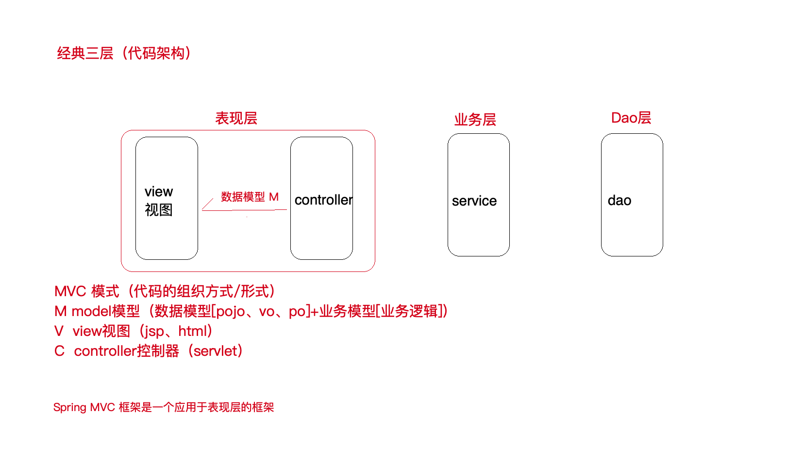
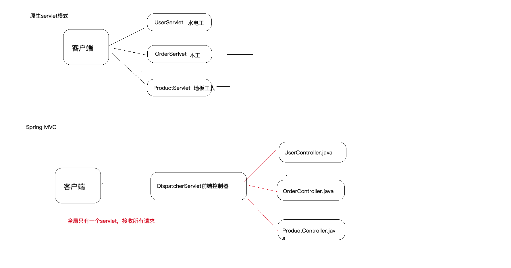
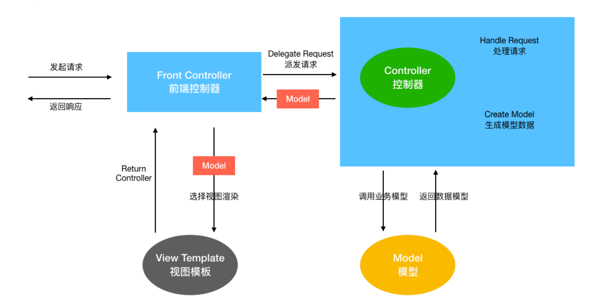
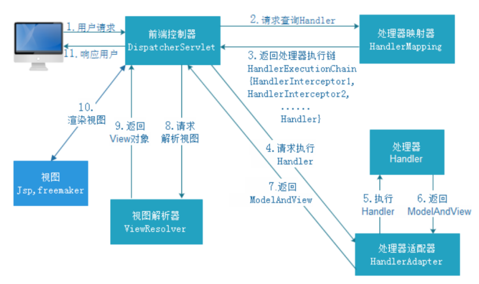

## 概述

### MVC 模式

### SpringMVC 的作用

SpringMVC 可以认为是对 Servlet 的简化。以前要许多个 Servlet 提供服务，而 SpringMVC 只有一个 DispatcherServlet，后面是各个 Controller 提供服务。

### SpringMVC 请求处理流程

## 类型转换

http 请求的参数可以自定义类型转换，需要实现 Converter 类，然后注册。框架会自动选择合适的类型转换器转换参数。