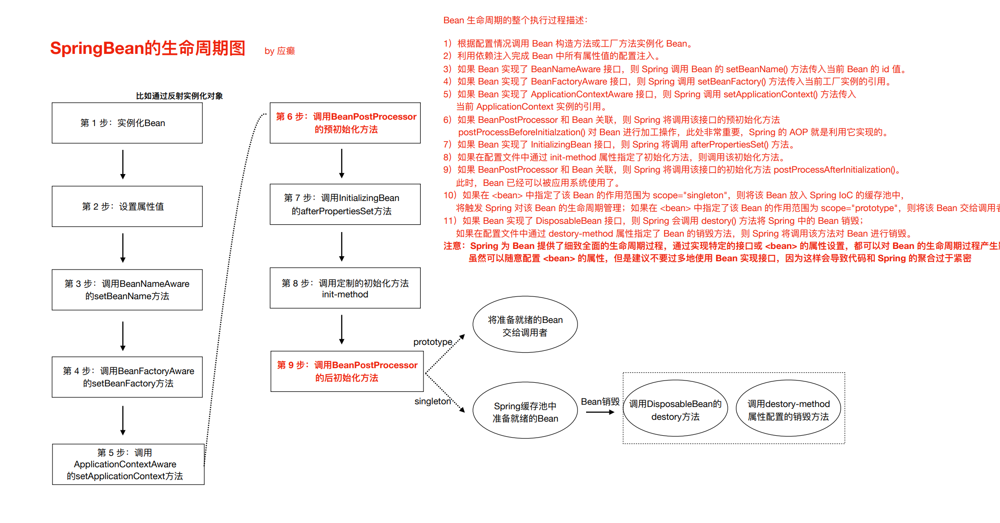
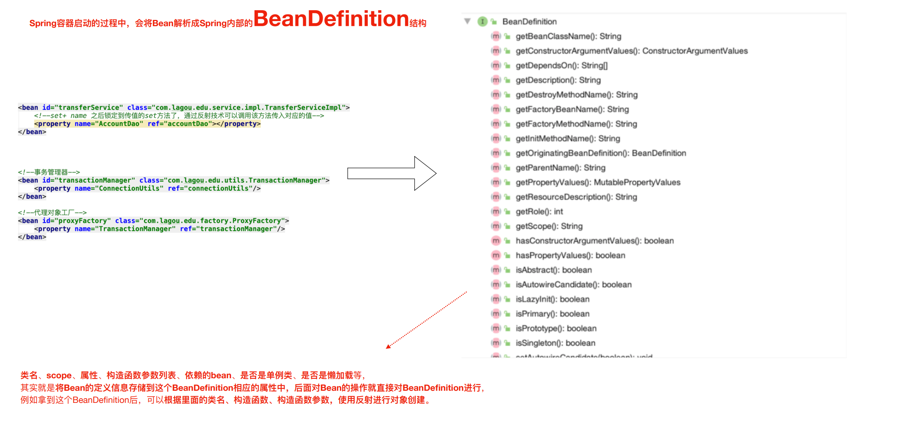

## Spring 做了哪些事
1. 读取配置文件，创建出单例的实例对象。

2. 读取依赖关系，注入实例对象。

3. 使用动态代理的方式，实现了AOP。

4. 将数据库连接和线程绑定，这样多个 sql 语句使用同一个连接，以便于事务的关系。

## 生命周期





## 组件

beans.xml（常叫做 applicationContext.xml）：定义需要实例化对象的类的全限定名，以及类之间依赖关系的描述。

BeanFactory：IOC 容器，通过反射技术来实例化对象并维护对象之间的依赖关系。这是理解 Spring 源码的入口。实现类有以下几种：

1. bean 都定义在 xml 中：

   1. JavaSE 应用： `ApplicationContext applicationContext = new ClassPathXmlApplicationContext("classpath:beans.xml");` 或者`ApplicationContext applicationContext = new FileSystemXmlApplicationContext("文件系统的绝对路径");`

   2. JavaWeb 应用：ContextLoaderListener (监听器去加载 xml)
2. 纯注解：

   1. JavaSE 应用：`ApplicationContext applicationContext = new AnnotationConfigApplicationContext(SpringConfig.class);`
   2. JavaWeb 应用：ContextLoaderListener (监听器去加载注解配置类)
3. xml + 注解：一般第三方 jar 包中的对象定义在 xml 中，自定义的对象使用注解。需要在 xml 中配置注解扫描。

ApplicationContext 是 BeanFactory 的一个子接口，BeanFactory 只有一些获取对象的方法，ApplicationContext 添加了一些加载资源的方法。

## 注解

@Componet 加到要实例化的对象上

@Autowired 按照类型注入，放到要注入的对象上，或者setter上

@Qualifier 按照名称注入，需要和 @Autowired 配合使用，而且 @Component 需要指定对象的名字

@Resource 由 J2EE 提供，默认按照名称注入，也可以指定类型注入。JDK11 移除了

纯注解的方式需要一个配置类，取代 xml 的方式，xml 中的所有配置都有对应的注解来代替：

```java
package com.lagou.config;

import org.springframework.beans.factory.annotation.Value;
import org.springframework.context.annotation.*;

import javax.sql.DataSource;

@PropertySource({"classpath:jdbc.properties"}) //引入外部资源文件
@ComponentScan({"com.lagou.service"}) //扫描需要实例化的对象所在的包
@Configuration //标记这是一个配置类
@Import({OtherSpringConfig.class}) //如果有多个配置类，一起引入
public class SpringConfig {

    //这里可以引用外部资源文件中定义的值
    @Value("${jdbc.driver}")
    private String driverClassName;
    @Value("${jdbc.url}")
    private String url;
    @Value("${jdbc.username}")
    private String username;
    @Value("${password}")
    private String password;

    //第三方jar包中的对象这样实例化
    @Bean("dataSource")
    public DataSource dataSource() {
        DataSource dataSource = new DruidDataSource();
        //dataSource.setUrl(url);
        //......
        return dataSource;
    }
}

```

## AOP

Aspect 切面 = 切入点（锁定方法）+ 方位点（锁定方法中的特殊时机，比如开始前、结束后、发生异常时）+ 横切逻辑

```xml
<dependency>
    <groupId>org.springframework</groupId>
    <artifactId>spring-aop</artifactId>
    <version>5.3.26</version>
</dependency>
<dependency>
    <groupId>org.aspectj</groupId>
    <artifactId>aspectjweaver</artifactId>
    <version>1.9.7</version>
</dependency>
```

示例：

```java
package com.lagou.aop;

import org.aspectj.lang.ProceedingJoinPoint;
import org.aspectj.lang.annotation.*;
import org.springframework.stereotype.Component;

@Aspect //标记这是一个切面
@Component
public class LogAspect {

    /**
     * 切入点
     * 可以指定多个
     */
    @Pointcut("execution(* *.*(..))")
    public void pt1() {
    }

    /**
     * 方位点
     */
    @Around("pt1()")
    public Object aroundPt1(ProceedingJoinPoint joinPoint) throws Throwable {
        System.out.println("开始执行");
        Object result = joinPoint.proceed();
        System.out.println("结束执行");
        return result;
    }
    
    //@AfterReturning 业务逻辑正常结束
    //@AfterThrowing 业务逻辑发生异常时
    //@After() 业务逻辑结束后（无论异常与否）
}

```

还需要在 Spring 配置类上加 @EnableAspectJAutoProxy

## 事务

@EnableTransactionManagment 开启声明式事务

## 高级特性

### 懒加载

容器启动时，默认就创建了所有的对象。可以配置懒加载，使用 @Lazy 注解，当使用到对象的时候才会创建。

懒加载只适用于 scope = singleton 的对象。因为 scope = prototype 的对象，Spring 容器每次都会创建新的，对象不用了就由 GC 回收，它们不由 Spring 容器管理。

### FactoryBean 和 BeanFactory

BeanFactory 是容器的顶级接口，负责生产和管理 Bean。

Spring 中的 Bean 有两种：普通 bean 和 工厂 bean。FactoryBean 可以生成某一个类型的 bean 实例，可以借助它来自定义 bean 的创建过程。

FactoryBean 接口：

```java
public interface FactoryBean<T> {
    @Nullable
	T getObject() throws Exception;
    
    @Nullable
	Class<?> getObjectType();
    
    default boolean isSingleton() {
		return true;
	}
}
```

示例：

```java
package com.lagou.pojo;

import lombok.Data;
import org.springframework.beans.factory.FactoryBean;
import org.springframework.stereotype.Component;

/**
 * 使用 FactoryBean 创建复杂对象
 */
@Component
public class CompanyFactory implements FactoryBean<CompanyFactory.Company> {

    private String companyInfo = "苹果公司,美国加州,10000"; //公司名称,地址,规模

    public Company getObject() throws Exception {
        //创建复杂对象
        String[] split = companyInfo.split(",");
        Company company = new Company();
        company.setName(split[0]);
        company.setAddress(split[1]);
        company.setScale(Integer.parseInt(split[2]));

        return company;
    }

    public Class<?> getObjectType() {
        return Company.class;
    }

    @Data
    static class Company {

        private String address;
        private String name;
        private int scale;
    }
}
```

结果如下：

```java
@Test
public void test() {
    ApplicationContext applicationContext = new AnnotationConfigApplicationContext(SpringConfig.class);
    Object company = applicationContext.getBean("companyFactory");
    System.out.println(company); //获取的是工厂生产的 Company 对象
    Object companyFactory = applicationContext.getBean("&companyFactory");
    System.out.println(companyFactory); //获取的是原始工厂 CompanyFactory 对象

}
```

### 后置处理器

