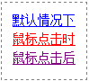
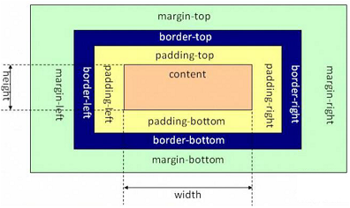

## CSS

概念：Cascading Style Sheets层叠样式表
层叠：多个样式可以作用在同一个html的元素上，同时生效

优点

1. 功能强大
2. 将内容展示和样式控制分离
   * 降低耦合度
   * 分工协作更容易
   * 提高开发效率

### css和html的结合方式

1. 行内样式：在标签内使用style属性指定css代码

   ```css
   <div style='color:red';>hello css</div>
   ```

   不推荐这种css样式，因为和font标签（已淘汰）作用一样了

   ```html
   <font color="red">hello css</font>
   ```

2. 内部样式：在head标签内，定义style标签，里面写css代码

   ```html
   <head>
       <style>
           p{
               color: blue;
               font-size:50px ;
               font-style: italic;
           }
       </style>
       <title>Title</title>
   </head>
   ```
   
3. 外部样式：在head标签内，通过link标签导入外部的css资源文件。
   a.css文件代码：

   ```css
   div{
       color:green
   }
   ```

   html文件

   ```html
   <head>
       <meta charset="UTF-8">
       <link rel="stylesheet" href="./a.css">
       <title>Title</title>
   </head>
   <body>
   
   <div>外部的样式</div>
   </body>
   </html>
   ```


### CSS选择器

* 格式：
  		选择器 {
    			属性名1:属性值1;
    			属性名2:属性值2;
    			...
    		}

* 选择器：用于“查找”（或选取）要设置样式的 HTML 元素。

  1. 基础选择器

     1. 元素选择器：根据元素名称来选择 HTML 元素。
        下面代码使得页面上的所有 \<p> 标签的字体为红色，居中显示

        ```css
        p {
          text-align: center;
          color: red;
        }
        ```

     2. id选择器：使用 HTML 元素的 id 属性来选择特定元素。id属性具有唯一性，同一页面中相同的id只能出现一次。要选择具有特定 id 的元素，写一个井号＃，后跟该元素的 id，id名不能只是数字。
        这条 CSS 规则将应用于 id="para1" 的 HTML 元素：

        ```css
        #para1 {
          text-align: center;
          color: red;
        }
        ```

     3. 类选择器：选择有特定 class 属性的 HTML 元素。类不唯一，可以为不同的元素设置相同的class属性，以便于统一添加样式。如需选择拥有特定 class 的元素，写一个句点‘.’字符，后面跟类名。
        下面代码作用在所有带有 class="center" 的 HTML 元素上：

        ```css
        .center {
          text-align: center;
          color: red;
        }
        ```


  2.  补充选择器

     1. 后代选择器 div p{}
     2. 子选择器 div > p{}
     3. 兄弟选择器
     4. 相邻选择器
     5. 组合选择器 div,p,span{}
     6. 属性选择器：input[type="password"]
     7. 伪类选择器，针对不同的状态：div:hover


### CSS样式

#### 字体样式font

相关的css属性

| 属性                              | 说明     |
| --------------------------------- | -------- |
| font-family                       | 字体类型 |
| font-size                         | 字体大小 |
| font-weight                       | 字体粗细 |
| font-style                        | 字体风格 |
| **color，这里别写成了font-color** | 字体颜色 |

font-size的取值单位常用px（像素点），也有em（与默认字体大小的比值）、百分比等。

```css
font-size:40px;
font-size:2.5em;
/*上面两种写法相同，默认大小是16px，所以2.5em就是40px。注意css的注释和html不一样*/
```

font-weight和font-size不一样，用来设置字体粗细。

#### 文本样式text

注意：文本样式和字体样式不一样。字体样式针对的是“文字本身”的型体效果，而文本样式针对的是“整个段落”的排版效果。字体样式注重个体，文本样式注重整体。因此在CSS中，特意使用了“font”和“text”两个前缀来区分这两类样式。

文本样式属性

| 属性                                                         | 说明     |
| :----------------------------------------------------------- | -------- |
| text-indent:像素值                                           | 首行缩进 |
| text-align:left/right/center                                 | 水平对齐 |
| text-decoration: underline下划线/line-through中划线/none去除划线，和\<a>一起用 | 文本修饰 |
| text-transform: uppercase转大写/lowercase转小写/capitalize首字母大写 |          |
| line-height: 像素值                                          | 行高     |
| letter-spacing                                               | 字母间距 |
| word-spacing                                                 | 词间距   |

如果要设置首行缩进两个中文字符，就将text-indent的像素值设置成font-size的两倍。

#### 边框样式

几乎所有的元素都可以定义边框。例如，div元素可以定义边框，img元素可以定义边框，table元素可以定义边框，span元素同样也可以定义边框。
边框样式需要设置3种：

| 属性                                          | 说明       |
| --------------------------------------------- | ---------- |
| border-width: 像素值                          | 边框的宽度 |
| border-style: none无样式/dashed虚线/solid实线 | 边框的外观 |
| border-color                                  | 边框的颜色 |

其实一个元素有四个边，可以分别设置不同的样式。

设置下边框

```css
border-bottom: 2px  dashed  blue;
```

#### 图片样式

图片大小：可以设置width、height属性

图片边框：和边框样式的设置方法一样

图片对齐：水平对齐用text-align。垂直对齐用vertical-align: top顶部对齐/bottom底部对齐/middle/baseline基线对齐，对齐的参考是图片周围的文字。

文字环绕：float: left图片在文字左边，float: right图片在文字右边

#### 背景样式

背景样式包括两个方面：背景颜色和背景图片。在Web1.0时代，都是使用background或者bgcolor这两个“HTML属性”（不是CSS属性）定义。不过在Web2.0时代，对于元素的背景样式，我们都是使用CSS属性来实现。
在CSS中，定义“背景颜色”使用的是background-color属性，而定义“背景图片”则比较复杂，往往涉及以下属性。

| 属性                  | 说明                                     |
| --------------------- | ---------------------------------------- |
| background-image      | 定义背景图片地址                         |
| background-repeat     | 定义背景图片重复，例如横向重复、纵向重复 |
| background-position   | 定义背景图片位置                         |
| background-attachment | 定义背景图片固定                         |

在CSS中颜色的取值方式有3种。

1. 预定义的颜色值：如red、green、blue等。
2. 十六进制：如#FF0000、#FF6600、#29D794等。
3.  RGB代码：如红色可以用rgb(255,0,0)或rgb(100%,0%,0%)来表示。如果使用百分比方式取值，即使其值为0，也不能省略百分号，必须写为0%。

用图片做背景：必须要设置高和宽，否则默认是0px，显示不出来。

```html
<style type="text/css">
    div{
        background-image: url(/code/css/haizei.png);
        width: 250px;
        height: 100px;
    }
</style>
```

background-repeat属性可以定义图片的重复方式，有下面四个取值：

| 属性值    | 说明                                     |
| --------- | ---------------------------------------- |
| repeat    | 在水平方向和垂直方向上同时平铺（默认值） |
| repeat-x  | 只在水平方向（x轴）上平铺                |
| repeat-y  | 只在垂直方向（y轴）上平铺                |
| no-repeat | 不平铺                                   |

background-position的取值：<a src=http://www.lvyestudy.com/css/background-position>点击链接</a>

#### 超链接伪类

（1）默认情况下：字体为蓝色，带有下划线。
（2）鼠标点击时：字体为红色，带有下划线。
（3）鼠标点击后：字体为紫色，带有下划线。

在CSS中，我们可以使用“超链接伪类”来定义超链接在鼠标点击的不同时期的样式。
**超链接伪类**

| 伪类      | 说明                      |
| --------- | ------------------------- |
| a:link    | 定义a元素未访问时的样式   |
| a:visited | 定义a元素访问后的样式     |
| a:hover   | 定义鼠标经过a元素时的样式 |
| a:active  | 定义鼠标点击激活时的样式  |

定义4个伪类，必须按照“link、visited、hover、active”的顺序进行，不然浏览器可能无法正常显示这4种样式。请记住，这4种样式定义顺序不能改变。可以把四种样式记成“爱恨原则”，即“<font color=red>l</font>o<font color=red>v</font>e <font color=red>ha</font>te”。

```html
<style type="text/css">
    a{text-decoration:none;} /*取消下划线*/
    a:link{color:red;}
    a:visited{color:purple;}
    a:hover{color:yellow;}
    a:active{color:blue;}
</style>
```

不过，在实际开发中，我们只会用到两种状态：**未访问时状态和鼠标经过状态**。对于未访问时状态，我们直接针对a元素定义就行了，没必要使用a:link。上述代码可以简化成：

```html
<style type="text/css">
    a{
        text-decoration:none;
        color:red; /*直接在这定义color就行了，用不着a:link*/
    } 
    a:hover{color:yellow;}
</style>
```

所以在实际开发中，只要关注hover就行了。其实hover不仅可以用在\<a>元素中。

```html
<!DOCTYPE html> 
<html>
<head>
    <meta charset="utf-8" />
    <title></title>
    <style type="text/css">
        div
        {
            width:100px;
            height:30px;
            line-height:30px;
            text-align:center;
            color:white;
            background-color: lightskyblue;
        }
        div:hover
        {
            background-color: hotpink;
        }
    </style>
</head>
<body>
    <div>绿叶学习网</div>
</body>
</html
```

还可以设置鼠标样式：<a src=http://www.lvyestudy.com/css/cursor>绿色学习网</a>

### 盒子模型

在“CSS盒子模型”理论中，页面中的所有元素都可以看成一个盒子，并且占据着一定的页面空间。一个页面由很多这样的盒子组成，这些盒子之间会互相影响，因此掌握盒子模型需要从两个方面来理解：一是理解单独一个盒子的内部结构（往往是padding）；二是理解多个盒子之间的相互关系（往往是margin）。


盒子的组成：

1. 内容区：内容区是CSS盒子模型的中心，它呈现了盒子的主要信息内容，这些内容可以是文本、图片等多种类型。内容区是盒子模型必备的组成部分，其他3个部分都是可选的。内容区有3个属性：width、height和overflow。使用width和height属性可以指定盒子内容区的高度和宽度。在这里注意一点，width和height这两个属性是针对内容区content而言，并不包括padding部分。当内容过多超出width和height时，可以使用overflow属性来指定溢出处理方式。
2. 内边距：内边距，指的是内容区和边框之间的空间，可以看成是内容区的背景区域。关于内边距的属性有5种：padding-top、padding-bottom、padding-left、padding-right以及综合了以上4个方向的简写内边距属性padding。使用这5种属性可以指定内容区与各方向边框之间的距离。
3. 外边距：外边距，指的是两个盒子之间的距离，它可能是子元素与父元素之间的距离，也可能是兄弟元素之间的距离。外边距使得元素之间不必紧凑地连接在一起，是CSS布局的一个重要手段。外边距的属性也有5种：margin-top、margin-bottom、margin-left、margin-right以及综合了以上4个方向的简写外边距属性margin。同时，CSS允许给外边距属性指定负数值，当外边距为负值时，整个盒子将向指定负值的相反方向移动，以此可以产生盒子的重叠效果，这就是传说中的“负margin技术”。
4. 边框：边框属性有border-width、border-style、border-color以及综合了3类属性的简写边框属性border。

width和height：

**元素的宽度（width）和高度（height）是针对content而言的**。很多初学者容易把padding也认为是内容区的一部分，这样理解是错的。只有块元素才可以设置width和height，行内元素是无法设置width和height的，比如div可以设置宽高，但是span没有办法设置宽高。而且如果块元素没有设置width，他会占据整行。
