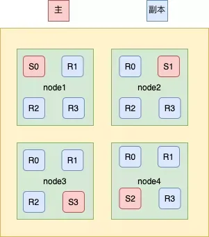

> [分布式搜索引擎Elasticsearch的架构分析 - 知乎 (zhihu.com)](https://zhuanlan.zhihu.com/p/334348919)

## 产品家族

ES：ES 使用 Java开发，自带了 JDK，提供了 rest api 给其他语言使用。运行端口 9200。

Kibana：运行端口 5601。

## 基本概念

文档：es 记录的基本单位，以 JSON 格式存储，类似于表中的一条记录

索引：是一类文档的集合，类似于一张表

mapping：对字段的限制

type：废弃了，现在都是 `_doc`

shards 分片：索引太大了，任何一个节点都无法存下，就可以分片，保存在不同的节点上。类似于 kafka 的 partition

replicas 副本：备份的数据

| RDBMS  | ElasticSearch |
| ------ | ------------- |
| table  | index         |
| row    | document      |
| column | filed         |
| schema | mapping       |
| SQL    | DSL           |

## ES 集群

每一个 ES 实例都是一个 Java 进程，叫做一个节点。

每个节点启动后，默认就是一个 master eligible 节点，可以参与选举成为 master 节点。`node.master: false` 禁用选举功能。

第一个节点启动时，自动成功 master，只有 master 可以修改集群的状态信息。

一个索引被分片之后保存到不同的节点上，同时这个节点还保存着其他节点的副本。**一个节点不能同时保存原始数据和副本，这样起不到安全备份的作用。**



分片数在创建索引的时候就确定了，不能再修改。副本数可以动态修改。所以当我们一直增加节点数，直到超过分片数，那么后来增加的节点保存的就都是副本了。

下面是 ES 的写流程：


## 基本查询

GET /_cat/nodes 查看所有节点

health：查看健康度

master：查看主节点

indices：查看所有索引

```
# 查询所有索引
GET /_cat/indices

#新建索引
PUT /shopping

#获取索引信息
GET /shopping

# 添加数据（自动生成id）
POST /shopping/_doc
{
  "title": "华为手机",
  "category": "手机",
  "price": 9899
}

# 添加数据（指定id）：id不存在就新增，否则全量更新
POST /shopping/_doc/2
{
  "title": "oppo手机",
  "category": "手机",
  "price": 2399
}

# 局部更新数据
POST /shopping/_update/2
{
  "doc": {
    "title": "vivo"
  }
}

# 删除索引
DELETE /shopping

# 根据id删除文档
DELETE /shopping/_doc/1

# 根据id查询文档
GET /shopping/_doc/2

# 条件查询
GET /shopping/_search?q=category:手机

# 条件查询（请求体方式）
# 分页、过滤字段、排序
# match是分词匹配 match_phrase是全文匹配
GET /shopping/_search
{
  "query": {
    "match": {
      "category": "手机"
    }
  }, 
  "from": 0,
  "size": 10,
  "_source": ["title"],
  "sort": [
    {
      "price": {
        "order": "desc"
      }
    }
  ]
}

# 多条件查询
# must、should相当于and、or
GET /shopping/_search
{
    "query": {
        "bool": {
            "should": [
                {
                    "match": {
                        "title": "小华"
                    }
                },
                {
                    "match": {
                        "price": 8888
                    }
                }
            ],
            "filter": {
                "range": {
                    "price": {
                        "gt": 10
                    }
                }
            }
        }
    }
}


# 创建映射
# text可以分词查询
# keyword不能分词
# index:false 不能查询
PUT /user
PUT /user/_mapping
{
    "properties": {
        "name": {
            "type": "text",
            "index": true
        }, 
        "sex": {
            "type": "keyword",
            "index": true
        },
        "tel": {
            "type": "keyword",
            "index": false
        }
    }
}
GET /user/_mapping

```

