IDEA 全称IntelliJ IDEA，是Java语言开发的集成环境，目前已经渐渐代替了Eclipse的使用。IntelliJ在业界被公认为最好的Java开发工具之一，因其功能强悍、设置人性化，而深受Java、大数据、移动端程序员的喜爱。本着"工欲善其事必先利其器"的精神，本套视频从IDEA的介绍、安装、设置入手，讲解IDEA中项目的创建、模板的使用、断点调试等。

说明：本文档所有截图针对IntelliJ IDEA 2019.2.3 x64版本。

# 一、IntelliJ IDEA  介绍

## 1、JetBrains  公司介绍

IDEA(https://www.jetbrains.com/idea/)是 JetBrains 公司的产品，公司旗下还有其它产品，比如：

* WebStorm：用于开发 JavaScript、HTML5、CSS3 等前端技术；
* PyCharm：用于开发 python
* PhpStorm：用于开发 PHP
* RubyMine：用于开发 Ruby/Rails
* AppCode：用于开发 Objective - C/Swift
* CLion：用于开发 C/C++
* DataGrip：用于开发数据库和 SQL
* Rider：用于开发.NET
* GoLand：用于开发 Go
* Datalore： 用于构建机器学习模型并在Python中创建丰富的可视化。 

而且用于开发 android的Android Studio，也是Google 基于 IDEA 社区版进行迭代的。


## 2、IntelliJ IDEA  介绍

IDEA，全称 IntelliJ IDEA，是 Java 语言的集成开发环境，IDEA 在业界被公认为是最好的 java 开发工具之一，尤其在智能代码助手、代码自动提示、重构、J2EE支持、Ant、JUnit、CVS 整合、代码审查、创新的 GUI 设计等方面的功能可以说是超常的。

IntelliJ IDEA 在 2015 年的官网上这样介绍自己：

Excel at enterprise, mobile and web development with Java, Scala and Groovy,with all the latest modern technologies and frameworks available out of thebox.

简明翻译：IntelliJ IDEA 主要用于支持 Java、Scala、Groovy 等语言的开发工具，同时具备支持目前主流的技术和框架，擅长于企业应用、移动应用和 Web 应用的开发。

现在IntelliJ IDEA这样介绍自己的主要特征：

Every aspect of IntelliJ IDEA is specifically designed to maximize developer productivity.

Together, the powerful static code analysis and ergonomic design make development not only productive but also an enjoyable experience.

简明翻译：

IntelliJ IDEA 是为在各个方面最大化提高开发者生产力的而设计的。同时强大的静态代码分析和人机工程学设计使开发不仅高效，而且令人愉快。

它内置的工具和支持的框架有：


## 3、IDEA  的下载

下载网址： https://www.jetbrains.com/idea/download/#section=windows 

IDEA 分为两个版本： 旗舰版(Ultimate)和 社区版(Community)。

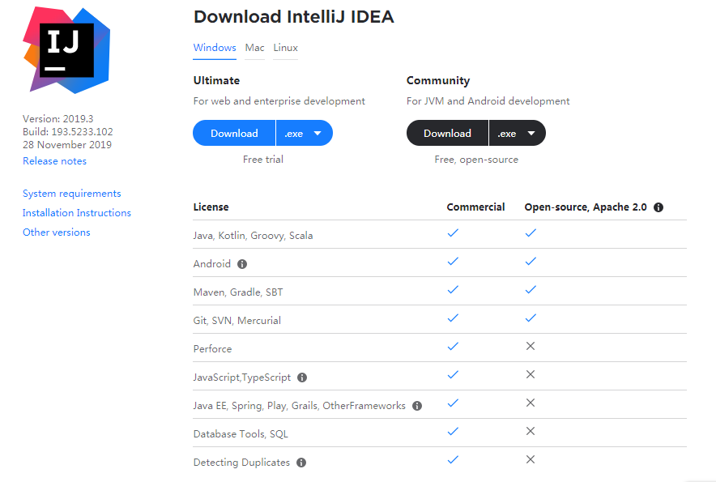

两个不同版本的详细对比，可以参照官网：
https://www.jetbrains.com/idea/features/editions_comparison_matrix.html

官网提供的详细使用文档：
https://www.jetbrains.com/help/idea/meet-intellij-idea.html

# 二、安装与卸载

## 1、安装前的准备

* 64位版本的windows10,8,7；
* 最少2G内存，建议8G内存以上；
* 安装需要2.5G硬盘，建议固态硬盘；
* 分辨率1024*768以上；


从安装上来看，IntelliJ IDEA 对硬件的要求似乎不是很高。可是实际在开发中其实并不是这样的，因为 IntelliJ IDEA 执行时会有大量的缓存、索引文件，所以如果你正在使用 Eclipse / MyEclipse，想通过 IntelliJ IDEA 来解决计算机的卡、慢等问题，这基本上是不可能的，本质上你应该对自己的硬件设备进行升级。

## 2、安装过程

1、双击

2、欢迎安装


3、是否删除电脑上低版本的IDEA

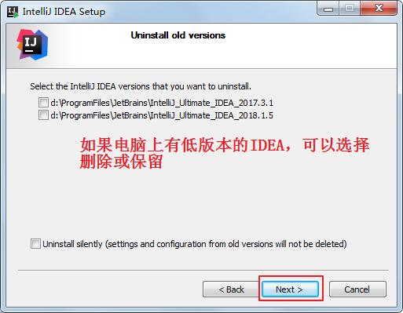

4、选择安装目录


5、确认操作系统类型

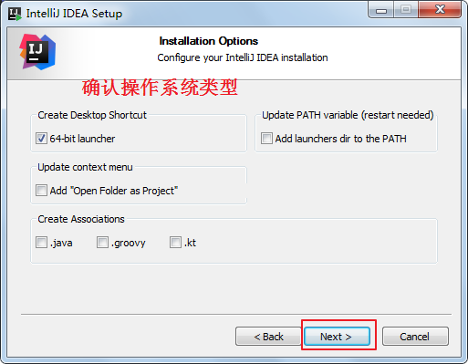

确认是否与.java、.groovy、.kt 格式文件进行关联，这里也可以选择不关联。

6、在【开始】菜单新建一个文件夹，来管理IDEA的相关内容


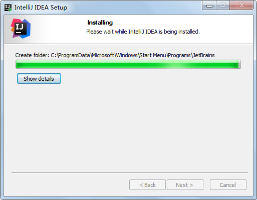

7、完成安装


## 3、卸载过程

### 方式一：【控制面板】中卸载

在【控制面板】找到【卸载程序】


双击IntelliJ IDEA 2019.2.3进行卸载：


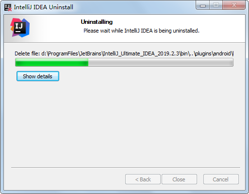


### 如何打开控制面板？

win10操作系统 在【搜索框】中输入【控制面板】就可以打开控制面板：


如果没有【搜索】图标的，可以这样显示出来：右键任务栏，在弹窗的菜单中选择【搜索】->显示搜索图标。


# 三、初始化配置与激活

1、双击

2、是否导入之前版本的配置


3、启动界面


4、选择UI界面的主题


这里根据个人喜好，进行选择，也可以选择跳过(skip all and set defaults)。后面在settings 里也可以再设置主题等。

5、激活


6、创建项目


7、创建Java项目


8、指定项目名称和代码存储目录


9、关闭提示


10、完成项目创建


# 四、HelloWorld

## 1、新建Java类

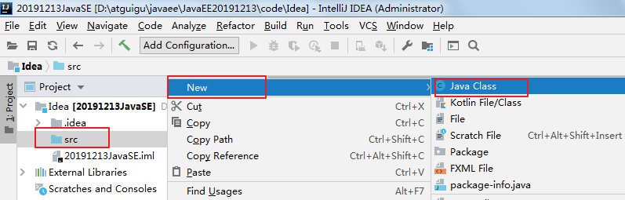

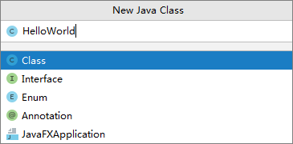

## 2、编写代码

```java
public class HelloWorld {
    public static void main(String[] args) {
        System.out.println("hello");
    }
}
```

## 3、运行


# 五、配置目录介绍

启动后会在C盘的用户目录下生成如下两个目录，例如：C:\Users\Irene\\.IntelliJIdea2019.2


这是 IDEA 的各种配置的保存目录。这个设置目录有一个特性，就是你删除掉整个目录之后，重新启动 IntelliJ IDEA 会再自动帮你生成一个全新的默认配置，所以很多时候如果你把 IntelliJ IDEA 配置改坏了，没关系，删掉该目录，一切都会还原到默认。

* config 目录是 IntelliJ IDEA 个性化化配置目录，或者说是整个 IDE 设置目录。此目录可看成是最重要的目录，没有之一，如果你还记得安装篇的介绍的时候，安装新版本的 IntelliJ IDEA 会自动扫描硬盘上的旧配置目录，指的就是该目录。这个目录主要记录了：IDE 主要配置功能、自定义的代码模板、自定义的文件模板、自定义的快捷键、Project 的 tasks 记录等等个性化的设置。
* system 目录是 IntelliJ IDEA 系统文件目录，是 IntelliJ IDEA 与开发项目一个桥梁目录，里面主要有：缓存、索引、容器文件输出等等，虽然不是最重要目录，但也是最不可或缺的目录之一。

# 六、详细配置

## 1、运行内存大小配置

找到IDEA安装目录的bin目录例如：D:\ProgramFiles\JetBrains\IntelliJ_IDEA_2019.2.3\bin，找到idea64.exe.vmoptions文件，用文本编辑器打开：


* 大家根据电脑系统的位数，选择 32 位的 VM 配置文件或者 64 位的 VM 配置文件
* 32 位操作系统内存不会超过 4G，所以没有多大空间可以调整，建议不用调整了
* 64 位操作系统中 8G 内存以下的机子或是静态页面开发者是无需修改的。
* 64 位操作系统且内存大于 8G 的，如果你是开发大型项目、Java 项目或是 Android 项目，建议进行修改，常修改的就是下面 3 个参数：

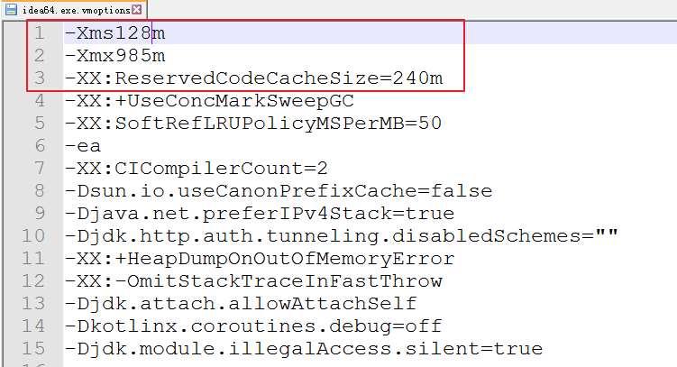

```properties
-Xms128m
  如果16 G 内存的机器可尝试设置为 -Xms512m(设置初始的内存数，增加该值可以提高 Java 程序的启动速度。)
-Xmx750m
   如果16 G 内存的机器可尝试设置为 -Xmx1500m(设置最大内存数，提高该值，可以减少内存 Garage 收集的频率，提高程序性能)
-XX:ReservedCodeCacheSize=240m
	如果16G 内存的机器可尝试设置为-XX:ReservedCodeCacheSize=500m(保留代码占用的内存容量)
```

## 2、如何打开详细配置界面

### （1）显示工具栏


### （2）选择详细配置菜单和按钮


## 3、默认启动项目配置


如果去掉Reopen last project on startup前面的对勾，每次启动IDEA就会出现如下界面：


## 4、设置整体主题

### （1）选择主题


### （2）设置菜单和窗口字体和大小


## 3、设置编辑器

### （1）编辑器主题


### （2）字体大小与颜色


更详细的字体与颜色如下：


### （3）显示行号与方法分隔符

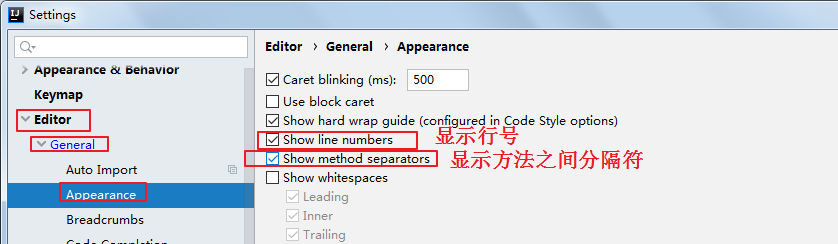

## 4、自动提示功能


IntelliJ IDEA 的代码提示和补充功能有一个特性：区分大小写。区分大小写的情况是这样的：比如我们在 Java 代码文件中输入 system，IntelliJ IDEA 默认是不会帮我们提示或是代码补充的，但是如果我们输入System 就可以进行代码提示和补充。 如果想不区分大小写的话，就把这个对勾去掉。

## 5、自动导包配置

* 默认需要自己手动导包，Alt+Enter快捷键


* 自动导包设置
  * 动态导入明确的包：Add unambiguous imports on the fly，该设置具有全局性；
  * 优化动态导入的包：Optimize imports on the fly，该设置只对当前项目有效；


## 6、设置编码

### （1）当前项目编码设置

方式一：File菜单-->Settings-->Editor-->File Encodings

方式二：工具类的详细配置按钮-->Editor-->File Encodings

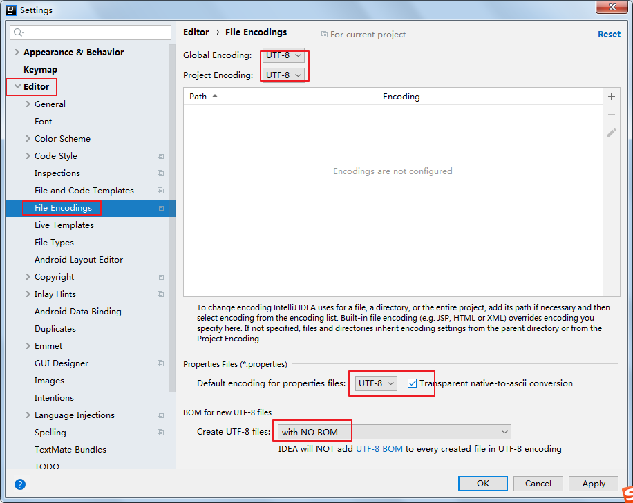

说明： Transparent native-to-ascii conversion主要用于转换ascii，一般都要勾选。

### （2）新建项目默认编码设置

方式一：File菜单-->Other Settings-->Settings for New Projects...-->Editor-->File Encodings

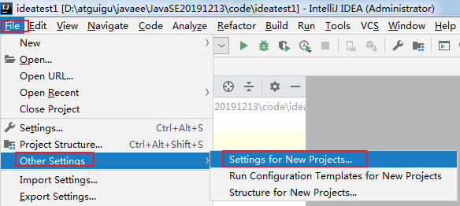

方式二：启动界面右下角有Config-->Settings-->Editor-->File Encodings


## 7、设置自动编译

方式一：File菜单-->Settings-->Build,Execution,Deployment-->Compiler

方式二：工具类的详细配置按钮-->Build,Execution,Deployment-->Compiler

注意：该项配置只针对当前项目有效。


## 8、取消自动更新


## 9、项目的JDK设置

方式一：File-->Project Structure...-->Platform Settings -->SDKs

方式二：工具栏-->-->Platform Settings -->SDKs

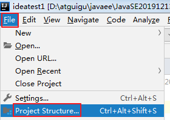

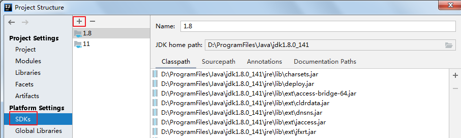

注：SDKs全称是Software Development Kit 

# 七、快捷键

## 1、软件通用的快捷键

* 保存：Ctrl + S
* 剪切：Ctrl + X
* 粘贴：Ctrl + V
* 复制：Ctrl + C
* 全选：Ctlr + A
* 撤销：Ctrl + Z

## 2、IDEA常用快捷键

### （1）提高代码编写速度

* 智能提示：Alt + 回车
* 自动代码
  * 自动补全函数括号、分号、当前行缩进：Ctrl + Shift + 回车
  * 提示代码模板：Ctrl + J
  * 使用xx块环绕：Ctrl + Alt + T
  * 自动生成构造器、get/set：Alt + Insert  （有的键盘需要同时按Fn键）
  * 由方法自动生成返回值变量：Ctrl + Alt + V
* 格式化代码：Ctrl + Alt + L
* 插入空行开始编辑
  * 在当前光标下一行插入空行开始编辑：Shift + 回车
  * 在当前光标上一行插入空行开始编辑：Ctrl+Alt+回车
* 移动代码
  * 向上移动代码：Ctrl+Shift + ↑  （整个方法移动）或  Alt + Shift + ↑（逐行移动）
  * 向下移动代码：Ctrl+Shift + ↓ （整个方法移动） 或  Alt + Shift + ↓（逐行移动）
* 复制行：Ctrl+D
* 删除行
  * Ctrl + Y
  * 不选中删除光标所在行：Ctrl + X
* 重命名类、变量、方法等：选择要重名的元素，按Shift + F6
* 抽取代码重构方法：Ctrl + Alt + M
* 查看所调用方法的形参列表提醒：Ctrl + P
* 重写或实现方法
  * 实现接口的方法：Ctrl + i
  * 重写父类的方法：Ctrl + O
* 注释
  * 单行注释：Ctrl + /
  * 多行注释：Ctrl + Shift + /

* 转大小写：Ctrl +Shift + U

### （2）移动光标定位

* 移动定位
  * 跳转到上一个/下一个位置编辑位置：Ctrl + Alt + 左/右键
  * 跳转到上一个/下一个方法位置： Alt + 上/下键
  * 打开的类文件之间切换： Alt + 左/右键
  * 定位某行：Ctrl + G
* 选择文本：Ctrl + W
  * 按一下选择单词，再按选择语句，再按选择行，再按选择方法

### （3）查找与查看源码

* 按住Ctrl键，单击某个类或方法就可以打开某个类或方法的源码
  * 但是当某个变量是通过多态引用调用父类或父接口的方法时，想要打开方法的实现类：Ctrl +Alt +B
* 查看方法文档：选中方法名后按Ctrl + Q
* 查看某个类的结构信息
  * 类的继承层次：Ctrl + H
  * 类的UML关系图：Ctrl + Alt + U
  * 当前文件结构：Ctrl + F12键
* 搜索
  * 搜索类：Ctrl + N
  * 全项目搜索文本：Ctrl + Shift + F
  * 全项目替换文本：Ctrl +Shift + R
  * 当前源文件查找文本：Ctrl + F
  * 当前源文件替换问题：Ctrl + R
  * 任何地方搜索：双击Shift

* 折叠与展开
  * 折叠方法实现：Ctrl + Shift +  -
  * 展开方法实现：Ctrl +Shift + +

### 3、查看和自定义快捷键

#### (1)已知快捷键操作，未知快捷键


#### (2)已知快捷键，不知道对应的操作名

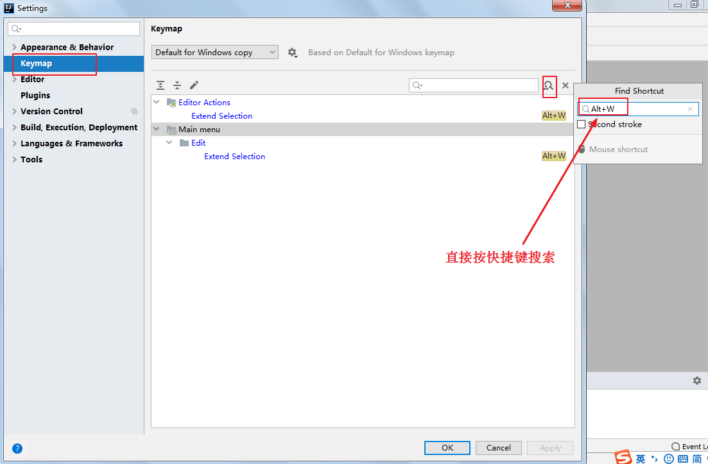

#### (3)自定义自己的快捷键

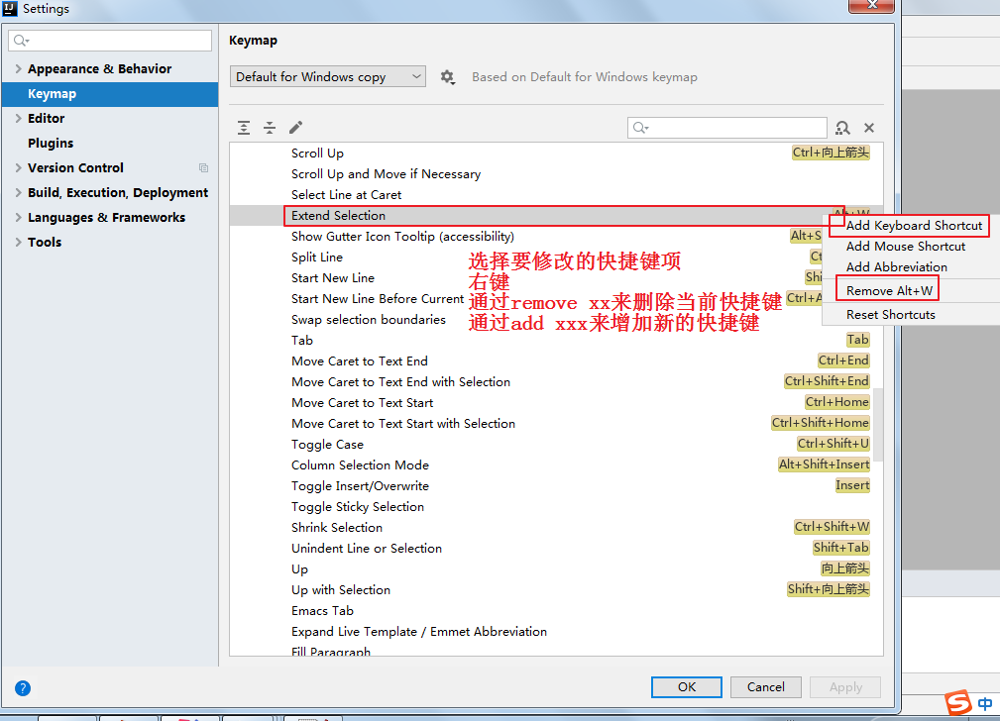

### 4、取消双击shift搜索

因为我们按shift切换中英文输入方式，经常被按到，总是弹出搜索框，太麻烦了。可以取消它。

双击shift 或 ctrl + shift + a，打开如下搜索窗口：


选择registry...，找到"ide.suppress.double.click.handler"，把复选框打上勾就可以取消双击shift出现搜索框了。


# 八、代码模板

## 1、常用快捷模板

* 主方法
  * psvm：public static void main(String[] args){}
  * main：public static void main(String[] args){}
* 输出语句
  * sout：System.out.println();
  * soutp：System.out.println("xxx :" + 方法形参);
  * soutm：System.out.println("xx类.当前方法名");
  * soutv：System.out.println("变量名 = " + 变量);
  * 变量.sout：System.out.println("变量名 = " + 变量);
* 非空判断
  * ifn：if(xx  == null)
  * inn：if(xx  != null)
  * 变量.null：if(变量 == null)
  * 变量.nn：if(变量 != null)
* 遍历
  * fori：for循环
  * itar：遍历数组
  * iter：foreach循环
* 静态常量声明
  * psf：public static final
  * prsf：private static final
* 常量声明：
  * psfi：public static final int
  * psfs：public static final String
* List集合遍历
  * list集合.for：foreach循环
  * list集合.fori：用for循环遍历list集合，正向遍历
  * list集合.forr：用for循环遍历list集合，逆向遍历

## 2、预定义模板

### （1）预定义Postfix Completion模板，不能修改


### （2）预定义Live Templates模板，可以修改


## 3、自定义模板

### （1）定义sop模板

#### ①在Live Templates中增加模板


#### ②先定义一个模板的组

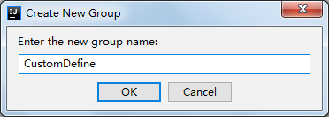

#### ③在模板组里新建模板

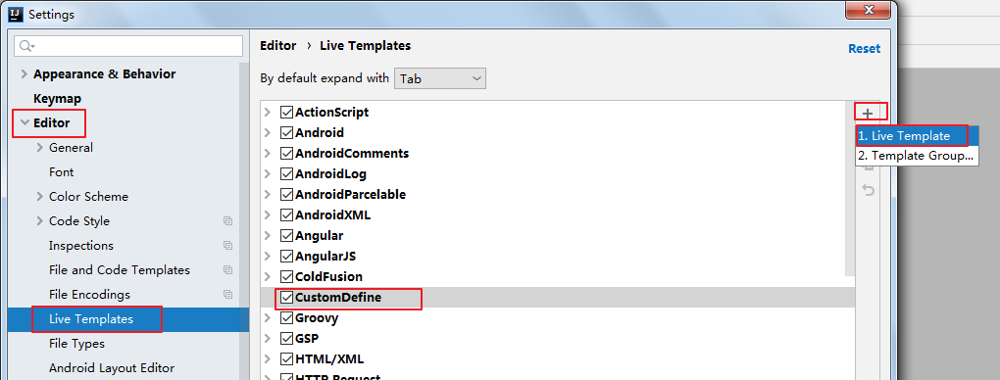

#### ④定义模板


* Abbreviation:模板的缩略名称
* Description:模板的描述
* Template text:模板的代码片段
* 应用范围。比如点击Define。选择如下：应用在java代码中。
* 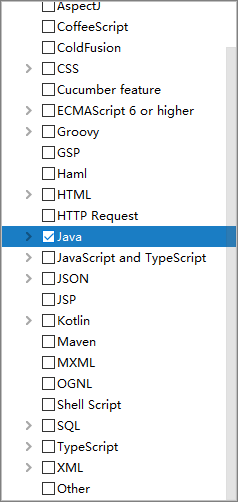

### （2）定义test测试方法模板

选中自定义的模板组，点击”+”（1.Live Template）来定义模板。

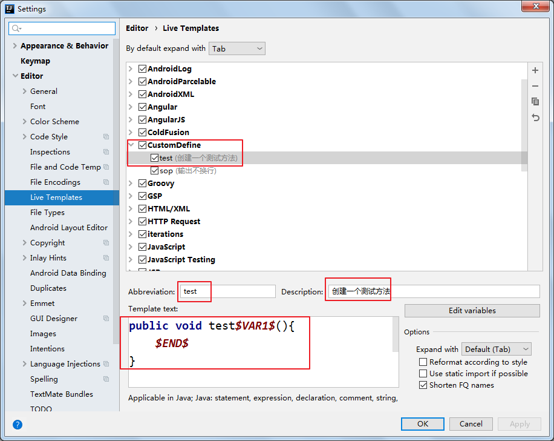


# 九、创建模块

在 IntelliJ IDEA 中，没有类似于 Eclipse 工作空间（Workspace）的概念，而是提出了Project和Module这两个概念。接下来，就让我们一起看看 IntelliJ IDEA 官方是如何描述两者的吧！对于 Project，IntelliJ IDEA 官方是这样介绍的：

A project is a top-level organizational unit for your development work in IntelliJ IDEA. In its finished form, a project may represent a complete software solution. A project is a collection of:

Your work results: source code, build scripts, configuration files, documentation, artifacts, etc.
SDKs and libraries that you use to develop, compile, run and test your code.
Project settings that represent your working preferences in the context of a project.
A project has one or more modules as its parts.

对于 Module，IntelliJ IDEA 官方是这样介绍的：

A module is a part of a project that you can compile, run, test and debug independently.
Modules are a way to reduce complexity of large projects while maintaining a common (project) configuration.
Modules are reusable: if necessary, a module can be included in more than one project.

通过上面的介绍，我们知道：在 IntelliJ IDEA 中Project是最顶级的结构单元，然后就是Module，一个Project可以有多个Module。目前，主流的大型项目结构基本都是多Module的结构，这类项目一般是按功能划分的，比如：user-core-module、user-facade-module和user-hessian-module等等，模块之间彼此可以相互依赖。通过这些Module的命名可以看出，它们都是处于同一个项目中的模块，彼此之间是有着不可分割的业务关系。因此，我们可以大致总结出：一个Project是由一个或多个Module组成，

* 当为单Module项目的时候，这个单独的Module实际上就是一个Project；
* 当为多Module项目的时候，多个模块处于同一个Project之中，此时彼此之间具有互相依赖的关联关系。
* 当然多个模块没有建立依赖关系的话，也可以作为单独一个“小项目”运行

此外， IntelliJ IDEA 的Project是一个不具备任何编码设置、构建等开发功能的概念，其主要作用就是起到一个项目定义、范围约束、规范类型的效果，或许，我们也可以简单地理解Project就是一个单纯的目录，只是这个目录在命名上必须有其代表性的意义。在缺省情况下，IntelliJ IDEA 是默认单Project单Module的，这时Project和Module合二为一，在没有修改存储路径的时候，显然Project对Module具有强约束作用！不过说实话，这里就是将Module的内容放在了Project的目录下，实际上还是Module自己约束自己。

## 1、创建模块

### （1）选择创建模块


### （2）选择模块类型

这里选择创建Java模块

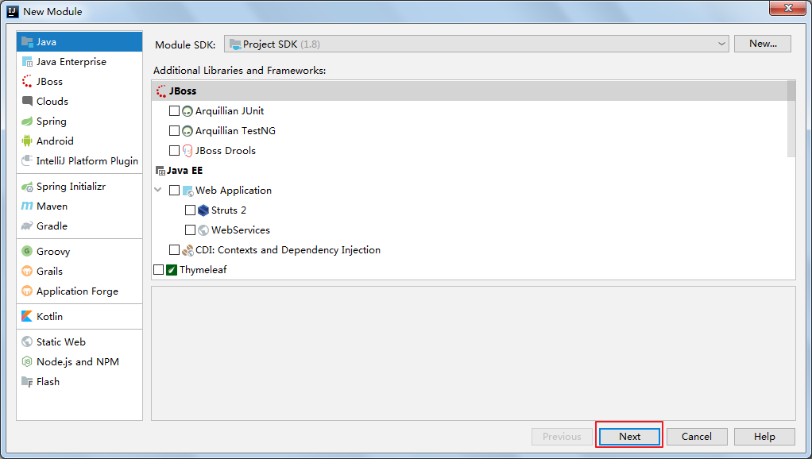

### （3）给模块命名


## 2、删除模块

### 方式一：先从模块设置中移除，然后delete

#### （1）先从模块设置中移除


#### （2）彻底删除模块


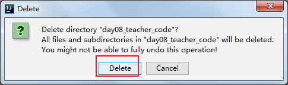

### 方式二：先从项目中remove后delete

#### （1）先从项目中remove


#### （2）彻底删除模块


## 3、模块依赖

一个模块可以理解为相当于一个独立的小项目，但是它又区别于独立的项目，因为它们同属于一个工程，而且互相之间可以相互依赖，即一个模块可以使用另一个模块的类型。

### 整个模块依赖

例如：在day16_teacher_code模块中需要使用day15_teacher_code模块中的所有公共类，例如：Student类，可以通过如下操作。

在Student stu = new Student();行按Alt +Enter，根据提示，点击Add dependency on module 'day15_teacher_code'。


如上操作会在day16_teacher_code.iml文件中增加如下代码，表示依赖于day15_teacher_code模块。此时day15_teacher_code模块下所有公共的类在day16_teacher_code模块下都可以使用了。


### 模块部分包依赖（了解）

例如：在day18_teacher_code模块中需要使用day17_teacher_code模块中的com.atguigu.bean包中的公共类，而不是该模块下所有的公共类。因为我们面向对象的开发原则中有一个迪米特法则（Only talk to your immediate friends，翻译过来就是：只与直接的朋友通信）。那么，我们可以通过如下操作进行：

注意：以下操作仅限于Java9以及以上版本，Java8不支持。

单击工具栏的打开项目设置


（1）先在day17_teacher_code模块暴露需要暴露的包

第一步：在day17_teacher_code模块的src下建立module-info.java文件


第二步在module-info.java文件加如下代码：

```java
module day17.teacher.code {
    exports com.atguigu.bean;
}
```

（2）在day18_teacher_code模块中依赖需要依赖的包

第一步在day18_teacher_code模块的src下建立module-info.java文件，

第二步在module-info.java文件增加如下代码：

```
module day18.teacher.code {
    requires day17.teacher.code;
}
```

（3）添加模块依赖

例如：在day18_teacher_code模块的TestStudent类中使用day17_teacher_code模块的bean包下的Student类，按Alt + Enter，提示添加依赖的模块。


发现在day18_teacher_code模块的day18_teacher_code.iml文件增加一句代码：

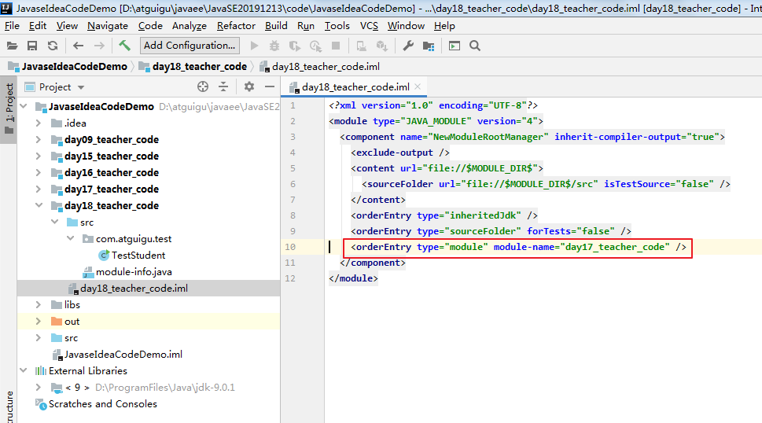

# 十、Debug调试

## 1、启动Debug

在所有调试中，调试一个Java程序是最简单的，主要有设置断点、启动调试、单步执行、结束调试几步。

1）设置断点：在源代码文件中，在想要设置断点的代码行的前面的标记行处，单击鼠标左键就可以设置断点，在相同位置再次单击即可取消断点。


2）启动调试：IDEA提供多种方式来启动程序(Launch)的调试，分别是通过菜单(Run –> Debug)、图标(“绿色臭虫”等等


## 2、单步调试工具介绍


或


：Step Over（F8）：进入下一步，如果当前行断点是调用一个方法，则不进入当前方法体内

：Step Into（F7）：进入下一步，如果当前行断点是调用一个自定义方法，则进入该方法体内

：Force Step Into（Alt +Shift  + F7）：进入下一步，如果当前行断点是调用一个核心类库方法，则进入该方法体内

：Step Out（Shift  + F8）：跳出当前方法体

：Run to Cursor（Alt + F9）：直接跳到下一个断点处继续调试

：Resume Program（F9）：恢复程序运行，但如果该断点下面代码还有断点则停在下一个断点上

：Stop（Ctrl + F2）：结束调试

：View Breakpoints（Ctrl + Shift  + F8）：查看所有断点

：Mute Breakpoints：使得当前代码后面所有的断点失效， 一下执行到底 

## 3、自定义调试数据视图


# 十一、生成javadoc


# 十二、使用第三方框架和组件

## 1、JUnit

### 方式一：指定Marven仓库

在@Test后面按Alt + 回车，选择Add 'JUnit4' to classpath即可


添加完成之后，在External Libraries中可以见到JUnit：

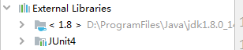

#### JUnit4 was not loaded问题

**注意：如果Maven的本地仓库（例如：C:\Users\Irene\\.m2）中没有对应的library则需要联网从Maven的中央仓库中下载或从其他人那里拷贝对应的库。**否则会报错：


查看Maven的本地仓库（例如：C:\Users\Irene\\.m2）中是否有对应的library。


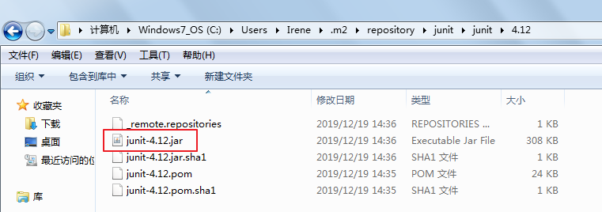


### 方式二：指定本地jar目录

如果目前无法联网，也无法拷贝对应maven仓库目录，但是你有JUnit的需要的jar包，那么也可以用如下方式指定：

（1）将JUnit框架需要用到的jar包拷贝到当前项目（或模块）的libs目录中（没有libs目录的可以手动创建）


然后在项目代码中就可以使用JUnit了。

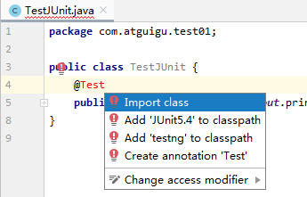

#### 如果此时其他模块也想使用刚才添加的library怎么办？

例如：新的模块day09_teacher_code中想要使用刚才的JUnit的library，可以单击工具栏的打开项目设置:

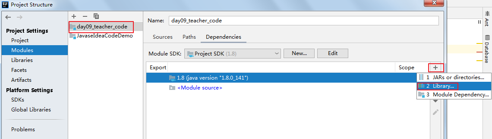


**注意Scope：选择Complie，否则编译时，无法使用JUnit。**

查看day09_teacher_code模块的配置文件day09_teacher_code.iml，发现多了一句配置。


现在day09_teacher_code模块中也可以使用JUnit了：

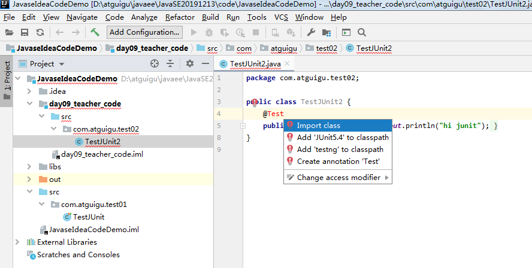

## 2、在JDBC中使用mysql的驱动

当Java代码中使用了mysql的驱动类，而在项目和模块中又没有引入mysql的驱动jar时，代码运行时会报错的：


将提前下载的mysql驱动jar拷贝到当前项目（或模块）的libs目录中（没有libs目录的可以手动创建）。


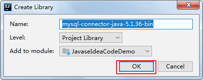

可以单击工具栏的打开项目设置


发现在day29_teacher_code模块的配置文件day29_teacher_code.iml中增加了如下一句代码：


# 十三、设置执行JUnit用例时支持控制台输入

Help菜单-->Edit Custom VM Options...，在最后加入如下参数，然后重启IDEA。

```properties
-Deditable.java.test.console=true
```


# 十四、导入模块

当想要在当前项目中导入一个已存在的模块时，可以进行如下操作：

（1）将要导入的模块


拷贝到项目目录中：


（2）在项目的modules.xml文件中加入如下配置即可


（3）注意：如果新导入的模块中有依赖相应的库，必须确保对应的库在项目中能找到，否则会报错


（4）注意：如果新导入的模块对其他模块有依赖，那么被依赖的模块也得导入

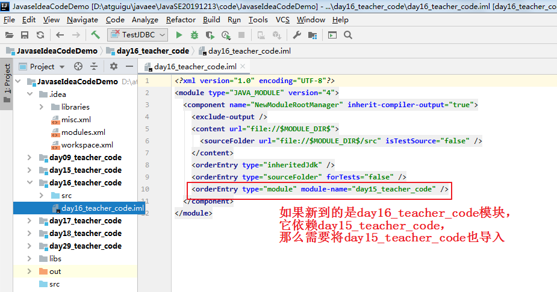


# 十五、缓存和索引的清理

IntelliJ IDEA 首次加载项目的时候，都会创建索引，而创建索引的时间跟项目的文件多少成正比。

在 IntelliJ IDEA 创建索引过程中即使你编辑了代码也是编译不了、运行不起来的，所以还是安安静静等 IntelliJ IDEA 创建索引完成。

IntelliJ IDEA 的缓存和索引主要是用来加快文件查询，从而加快各种查找、代码提示等操作的速度，所以 IntelliJ IDEA 的索引的重要性再强调一次也不为过。

但是，IntelliJ IDEA 的索引和缓存并不是一直会良好地支持 IntelliJ IDEA 的，某些特殊条件下，IntelliJ IDEA 的缓存和索引文件也是会损坏的，比如：断电、蓝屏引起的强制关机，当你重新打开 IntelliJ IDEA，很可能 IntelliJ IDEA 会报各种莫名其妙错误，甚至项目打不开，IntelliJ IDEA 主题还原成默认状态。即使没有断电、蓝屏，也会有莫名奇怪的问题的时候，也很有可能是 IntelliJ IDEA 缓存和索引出现了问题，这种情况还不少。遇到此类问题也不用过多担心。我们可以清理缓存和索引。如下：


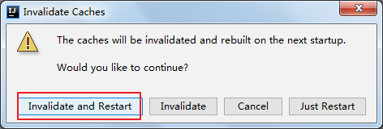

* 一般建议点击 Invalidate and Restart，这样会比较干净。
* 上图警告：清除索引和缓存会使得 IntelliJ IDEA 的 Local History 丢失。**所以如果你项目没有加入到版本控制，那你最好备份下你的 LocalHistory 目录**。LocalHistory 目录在用户目录下，例如：C:\Users\Irene\.IntelliJIdea2019.2\system。
* 通过上面方式清除缓存、索引本质也就是去删除 C 盘下的 system 目录下的对应的文件而已，所以如果你不用上述方法也可以手动删除整个 system。当 IntelliJ IDEA 再次启动项目的时候会重新创建新的 system 目录以及对应项目缓存和索引。


# 十六、导出jar

（1）单击工具栏的打开项目设置。

（2）选择Artifacts（打包部署），选择添加jar。


（3）给导出的jar命名，确认导出的路径

（4）确认创建或选择已有的Manifest.MF文件。单词“manifest”的意思是“显示” 。 这个 manifest 文件定义了与扩展和包相关的数据。

说明： 打开Java的JAR文件我们经常可以看到文件中包含着一个META-INF目录，这个目录下会有一些文件，其中必有一个MANIFEST.MF，这个文件描述了该Jar文件的很多信息 


（5） 选择Manifest.MF文件存储目录。


 （6）如果需要可以填写jar的运行入口，main所在的类的全名称。（可选）


（7）选择jar要包含的.class文件的目录，即哪些模块的out目录

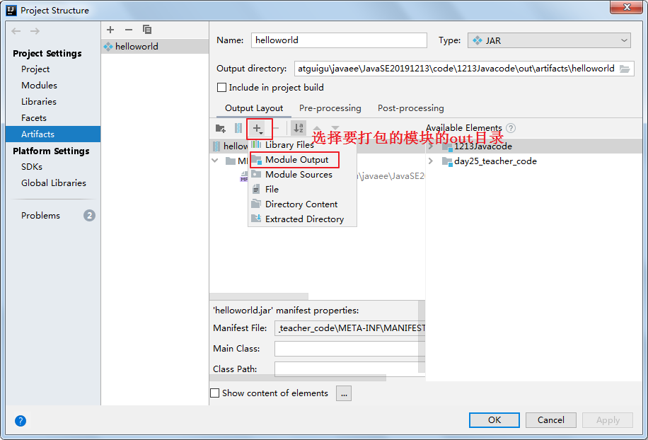


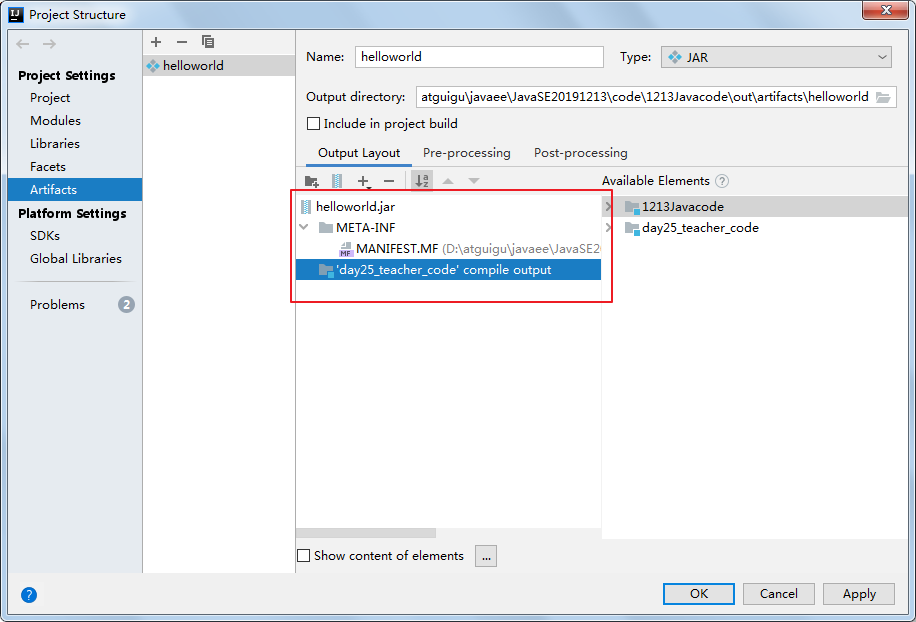

（8）编译生成jar


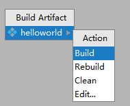


（9）查看生成的jar


