# 一、新建动态web项目

## 1、新建项目

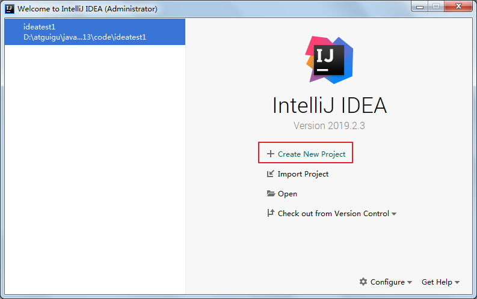

## 2、选择创建动态web项目

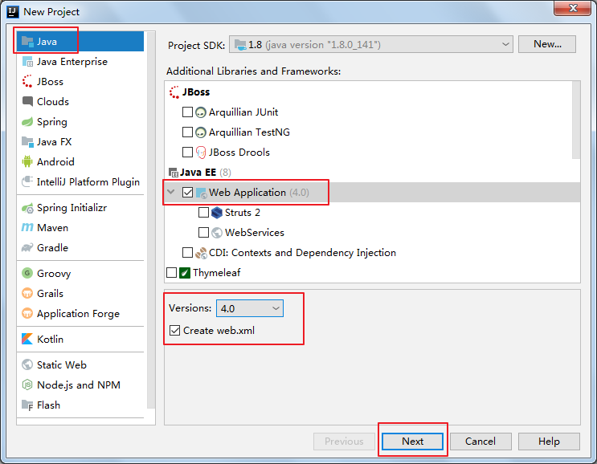

## 3、项目命名

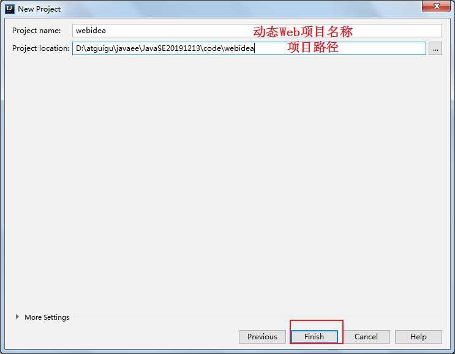

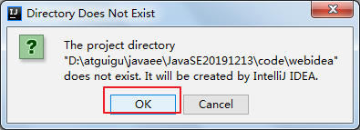

## 4、编辑index.jsp

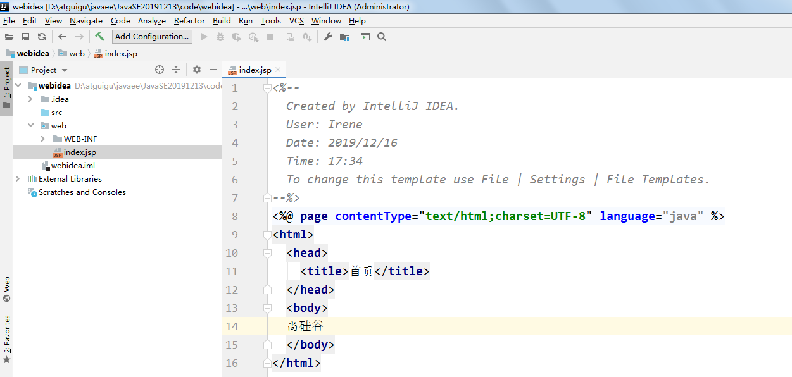

# 二、配置Tomcat

## 1、新增tomcat服务器配置

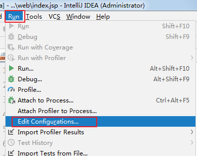

## 2、选择服务器类型

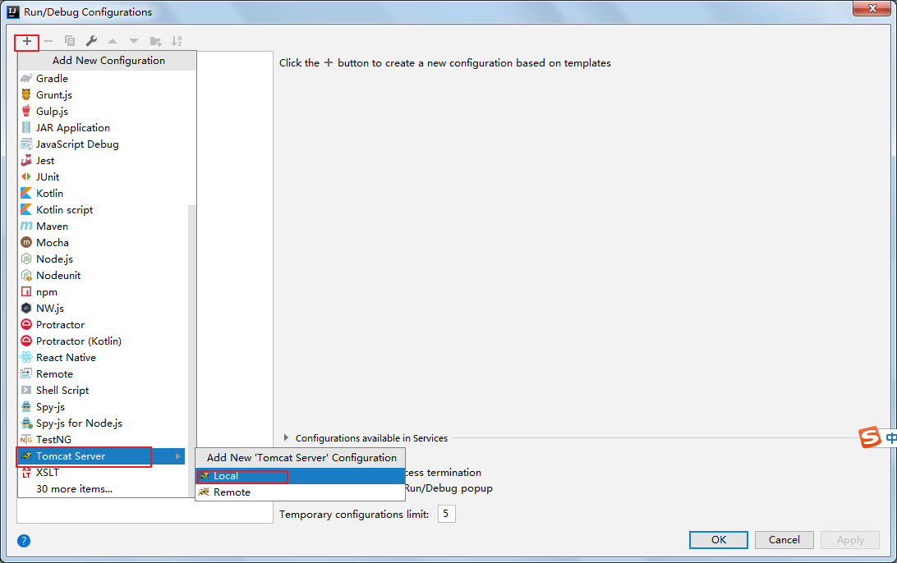

## 3、配置服务器参数

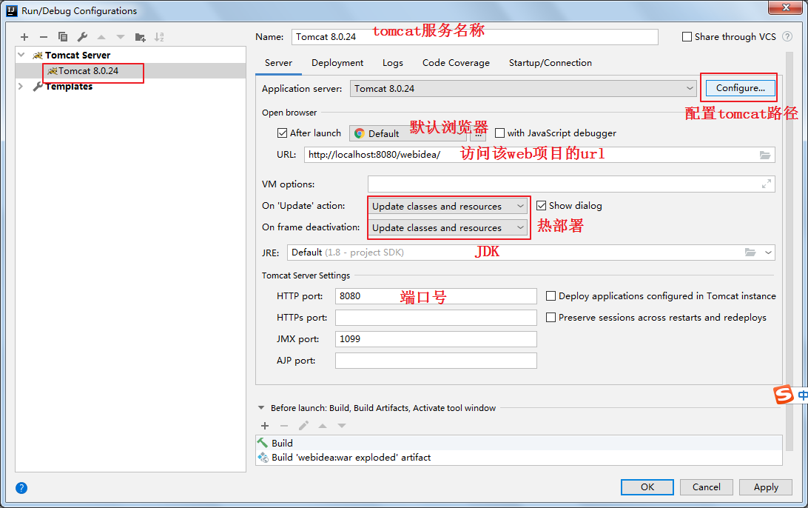

## 4、部署项目

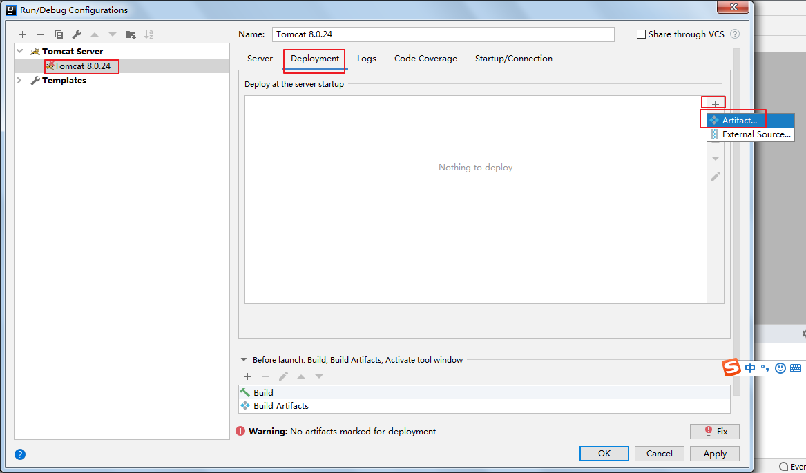

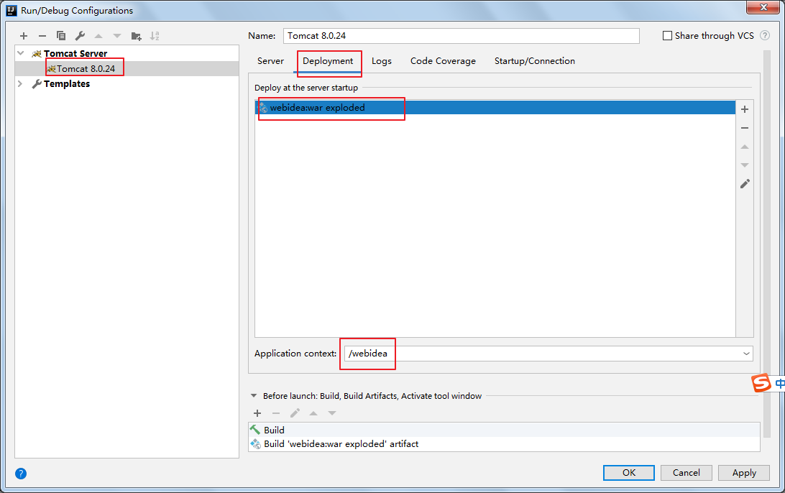

## 5、完成配置

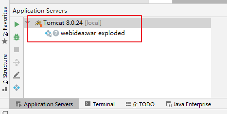

## 6、启动运行

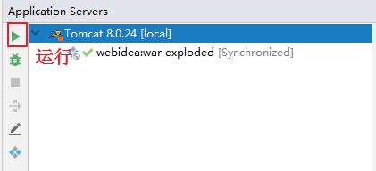

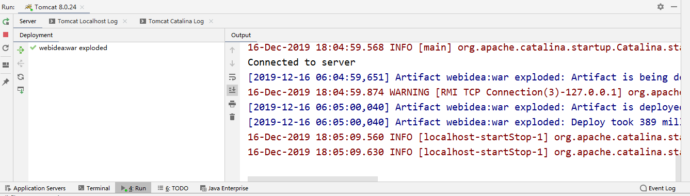

## 7、访问web项目

在浏览器地址栏输入： http://localhost:8080/webidea/ 

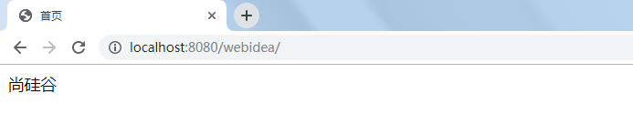

# 三、tomcat启动报程序包javax.servlet.http不存在

单击工具栏按钮

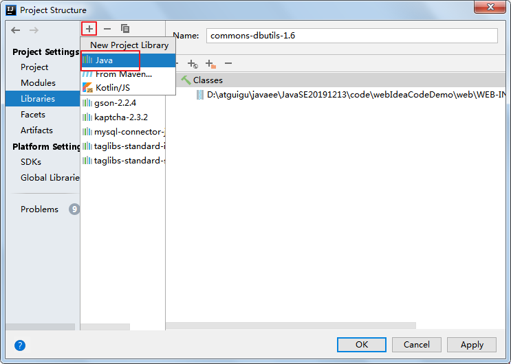

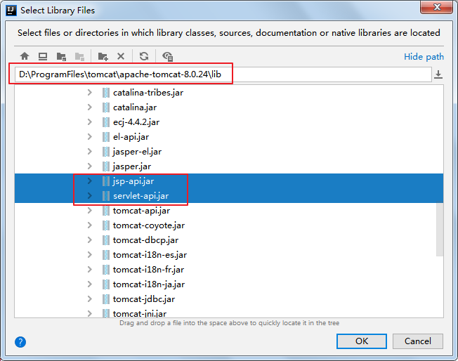

# 四、tomcat控制台乱码问题

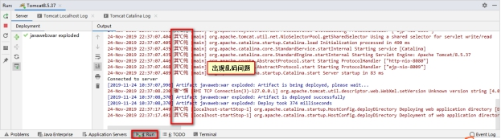

1、 点击Help => Edit custom VM Options，在最后面添加 “-Dfile.encoding=UTF-8”

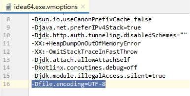

2、点击Run菜单的 Edit Configurations，在tomcat配置中的 VM option中添加 “-Dfile.encoding=UTF-8”

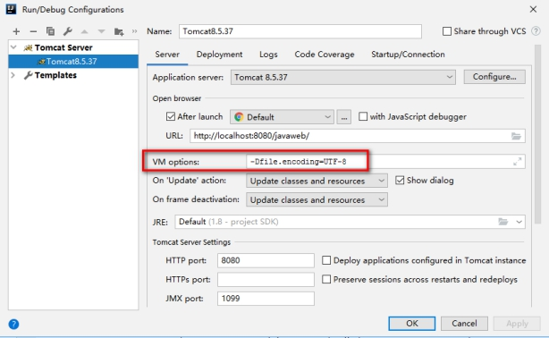

3、在第二步的Startup/Connection页签的Run和Debug添加一个key为JAVA_TOOL_OPTIONS， value为-Dfile.encoding=UTF-8的环境变量

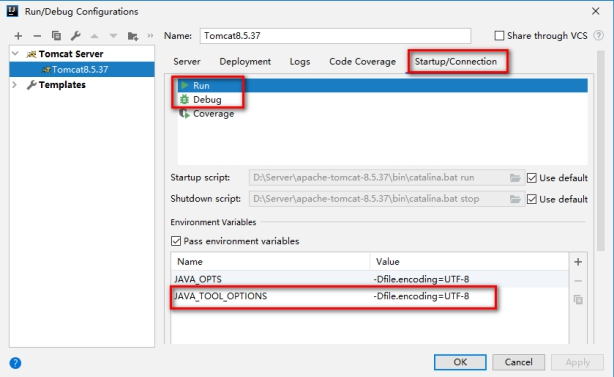

4、保存后重启idea，可以发现控制台中文乱码显示正常了

