# 一、连接数据库

## 1、连接mysql

## 2、连接参数配置

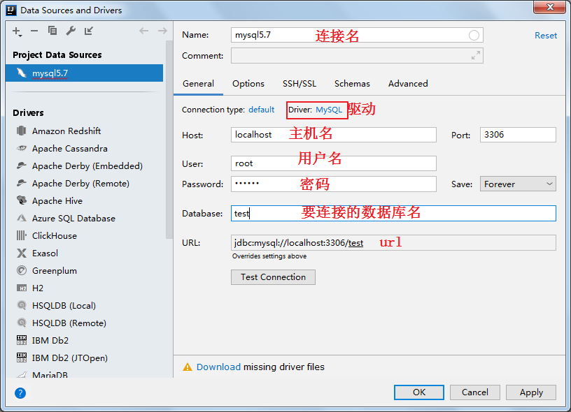

## 3、配置驱动

如果没有配置驱动，将会报如下错误

### 从maven仓库下载：要求联网

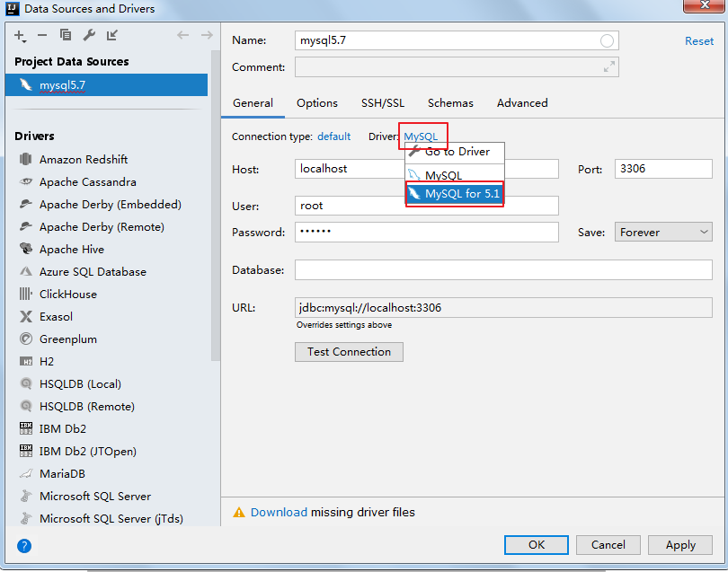

### 将提前下载好的jar放到本地目录

将提前准备好的mysql驱动jar包，放到Idea配置路径中：C:\Users\Irene\.IntelliJIdea2019.2\config\jdbc-drivers

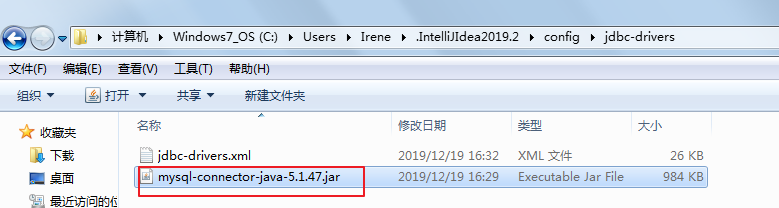

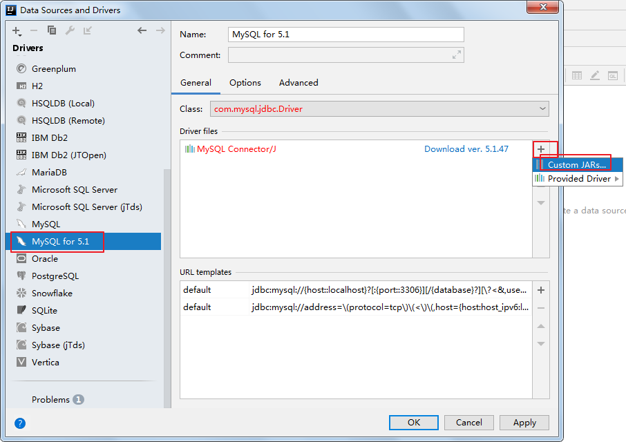

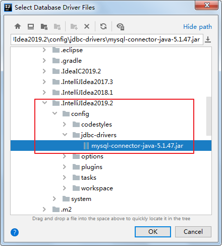

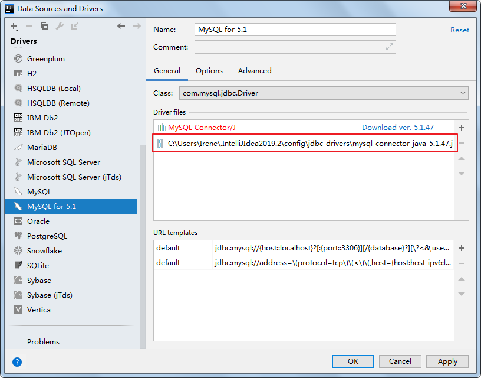

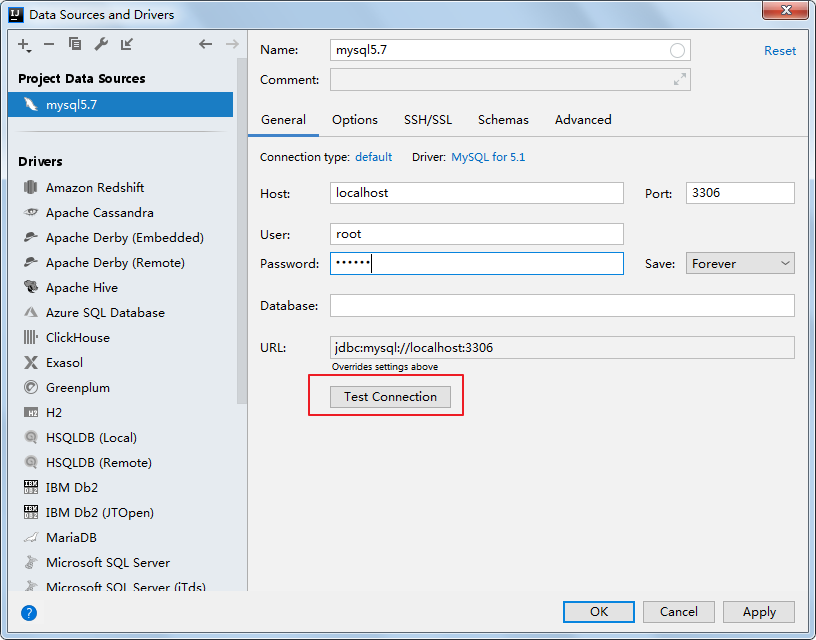

## 4、完成

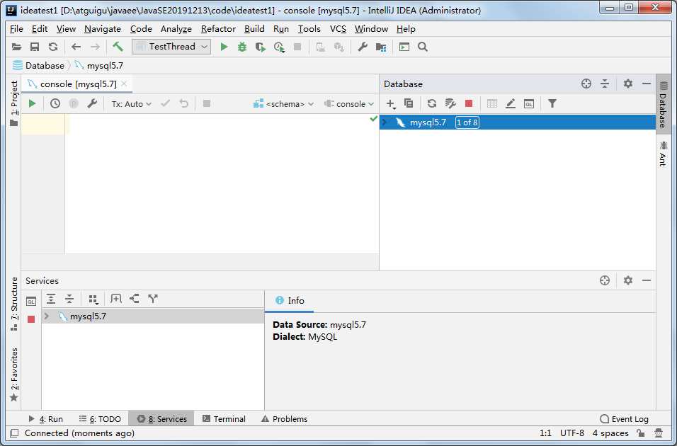

# 二、执行sql

## 1、选择要操作的数据库

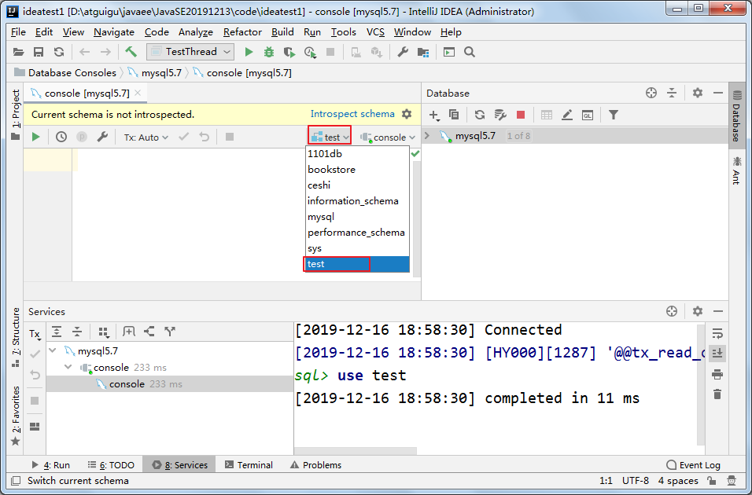

## 2、执行sql

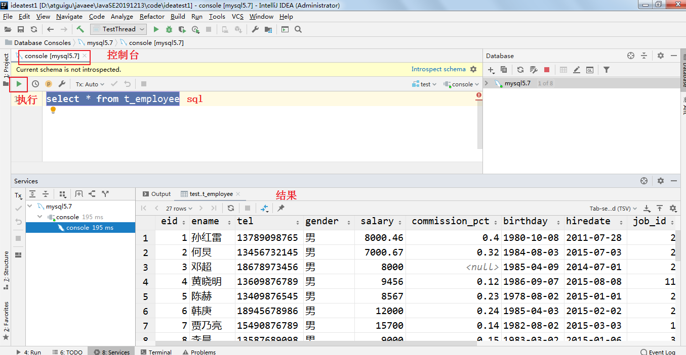

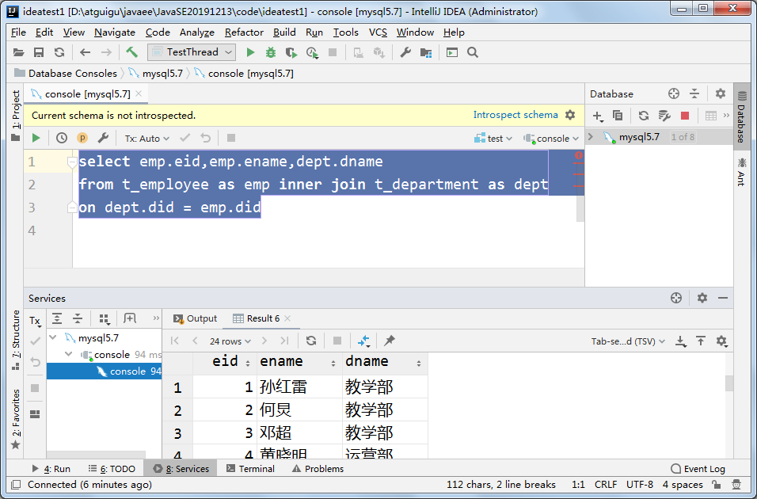

# 三、问题

## 1、可能因为时区问题连接不上

解决办法：手动增加高级参数 serverTimezone=Asia/Shanghai

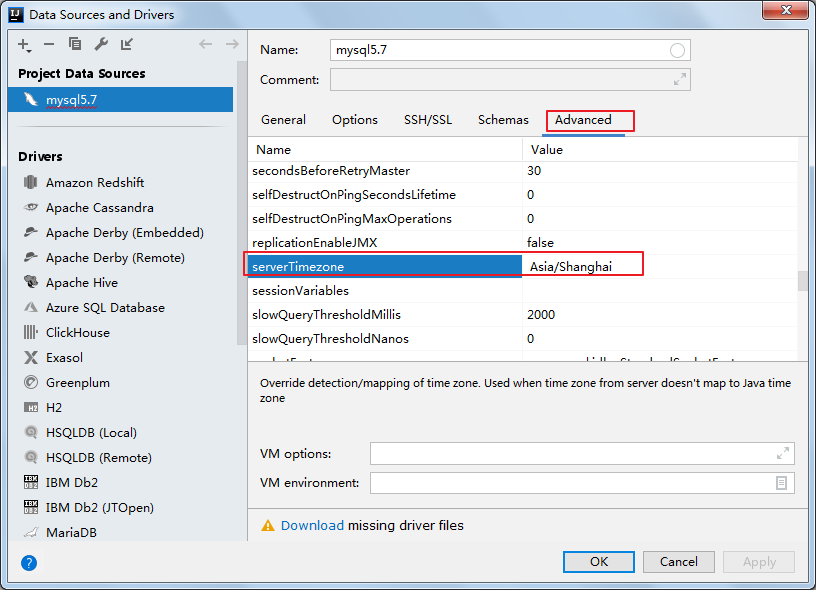