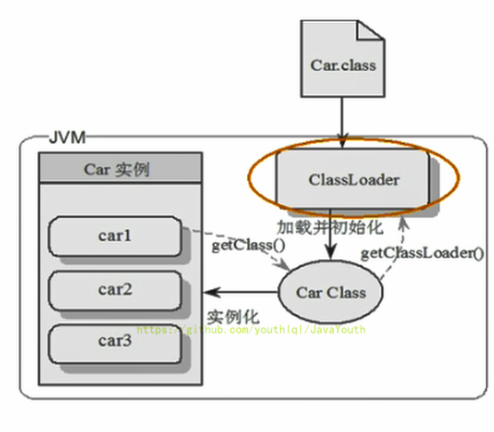
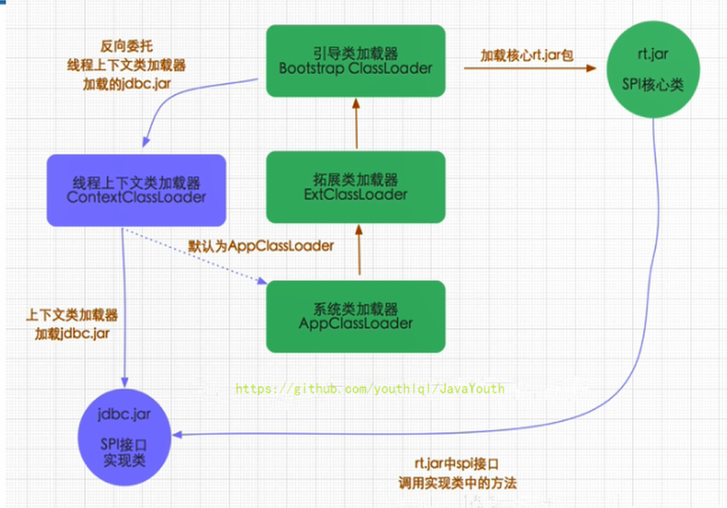
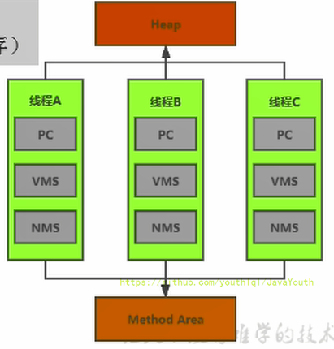
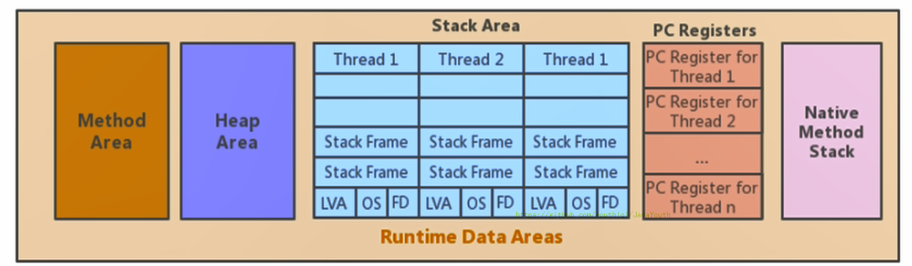
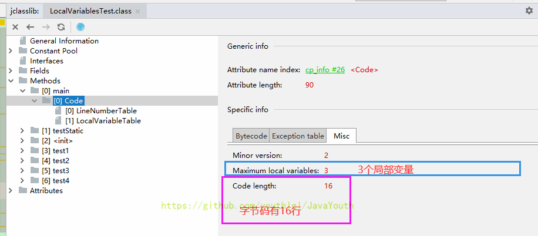
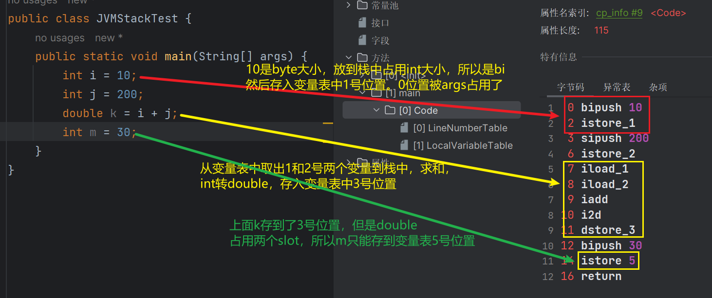

## 参考

> JVM成神之路：https://juejin.cn/post/7094121178373029895

## JVM架构模型

JVM采用的是基于栈的指令集，编译后的指令数更多，但是更容易跨平台。

**基于栈的指令集**：

1. 设计和实现更简单，适用于资源受限的系统
2. 避开了寄存器的分配难题：使用零地址指令方式分配
3. 指令流中的指令大部分是零地址指令，其执行过程依赖于操作栈。指令集更小，编译器容易实现
4. 不需要硬件支持，可移植性更好，更好实现跨平台

**基于寄存器架构的特点：**

1. 典型的应用是x86的二进制指令集：比如传统的PC以及Android的Davlik虚拟机。
2. 指令集架构则完全依赖硬件，与硬件的耦合度高，可移植性差
3. 性能优秀和执行更高效
4. 花费更少的指令去完成一项操作
5. 在大部分情况下，基于寄存器架构的指令集往往都以一地址指令、二地址指令和三地址指令为主，而基于栈式架构的指令集却是以零地址指令为主

```java
public class StackStructTest {
    public static void main(String[] args) {
        //Java编译后指令集是基于栈的指令集，和c语言那种基于寄存器的不同
        int i = 1;
        int j = 2;
        int k = i + j;
    }
}

```

编译上面的 Java 文件，然后使用`javap -v StackStructTest.class `反编译，输出：

```
0: iconst_1
1: istore_1
2: iconst_2
3: istore_2
4: iload_1
5: iload_2
6: iadd
7: istore_3
8: return
```

如果是C语言，编译后类似：

```
mov eax 1
add eax 2
```

## 类加载子系统


注意：方法区只有HotSpot虚拟机有，J9，JRockit都没有。

**类加载器子系统作用：**

1. 类加载器子系统负责从文件系统或者网络中加载Class文件，class文件在文件开头有特定的文件标识。
2. ClassLoader只负责class文件的加载，至于它是否可以运行，则由Execution Engine决定。
3. **加载的类信息存放于一块称为方法区的内存空间**。除了类的信息外，方法区中还会存放运行时常量池信息，可能还包括字符串字面量和数字常量（这部分常量信息是Class文件中常量池部分的内存映射）

**类加载器ClassLoader角色**

1. class file（在下图中就是Car.class文件）存在于本地硬盘上，可以理解为设计师画在纸上的模板，而最终这个模板在执行的时候是要加载到JVM当中来根据这个文件实例化出n个一模一样的实例。
2. class file加载到JVM中，被称为DNA元数据模板（在下图中就是内存中的Car Class），放在方法区。
3. 在.class文件–>JVM–>最终成为元数据模板，此过程就要一个运输工具（类装载器Class Loader），扮演一个快递员的角色。



### 过程

**加载阶段**

加载：

1. 通过一个类的全限定名获取定义此类的二进制字节流
2. 将这个字节流所代表的静态存储结构转化为方法区（永久代、元空间）的运行时数据结构
3. **在内存中生成一个代表这个类的java.lang.Class对象**，作为方法区这个类的各种数据的访问入口

加载class文件的方式：

1. 从本地系统中直接加载
2. 通过网络获取，典型场景：Web Applet
3. 从zip压缩包中读取，成为日后jar、war格式的基础
4. 运行时计算生成，使用最多的是：动态代理技术
5. 由其他文件生成，典型场景：JSP应用从专有数据库中提取.class文件，比较少见
6. 从加密文件中获取，典型的防Class文件被反编译的保护措施

**链接阶段**

链接分为三个子阶段：验证 -> 准备 -> 解析

验证

1. 目的在于确保Class文件的字节流中包含信息符合当前虚拟机要求，保证被加载类的正确性，不会危害虚拟机自身安全
2. 主要包括四种验证，文件格式验证，元数据验证，字节码验证，符号引用验证。

准备

1. 为类变量（static变量）分配内存并且设置该类变量的默认初始值，即零值
2. 这里不包含用final修饰的static，因为final在编译的时候就会分配好了默认值，准备阶段会显式初始化
3. 注意：这里不会为实例变量分配初始化，类变量会分配在方法区中，而实例变量是会随着对象一起分配到Java堆中

解析

1. **将常量池内的符号引用转换为直接引用的过程**
2. 事实上，解析操作往往会伴随着JVM在执行完初始化之后再执行
3. 符号引用就是一组符号来描述所引用的目标。符号引用的字面量形式明确定义在《java虚拟机规范》的class文件格式中。直接引用就是直接指向目标的指针、相对偏移量或一个间接定位到目标的句柄
4. 解析动作主要针对类或接口、字段、类方法、接口方法、方法类型等。对应常量池中的CONSTANT Class info、CONSTANT Fieldref info、CONSTANT Methodref info等

**初始化阶段**

类的初始化时机

1. 创建类的实例
2. 访问某个类或接口的静态变量，或者对该静态变量赋值
3. 调用类的静态方法
4. 反射（比如：Class.forName(“com.atguigu.Test”)）
5. 初始化一个类的子类
6. Java虚拟机启动时被标明为启动类的类
7. JDK7开始提供的动态语言支持：java.lang.invoke.MethodHandle实例的解析结果REF_getStatic、REF putStatic、REF_invokeStatic句柄对应的类没有初始化，则初始化

除了以上七种情况，其他使用Java类的方式都被看作是对类的被动使用，都不会导致类的初始化，即不会执行初始化阶段（不会调用 clinit() 方法和 init() 方法）

clinit()

1. 初始化阶段就是执行类构造器方法`<clinit>()`的过程
2. 此方法不需定义，是javac编译器自动收集类中的所有**类变量**的赋值动作和静态代码块中的语句合并而来。也就是说，当我们代码中包含static变量的时候，就会有clinit方法
3. `<clinit>()`方法中的指令按语句在源文件中出现的顺序执行
4. `<clinit>()`不同于类的构造器。（关联：构造器是虚拟机视角下的`<init>()`）
5. 若该类具有父类，JVM会保证子类的`<clinit>()`执行前，父类的`<clinit>()`已经执行完毕
6. 虚拟机必须保证一个类的`<clinit>()`方法在多线程下被同步加锁

> IDEA 中安装 JClassLib Bytecode viewer 插件，可以很方便的看字节码

### 类加载器的分类

1. JVM严格来讲支持两种类型的类加载器 。分别为引导类加载器（Bootstrap ClassLoader）和自定义类加载器（User-Defined ClassLoader）
2. 从概念上来讲，自定义类加载器一般指的是程序中由开发人员自定义的一类类加载器，但是Java虚拟机规范却没有这么定义，而是**将所有派生于抽象类ClassLoader的类加载器都划分为自定义类加载器**
3. 无论类加载器的类型如何划分，在程序中我们最常见的类加载器始终只有3个，如下所示


```java
public class ClassLoaderTest {
    public static void main(String[] args) {

        //获取系统类加载器
        ClassLoader systemClassLoader = ClassLoader.getSystemClassLoader();
        System.out.println(systemClassLoader);//sun.misc.Launcher$AppClassLoader@18b4aac2

        //获取其上层：扩展类加载器
        ClassLoader extClassLoader = systemClassLoader.getParent();
        System.out.println(extClassLoader);//sun.misc.Launcher$ExtClassLoader@1540e19d

        //获取其上层：获取不到引导类加载器
        ClassLoader bootstrapClassLoader = extClassLoader.getParent();
        System.out.println(bootstrapClassLoader);//null

        //对于用户自定义类来说：默认使用系统类加载器进行加载
        ClassLoader classLoader = ClassLoaderTest.class.getClassLoader();
        System.out.println(classLoader);//sun.misc.Launcher$AppClassLoader@18b4aac2

        //String类使用引导类加载器进行加载的。---> Java的核心类库都是使用引导类加载器进行加载的。
        ClassLoader classLoader1 = String.class.getClassLoader();
        System.out.println(classLoader1);//null
    }
}
```

- 我们尝试获取引导类加载器，获取到的值为 null ，这并不代表引导类加载器不存在，**而是因为引导类加载器是C语言写的**
- 两次获取系统类加载器的值都相同：sun.misc.Launcher$AppClassLoader@18b4aac2 ，这说明**系统类加载器是全局唯一的**

虚拟机自带的加载器

启动类加载器（引导类加载器，Bootstrap ClassLoader）

1. 这个类加载使用C/C++语言实现的，嵌套在JVM内部
2. 它用来加载Java的核心库（JAVA_HOME/jre/lib/rt.jar、resources.jar或sun.boot.class.path路径下的内容），用于提供JVM自身需要的类
3. 并不继承自java.lang.ClassLoader，没有父加载器
4. 加载扩展类和应用程序类加载器，并作为他们的父类加载器
5. 出于安全考虑，Bootstrap启动类加载器只加载包名为java、javax、sun等开头的类

扩展类加载器（Extension ClassLoader）

1. Java语言编写，由sun.misc.Launcher$ExtClassLoader实现
2. 派生于ClassLoader类
3. 父类加载器为启动类加载器
4. 从java.ext.dirs系统属性所指定的目录中加载类库，或从JDK的安装目录的jre/lib/ext子目录（扩展目录）下加载类库。如果用户创建的JAR放在此目录下，也会自动由扩展类加载器加载

系统类加载器（也称为应用程序类加载器，AppClassLoader）

1. Java语言编写，由sun.misc.LaunchersAppClassLoader实现
2. 派生于ClassLoader类
3. 父类加载器为扩展类加载器
4. 它负责加载环境变量classpath或系统属性java.class.path指定路径下的类库
5. 该类加载是程序中默认的类加载器，一般来说，Java应用的类都是由它来完成加载
6. 通过classLoader.getSystemclassLoader()方法可以获取到该类加载器

```java
public class ClassLoaderTest1 {
    public static void main(String[] args) {
        System.out.println("**********启动类加载器**************");
        //获取BootstrapClassLoader能够加载的api的路径
        URL[] urLs = sun.misc.Launcher.getBootstrapClassPath().getURLs();
        for (URL element : urLs) {
            System.out.println(element.toExternalForm());
        }
        //从上面的路径中随意选择一个类,来看看他的类加载器是什么:引导类加载器
        ClassLoader classLoader = Provider.class.getClassLoader();
        System.out.println(classLoader);

        System.out.println("***********扩展类加载器*************");
        String extDirs = System.getProperty("java.ext.dirs");
        for (String path : extDirs.split(";")) {
            System.out.println(path);
        }

        //从上面的路径中随意选择一个类,来看看他的类加载器是什么:扩展类加载器
        ClassLoader classLoader1 = CurveDB.class.getClassLoader();
        System.out.println(classLoader1);//sun.misc.Launcher$ExtClassLoader@1540e19d

    }
}
```

**输出结果**

```
**********启动类加载器**************
file:/C:/Program%20Files/Java/jdk1.8.0_131/jre/lib/resources.jar
file:/C:/Program%20Files/Java/jdk1.8.0_131/jre/lib/rt.jar
file:/C:/Program%20Files/Java/jdk1.8.0_131/jre/lib/sunrsasign.jar
file:/C:/Program%20Files/Java/jdk1.8.0_131/jre/lib/jsse.jar
file:/C:/Program%20Files/Java/jdk1.8.0_131/jre/lib/jce.jar
file:/C:/Program%20Files/Java/jdk1.8.0_131/jre/lib/charsets.jar
file:/C:/Program%20Files/Java/jdk1.8.0_131/jre/lib/jfr.jar
file:/C:/Program%20Files/Java/jdk1.8.0_131/jre/classes
null
***********扩展类加载器*************
C:\Program Files\Java\jdk1.8.0_131\jre\lib\ext
C:\Windows\Sun\Java\lib\ext
sun.misc.Launcher$ExtClassLoader@29453f44
```

### 自定义类加载器

**什么时候需要自定义类加载器？**

在Java的日常应用程序开发中，类的加载几乎是由上述3种类加载器相互配合执行的，在必要时，我们还可以自定义类加载器，来定制类的加载方式。那为什么还需要自定义类加载器？

1. 隔离加载类（比如说我假设现在Spring框架，和RocketMQ有包名路径完全一样的类，类名也一样，这个时候类就冲突了。不过一般的主流框架和中间件都会自定义类加载器，实现不同的框架，中间价之间是隔离的）
2. 修改类加载的方式
3. 扩展加载源（还可以考虑从数据库中加载类，路由器等等不同的地方）
4. 防止源码泄漏（对字节码文件进行解密，自己用的时候通过自定义类加载器来对其进行解密）

**如何自定义类加载器？**

1. 开发人员可以通过继承抽象类java.lang.ClassLoader类的方式，实现自己的类加载器，以满足一些特殊的需求
2. 在JDK1.2之前，在自定义类加载器时，总会去继承ClassLoader类并重写loadClass()方法，从而实现自定义的类加载类，但是在JDK1.2之后已不再建议用户去覆盖loadClass()方法，而是建议把自定义的类加载逻辑写在findclass()方法中
3. 在编写自定义类加载器时，如果没有太过于复杂的需求，可以直接继承URIClassLoader类，这样就可以避免自己去编写findclass()方法及其获取字节码流的方式，使自定义类加载器编写更加简洁。

```java
public class CustomClassLoader extends ClassLoader {
    @Override
    protected Class<?> findClass(String name) throws ClassNotFoundException {

        try {
            byte[] result = getClassFromCustomPath(name);
            if (result == null) {
                throw new FileNotFoundException();
            } else {
                //defineClass和findClass搭配使用
                return defineClass(name, result, 0, result.length);
            }
        } catch (FileNotFoundException e) {
            e.printStackTrace();
        }

        throw new ClassNotFoundException(name);
    }
	//自定义流的获取方式
    private byte[] getClassFromCustomPath(String name) {
        //从自定义路径中加载指定类:细节略
        //如果指定路径的字节码文件进行了加密，则需要在此方法中进行解密操作。
        return null;
    }

    public static void main(String[] args) {
        CustomClassLoader customClassLoader = new CustomClassLoader();
        try {
            Class<?> clazz = Class.forName("One", true, customClassLoader);
            Object obj = clazz.newInstance();
            System.out.println(obj.getClass().getClassLoader());
        } catch (Exception e) {
            e.printStackTrace();
        }
    }
}
```

### 关于 ClassLoader

ClassLoader类，它是一个抽象类，其后所有的类加载器都继承自ClassLoader（不包括启动类加载器）


获取 ClassLoader 的方式：

```java
public class ClassLoaderTest2 {
    public static void main(String[] args) {
        try {
            //1.获取当前类的 ClassLoader
            ClassLoader classLoader = Class.forName("java.lang.String").getClassLoader();
            System.out.println(classLoader);
            //2.获取当前线程的 ClassLoader;
            ClassLoader classLoader1 = Thread.currentThread().getContextClassLoader();
            System.out.println(classLoader1);
            //3.获取系统的 ClassLoader
            ClassLoader classLoader2 = ClassLoader.getSystemClassLoader().getParent();
            System.out.println(classLoader2);
        } catch (ClassNotFoundException e) {
            e.printStackTrace();
        }
    }
}
```

### 双亲委派机制

Java虚拟机对class文件采用的是**按需加载**的方式，也就是说当需要使用该类时才会将它的class文件加载到内存生成class对象。而且加载某个类的class文件时，Java虚拟机采用的是双亲委派模式，即把请求交由父类处理，它是一种任务委派模式

1. 如果一个类加载器收到了类加载请求，它并不会自己先去加载，而是把这个请求委托给父类的加载器去执行；
2. 如果父类加载器还存在其父类加载器，则进一步向上委托，依次递归，请求最终将到达顶层的启动类加载器；
3. 如果父类加载器可以完成类加载任务，就成功返回，倘若父类加载器无法完成此加载任务，子加载器才会尝试自己去加载，这就是双亲委派模式。
4. 父类加载器一层一层往下分配任务，如果子类加载器能加载，则加载此类，如果将加载任务分配至系统类加载器也无法加载此类，则抛出异常


```java
package java.lang;
public class String {
    static{
        System.out.println("我是自定义的String类的静态代码块");
    }
    //错误: 在类 java.lang.String 中找不到 main 方法
    public static void main(String[] args) {
        System.out.println("hello,String");
    }
}
```

上面的代码我们自定义了同名的 java.lang.String 类，由于双亲委派机制一直找父类，所以最后找到了Bootstrap ClassLoader，Bootstrap ClassLoader找到的是 JDK 自带的 String 类，在那个String类中并没有 main() 方法，所以就报了上面的错误。

当我们加载jdbc.jar 用于实现数据库连接的时候

1. 我们现在程序中需要用到SPI接口，而SPI接口属于rt.jar包中Java核心api
2. 然后使用双清委派机制，引导类加载器把rt.jar包加载进来，而rt.jar包中的SPI存在一些接口，接口我们就需要具体的实现类了
3. 具体的实现类就涉及到了某些第三方的jar包了，比如我们加载SPI的实现类jdbc.jar包【首先我们需要知道的是 jdbc.jar是基于SPI接口进行实现的】
4. 第三方的jar包中的类属于系统类加载器来加载
5. 从这里面就可以看到SPI核心接口由引导类加载器来加载，SPI具体实现类由系统类加载器来加载



**双亲委派机制优势**

1. 避免类的重复加载
2. 保护程序安全，防止核心API被随意篡改
   - 自定义类：自定义java.lang.String 没有被加载。
   - 自定义类：java.lang.ShkStart（报错：阻止创建 java.lang开头的类）

### 其他

**如何判断两个class对象是否相同？**

在JVM中表示两个class对象是否为同一个类存在两个必要条件：

1. 类的完整类名必须一致，包括包名
2. **加载这个类的ClassLoader（指ClassLoader实例对象）必须相同**
3. 换句话说，在JVM中，即使这两个类对象（class对象）来源同一个Class文件，被同一个虚拟机所加载，但只要加载它们的ClassLoader实例对象不同，那么这两个类对象也是不相等的

**对类加载器的引用**

1. JVM必须知道一个类型是由启动加载器加载的还是由用户类加载器加载的
2. **如果一个类型是由用户类加载器加载的，那么JVM会将这个类加载器的一个引用作为类型信息的一部分保存在方法区中**
3. 当解析一个类型到另一个类型的引用的时候，JVM需要保证这两个类型的类加载器是相同的（后面讲）

## 运行时数据区

本节主要讲的是运行时数据区，它是在类加载完成后的阶段。当我们通过前面的：类的加载 –> 验证 –> 准备 –> 解析 –> 初始化，这几个阶段完成后，就会用到执行引擎对我们的类进行使用，同时执行引擎将会使用到我们运行时数据区。


### 内存结构

**不同的JVM对于内存的划分方式和管理机制存在着部分差异**。结合JVM虚拟机规范，来探讨一下经典的JVM内存布局。

> 下图来自阿里巴巴手册JDK8


Java虚拟机定义了若干种程序运行期间会使用到的运行时数据区：其中有一些会随着虚拟机启动而创建，随着虚拟机退出而销毁，是 JVM 进程所有的。另外一些则是与线程一一对应的，会随着线程开始和结束而创建和销毁。

下图灰色的为单独线程私有的，红色的为多个线程共享的。即：

- 线程独有：包括PC、虚拟机栈、本地方法栈
- 线程间共享：堆、堆外内存（永久代或元空间、代码缓存）




### Runtime类

**每个JVM只有一个Runtime实例**。即为运行时环境，相当于内存结构的中间的那个框框：运行时环境。


### JVM 线程

在Hotspot JVM里，每个线程都与操作系统的本地线程直接映射。

- 如果你使用jconsole或者是任何一个调试工具，都能看到在后台有许多线程在运行。这些后台线程不包括调用`public static void main(String[])`的main线程以及所有这个main线程自己创建的线程。
- 这些主要的后台系统线程在Hotspot JVM里主要是以下几个：

1. **虚拟机线程**：这种线程的操作是需要JVM达到安全点才会出现。这些操作必须在不同的线程中发生的原因是他们都需要JVM达到安全点，这样堆才不会变化。这种线程的执行类型括”stop-the-world”的垃圾收集，线程栈收集，线程挂起以及偏向锁撤销
2. **周期任务线程**：这种线程是时间周期事件的体现（比如中断），他们一般用于周期性操作的调度执行
3. **GC线程**：这种线程对在JVM里不同种类的垃圾收集行为提供了支持
4. **编译线程**：这种线程在运行时会将字节码编译成到本地代码
5. **信号调度线程**：这种线程接收信号并发送给JVM，在它内部通过调用适当的方法进行处理

### PC寄存器

> 官方文档网址：https://docs.oracle.com/javase/specs/jvms/se8/html/index.html



1. JVM中的程序计数寄存器（Program Counter Register），并非是广义上所指的物理寄存器，**JVM中的PC寄存器是对物理PC寄存器的一种抽象模拟**。
2. 在JVM规范中，每个线程都有它自己的程序计数器，是线程私有的，生命周期与线程的生命周期保持一致。
3. 任何时间一个线程都只有一个方法在执行，也就是所谓的**当前方法**。程序计数器会存储当前线程正在执行的Java方法的JVM指令地址；或者，如果是在执行native方法，则是未指定值（undefned）。
4. 字节码解释器工作时就是通过改变这个计数器的值来选取下一条需要执行的字节码指令。
5. 它是**唯一一个**在Java虚拟机规范中没有规定任何OutofMemoryError情况的区域。

PC寄存器用来存储指向下一条指令的地址，也即将要执行的指令代码。由执行引擎读取下一条指令，并执行该指令。


### 本地方法


本地接口的作用是融合不同的编程语言为Java所用，它的初衷是融合C/C++程序。

举例：需要注意的是：标识符native可以与其它java标识符连用，但是abstract除外

```
public class IHaveNatives {
    public native void Native1(int x);

    public native static long Native2();

    private native synchronized float Native3(Object o);

    native void Native4(int[] ary) throws Exception;
    
}
```

1. Sun的解释器是用C实现的，这使得它能像一些普通的C一样与外部交互。jre大部分是用Java实现的，它也通过一些本地方法与外界交互。
2. 例如：类java.lang.Thread的setPriority()方法是用Java实现的，但是它实现调用的是该类里的本地方法setPriority0()。这个本地方法是用C实现的，并被植入JVM内部在Windows 95的平台上，这个本地方法最终将调用Win32 setpriority() API。这是一个本地方法的具体实现由JVM直接提供，更多的情况是本地方法由外部的动态链接库（external dynamic link library）提供，然后被JVM调用。

**本地方法栈**：

1. **Java虚拟机栈于管理Java方法的调用，而本地方法栈用于管理本地方法的调用**。
2. 本地方法栈，也是线程私有的。
3. 允许被实现成固定或者是可动态扩展的内存大小（在内存溢出方面和虚拟机栈相同）
   - 如果线程请求分配的栈容量超过本地方法栈允许的最大容量，Java虚拟机将会抛出一个stackoverflowError 异常。
   - 如果本地方法栈可以动态扩展，并且在尝试扩展的时候无法申请到足够的内存，或者在创建新的线程时没有足够的内存去创建对应的本地方法栈，那么Java虚拟机将会抛出一个outofMemoryError异常。
4. 本地方法一般是使用C语言或C++语言实现的。
5. 它的具体做法是Native Method Stack中登记native方法，在Execution Engine 执行时加载本地方法库。


**注意事项**

1. 当某个线程调用一个本地方法时，它就进入了一个全新的并且不再受虚拟机限制的世界。它和虚拟机拥有同样的权限。
   - 本地方法可以通过本地方法接口来访问虚拟机内部的运行时数据区
   - 它甚至可以直接使用本地处理器中的寄存器
   - 直接从本地内存的堆中分配任意数量的内存
2. 并不是所有的JVM都支持本地方法。因为Java虚拟机规范并没有明确要求本地方法栈的使用语言、具体实现方式、数据结构等。如果JVM产品不打算支持native方法，也可以无需实现本地方法栈。
3. **在Hotspot JVM中，直接将本地方法栈和虚拟机栈合二为一**。

### 虚拟机栈

**虚拟机栈的出现背景**

1. 由于跨平台性的设计，Java的指令都是根据栈来设计的。不同平台CPU架构不同，所以不能设计为基于寄存器的【如果设计成基于寄存器的，耦合度高，性能会有所提升，因为可以对具体的CPU架构进行优化，但是跨平台性大大降低】。
2. 优点是跨平台，指令集小，编译器容易实现，缺点是性能下降，实现同样的功能需要更多的指令。

**内存中的栈与堆**

1. 首先栈是运行时的单位，而堆是存储的单位。
2. 即：栈解决程序的运行问题，即程序如何执行，或者说如何处理数据。堆解决的是数据存储的问题，即数据怎么放，放哪里

**虚拟机栈基本内容**

- Java虚拟机栈是什么？

  - Java虚拟机栈（Java Virtual Machine Stack），早期也叫Java栈。每个线程在创建时都会创建一个虚拟机栈，其内部保存一个个的栈帧（Stack Frame），**对应着一次次的Java方法调用**，栈是线程私有的


- 虚拟机栈的作用
  - 主管Java程序的运行，它保存方法的局部变量（8 种基本数据类型、对象的引用地址）、部分结果，并参与方法的调用和返回。
  - 局部变量，它是相比于成员变量来说的（或属性）

**虚拟机栈的特点**

- 栈是一种快速有效的分配存储方式，访问速度仅次于程序计数器。
- JVM直接对Java栈的操作只有两个：
  - 每个方法执行，伴随着**进栈**（入栈、压栈）
  - 执行结束后的**出栈**工作
- 对于栈来说不存在垃圾回收问题
  - 栈不需要GC，但是可能存在OOM

**面试题：栈中可能出现的异常？**

- Java 虚拟机规范允许Java栈的大小是动态的或者是固定不变的。
  - 如果采用固定大小的Java虚拟机栈，那每一个线程的Java虚拟机栈容量可以在线程创建的时候独立选定。如果线程请求分配的栈容量超过Java虚拟机栈允许的最大容量，Java虚拟机将会抛出一个**StackoverflowError** 异常。
  - 如果Java虚拟机栈可以动态扩展，并且在尝试扩展的时候无法申请到足够的内存，或者在创建新的线程时没有足够的内存去创建对应的虚拟机栈，那Java虚拟机将会抛出一个 **OutofMemoryError** 异常。

#### 设置栈内存大小

我们可以使用参数 **-Xss** 选项来设置线程的最大栈空间，栈的大小直接决定了函数调用的最大可达深度。

> Sets the thread stack size (in bytes). Append the letter `k` or `K` to indicate KB, `m` or `M` to indicate MB, and `g` or `G` to indicate GB. The default value depends on the platform:
>
> - Linux/x64 (64-bit): 1024 KB
> - macOS (64-bit): 1024 KB
> - Oracle Solaris/x64 (64-bit): 1024 KB
> - Windows: The default value depends on virtual memory

The following examples set the thread stack size to 1024 KB in different units:

```
JAVA
-Xss1m
-Xss1024k
-Xss1048576
```

举例：

```java
public class StackErrorTest {
    private static int count = 1;
    public static void main(String[] args) {
        System.out.println(count);
        count++;
        main(args);
    }
}
```

没设置参数前输出结果：栈在11406这个深度溢出了

```
11404
11405
11406
Exception in thread "main" java.lang.StackOverflowError
	at sun.nio.cs.UTF_8$Encoder.encodeLoop(UTF_8.java:691)
```

**设置栈参数之后**：

```
2474
2475
2476
Exception in thread "main" java.lang.StackOverflowError
	at sun.nio.cs.UTF_8.updatePositions(UTF_8.java:77)
```

#### 栈运行原理

1. JVM直接对Java栈的操作只有两个，就是对栈帧的**压栈和出栈**，遵循先进后出（后进先出）原则
2. 在一条活动线程中，一个时间点上，只会有一个活动的栈帧。即只有当前正在执行的方法的栈帧（栈顶栈帧）是有效的。这个栈帧被称为**当前栈帧（Current Frame）**，与当前栈帧相对应的方法就是**当前方法（Current Method）**，定义这个方法的类就是**当前类（Current Class）**
3. 执行引擎运行的所有字节码指令只针对当前栈帧进行操作。
4. 如果在该方法中调用了其他方法，对应的新的栈帧会被创建出来，放在栈的顶端，成为新的当前帧。

.png)

1. **不同线程中所包含的栈帧是不允许存在相互引用的**，即不可能在一个栈帧之中引用另外一个线程的栈帧。
2. 如果当前方法调用了其他方法，方法返回之际，当前栈帧会传回此方法的执行结果给前一个栈帧，接着，虚拟机会丢弃当前栈帧，使得前一个栈帧重新成为当前栈帧。
3. Java方法有两种返回函数的方式。
   - 一种是正常的函数返回，使用return指令。
   - 另一种是方法执行中出现未捕获处理的异常，以抛出异常的方式结束。
   - 但不管使用哪种方式，都会导致栈帧被弹出。

**栈帧的内部结构**

每个栈帧中存储着：

- 局部变量表（Local Variables）
- 操作数栈（Operand Stack）（或表达式栈）
- 动态链接（Dynamic Linking）（或指向运行时常量池的方法引用）
- 方法返回地址（Return Address）（或方法正常退出或者异常退出的定义）
- 一些附加信息

.png)

并行每个线程下的栈都是私有的，因此每个线程都有自己各自的栈，并且每个栈里面都有很多栈帧，栈帧的大小主要由局部变量表 和 操作数栈决定的。

.png)

#### 局部变量表

1. 局部变量表也被称之为局部变量数组或本地变量表。**定义为一个数字数组，主要用于存储方法参数和定义在方法体内的局部变量**，这些数据类型包括各类基本数据类型、对象引用（reference），以及returnAddress返回值类型。
3. 由于局部变量表是建立在线程的栈上，是线程的私有数据，因此**不存在数据安全问题**
4. **局部变量表所需的容量大小是在编译期确定下来的**，并保存在方法的Code属性的**maximum local variables**数据项中。在方法运行期间是不会改变局部变量表的大小的。
5. 方法嵌套调用的次数由栈的大小决定。一般来说，栈越大，方法嵌套调用次数越多。
   - 对一个函数而言，它的参数和局部变量越多，使得局部变量表膨胀，它的栈帧就越大，以满足方法调用所需传递的信息增大的需求。
   - 进而函数调用就会占用更多的栈空间，导致其嵌套调用次数就会减少。
6. 局部变量表中的变量只在当前方法调用中有效。
   - 在方法执行时，虚拟机通过使用局部变量表完成参数值到参数变量列表的传递过程。
   - 当方法调用结束后，随着方法栈帧的销毁，局部变量表也会随之销毁。

```java
public class LocalVariablesTest {
    private int count = 0;

    public static void main(String[] args) {
        LocalVariablesTest test = new LocalVariablesTest();
        int num = 10;
        test.test1();
    }

    //练习：
    public static void testStatic(){
        LocalVariablesTest test = new LocalVariablesTest();
        Date date = new Date();
        int count = 10;
        System.out.println(count);
        //因为this变量不存在于当前方法的局部变量表中！！
//        System.out.println(this.count);
    }

    //关于Slot的使用的理解
    public LocalVariablesTest(){
        this.count = 1;
    }

    public void test1() {
        Date date = new Date();
        String name1 = "atguigu.com";
        test2(date, name1);
        System.out.println(date + name1);
    }

    public String test2(Date dateP, String name2) {
        dateP = null;
        name2 = "songhongkang";
        double weight = 130.5;//占据两个slot
        char gender = '男';
        return dateP + name2;
    }

    public void test3() {
        this.count++;
    }

    public void test4() {
        int a = 0;
        {
            int b = 0;
            b = a + 1;
        }
        //变量c使用之前已经销毁的变量b占据的slot的位置
        int c = a + 1;
    }
}
```

.png)

看完字节码后，可得结论：所以局部变量表所需的容量大小是在编译期确定下来的。

我们直接用jclasslib来看字节码，以main方法为例来讲解。

1、0-15 也就是有16行字节码


2、方法异常信息表


3、Misc



4、行号表

Java代码的行号和字节码指令行号的对应关系

.png)

5、注意：生效行数和剩余有效行数都是针对于字节码文件的行数

.png)


图中圈的东西表示该局部变量的作用域：Start PC==11表示在字节码的11行开始生效，也就是Java代码的第15行。而声明int num在java代码的是第14行，说明是从声明的下一行开始生效。Length== 5表示局部变量剩余有效行数，main方法字节码指令总共有16行，从11行开始生效，那么剩下就是16-11 ==5。`Ljava/lang/String` 前面的L表示引用类型。

#### Slot

1. 参数值的存放总是从局部变量数组索引 0 的位置开始

2. 局部变量表，**最基本的存储单元是Slot（变量槽）**，局部变量表中存放编译期可知的各种基本数据类型（8种），引用类型（reference），returnAddress类型的变量。

3. 在局部变量表里，32位以内的类型只占用一个slot（包括returnAddress类型），64位的类型占用两个slot

   （1ong和double）。

   - byte、short、char在储存前被转换为int，boolean也被转换为int，0表示false，非0表示true
   - long和double则占据两个slot

4. JVM会为局部变量表中的每一个Slot都分配一个访问索引，通过这个索引即可成功访问到局部变量表中指定的局部变量值

5. 当一个实例方法被调用的时候，它的方法参数和方法体内部定义的局部变量将会**按照顺序被复制**到局部变量表中的每一个slot上

6. 如果需要访问局部变量表中一个64bit的局部变量值时，只需要使用第一个 slot 的索引即可。

7. 如果当前帧是由构造方法或者实例方法创建的，那么**该对象引用this将会存放在index为0的slot处**，其余的参数按照参数表顺序继续排列。（this也相当于一个变量）


```java
public void test3() {
       this.count++;
}
```

局部变量表：this 存放在 index = 0 的位置


**64位的类型（1ong和double）占用两个slot**

```java
public String test2(Date dateP, String name2) {
      dateP = null;
      name2 = "songhongkang";
      double weight = 130.5;//占据两个slot
      char gender = '男';
      return dateP + name2;
  }
```

weight 为 double 类型，index 直接从 3 蹦到了 5


**static 无法调用 this**，因为 this 不存在与 static 方法的局部变量表中

**Slot的重复利用**：栈帧中的局部变量表中的槽位是可以重用的，如果一个局部变量过了其作用域，那么在其作用域之后申明新的局部变量变就很有可能会复用过期局部变量的槽位，从而达到节省资源的目的。

```java
public void test4() {
    int a = 0;
    {
        int b = 0;
        b = a + 1;
    }
    //变量c使用之前已经销毁的变量b占据的slot的位置
    int c = a + 1;
}
```

局部变量 c 重用了局部变量 b 的 slot 位置


#### 静态变量与局部变量的对比

```
变量的分类：
1、按照数据类型分：① 基本数据类型  ② 引用数据类型
2、按照在类中声明的位置分：
  2-1、成员变量：在使用前，都经历过默认初始化赋值
       2-1-1、类变量: linking的prepare阶段：给类变量默认赋值
              ---> initial阶段：给类变量显式赋值即静态代码块赋值
       2-1-2、实例变量：随着对象的创建，会在堆空间中分配实例变量空间，并进行默认赋值
  2-2、局部变量：在使用前，必须要进行显式赋值的！否则，编译不通过。
```

1. 参数表分配完毕之后，再根据方法体内定义的变量的顺序和作用域分配。
2. 我们知道成员变量有两次初始化的机会**，**第一次是在“准备阶段”，执行系统初始化，对类变量设置零值，另一次则是在“初始化”阶段，赋予程序员在代码中定义的初始值。
3. 和类变量初始化不同的是，**局部变量表不存在系统初始化的过程**，这意味着一旦定义了局部变量则必须人为的初始化，否则无法使用。

**补充说明**

1. 在栈帧中，与性能调优关系最为密切的部分就是前面提到的局部变量表。在方法执行时，虚拟机使用局部变量表完成方法的传递。
2. 局部变量表中的变量也是重要的垃圾回收根节点，只要被局部变量表中直接或间接引用的对象都不会被回收。

#### 操作数栈

1. 每一个独立的栈帧除了包含局部变量表以外，还包含一个后进先出（Last - In - First -Out）的操作数栈，也可以称之为**表达式栈**（Expression Stack）
2. 操作数栈，在方法执行过程中，**根据字节码指令，往栈中写入数据或提取数据**，即入栈（push）和 出栈（pop）

- 某些字节码指令将值压入操作数栈，其余的字节码指令将操作数取出栈。使用它们后再把结果压入栈，
- 比如：执行复制、交换、求和等操作

**操作数栈的作用**

1. 操作数栈，**主要用于保存计算过程的中间结果，同时作为计算过程中变量临时的存储空间**。
2. 操作数栈就是JVM执行引擎的一个工作区，当一个方法刚开始执行的时候，一个新的栈帧也会随之被创建出来，这时方法的操作数栈是空的。
3. 每一个操作数栈都会拥有一个明确的栈深度用于存储数值，其所需的最大深度在编译期就定义好了，保存在方法的Code属性中，为**maxstack**的值。
4. 栈中的任何一个元素都是可以任意的Java数据类型
   - 32bit的类型占用一个栈单位深度
   - 64bit的类型占用两个栈单位深度
6. 如果被调用的方法带有返回值的话，其返回值将会被压入当前栈帧的操作数栈中，并更新PC寄存器中下一条需要执行的字节码指令。
7. 操作数栈中元素的数据类型必须与字节码指令的序列严格匹配，这由编译器在编译器期间进行验证，同时在类加载过程中的类检验阶段的数据流分析阶段要再次验证。
8. 另外，**我们说Java虚拟机的解释引擎是基于栈的执行引擎，其中的栈指的就是操作数栈**。



## 栈顶缓存技术

**栈顶缓存技术：Top Of Stack Cashing**

1. 前面提过，基于栈式架构的虚拟机所使用的零地址指令更加紧凑，但完成一项操作的时候必然需要使用更多的入栈和出栈指令，这同时也就意味着将需要更多的指令分派（instruction dispatch）次数（也就是你会发现指令很多）和导致内存读/写次数多，效率不高。
2. 由于操作数是存储在内存中的，因此频繁地执行内存读/写操作必然会影响执行速度。为了解决这个问题，HotSpot JVM的设计者们提出了栈顶缓存（Tos，Top-of-Stack Cashing）技术，**将栈顶元素全部缓存在物理CPU的寄存器中，以此降低对内存的读/写次数，提升执行引擎的执行效率。**
3. 寄存器的主要优点：指令更少，执行速度快，但是指令集（也就是指令种类）很多

## 动态链接

**动态链接（或指向运行时常量池的方法引用）**

1. 每一个栈帧内部都包含**一个指向运行时常量池中该栈帧所属方法的引用**。包含这个引用的目的就是**为了支持当前方法的代码能够实现动态链接**（Dynamic Linking），比如：invokedynamic指令
2. 在Java源文件被编译到字节码文件中时，所有的变量和方法引用都作为符号引用（Symbolic Reference）保存在class文件的常量池里。比如：描述一个方法调用了另外的其他方法时，就是通过常量池中指向方法的符号引用来表示的，那么**动态链接的作用就是为了将这些符号引用转换为调用方法的直接引用**

```
JAVA
public class DynamicLinkingTest {

    int num = 10;

    public void methodA(){
        System.out.println("methodA()....");
    }

    public void methodB(){
        System.out.println("methodB()....");

        methodA();

        num++;
    }

}
```

对应字节码

```
JAVA
Classfile /F:/IDEAWorkSpaceSourceCode/JVMDemo/out/production/chapter05/com/atguigu/java1/DynamicLinkingTest.class
  Last modified 2020-11-10; size 712 bytes
  MD5 checksum e56913c945f897c7ee6c0a608629bca8
  Compiled from "DynamicLinkingTest.java"
public class com.atguigu.java1.DynamicLinkingTest
  minor version: 0
  major version: 52
  flags: ACC_PUBLIC, ACC_SUPER
Constant pool:
   #1 = Methodref          #9.#23         // java/lang/Object."<init>":()V
   #2 = Fieldref           #8.#24         // com/atguigu/java1/DynamicLinkingTest.num:I
   #3 = Fieldref           #25.#26        // java/lang/System.out:Ljava/io/PrintStream;
   #4 = String             #27            // methodA()....
   #5 = Methodref          #28.#29        // java/io/PrintStream.println:(Ljava/lang/String;)V
   #6 = String             #30            // methodB()....
   #7 = Methodref          #8.#31         // com/atguigu/java1/DynamicLinkingTest.methodA:()V
   #8 = Class              #32            // com/atguigu/java1/DynamicLinkingTest
   #9 = Class              #33            // java/lang/Object
  #10 = Utf8               num
  #11 = Utf8               I
  #12 = Utf8               <init>
  #13 = Utf8               ()V
  #14 = Utf8               Code
  #15 = Utf8               LineNumberTable
  #16 = Utf8               LocalVariableTable
  #17 = Utf8               this
  #18 = Utf8               Lcom/atguigu/java1/DynamicLinkingTest;
  #19 = Utf8               methodA
  #20 = Utf8               methodB
  #21 = Utf8               SourceFile
  #22 = Utf8               DynamicLinkingTest.java
  #23 = NameAndType        #12:#13        // "<init>":()V
  #24 = NameAndType        #10:#11        // num:I
  #25 = Class              #34            // java/lang/System
  #26 = NameAndType        #35:#36        // out:Ljava/io/PrintStream;
  #27 = Utf8               methodA()....
  #28 = Class              #37            // java/io/PrintStream
  #29 = NameAndType        #38:#39        // println:(Ljava/lang/String;)V
  #30 = Utf8               methodB()....
  #31 = NameAndType        #19:#13        // methodA:()V
  #32 = Utf8               com/atguigu/java1/DynamicLinkingTest
  #33 = Utf8               java/lang/Object
  #34 = Utf8               java/lang/System
  #35 = Utf8               out
  #36 = Utf8               Ljava/io/PrintStream;
  #37 = Utf8               java/io/PrintStream
  #38 = Utf8               println
  #39 = Utf8               (Ljava/lang/String;)V
{
  int num;
    descriptor: I
    flags:

  public com.atguigu.java1.DynamicLinkingTest();
    descriptor: ()V
    flags: ACC_PUBLIC
    Code:
      stack=2, locals=1, args_size=1
         0: aload_0
         1: invokespecial #1                  // Method java/lang/Object."<init>":()V
         4: aload_0
         5: bipush        10
         7: putfield      #2                  // Field num:I
        10: return
      LineNumberTable:
        line 7: 0
        line 9: 4
      LocalVariableTable:
        Start  Length  Slot  Name   Signature
            0      11     0  this   Lcom/atguigu/java1/DynamicLinkingTest;

  public void methodA();
    descriptor: ()V
    flags: ACC_PUBLIC
    Code:
      stack=2, locals=1, args_size=1
         0: getstatic     #3                  // Field java/lang/System.out:Ljava/io/PrintStream;
         3: ldc           #4                  // String methodA()....
         5: invokevirtual #5                  // Method java/io/PrintStream.println:(Ljava/lang/String;)V
         8: return
      LineNumberTable:
        line 12: 0
        line 13: 8
      LocalVariableTable:
        Start  Length  Slot  Name   Signature
            0       9     0  this   Lcom/atguigu/java1/DynamicLinkingTest;

  public void methodB();
    descriptor: ()V
    flags: ACC_PUBLIC
    Code:
      stack=3, locals=1, args_size=1
         0: getstatic     #3                  // Field java/lang/System.out:Ljava/io/PrintStream;
         3: ldc           #6                  // String methodB()....
         5: invokevirtual #5                  // Method java/io/PrintStream.println:(Ljava/lang/String;)V
         8: aload_0
         9: invokevirtual #7                  // Method methodA:()V
        12: aload_0
        13: dup
        14: getfield      #2                  // Field num:I
        17: iconst_1
        18: iadd
        19: putfield      #2                  // Field num:I
        22: return
      LineNumberTable:
        line 16: 0
        line 18: 8
        line 20: 12
        line 21: 22
      LocalVariableTable:
        Start  Length  Slot  Name   Signature
            0      23     0  this   Lcom/atguigu/java1/DynamicLinkingTest;
}
SourceFile: "DynamicLinkingTest.java"
```

1、在字节码指令中，methodB() 方法中通过 invokevirtual #7 指令调用了方法 A ，那么 #7 是个啥呢？

2、往上面翻，找到常量池的定义：`#7 = Methodref #8.#31`

- 先找 #8 ：
  - `#8 = Class #32` ：去找 #32
  - `#32 = Utf8 com/atguigu/java1/DynamicLinkingTest`
  - 结论：通过 #8 我们找到了 `DynamicLinkingTest` 这个类
- 再来找 #31：
  - `#31 = NameAndType #19:#13` ：去找 #19 和 #13
  - `#19 = Utf8 methodA` ：方法名为 methodA
  - `#13 = Utf8 ()V` ：方法没有形参，返回值为 void

3、结论：通过 #7 我们就能找到需要调用的 methodA() 方法，并进行调用

4、在上面，其实还有很多符号引用，比如 Object、System、PrintStream 等等

[](https://upyunimg.imlql.cn/youthlql@1.0.8/JVM/chapter_004/0031.png)

**为什么要用常量池呢？**

1. 因为在不同的方法，都可能调用常量或者方法，所以只需要存储一份即可，然后记录其引用即可，节省了空间。
2. 常量池的作用：就是为了提供一些符号和常量，便于指令的识别

## 方法的调用

### 静态链接与动态链接

在JVM中，将符号引用转换为调用方法的直接引用与方法的绑定机制相关

- **静态链接**：

当一个字节码文件被装载进JVM内部时，如果被调用的目标方法在编译期确定，且运行期保持不变时，这种情况下将调用方法的符号引用转换为直接引用的过程称之为静态链接

- **动态链接**：

如果被调用的方法在编译期无法被确定下来，也就是说，只能够在程序运行期将调用的方法的符号转换为直接引用，由于这种引用转换过程具备动态性，因此也被称之为动态链接。

### 早期绑定与晚期绑定

> 静态链接与动态链接针对的是方法。早期绑定和晚期绑定范围更广。早期绑定涵盖了静态链接，晚期绑定涵盖了动态链接。

静态链接和动态链接对应的方法的绑定机制为：早期绑定（Early Binding）和晚期绑定（Late Binding）。**绑定是一个字段、方法或者类在符号引用被替换为直接引用的过程**，这仅仅发生一次。

- **早期绑定**

早期绑定就是指被调用的目标方法如果在编译期可知，且运行期保持不变时，即可将这个方法与所属的类型进行绑定，这样一来，由于明确了被调用的目标方法究竟是哪一个，因此也就**可以使用静态链接的方式将符号引用转换为直接引用**。

- **晚期绑定**

如果被调用的方法在编译期无法被确定下来，**只能够在程序运行期根据实际的类型绑定相关的方法**，这种绑定方式也就被称之为晚期绑定。

```
JAVA
class Animal {

    public void eat() {
        System.out.println("动物进食");
    }
}

interface Huntable {
    void hunt();
}

class Dog extends Animal implements Huntable {
    @Override
    public void eat() {
        System.out.println("狗吃骨头");
    }

    @Override
    public void hunt() {
        System.out.println("捕食耗子，多管闲事");
    }
}

class Cat extends Animal implements Huntable {

    public Cat() {
        super();//表现为：早期绑定
    }

    public Cat(String name) {
        this();//表现为：早期绑定
    }

    @Override
    public void eat() {
        super.eat();//表现为：早期绑定
        System.out.println("猫吃鱼");
    }

    @Override
    public void hunt() {
        System.out.println("捕食耗子，天经地义");
    }
}

public class AnimalTest {
    public void showAnimal(Animal animal) {
        animal.eat();//表现为：晚期绑定
    }

    public void showHunt(Huntable h) {
        h.hunt();//表现为：晚期绑定
    }
}
```

部分字节码

```
JAVA
{
  public com.atguigu.java2.AnimalTest();
    descriptor: ()V
    flags: ACC_PUBLIC
    Code:
      stack=1, locals=1, args_size=1
         0: aload_0
         1: invokespecial #1                  // Method java/lang/Object."<init>":()V
         4: return
      LineNumberTable:
        line 54: 0
      LocalVariableTable:
        Start  Length  Slot  Name   Signature
            0       5     0  this   Lcom/atguigu/java2/AnimalTest;

  public void showAnimal(com.atguigu.java2.Animal);
    descriptor: (Lcom/atguigu/java2/Animal;)V
    flags: ACC_PUBLIC
    Code:
      stack=1, locals=2, args_size=2
         0: aload_1
         1: invokevirtual #2                  // Method com/atguigu/java2/Animal.eat:()V
         4: return
      LineNumberTable:
        line 56: 0
        line 57: 4
      LocalVariableTable:
        Start  Length  Slot  Name   Signature
            0       5     0  this   Lcom/atguigu/java2/AnimalTest;
            0       5     1 animal   Lcom/atguigu/java2/Animal;

  public void showHunt(com.atguigu.java2.Huntable);
    descriptor: (Lcom/atguigu/java2/Huntable;)V
    flags: ACC_PUBLIC
    Code:
      stack=1, locals=2, args_size=2
         0: aload_1
         1: invokeinterface #3,  1            // InterfaceMethod com/atguigu/java2/Huntable.hunt:()V
         6: return
      LineNumberTable:
        line 60: 0
        line 61: 6
      LocalVariableTable:
        Start  Length  Slot  Name   Signature
            0       7     0  this   Lcom/atguigu/java2/AnimalTest;
            0       7     1     h   Lcom/atguigu/java2/Huntable;
}
SourceFile: "AnimalTest.java"
```

invokevirtual 体现为晚期绑定

invokeinterface 也体现为晚期绑定

invokespecial 体现为早期绑定

### 多态与绑定

1. 随着高级语言的横空出世，类似于Java一样的基于面向对象的编程语言如今越来越多，尽管这类编程语言在语法风格上存在一定的差别，但是它们彼此之间始终保持着一个共性，那就是都支持封装、继承和多态等面向对象特性，既然这一类的编程语言具备多态特性，那么自然也就具备早期绑定和晚期绑定两种绑定方式。
2. Java中任何一个普通的方法其实都具备虚函数的特征，它们相当于C++语言中的虚函数（C++中则需要使用关键字virtual来显式定义）。如果在Java程序中不希望某个方法拥有虚函数的特征时，则可以使用关键字final来标记这个方法。

#### 虚方法与非虚方法

**虚方法与非虚方法的区别**

1. 如果方法在编译期就确定了具体的调用版本，这个版本在运行时是不可变的。这样的方法称为非虚方法。
2. 静态方法、私有方法、final方法、实例构造器、父类方法都是非虚方法。
3. 其他方法称为虚方法。

**子类对象的多态的使用前提：**

1. 类的继承关系
2. 方法的重写

**虚拟机中调用方法的指令**

- **普通指令：**

1. invokestatic：调用静态方法，解析阶段确定唯一方法版本
2. invokespecial：调用`<init>`方法、私有及父类方法，解析阶段确定唯一方法版本
3. invokevirtual：调用所有虚方法
4. invokeinterface：调用接口方法

- **动态调用指令**

invokedynamic：动态解析出需要调用的方法，然后执行

前四条指令固化在虚拟机内部，方法的调用执行不可人为干预。而invokedynamic指令则支持由用户确定方法版本。其中invokestatic指令和invokespecial指令调用的方法称为非虚方法，其余的（final修饰的除外）称为虚方法。

#### 举例

```
JAVA
class Father {
    public Father() {
        System.out.println("father的构造器");
    }

    public static void showStatic(String str) {
        System.out.println("father " + str);
    }

    public final void showFinal() {
        System.out.println("father show final");
    }

    public void showCommon() {
        System.out.println("father 普通方法");
    }
}

public class Son extends Father {
    public Son() {
        //invokespecial
        super();
    }

    public Son(int age) {
        //invokespecial
        this();
    }

    //不是重写的父类的静态方法，因为静态方法不能被重写！
    public static void showStatic(String str) {
        System.out.println("son " + str);
    }

    private void showPrivate(String str) {
        System.out.println("son private" + str);
    }

    public void show() {
        //invokestatic
        showStatic("atguigu.com");
        //invokestatic
        super.showStatic("good!");
        //invokespecial
        showPrivate("hello!");
        //invokespecial
        super.showCommon();

        //invokevirtual
        showFinal();//因为此方法声明有final，不能被子类重写，所以也认为此方法是非虚方法。
        //虚方法如下：
        
        /*
        invokevirtual  你没有显示的加super.，编译器认为你可能调用子类的showCommon(即使son子类没有重写，也		  会认为)，所以编译期间确定不下来，就是虚方法。
        */
        showCommon();
        info();

        MethodInterface in = null;
        //invokeinterface
        in.methodA();
    }

    public void info() {

    }

    public void display(Father f) {
        f.showCommon();
    }

    public static void main(String[] args) {
        Son so = new Son();
        so.show();
    }
}

interface MethodInterface {
    void methodA();
}
```

Son 类中 show() 方法的字节码指令如下

[](https://upyunimg.imlql.cn/youthlql@1.0.8/JVM/chapter_004/0032.png)

#### 关于 invokedynamic 指令

1. JVM字节码指令集一直比较稳定，一直到Java7中才增加了一个invokedynamic指令，这是Java为了实现【动态类型语言】支持而做的一种改进。
2. 但是在Java7中并没有提供直接生成invokedynamic指令的方法，需要借助ASM这种底层字节码工具来产生invokedynamic指令。直到Java8的Lambda表达式的出现，invokedynamic指令的生成，在Java中才有了直接的生成方式。
3. Java7中增加的动态语言类型支持的本质是对Java虚拟机规范的修改，而不是对Java语言规则的修改，这一块相对来讲比较复杂，增加了虚拟机中的方法调用，最直接的受益者就是运行在Java平台的动态语言的编译器。

```
JAVA
@FunctionalInterface
interface Func {
    public boolean func(String str);
}

public class Lambda {
    public void lambda(Func func) {
        return;
    }

    public static void main(String[] args) {
        Lambda lambda = new Lambda();

        Func func = s -> {
            return true;
        };

        lambda.lambda(func);

        lambda.lambda(s -> {
            return true;
        });
    }
}
```

[](https://upyunimg.imlql.cn/youthlql@1.0.8/JVM/chapter_004/0033.png)

### 动态语言和静态语言

1. 动态类型语言和静态类型语言两者的区别就在于**对类型的检查是在编译期还是在运行期**，满足前者就是静态类型语言，反之是动态类型语言。
2. 说的再直白一点就是，静态类型语言是判断变量自身的类型信息；动态类型语言是判断变量值的类型信息，变量没有类型信息，变量值才有类型信息，这是动态语言的一个重要特征。

Java：String info = “mogu blog”; (Java是静态类型语言的，会先编译就进行类型检查)
JS：var name = “shkstart”; var name = 10; （运行时才进行检查）

```
Python: info = 130.5 (运行时才检查)
```

### Java语言中方法重写的本质

1. 找到操作数栈顶的第一个元素所执行的对象的实际类型，记作C。
2. 如果在类型C中找到与常量中的描述符合简单名称都相符的方法，则进行访问权限校验。
   - 如果通过则返回这个方法的直接引用，查找过程结束
   - 如果不通过，则返回java.lang.IllegalAccessError 异常
3. 否则，按照继承关系从下往上依次对C的各个父类进行第2步的搜索和验证过程。
4. 如果始终没有找到合适的方法，则抛出java.lang.AbstractMethodError异常。

> 上面这个过程称为**动态分派**

**IllegalAccessError介绍**

1. 程序试图访问或修改一个属性或调用一个方法，这个属性或方法，你没有权限访问。一般的，这个会引起编译器异常。这个错误如果发生在运行时，就说明一个类发生了不兼容的改变。
2. 比如，你把应该有的jar包放从工程中拿走了，或者Maven中存在jar包冲突

### 虚方法表

1. 在面向对象的编程中，会很频繁的使用到**动态分派**，如果在每次动态分派的过程中都要重新在类的方法元数据中搜索合适的目标的话就可能影响到执行效率。因此，为了提高性能，**JVM采用在类的方法区建立一个虚方法表（virtual method table）来实现**，非虚方法不会出现在表中。使用索引表来代替查找。【上面动态分派的过程，我们可以看到如果子类找不到，还要从下往上找其父类，非常耗时】
2. 每个类中都有一个虚方法表，表中存放着各个方法的实际入口。
3. 虚方法表是什么时候被创建的呢？虚方法表会在类加载的链接阶段被创建并开始初始化，类的变量初始值准备完成之后，JVM会把该类的虚方法表也初始化完毕。

**例子1**

如图所示：如果类中重写了方法，那么调用的时候，就会直接在该类的虚方法表中查找

[](https://upyunimg.imlql.cn/youthlql@1.0.8/JVM/chapter_004/0034.png)

1、比如说son在调用toString的时候，Son没有重写过，Son的父类Father也没有重写过，那就直接调用Object类的toString。那么就直接在虚方法表里指明toString直接指向Object类。

2、下次Son对象再调用toString就直接去找Object，不用先找Son–>再找Father–>最后才到Object的这样的一个过程。

**例子2**

[](https://upyunimg.imlql.cn/youthlql@1.0.8/JVM/chapter_004/0035.png)[](https://upyunimg.imlql.cn/youthlql@1.0.8/JVM/chapter_004/0036.jpg)[](https://upyunimg.imlql.cn/youthlql@1.0.8/JVM/chapter_004/0037.jpg)[](https://upyunimg.imlql.cn/youthlql@1.0.8/JVM/chapter_004/0038.jpg)

## 方法返回地址

[](https://upyunimg.imlql.cn/youthlql@1.0.8/JVM/chapter_004/0039.png)

> 在一些帖子里，方法返回地址、动态链接、一些附加信息 也叫做帧数据区

1. 存放调用该方法的pc寄存器的值。一个方法的结束，有两种方式：
   - 正常执行完成
   - 出现未处理的异常，非正常退出
2. 无论通过哪种方式退出，在方法退出后都返回到该方法被调用的位置。方法正常退出时，**调用者的pc计数器的值作为返回地址，即调用该方法的指令的下一条指令的地址**。而通过异常退出的，返回地址是要通过异常表来确定，栈帧中一般不会保存这部分信息。
3. 本质上，方法的退出就是当前栈帧出栈的过程。此时，需要恢复上层方法的局部变量表、操作数栈、将返回值压入调用者栈帧的操作数栈、设置PC寄存器值等，让调用者方法继续执行下去。
4. 正常完成出口和异常完成出口的区别在于：通过异常完成出口退出的不会给他的上层调用者产生任何的返回值。

**方法退出的两种方式**

当一个方法开始执行后，只有两种方式可以退出这个方法，

**正常退出：**

1. 执行引擎遇到任意一个方法返回的字节码指令（return），会有返回值传递给上层的方法调用者，简称**正常完成出口**；
2. 一个方法在正常调用完成之后，究竟需要使用哪一个返回指令，还需要根据方法返回值的实际数据类型而定。
3. 在字节码指令中，返回指令包含：
   - ireturn：当返回值是boolean，byte，char，short和int类型时使用
   - lreturn：Long类型
   - freturn：Float类型
   - dreturn：Double类型
   - areturn：引用类型
   - return：返回值类型为void的方法、实例初始化方法、类和接口的初始化方法

**异常退出：**

1. 在方法执行过程中遇到异常（Exception），并且这个异常没有在方法内进行处理，也就是只要在本方法的异常表中没有搜索到匹配的异常处理器，就会导致方法退出，简称**异常完成出口**。
2. 方法执行过程中，抛出异常时的异常处理，存储在一个异常处理表，方便在发生异常的时候找到处理异常的代码

[](https://upyunimg.imlql.cn/youthlql@1.0.8/JVM/chapter_004/0040.png)

异常处理表：

- 反编译字节码文件，可得到 Exception table
- from ：字节码指令起始地址
- to ：字节码指令结束地址
- target ：出现异常跳转至地址为 11 的指令执行
- type ：捕获异常的类型

[](https://upyunimg.imlql.cn/youthlql@1.0.8/JVM/chapter_004/0041.png)

## 一些附加信息

栈帧中还允许携带与Java虚拟机实现相关的一些附加信息。例如：对程序调试提供支持的信息。

## 栈相关面试题

### 举例栈溢出的情况？

SOF（StackOverflowError），栈大小分为固定的，和动态变化。如果是固定的就可能出现StackOverflowError。如果是动态变化的，内存不足时就可能出现OOM

### 调整栈大小，就能保证不出现溢出么？

不能保证不溢出，只能保证SOF出现的几率小

### 分配的栈内存越大越好么？

不是，一定时间内降低了OOM概率，但是会挤占其它的线程空间，因为整个虚拟机的内存空间是有限的

### 垃圾回收是否涉及到虚拟机栈？

不会

| 位置                                        | 是否有Error | 是否存在GC |
| ------------------------------------------- | ----------- | ---------- |
| PC计数器                                    | 无          | 不存在     |
| 虚拟机栈                                    | 有，SOF     | 不存在     |
| 本地方法栈(在HotSpot的实现中和虚拟机栈一样) |             |            |
| 堆                                          | 有，OOM     | 存在       |
| 方法区                                      | 有          | 存在       |

### 方法中定义的局部变量是否线程安全？

具体问题具体分析

1. 如果只有一个线程才可以操作此数据，则必是线程安全的。
2. 如果有多个线程操作此数据，则此数据是共享数据。如果不考虑同步机制的话，会存在线程安全问题。

**具体问题具体分析：**

- 如果对象是在内部产生，并在内部消亡，没有返回到外部，那么它就是线程安全的，反之则是线程不安全的。

```
JAVA
/**
 * 面试题：
 * 方法中定义的局部变量是否线程安全？具体情况具体分析
 *
 *   何为线程安全？
 *      如果只有一个线程才可以操作此数据，则必是线程安全的。
 *      如果有多个线程操作此数据，则此数据是共享数据。如果不考虑同步机制的话，会存在线程安全问题。
 */
public class StringBuilderTest {

    int num = 10;

    //s1的声明方式是线程安全的（只在方法内部用了）
    public static void method1(){
        //StringBuilder:线程不安全
        StringBuilder s1 = new StringBuilder();
        s1.append("a");
        s1.append("b");
        //...
    }
    //sBuilder的操作过程：是线程不安全的（作为参数传进来，可能被其它线程操作）
    public static void method2(StringBuilder sBuilder){
        sBuilder.append("a");
        sBuilder.append("b");
        //...
    }
    //s1的操作：是线程不安全的（有返回值，可能被其它线程操作）
    public static StringBuilder method3(){
        StringBuilder s1 = new StringBuilder();
        s1.append("a");
        s1.append("b");
        return s1;
    }
    //s1的操作：是线程安全的（s1自己消亡了，最后返回的只是s1.toString的一个新对象）
    public static String method4(){
        StringBuilder s1 = new StringBuilder();
        s1.append("a");
        s1.append("b");
        return s1.toString();
    }

    public static void main(String[] args) {
        StringBuilder s = new StringBuilder();


        new Thread(() -> {
            s.append("a");
            s.append("b");
        }).start();

        method2(s);

    }

}
```

**文章作者:** [youthlql](mailto:undefined)
