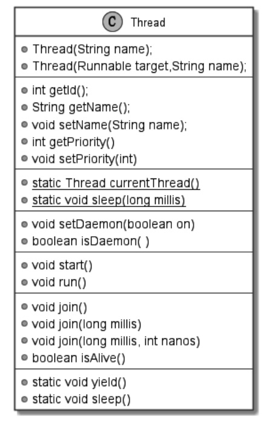
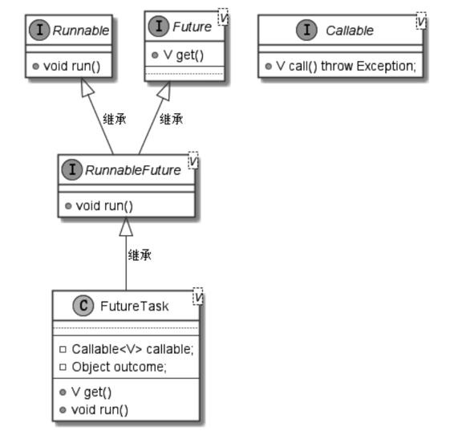
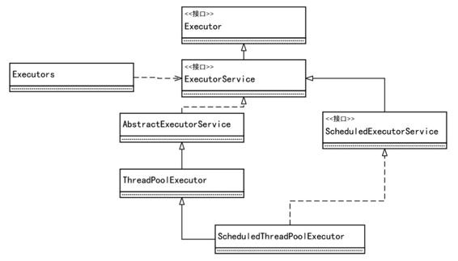
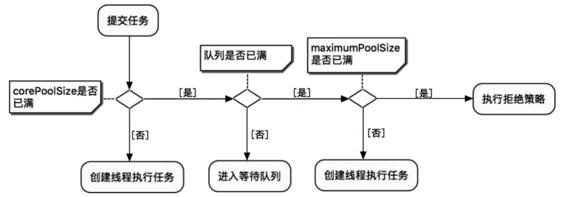

# 基本概念

https://www.cnblogs.com/dolphin0520/p/3910667.html

## 1、进程和线程

进程对应计算机里运行的程序，有着独立的内存空间，不同进程之间互不影响。

线程是比进程更小的执行单位，进程对应一个程序，线程就对应这个程序里不同的子任务。一个进程里可以有多个线程，多个线程间共同享有这个进程占有的地址空间和资源。

总结：**进程是操作系统进行资源分配的基本单位，线程是操作系统进行调度的基本单位；进程使操作系统的并发成为可能，线程使进程内的并发成为可能。**

## 2、为什么要多线程？

（1）“多”：多个线程执行不同的子任务，提高CPU的利用率；

（2）“线程”：线程可以看做是轻量级的进程，线程间的切换调度的开销远比进程间的小；

（3）“线程”之间通信比进程之间更简单；

## 3、调度算法和上下文切换

**调度算法**

一般线程的个数要多于CPU核的个数，任意时刻下一个CPU的核只能被一个线程使用，CPU为每个线程分配该线程对应的时间片，当一个线程的时间片用完时，该线程重新处于就绪状态，其他线程开始利用CPU核。由于CPU切换不同的线程的频率很快，导致总体看好像是多个线程在同一时刻都在运行。

**上下文切换**

当前线程在执行完对应的CPU时间片，将CPU给下一个线程使用之前会保存自己的状态，以便下次再切换到这个线程时，可以加载这个线程的状态。线程执行完对应的CPU时间片，下一个线程执行下一个线程对应的CPU时间片的过程就是一次上下文切换。

## 4、用户线程和守护线程

Java线程可以分为两类：用户线程和守护线程。

**用户线程（User）**

运行在前台，执行具体任务的线程，比如main方法所在的主线程。

**守护线程（Daemon）**

运行在后台，为用户线程服务的线程，**当所有用户线程都结束工作时，守护线程会随着JVM一起结束工作**，比如垃圾回收用的守护线程。

通过setDaemon(true) 将线程设置为守护线程。要在调用start()方法之前设置，否则线程启动之后就无法修改了。在守护线程中创建的其他线程默认都是守护线程，但可以修改成用户线程。

## 5、线程状态和优先级

https://tobebetterjavaer.com/thread/thread-state-and-method.html

**线程的状态**

**（1）new**

线程创建成功，但没有调用 start() 方法。

**（2）runnable**

一旦调用了start方线程会进入runnable状态。

> Java线程的**RUNNABLE**状态其实是包括了传统操作系统线程的**ready**和**running**两个状态的。

**（3）running**

线程的运行状态，此时线程进CPU时间片后，开始疯狂输出（做任务）。

**（4）waiting**

处于 waiting 状态的线程需要被其他线程显式地唤醒，才会进入就绪状态。

调用如下3个方法会使线程进入等待状态：

> - Object.wait()：使当前线程处于等待状态直到另一个线程唤醒它；
> - thread.join()：等待被合并线程执行完毕就会唤醒，底层调用的是Object实例的wait方法；
> - LockSupport.park()：除非获得调用许可，否则禁用当前线程进行线程调度。唤醒方法是调用 LockSuppert.unpark(Thread)

**（5）timed waiting**

计时等待，比waiting多了个条件，当休眠的时间超过设置的时，线程也会被唤醒，重新进入runnable状态。

> 调用如下方法会使线程进入超时等待状态：
>
> - Thread.sleep(long millis)：使当前线程睡眠指定时间；
> - Object.wait(long timeout)：线程休眠指定时间，等待期间可以通过notify()/notifyAll()唤醒；
> - Thread.join(long millis)：等待当前线程最多执行millis毫秒，如果millis为0，则会一直执行；
> - LockSupport.parkNanos(long nanos)： 除非获得调用许可，否则禁用当前线程进行线程调度指定时间；
> - LockSupport.parkUntil(long deadline)：同上，也是禁止线程进行调度指定时间；

**（6）blocked**

阻塞状态。当线程试图访问一份资源，获得对象锁时，此时对象锁被其他线程所持有的，线程只能进入blocked状态，只有当其他线程释放对象锁，并且线程调度器允许它持有该锁时，才会有blocked状态进入runnable状态。

**（7）dead**

死亡状态。线程进入dead状态有两种情况：

- run方法正常退出而自然消亡；
- 执行run方法时抛出没有捕获的异常而非正常死亡。


**线程的优先级**

- 线程的优先级用数字来表示，优先级在MIN_PRIORITY(1)和MAX_PRIORITY(10)之间，缺省时为NORM_PRIORITY(5)；
- 设置和获得线程对象的优先级：int getPriority(); void setPriority(int newPriority);
- 注意：线程优先级低只是意味着获得调度的概率低，并不是绝对先调用优先级高的线程后调用优先级低的线程。

## 6、同步和异步

同步和异步是一组相对的概念，同步对应串行编程，异步对应并行编程。需要等待结果返回才能继续执行的是同步，不需要等待结果返回就能继续执行的是异步。

这里可以先理解一下通信里的同步和异步的概念。

**串行编程和异步编程**

```java
public static void main(String[] args) {
        {
           TaskA;
        }
        ...

        {
            TaskB;
        }
    }
```

串行编程是程序从上到下按顺序执行，比如上面先执行TaskA，再执行TaskB。串行编程直观和简单，不容易出岔子，缺点是如果TaskA执行的时间过长，TaskB一直要等待TaskA执行完才能执行，效率很低。

异步编程是执行TaskA的过程中，同时再执行TaskB，TaskA和TaskB是同时进行的，有种并行的感觉。相比于串行编程，TaskB无需等待TaskA，效率较高，缺点是容易出错，会出现同步等问题。比如在TaskA里起一个线程池执行一个线程任务，TaskB所在的线程就是主线程。Java里有专门的异步编程框架CompletableFuture，这个后续再详细介绍。

**同步**

当两个或者两个以上的线程访问一份共享的资源，需要某种方法确定同一时刻内资源仅被一个线程占用，达到此目的过程叫同步。

线程同步是在线程互斥的基础上实现的，java实现同步有synchronized关键字、Lock、volatile关键字、线程变量（ThreadLocal）和原子类，这些后续详细介绍。

# 线程的基本信息

Java 中使用 Thread 实例来描述线程。



```java
public class Client0 {

    public static void main(String[] args) {
        //线程基本信息
        fun1();
        Thread thread = Thread.currentThread();
        System.out.println(thread.getId());
        System.out.println(thread.getName());
        System.out.println(thread.getState());
        System.out.println(thread.getPriority());
    }

    private static void fun1() {
        int a = 1;
        int b = 1;
        int c = a/b;
    }
}
```

Thread的内部静态枚举类State用于定义Java线程的所有状态。线程创建出来之后就是 NEW 状态，调用 start() 方法后，JVM 会将线程交给操作系统去管理，此时状态变成 Runnable。**OS线程区分就绪状态和运行状态，但是在JVM里都是同一种状态RUNNABLE。**
```java
public enum State {
        NEW,
        RUNNABLE,
        BLOCKED,
        WAITING,
        TIMED_WAITING,
        TERMINATED;
    }
```

# 创建线程的方法

创建线程的几种方法都和 Thread 类有关。

- 继承Thread类，重写run方法
- 实现runable接口
- 使用 callable 和 FutureTask
- 创建线程池

一般工程里不允许1、2这种直接new一个线程去做任务，这样的线程叫“野线程”，正规的是用线程池创建工作线程执行任务。

## 继承Thread类

查看一下Thread类的源码，其run()方法的具体代码如下：

```java
public class Thread implements Runnable {
    /* What will be run. */
    private Runnable target;
    
    @Override
    public void run() {
        if (target != null) {
            target.run();
        }
    }
    
    public Thread(Runnable target) {
        init(null, target, "Thread-" + nextThreadNum(), 0);
    }
}
```

在Thread类中，target的属性值默认为空，如果直接创建一个 Thread 类的实例然后 start()，什么都不会做。

我们可以定义自己的类并继承 Thread，重写 run() ，在里面实现业务代码。

### **run() 和 start() 的区别**

run()方法是实现Runnable接口时，要实现的方法，实现的是线程具体要做的事情。

start()方法是Thread类里的方法，线程对象调用start()方法，线程进入就绪状态（runnable），待线程分到CPU的时间片时，由runnable状态进入running状态，进入running状态的线程会执行run方法里写的线程具体执行的任务。

## 实现Runnable接口

从上面 Thread 类源码知道：如果target（执行目标）不为空，就执行 target 的 run() 方法。target 的类型为Runnable。

再看一下Runnable接口的代码：

```java
@FunctionalInterface
public interface Runnable {
    public abstract void run();
}
```

实现 runnable 接口只需实现run方法即可，run方法里写具体这个线程要做什么事情，run方法返回为void，无需传入参数，符合函数式接口，宜选用lambda表达式。

Thread 有两个构造器可以为 target 赋值：

```
public Thread(Runnable target)
public Thread(Runnable target, String name)
```

### 优点

实现 Runnable 接口的优点除了避免 Thread 单继承的限制，最重要的是实现了逻辑和数据的更好分离，更适合同一个资源被多段业务逻辑并行处理的场景，因为一个 Runnable 实例可以作为多个 Thread 的参数。例如：

```java
public class SalesDemo {
    public static final int MAX_AMOUNT = 5; //商品数量

    //商店商品的销售线程，每条线程异步销售4次
    static class StoreGoods extends Thread {
        StoreGoods(String name) {
            super(name);
        }

        private int goodsAmount = MAX_AMOUNT;

        public void run() {
            for (int i = 0; i <= MAX_AMOUNT; i++) {
                if (this.goodsAmount > 0) {
                    System.out.println(getName() + " 卖出一件，还剩：" + (--goodsAmount));
                    sleepMilliSeconds(10);
                }
            }
            System.out.println(getName() + "运行结束.");
        }
    }

    //商场商品的target销售目标类，一个商品最多销售4次，可以多人销售
    static class MallGoods implements Runnable {
        //多人销售, 可能导致数据出错，使用原子数据类型保障数据安全
        private AtomicInteger goodsAmount = new AtomicInteger(MAX_AMOUNT);

        public void run() {
            for (int i = 0; i <= MAX_AMOUNT; i++) {
                if (this.goodsAmount.get() > 0) {
                    System.out.println(Thread.currentThread().getName() + " 卖出一件，还剩：" + goodsAmount.decrementAndGet());
                    sleepMilliSeconds(10);
                }
            }
            System.out.println(Thread.currentThread().getName() + "运行结束.");
        }
    }

    public static void main(String args[]) throws InterruptedException {
        System.out.println("商店版本的销售");
        for (int i = 1; i <= 2; i++) {
            Thread thread = null;
            thread = new StoreGoods("店员-" + i);
            thread.start();
        }

        Thread.sleep(1000);
        System.out.println("商场的商品销售");
        MallGoods mallGoods = new MallGoods();
        for (int i = 1; i <= 2; i++) {
            Thread thread = null;
            thread = new Thread(mallGoods, "商场销售员-" + i);
            thread.start();
        }

        System.out.println(Thread.currentThread().getName() + "运行结束.");
    }
}

商店版本的销售
店员-1 卖出一件，还剩：4
店员-2 卖出一件，还剩：4
店员-2 卖出一件，还剩：3
店员-1 卖出一件，还剩：3
店员-2 卖出一件，还剩：2
店员-1 卖出一件，还剩：2
店员-1 卖出一件，还剩：1
店员-2 卖出一件，还剩：1
店员-2 卖出一件，还剩：0
店员-1 卖出一件，还剩：0
店员-1运行结束.
店员-2运行结束.
商场的商品销售
main运行结束.
商场销售员-1 卖出一件，还剩：4
商场销售员-2 卖出一件，还剩：3
商场销售员-2 卖出一件，还剩：2
商场销售员-1 卖出一件，还剩：1
商场销售员-1 卖出一件，还剩：0
商场销售员-2运行结束.
商场销售员-1运行结束.
```

## 使用 callable 和 FutureTask

前面两种方式都没法获取异步执行的结果。java提供的异步框架：callable接口 + Future接口/FutureTask类 + 线程池（ExecutorService接口）解决了这个问题。

先看callable接口：有返回值，允许抛出异常。

```java
@FunctionalInterface
public interface Callable<V> {
    V call() throws Exception;
}
```

例子：

```java
public class MyTask implements Callable<Integer> {
    @Override
    public Integer call() throws Exception {
        System.out.println("开始执行异步任务");
        int sum = 0;
        for (int i = 0; i < 100; ++i)
        {
            System.out.println("正在执行异步任务, 当前i值为：" + String.valueOf(i));
            sum += i;
        }
        return sum;
    }
}
```

Thread的target属性的类型为 Runnable，而Callable接口与Runnable接口之间没有任何继承关系，显而易见，Callable接口实例没有办法作为Thread线程实例的target来使用。既然如此，那么该如何使用Callable接口创建线程呢？一个在Callable接口与Thread线程之间起到搭桥作用的重要接口马上就要登场了。

这个重要的中间搭桥接口就是RunnableFuture接口，请看RunnableFuture接口的代码：

```java
public interface RunnableFuture<V> extends Runnable, Future<V> {
    void run();
}
```

通过源代码可以看出：RunnableFuture继承了Runnable接口，从 而保证了其实例可以作为Thread线程实例的target目标；同时，RunnableFuture通过继承Future接口，保证了可以获取未来的异步执行结果。

Future 接口有3个作用：

1. 取消异步执行的任务
2. 判断异步任务是否完成
3. 获取异步执行的结果

Future 源码如下：

```java
public interface Future<V> {

    boolean cancel(boolean mayInterruptIfRunning);

    boolean isCancelled();

    boolean isDone();
	//阻塞获取异步执行结果
    V get() throws InterruptedException, ExecutionException;
    //阻塞获取异常执行结果，可以设置超时时间
    V get(long timeout, TimeUnit unit)
        throws InterruptedException, ExecutionException, TimeoutException;
}
```

总体来说，Future是一个对异步任务进行交互、操作的接口。但 是Future仅仅是一个接口，通过它没有办法直接完成对异步任务的操作，JDK提供了一个默认的实现类——FutureTask。

FutureTask 是 Future 和 Runnable 的实现类，同时 FutureTask 内部持有 Callable 的实例。所以 FutureTask 成为了 Callable 和 Thread 之间的桥梁：



通过FutureTask类和Callable接口的联合使用可以创建能够获取异步执行结果的线程，具体步骤如下：

1. 创建一个Callable接口的实现类，并实现其call()方法。
2. 使用Callable实现类的实例构造一个FutureTask实例。
3. 使用FutureTask实例构建Thread线程实例。

4. 调用Thread实例的start()方法启动线程
5. 调用FutureTask对象的get()方法阻塞性地获得并发线程的执行结果。

```java
public class CreateDemo3 {

    public static final int MAX_TURN = 5;
    public static final int COMPUTE_TIMES = 100000000;


    static class ReturnableTask implements Callable<Long> {
        //返回并发执行的时间
        public Long call() throws Exception {
            long startTime = System.currentTimeMillis();
            Print.cfo(getCurThreadName() + " 线程运行开始.");
            Thread.sleep(1000);

            for (int i = 0; i < COMPUTE_TIMES; i++) {
                int j = i * 10000;
            }
            long used = System.currentTimeMillis() - startTime;
            Print.cfo(getCurThreadName() + " 线程运行结束.");
            return used;
        }
    }

    public static void main(String args[]) throws InterruptedException {
        ReturnableTask task = new ReturnableTask();
        FutureTask<Long> futureTask = new FutureTask<Long>(task);
        Thread thread = new Thread(futureTask, "returnableThread");
        thread.start();

        Thread.sleep(500);
        Print.cfo(getCurThreadName() + " 让子弹飞一会儿.");
        Print.cfo(getCurThreadName() + " 做一点自己的事情.");
        for (int i = 0; i < COMPUTE_TIMES / 2; i++) {
            int j = i * 10000;
        }

        Print.cfo(getCurThreadName() + " 获取并发任务的执行结果.");

        try {
            Print.cfo(thread.getName() + "线程占用时间：" + futureTask.get());
        } catch (InterruptedException e) {
            e.printStackTrace();
        } catch (ExecutionException e) {
            e.printStackTrace();
        }
        Print.cfo(getCurThreadName() + " 运行结束.");
    }
}
```

returnableThread线程首先执行的是thread.run()方法，然后在 其中会执行到其target(futureTask任务)的run()方法；接着在这个 futureTask.run()方法中会执行futureTask的callable成员的call() 方法，这里的callable成员（ReturnableTask实例)是通过 FutureTask构造器在初始化时传递进来的、自定义的Callable实现类的实例。FutureTask的Callable成员的call()方法执行完成后，会将结果保存在FutureTask内部的outcome实例属性中。

# 线程的基本操作

## jdk工具

```
jps: 查看所有JVM里所有的线程id
jstack tid: 查看指定id的线程堆栈信息
```

## 中断

Java语言提供了stop()方法终止正在运行的线程，但是Java将Thread的stop()方法设置为过时，不建议大家使用。在程序中，我们是不能随便中断一个线程的，我们无法知道这个线程正运行在什么状态，它可能持有某把锁，强行中断线程可能导致锁不能释放的问题；或者线程可能在操作数据库，强行中断线程可能导致数据不一致的问题。正是由于调用stop()方法来终止线程可能会产生不可预料的结果，因此不推荐调用stop()方法。

一个线程什么时候可以退出呢？当然只有线程自己才能知道。所以，这里介绍一下Thread的interrupt()方法，此方法本质不是用来中断一个线程，而是将线程设置为中断状态。

当我们调用线程的interrupt()方法时，它有两个作用：

（1）如果此线程处于阻塞状态（如调用了Object.wait()方法），就会立马退出阻塞，并抛出InterruptedException异常，线程就可以通过捕获InterruptedException来做一定的处理，然后让线程退出。更确切地说，如果线程被Object.wait()、Thread.join()和Thread.sleep()三种方法之一阻塞，此时调用该线程的interrupt()方法，该线程将抛出一个InterruptedException中断异常（该线程必须事先预备好处理此异常），从而提早终结被阻塞状态。

（2）如果此线程正处于运行之中，线程就不受任何影响，继续运行，仅仅是线程的中断标记被设置为true。所以，程序可以在适当的位置通过调用isInterrupted()方法来查看自己是否被中断，并执行退出操作。

> Thread.sleep() 被 interrupt() 中断会抛异常。但是 LockSupport.parkNanos() 不会抛异常。

## join

线程的合并是一个比较难以说清楚的概念，什么是线程的合并呢？举一个例子，假设有两个线程A和B。现在线程A在执行过程中对另一个线程B的执行有依赖，具体的依赖为：线程A需要将线程B的执行流程合并到自己的执行流程中（至少表面如此），这就是线程合并，被动方线程B可以叫作被合并线程。这个例子中的线程A合并线程B的伪代码大致为：

```java
 class ThreadA extends Thread
 {
     void run()
     {
         Thread threadb = new Thread("thread-b");
         threadb.join();
     }
 }
```

join()方法是Thread类的一个实例方法，有三个重载版本：

1. 把当前线程变为TIMED_WAITING，直到被合并线程执行结束
2. 把当前线程变为TIMED_WAITING，直到被合并线程执行结束，或者等待被合并线程执行millis的时间
3. 把当前线程变为TIMED_WAITING，直到被合并线程执行结束，或者等待被合并线程执行millis+nanos的时间

## yield

yield() 是Thread 提供的静态方法，作用是使当前线程让出cpu的执行权限。

1. yield仅能使一个线程从运行状态转到就绪状态，而不是阻塞状态。
2. yield不能保证使得当前正在运行的线程迅速转换到就绪状态。
3. 即使完成了迅速切换，OS 下次线程调度时仍然可能选中此线程


# 线程池实战

实际开发中，都是使用线程池。

## JUC的架构

JUC就是java.util.concurrent工具包的简称，该工具包是从JDK 1.5开始加入JDK的，是用于完成高并发、处理多线程的一个工具包。

JUC（java.util.concurrent）中线程池相关的架构图：



Executor 接口只有一个 execute() 方法，可以接口一个 Runnable实例。

ExecutorService 接口负责管理和调度线程，有 execute() 方法和 submit() 方法，可以执行 Runnable 和 Callable任务。

```java
//方法一：执行一个 Runnable类型的target执行目标实例，无返回
     void execute(Runnable command);
//方法二：提交一个 Callable类型的target执行目标实例, 返回一个Future异步任务实例
     <T> Future<T> submit(Callable<T> task);  
//方法三：提交一个 Runnable类型的target执行目标实例, 返回一个Future异步任务实例。这种用法主要是使用 Future 对象控制线程的执行，比如取消线程。
     Future<?> submit(Runnable task);
```

ThreadPoolExecutor就是大名鼎鼎的“线程池”实现类。用来创建自定义的线程池。

ScheduledThreadPoolExecutor提供了“延时执行”和“周期执行”等方法。

Executors是一个静态工厂类，提供了一些快捷的创建线程池的方法。

## Executors 工厂类

Executors工厂类提供了4种快捷创建线程池的方法：

1. newSingleThreadExecutor()：创建只有一个线程的线程池
   1. 任务按顺序提交并执行。唯一线程繁忙时，新提交的任务会假如阻塞队列，阻塞队列无限大。

2. newFixedThreadPool(int)：创建固定大小的线程池
   1. 如果线程数没有达到“固定数量”，每次提交一个任务线程池内就创建一个新线程，直到线程达到线程池固定的数量。
   2. 线程池的大小一旦达到“固定数量”就会保持不变，如果某个线程因为执行异常而结束，那么线程池会补充一个新线程。
   3. 如果池中的所有线程均在繁忙状态，新任务会进入阻塞队列中（无界的阻塞队列）。
   4. 适用于：需要任务长期执行的场景。弊端：阻塞队列无界，可能耗尽服务器资源。

3. newCachedThreadPool()：创建不限数量的线程池，任何提交的任务都将立即执行，但是空闲线程会得到及时回收
   1. 在接收新的异步任务target执行目标实例时，如果池内所有线程繁忙，此线程池就会添加新线程来处理任务。
   2. 此线程池不会对线程池大小进行限制，线程池大小完全依赖于操作系统（或者说JVM）能够创建的最大线程大小。
   3. 如果部分线程空闲，也就是存量线程的数量超过了处理任务数量，就会回收空闲（60秒不执行任务）线程。
   4. 适用于：需要快速处理突发性强、耗时较短的任务场景，如Netty的NIO处理场景、REST API接口的瞬时削峰场景。弊端：线程池没有最大线程数量限制，如果大量的异步任务同时提交，可能会因创建线程过多而耗尽资源。

4. newScheduledThreadPool()：创建可定时执行任务的线程池
   1. newScheduledThreadPool(int coreSizse)：创建指定大小的调度线程池。newSingleThreadScheduledExecutor()：创建单个线程的调度线程池。


```java
public class CreateThreadPoolDemo {

    public static final int SLEEP_GAP = 500;
    public static final int MAX_TURN = 5;

    //异步的执行目标类
    public static class TargetTask implements Runnable {
        static AtomicInteger taskNo = new AtomicInteger(1);
        protected String taskName;

        public TargetTask() {
            taskName = "task-" + taskNo.get();
            taskNo.incrementAndGet();
        }

        public void run() {

            Print.tco("任务：" + taskName + " doing");
            // 线程睡眠一会
            sleepMilliSeconds(SLEEP_GAP);

            Print.tco(taskName + " 运行结束.");
        }

        @Override
        public String toString() {
            return "TargetTask{" + taskName + '}';
        }
    }

    //异步的执行目标类：执行过程中将发生异常
    static class TargetTaskWithError extends TargetTask {
        public void run() {
            super.run();
            throw new RuntimeException("Error from " + taskName);
        }
    }

    //测试用例：只有一条线程的线程池
    @Test
    public void testSingleThreadExecutor() {
        ExecutorService pool = Executors.newSingleThreadExecutor();
        for (int i = 0; i < 5; i++) {
            pool.execute(new TargetTask());
            pool.submit(new TargetTask());
        }
        sleepSeconds(1000);
        //关闭线程池
        pool.shutdown();
    }


    //测试用例：只有3条线程固定大小的线程池
    @Test
    public void testNewFixedThreadPool() {
        ExecutorService pool = Executors.newFixedThreadPool(3);
        for (int i = 0; i < 5; i++) {
            pool.execute(new TargetTask());
            pool.submit(new TargetTask());
        }
        sleepSeconds(1000);
        //关闭线程池
        pool.shutdown();
    }

    //测试用例：“可缓存线程池”
    @Test
    public void testNewCacheThreadPool() {
        ExecutorService pool = Executors.newCachedThreadPool();
        for (int i = 0; i < 5; i++) {
            pool.execute(new TargetTask());
            pool.submit(new TargetTask());
        }
        sleepSeconds(1000);
        //关闭线程池
        pool.shutdown();
    }

    //测试用例：“可调度线程池”
    @Test
    public void testNewScheduledThreadPool() {
        ScheduledExecutorService scheduled = Executors.newScheduledThreadPool(2);
        for (int i = 0; i < 2; i++) {
            scheduled.scheduleAtFixedRate(new TargetTask(),
                    0, 500, TimeUnit.MILLISECONDS);
            //以上的参数中：
            // 0表示首次执行任务的延迟时间，500表示每次执行任务的间隔时间
            //TimeUnit.MILLISECONDS所设置的时间的计时单位为毫秒
        }
        sleepSeconds(1000);
        //关闭线程池
        scheduled.shutdown();
    }

    //测试用例：“可调度线程池2”
    @Test
    public void testNewScheduledThreadPool2() {
        ScheduledExecutorService scheduled = Executors.newScheduledThreadPool(0);
        for (int i = 0; i < 2; i++) {
            scheduled.scheduleAtFixedRate(new TargetTask(),
                    0, 500, TimeUnit.MILLISECONDS);
            //以上的参数中：
            // 0表示首次执行任务的延迟时间，500表示每次执行任务的间隔时间
            //TimeUnit.MILLISECONDS所设置的时间的计时单位为毫秒
        }
        sleepSeconds(1000);
        //关闭线程池
        scheduled.shutdown();
    }


    @org.junit.Test
    public void testThreadPoolExecutor() {
        ThreadPoolExecutor executor = new ThreadPoolExecutor(
                1, //corePoolSize
                100, //maximumPoolSize
                100, //keepAliveTime
                TimeUnit.SECONDS, //unit
                new LinkedBlockingDeque<>(100));//workQueue

        for (int i = 0; i < 5; i++) {
            final int taskIndex = i;
            executor.execute(() ->
            {
                Print.tco("taskIndex = " + taskIndex);
                try {
                    Thread.sleep(Long.MAX_VALUE);
                } catch (InterruptedException e) {
                    e.printStackTrace();
                }
            });
        }
        while (true) {
            Print.tco("- activeCount:" + executor.getActiveCount() +
                    " - taskCount:" + executor.getTaskCount());
            sleepSeconds(1);
        }
    }

    //一个简单的线程工厂
    static public class SimpleThreadFactory implements ThreadFactory {
        static AtomicInteger threadNo = new AtomicInteger(1);

        //实现其唯一的创建线程方法
        @Override
        public Thread newThread(Runnable target) {
            String threadName = "simpleThread-" + threadNo.get();
            Print.tco("创建一条线程，名称为：" + threadName);
            threadNo.incrementAndGet();
            //设置线程名称
            Thread thread = new Thread(target, threadName);
            //设置为守护线程
            thread.setDaemon(true);
            return thread;
        }
    }


    @org.junit.Test
    public void testThreadFactory() {
        //使用自定义线程工厂，快捷创建线程池
        ExecutorService pool =
                Executors.newFixedThreadPool(2, new SimpleThreadFactory());
        for (int i = 0; i < 5; i++) {
            pool.submit(new TargetTask());
        }
        //等待10秒
        sleepSeconds(10);
        Print.tco("关闭线程池");
        pool.shutdown();
    }

    //自定义拒绝策略
    public static class CustomIgnorePolicy implements RejectedExecutionHandler {
        public void rejectedExecution(Runnable r, ThreadPoolExecutor e) {
            // 可做日志记录等
            Print.tco(r + " rejected; " + " - getTaskCount: " + e.getTaskCount());
        }
    }

    @org.junit.Test
    public void testCustomIgnorePolicy() {
        int corePoolSize = 2; //核心线程数
        int maximumPoolSize = 4;  //最大线程数
        long keepAliveTime = 10;
        TimeUnit unit = TimeUnit.SECONDS;
        //最大排队任务数
        BlockingQueue<Runnable> workQueue = new ArrayBlockingQueue<>(2);
        //线程工厂
        ThreadFactory threadFactory = new SimpleThreadFactory();
        //拒绝和异常策略
        RejectedExecutionHandler policy = new CustomIgnorePolicy();
        ThreadPoolExecutor pool = new ThreadPoolExecutor(
                corePoolSize,
                maximumPoolSize,
                keepAliveTime, unit,
                workQueue,
                threadFactory,
                policy);

        // 预启动所有核心线程
        pool.prestartAllCoreThreads();
        for (int i = 1; i <= 10; i++) {
            pool.execute(new TargetTask());
        }
        //等待10秒
        sleepSeconds(10);
        Print.tco("关闭线程池");
        pool.shutdown();
    }

    //线程本地变量,用于记录线程异步任务的开始执行时间
    private static final ThreadLocal<Long> START_TIME = new ThreadLocal<>();

    @org.junit.Test
    public void testHooks() {
        ExecutorService pool = new ThreadPoolExecutor(2,
                4, 60,
                TimeUnit.SECONDS, new LinkedBlockingQueue<>(2)) {
            @Override
            protected void terminated() {
                Print.tco("调度器已经终止!");
            }

            @Override
            protected void beforeExecute(Thread t, Runnable target) {
                Print.tco(target + "前钩子被执行");
                //记录开始执行时间
                START_TIME.set(System.currentTimeMillis());
                super.beforeExecute(t, target);
            }


            @Override
            protected void afterExecute(Runnable target, Throwable t) {
                super.afterExecute(target, t);
                //计算执行时长
                long time = (System.currentTimeMillis() - START_TIME.get());
                Print.tco(target + " 后钩子被执行, 任务执行时长（ms）：" + time);
                //清空本地变量
                START_TIME.remove();
            }
        };


        pool.execute(new TargetTask());

        //等待10秒
        sleepSeconds(10);
        Print.tco("关闭线程池");
        pool.shutdown();

    }


    @org.junit.Test
    public void testNewFixedThreadPool2() {
        //创建一个固定大小线程池
        ExecutorService fixedExecutorService = Executors.newFixedThreadPool(1);
        ThreadPoolExecutor threadPoolExecutor = (ThreadPoolExecutor) fixedExecutorService;
        Print.tco(threadPoolExecutor.getMaximumPoolSize());
        //设置核心线程数
        threadPoolExecutor.setCorePoolSize(8);

        //创建一个单线程化的线程池
        ExecutorService singleExecutorService = Executors.newSingleThreadExecutor();
        //转换成普通线程池， 会抛出运行时异常 java.lang.ClassCastException
        ((ThreadPoolExecutor) singleExecutorService).setCorePoolSize(8);
    }


    //测试用例：提交和执行
    @Test
    public void testSubmit() {
        ScheduledExecutorService pool = Executors.newScheduledThreadPool(2);
        pool.execute(new TargetTaskWithError());
        /**
         * submit(Runnable x) 返回一个future。可以用这个future来判断任务是否成功完成。请看下面：
         */
        Future future = pool.submit(new TargetTaskWithError());

        try {
            //如果异常抛出，会在调用Future.get()时传递给调用者
            if (future.get() == null) {
                //如果Future的返回为null，任务完成
                Print.tco("任务完成");
            }
        } catch (Exception e) {
            Print.tco(e.getCause().getMessage());
        }


        sleepSeconds(10);
        //关闭线程池
        pool.shutdown();
    }

    //测试用例：获取异步调用的结果
    @Test
    public void testSubmit2() {
        ScheduledExecutorService pool = Executors.newScheduledThreadPool(2);
        Future<Integer> future = pool.schedule(new Callable<Integer>() {
            @Override
            public Integer call() throws Exception {
                //返回200 - 300 之间的随机数
                return RandomUtil.randInRange(200, 300);
            }
        }, 100, TimeUnit.MILLISECONDS);

        try {
            Integer result = future.get();
            Print.tco("异步执行的结果是:" + result);
        } catch (InterruptedException e) {
            Print.tco("异步调用被中断");
            e.printStackTrace();
        } catch (ExecutionException e) {
            Print.tco("异步调用过程中，发生了异常");
            e.printStackTrace();
        }
        sleepSeconds(10);
        //关闭线程池
        pool.shutdown();

    }


    //测试用例：优雅关闭
    @Test
    public void testShutdownGracefully() {
        ScheduledExecutorService threadPool = Executors.newScheduledThreadPool(2);
        threadPool.shutdown(); // Disable new tasks from being submitted
        try {
            // 设定最大重试次数
            // 等待 60 s
            if (!threadPool.awaitTermination(60, TimeUnit.SECONDS)) {
                // 调用 shutdownNow 取消正在执行的任务
                threadPool.shutdownNow();
                // 再次等待 60 s，如果还未结束，可以再次尝试，或则直接放弃
                if (!threadPool.awaitTermination(60, TimeUnit.SECONDS)) {
                    System.err.println("线程池任务未正常执行结束");
                }
            }
        } catch (InterruptedException ie) {
            // 重新调用 shutdownNow
            threadPool.shutdownNow();
        }
    }
}
```

### shutdonw()

以上用例在最后调用shutdown()方法来关闭线程池。执行 shutdown()方法后，线程池状态变为SHUTDOWN，此时线程池将拒绝新任务，不能再往线程池中添加新任务，否则会抛出 RejectedExecutionException异常。但是，线程池不会立刻退出，直 添加到线程池中的任务都已经处理完成才会退出。还有一个与 shutdown()类似的方法，叫作shutdownNow()，执行shutdownNow()方法后，线程池状态会立刻变成STOP，并试图停止所有正在执行的线程，并且不再处理还在阻塞队列中等待的任务，会返回那些未执行的任务。

### Executors快捷创建线程池的潜在问题

实际开发禁止使用 Executors 工厂类，原因是：

1. FixedThreadPool和SingleThreadPool 这两个工厂方法所创建的线程池，阻塞队列的长度都为Integer.MAX_VALUE，可能会堆积大量的任务，从而导致 OOM。
2. CachedThreadPool和ScheduledThreadPool 这两个工厂方法所创建的线程池允许创建的线程数量为 Integer.MAX_VALUE，可能会导致创建大量的线程，从而导致OOM。

为了防止OOM，大厂的编程规范都不允许使用Executors创建线程池，而是要求使用标准构造器ThreadPoolExecutor创建线程池。

## 创建线程池的标准方法

### ThreadPoolExecutor

```java
// 使用标准构造器构造一个普通的线程池
     public ThreadPoolExecutor(
       int corePoolSize,            // 核心线程数，即使线程空闲（Idle），也不会回收
       int maximumPoolSize,                 // 线程数的上限
       long keepAliveTime, TimeUnit unit,   // 线程最大空闲（Idle）时长 
       BlockingQueue<Runnable> workQueue,     // 任务的排队队列
       ThreadFactory threadFactory,           // 新线程的产生方式
       RejectedExecutionHandler handler)    // 拒绝策略
```

1. 核心和最大线程数量：线程池执行器将会根据corePoolSize和maximumPoolSize自动维护线程池中的工作线程。
   1. 接收到新任务时，如果当前工作线程数少于 corePoolSize ，即使有空闲的线程，也会创建一个新线程来处理该请求，直到线程数达到corePoolSize。
   2. 如果当前工作线程数多于corePoolSize数量，但小于 maximumPoolSize数量，那么仅当任务排队队列已满时才会创建新线程。通过设置corePoolSize和maximumPoolSize相同，可以创建一个固定大小的线程池。
   3. 当maximumPoolSize被设置为无界值（如 Integer.MAX_VALUE）时，线程池可以接收任意数量的并发任务。
   4. corePoolSize 和 maximumPoolSize 不仅能在线程池构造时设 置，也可以调用 setCorePoolSize() 和 setMaximumPoolSize() 两个方法进行动态更改。

2. 阻塞队列：如果核心线程都很忙，新收到的异步任务会暂存起来。

3. 最大空闲时长：keepAliveTime 用于设置池内线程最大Idle（空闲）时长（或者说保活时长），如果超过这个时间，默认情况下Idle、非Core线程会被回收。
   1. 如果池在使用过程中提交任务的频率变高，也可以调用方法setKeepAliveTime(long，TimeUnit)进行线程存活时间的动态调整，可以将时长延长。如果需要防止Idle线程被终止，可以将Idle时间设置为无限大，具体如下：` setKeepAliveTime(Long.MAX_VALUE，TimeUnit.NANOSECONDS);`
   1. 默认情况下，Idle超时策略仅适用于存在超过corePoolSize线程的情况。但若调用了allowCoreThreadTimeOut(true)，则keepAliveTime参数所设置的Idle超时策略也将被应用于核心线程。

### 线程池的任务调度流程



线程池的任务调度流程（包含接收新任务和执行下一个任务）大致如下：

（1）如果当前工作线程数量小于核心线程数量，执行器总是优先创建一个任务线程，而不是从线程队列中获取一个空闲线程。

（2）如果线程池中总的任务数量大于核心线程池数量，新接收的任务将被加入阻塞队列中，一直到阻塞队列已满。在核心线程池数量已经用完、阻塞队列没有满的场景下，线程池不会为新任务创建一个新线程。

（3）当完成一个任务的执行时，执行器总是优先从阻塞队列中获取下一个任务，并开始执行，一直到阻塞队列为空，其中所有的缓存任务被取光。

（4）在核心线程池数量已经用完、阻塞队列也已经满了的场景下，如果线程池接收到新的任务，将会为新任务创建一个线程（非核心线程），并且立即开始执行新任务。

（5）在核心线程都用完、阻塞队列已满的情况下，一直会创建新线程去执行新任务，直到池内的线程总数超出maximumPoolSize。如果线程池的线程总数超过maximumPoolSize，线程池就会拒绝接收任务，当新任务过来时，会为新任务执行拒绝策略。

```java
public class Client20 {

    public static void main(String[] args) throws InterruptedException {

        ThreadPoolExecutor executor = new ThreadPoolExecutor(1, 100, 100, TimeUnit.SECONDS, new LinkedBlockingDeque<>(100));

        for(int i = 0; i < 5; i ++) {
            executor.execute(() -> {
                Thread thread = Thread.currentThread();
                System.out.println(thread.getName());
                try {
                    //无限睡眠
                    Thread.sleep(Long.MAX_VALUE);
                } catch (InterruptedException e) {
                    throw new RuntimeException(e);
                }
            });
        }
        while(true) {
            //每秒，输出线程池的线程数
            System.out.println("活跃的线程数: " + executor.getActiveCount() + " 任务数量: " + executor.getTaskCount());
            Thread.sleep(1000);
        }
    }
}
```

代码运行结果：

```
活跃的线程数: 1 任务数量: 5
pool-1-thread-1
活跃的线程数: 1 任务数量: 5
活跃的线程数: 1 任务数量: 5
活跃的线程数: 1 任务数量: 5
活跃的线程数: 1 任务数量: 5
......
```

以上示例创建了最大线程数量maximumPoolSize为100的线程池，仅仅向其中提交了5个任务。理论上，这5个任务都会被执行到，奇怪的是示例中只有1个任务在执行，其他的4个任务都在等待。其他任务被加入到了阻塞队列中，需要等pool-1-thread-1线程执行完第一个任务后，才能依次从阻塞队列取出执行。但是，实例中的第一个任务是一个永远也没有办法完成的任务，所以其他的4个任务只能永远在阻塞队列中等待着。由于参数配置得不合理，因此出现了以上的奇怪现象。

为什么会出现上面的奇怪现象呢？因为例子中的corePoolSize为1，阻塞队列的大小为100，按照线程创建的规则，需要等阻塞队列已满，才会去创建新的线程。例子中加入了5个任务，阻塞队列大小为4（<100），所以线程池的调度器不会去创建新的线程，后面的4个任务只能等待。

### ThreadFactory

ThreadFactory是Java线程工厂接口，这是一个非常简单的接口， 具体如下：

```java
package java.util.concurrent;
public interface ThreadFactory {
 //唯一的方法：创建一个新线程
 Thread newThread(Runnable target);
}
```

使用Executors创建新的线程池时，也可以基于 ThreadFactory（线程工厂）创建，在创建新线程池时可以指定将要使用的ThreadFactory实例。只不过，如果没有指定的话，就会使用 Executors.defaultThreadFactory 默认实例。使用默认的线程工厂实例所创建的线程全部位于同一个ThreadGroup（线程组）中，具有相同的NORM_PRIORITY（优先级为5），而且都是非守护进程状态。

> 这里提到了两个工厂类，比较容易混淆，故做出说明。Executors 为线程池工厂类，用于快捷创建线程池（Thread Pool）； ThreadFactory为线程工厂类，用于创建线程（Thread）。

### BlockingQueue

Java中的阻塞队列（BlockingQueue）与普通队列相比有一个重要的特点：在阻塞队列为空时会阻塞当前线程的元素获取操作。具体来说，在一个线程从一个空的阻塞队列中获取元素时线程会被阻塞，直到阻塞队列中有了元素；当队列中有元素后，被阻塞的线程会自动被唤醒（唤醒过程不需要用户程序干预）。

BlockingQueue是JUC包的一个超级接口，比较常用的实现类有:

1. ArrayBlockingQueue：是一个数组实现的有界阻塞队列，创建时必须指定大小。
2. LinkedBlockingQueue：是一个基于链表实现的阻塞队列，不设置容量是就是无界的。静态方法Executors.newSingleThreadExecutor和 Executors.newFixedThreadPool使用了这个队列，而且都是无界的。
3. PriorityBlockingQueue：是具有优先级的无界队列。
4. DelayQueue：这是一个无界阻塞延迟队列，底层基于 PriorityBlockingQueue实现，队列中每个元素都有过期时间，当从队列获取元素（元素出队）时，只有已经过期的元素才会出队，队列头部的元素是过期最快的元素。快捷工厂方法 Executors.newScheduledThreadPool所创建的线程池使用此队列。
5. SynchronousQueue：（同步队列）是一个不存储元素的阻塞队列，每个插入操作必须等到另一个线程的调用移除操作，否则插入操作一直处于阻塞状态，其吞吐量通常高于LinkedBlockingQueue。快捷工厂方法Executors.newCachedThreadPool所创建的线程池使用此队列。与前面的队列相比，这个队列比较特殊，它不会保存提交的任务，而是直接新建一个线程来执行新来的任务

### 钩子方法

ThreadPoolExecutor类提供了三个钩子方法（空方法），这三个钩子方法一般用作被子类重写：

```java
//任务执行之前的钩子方法（前钩子）
 protected void beforeExecute(Thread t, Runnable r) { }
 //任务执行之后的钩子方法（后钩子）
 protected void afterExecute(Runnable r, Throwable t) { }
 //线程池终止时的钩子方法（停止钩子）
 protected void terminated() { }
```

钩子方法一般用来操作 ThreadLocal。

```java
public void testHooks() {
        ExecutorService pool = new ThreadPoolExecutor(2,
                4, 60,
                TimeUnit.SECONDS, new LinkedBlockingQueue<>(2)) {
            @Override
            protected void terminated() {
                Print.tco("调度器已经终止!");
            }

            @Override
            protected void beforeExecute(Thread t, Runnable target) {
                Print.tco(target + "前钩子被执行");
                //记录开始执行时间
                START_TIME.set(System.currentTimeMillis());
                super.beforeExecute(t, target);
            }


            @Override
            protected void afterExecute(Runnable target, Throwable t) {
                super.afterExecute(target, t);
                //计算执行时长
                long time = (System.currentTimeMillis() - START_TIME.get());
                Print.tco(target + " 后钩子被执行, 任务执行时长（ms）：" + time);
                //清空本地变量
                START_TIME.remove();
            }
        };

        for (int i = 0; i < 5; i++) {
            pool.execute(new TargetTask());
        }
        //等待10秒
        sleepSeconds(10);
        Print.tco("关闭线程池");
        pool.shutdown();

    }
```

### 拒绝策略

在线程池的任务缓存队列为有界队列（有容量限制的队列）的时 候，如果队列满了，提交任务到线程池的时候就会被拒绝。总体来说，任务被拒绝有两种情况：1.线程池已经被关闭。2.工作队列已满且maximumPoolSize已满。

无论以上哪种情况任务被拒绝，线程池都会调用 RejectedExecutionHandler实例的rejectedExecution方法。 RejectedExecutionHandler是拒绝策略的接口，JUC为该接口提供了以 下几种实现：

1. AbortPolicy：拒绝策略。这是默认策略，任务被拒绝会抛出RejectedExecutionException。
2. DiscardPolicy：抛弃策略。任务被丢弃，不会抛异常。
3. DiscardOldestPolicy：抛弃最老任务策略。 
4. CallerRunsPolicy：调用者执行策略。如果提交失败，由提交任务的线程自己去执行。

```java
public static class CustomIgnorePolicy implements RejectedExecutionHandler {
        public void rejectedExecution(Runnable r, ThreadPoolExecutor e) {
            // 可做日志记录等
            Print.tco(r + " rejected; " + " - getTaskCount: " + e.getTaskCount());
        }
    }

    @org.junit.Test
    public void testCustomIgnorePolicy() {
        //拒绝和异常策略
        RejectedExecutionHandler policy = new CustomIgnorePolicy();
        ThreadPoolExecutor pool = new ThreadPoolExecutor(
                2,
                4,
                10, TimeUnit.SECONDS,
                new ArrayBlockingQueue<>(2),
                new SimpleThreadFactory(),
                policy);

        // 预启动所有核心线程
        pool.prestartAllCoreThreads();
        for (int i = 1; i <= 10; i++) {
            pool.execute(new TargetTask());
        }
        //等待10秒
        sleepSeconds(10);
        Print.tco("关闭线程池");
        pool.shutdown();
    }
```

### 优雅关闭

```java
package com.crazymakercircle.util;

import java.util.concurrent.ExecutorService;
import java.util.concurrent.TimeUnit;

// 省略import
public class ThreadUtil {
    public static void shutdownThreadPoolGracefully(
            ExecutorService threadPool) {
        // 若已经关闭则返回
        if (!(threadPool instanceof ExecutorService) ||
                threadPool.isTerminated()) {
            return;
        }
        try {
            threadPool.shutdown(); //拒绝接受新任务
        } catch (SecurityException e) {
            return;
        } catch (NullPointerException e) {
            return;
        }
        try {
            // 等待60秒，等待线程池中的任务完成执行
            if (!threadPool.awaitTermination(60,
                    TimeUnit.SECONDS)) {
                // 调用 shutdownNow() 方法取消正在执行的任务
                threadPool.shutdownNow();
                // 再次等待60秒，如果还未结束，可以再次尝试，或者直接放弃
                if (!threadPool.awaitTermination(60,
                        TimeUnit.SECONDS)) {
                    System.err.println("线程池任务未正常执行结
                            束");
                }
            }
        } catch (InterruptedException ie) {
            // 捕获异常，重新调用 shutdownNow() 方法
            threadPool.shutdownNow();
        }
        // 仍然没有关闭，循环关闭1000次，每次等待10毫秒
        if (!threadPool.isTerminated()) {
            try {
                for (int i = 0; i < 1000; i++) {
                    if
                    (threadPool.awaitTermination(10, TimeUnit.MILLISECONDS)) {
                        break;
                    }
                    threadPool.shutdownNow();
                }
            } catch (InterruptedException e) {
                System.err.println(e.getMessage());
            } catch (Throwable e) {
                System.err.println(e.getMessage());
            }
        }
    }
    // 省略不相干代码
}
```

### 合理的线程数

1. IO 密集型任务 CPU 利用率较低，推荐线程数为 CPU 核心的两倍。
2. CPU 密集型任务，为防止切换线程导致效率降低，线程数应该与 CPU 核心数相同。
3. 混合型任务，比如 web 服务器，CPU 时间往往占响应时间的很小比例，业界有一个估算公式：`最佳线程数 = ((线程等待时间 + 线程CPU时间) / 线程CPU时间) * CPU 核数`。也就是说：等待时间占比越多，需要的线程就越多。

## ThreadLocal

在Java的多线程并发执行过程中，为了保证多个线程对变量的安 全访问，可以将变量放到ThreadLocal类型的对象中，使变量在每个线程中都有独立值，不会出现一个线程读取变量时被另一个线程修改的现象。ThreadLocal类通常被翻译为“线程本地变量”类或者“线程局部变量”类。

在JDK 8中，每一个Thread线程内部都有一个 Map（ThreadLocalMap），如果给一个Thread创建多个ThreadLocal实例，然后放置本地数据，那么当前线程的ThreadLocalMap中就会有多个键值对，其中ThreadLocal实例为Key，本地数据为 Value。

使用步骤：

1. 定义一个 ThreadLocal 变量 t。
2. 调用 t.get() 获取线程变量，为null说明还没有设置
3. 调用 t.set(value) 设置线程变量
4. 任务执行完毕清除线程变量：t.remove()

```java
public class ThreadLocalTest {
    @Data
    static class Foo {
        //实例总数
        static final AtomicInteger AMOUNT = new AtomicInteger(0);
        int index = 0;  //对象的编号
        int bar = 10; //对象的内容

        //构造器
        public Foo() {
            index = AMOUNT.incrementAndGet(); //总数增加，并且给对象的编号
        }

        @Override
        public String toString() {
            return index + "@Foo{bar=" + bar + '}';
        }
    }

    //定义线程本地变量
    private static final ThreadLocal<Foo> LOCAL_FOO = new ThreadLocal<Foo>();

    @Test
    public void testThreadLocal() throws InterruptedException {   
        ThreadPoolExecutor threadPool = (ThreadPoolExecutor) Executors.newFixedThreadPool(3);

        //共5个线程
        for (int i = 0; i < 5; i++) {
            threadPool.execute(new Runnable() {
                @Override
                public void run() {
                    //获取“线程本地变量”中当前线程所绑定的值
                    if (LOCAL_FOO.get() == null) {
                        //设置“线程本地变量”中当前线程所绑定的值
                        LOCAL_FOO.set(new Foo());
                    }

                    Print.tco("初始的本地值：" + LOCAL_FOO.get());
                    //每个线程执行10次
                    for (int i = 0; i < 10; i++) {
                        Foo foo = LOCAL_FOO.get();
                        foo.setBar(foo.getBar() + 1);
                        sleepMilliSeconds(10);

                    }
                    Print.tco("累加10次之后的本地值：" + LOCAL_FOO.get());

                    //删除“线程本地变量”中当前线程所绑定的值，对于线程池中的线程尤其重要
                    LOCAL_FOO.remove();
                }
            });
        }
    }
}
```

在当前线程尚未绑定值时，如果希望从线程本地变量获取到初始值，而且不想采用以上的“判空后设值”这种相对烦琐的方式，可以调用 ThreadLocal.withInitial(…) 静态工厂方法，在定义 ThreadLocal 对象时设置一个获取初始值的回调函数，具体的代码如下：`ThreadLocal LOCAL_FOO = ThreadLocal.withInitial(() -> new Foo());`

### 线程隔离

ThreadLocal的主要价值在于线程隔离，ThreadLocal中的数据只属于当前线程，其本地值对别的线程是不可见的，在多线程环境下，可以防止自己的变量被其他线程篡改。

常见的 ThreadLocal 使用场景为数据库连接独享、处理 Http 请求等。

### 跨函数传递

通常用于同一个线程内，跨类、跨方法传递数据时，如果不用 ThreadLocal，那么相互之间的数据传递势必要靠返回值和参数，这样无形之中增加了这些类或者方法之间的耦合度。

### 源码分析

set(T value) 执行流程：

1. 获得当前线程，然后获得当前线程的ThreadLocalMap成员，暂存于map变量。
2. 如果map不为空，就将Value设置到map中，当前的 ThreadLocal 作为Key。
3. 如果map为空，为该线程创建map，然后设置第一个键值对，Key为当前的ThreadLocal实例，Value为set()方法的参数 value 值。

get() 方法：

1. 先尝试获得当前线程，然后获得当前线程的ThreadLocalMap 成员，暂存于map变量。
2. 如果获得的map不为空，那么以当前ThreadLocal实例为Key尝试获得map中的Entry。
3. 如果Entry不为空，就返回Entry中的Value。
4. 如果Entry为空，就通过调用initialValue初始化钩子函数获取ThreadLocal初始值，并设置在map中。如果map不存在，还会给当前线程创建新ThreadLocalMap成员，并绑定第一个键值对。

