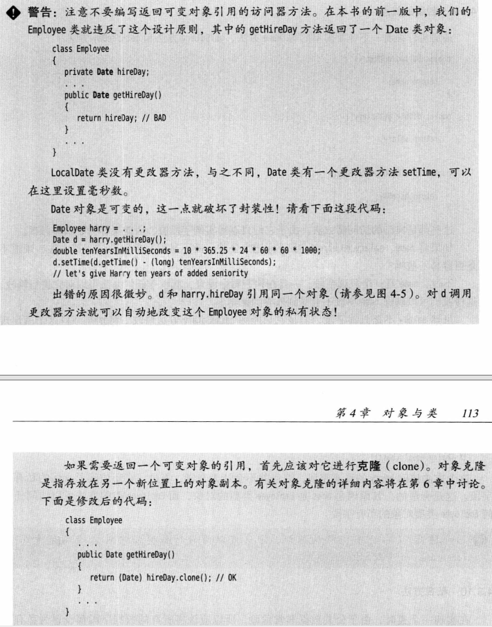
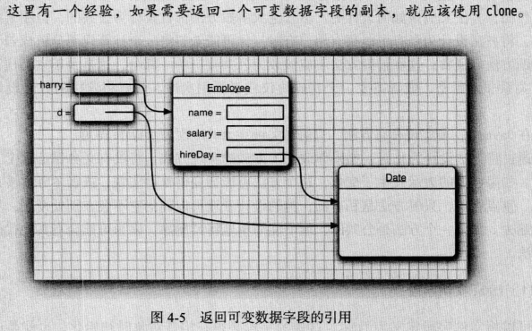
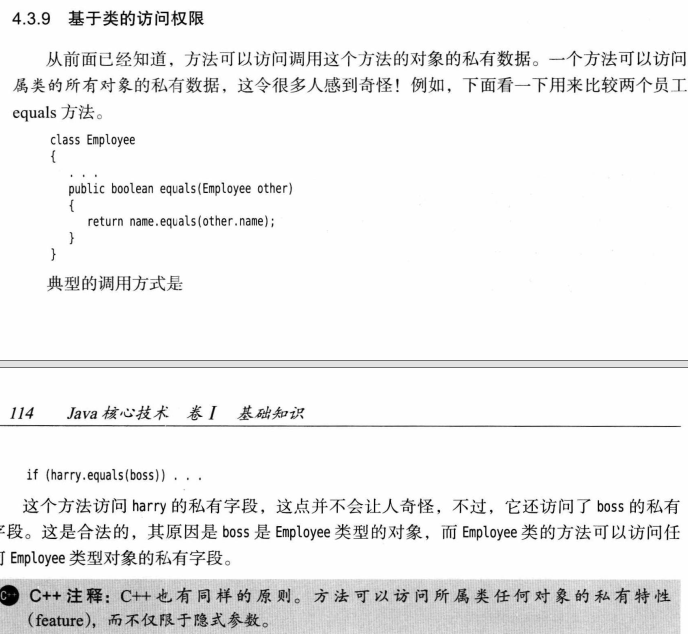
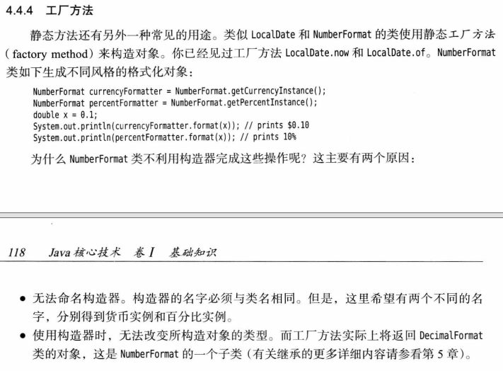
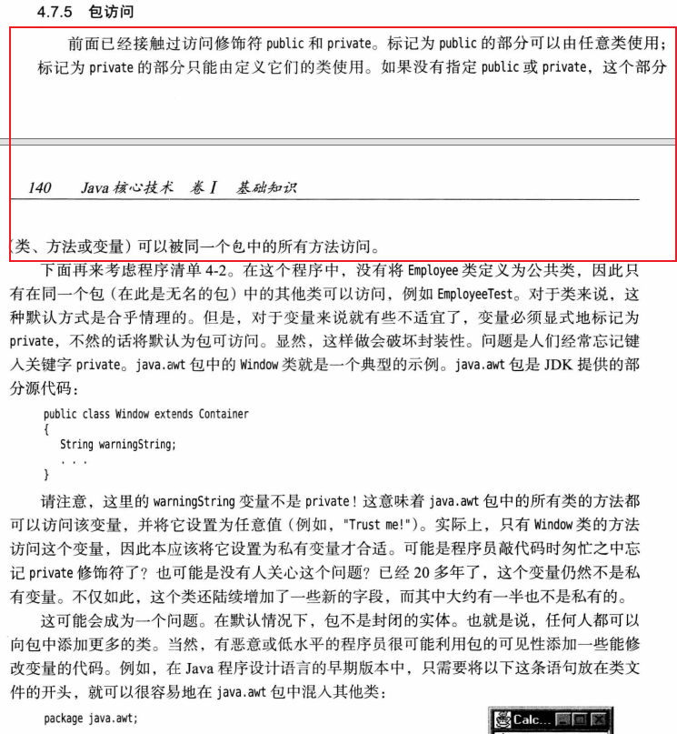
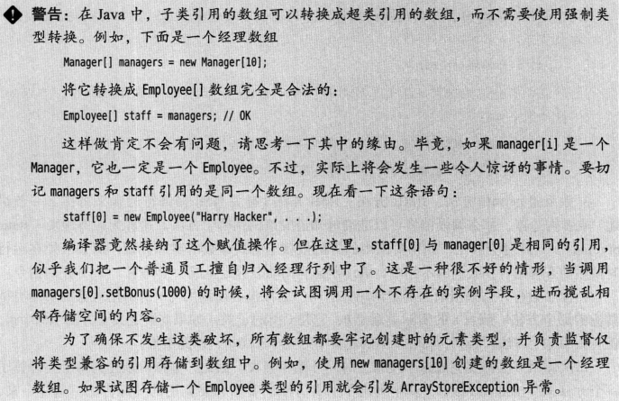
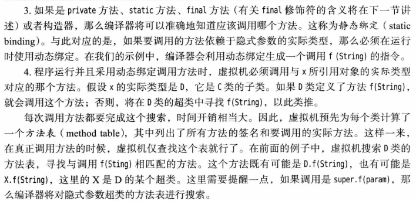
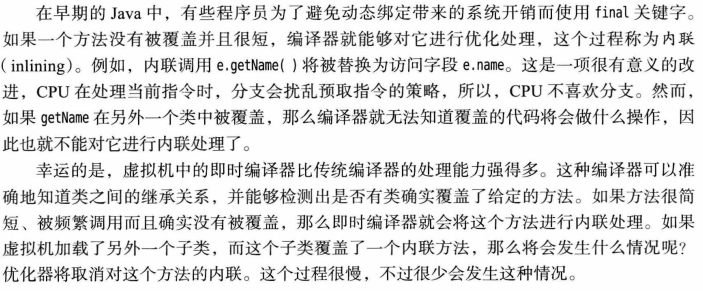

如果getter返回的是一个实例对象，虽然这个实例对象是private的，但是仍然可以在对象外部对其进行修改。所以最好返回一个clone()对象




**类的方法明确接收的参数是显式参数，在方法里除了直接使用显式参数，还可以使用所在实例的成员变量，这些变量构成方法的隐式参数（常通过this来访问）。**如果显式参数也是一个同类型的实例，那么在方法里可以直接访问入参对象的私有成员变量。

static 方法只能访问静态的成员，不能访问非静态的成员。可以认为静态方法没有this参数。this 不能引用类的静态成员，因为 this 代表的是类的一个实例，而静态成员不属于类的任何实例。





从编译器的角度看，嵌套的包之间毫无关系。例如，java.util 包和 java.util.jar包没有任何关系。每一个包都是独立的类的集合。





类的私有成员只能在本类内部访问，类的变量不能访问。子类会继承父类的私有成员，但是子类也不能直接访问父类的私有成员，而要使用super关键字调用父类的getter来访问，或者在子类的构造器中使用super调用父类的构造器来初始化从父类继承的私有成员变量。
```java
public class FirstName {
    private String firstName;

    public FirstName(String firstName) {
        this.firstName = firstName;
    }

    public String getFirstName() {
        return firstName;
    }

    public void setFirstName(String firstName) {
        this.firstName = firstName;
    }
}

public class FullName extends FirstName{

    private String lastName;
    private String fullName;

    public FullName(String firstName, String lastName) {
        super(firstName);
        this.lastName = lastName;
        //这里使用super.getFirstName()或者this.getFirstName()都行，因为子类没有重写这个方法
        //这里不能使用this.firstName。因为私有成员只能在本类内部访问，如果是protected成员就能在子类之中访问
        this.fullName = super.getFirstName() + "." + this.lastName;
    }

    public String getLastName() {
        return lastName;
    }

    public void setLastName(String lastName) {
        this.lastName = lastName;
    }

    public String getFullName() {
        return fullName;
    }

    public void setFullName(String firstName, String lastName) {
        super.setFirstName(firstName);
        this.lastName = lastName;
        this.fullName = super.getFirstName() + "." + this.lastName;
    }
}
```










