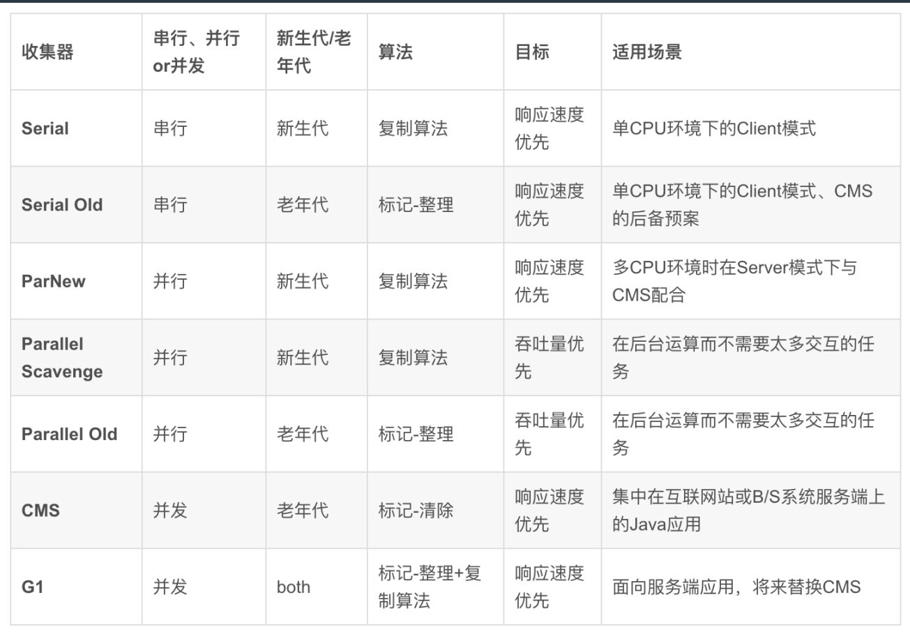

## 参考

> JVM成神之路：https://juejin.cn/post/7094121178373029895

## JVM启动参数

JVM 启动命令：`java [-option] 类名 [args...]`

option是JVM的参数，args是main()的参数。以 `-` 开头的是标准参数，所有 JVM 都要实现，向后兼容。`-D` 设置系统属性。`-X` 为非标准参数，不保证所有JVM都实现，也不想后兼容。`-XX` 为实验性的参数，未来可能取消，可以使用 +-Flags 对bool值开头，或者 key=value 指定具体的值。。

1. `-Xmx32m`：设置heap的最大空间
1. `-Xms10m`：设置heap的最小空间
1. `-Xss128k`：设置栈的最大空间
1. `-XX:+PrintGC`：输出GC的日志
1. `-X:loggc`：输出GC的日志(jdk9以上推荐)
1. `-server`：启用server模式。此模式下才能启用逃逸分析
1. `-XX:+DoEscapeAnalysis`：启用逃逸分析
1. `-XX:+EliminateAllocations`：开启标量替换（默认开启），允许将对象打散分配在栈上
1. `-XX:-UseTLAB`：关闭TLAB
1. `-XX:PermSize5m -XX:MaxPermSize5m`：设置永久代的大小（jdk8之前）
1. `-XX:MaxMetaspaceSize`：设置元空间的大小。和永久代不同，元空间是一块堆外内存，如果不指定大小，VM 会耗尽所有可用的系统内存。

**无参数启动 JVM 进程，默认最大 heap 是系统内存的1/4，其中 NewRation = 2，也就是 old generation：young generation = 2。其中新生代里：eden:s0:s1 = 8:1:1。**

## JVM 工具

**命令行工具：**

jps/jinfo：查看 Java 进程

- jps -lmv 

jstat：查看 JVM 内部 gc 信息

jmap：查看 heap 空间

jstack：查看线程信息

jcmd：用来调用其他命令

jrunscript/jjs：执行 js 命令

jhat：dump 内存

**图形工具：**

jconsole

j visualvm

idea 插件 visual GC

## GC 策略



jdk 8：并行gc

新生代：eden + s0 + s1，标记复制算法。

老年代：标记整理算法。


CMS（concurrent mark-sweep） gc：

始终有gc线程和应用线程一起并发执行，将并行gc大的停止时间分割成一个个小的停止时间。

处理老年代，使用标记清除算法，不整理，而是维护了一个空闲列表。

一般和 parNew 结合使用。


jdk 9 以后：G1

目的是将 stop the world 时间变成可预期和可配置的。不再分代，而是把heap分成许多（通常2048）个小块区域，每个小块在eden、survivor、old区不断变化。

每次回收所有新生代和部分老年代，优先回收垃圾最多的小块。

`-XX:+UserG1GC -XX:MaxGCPauseMillis=50`

## 逃逸分析和栈上分配

> https://zhuanlan.zhihu.com/p/612578226

逃逸分析是判断对象的作用域能够逃逸出函数体。

下面这段代码显示了一个逃逸的对象：User u 是一个实例变量，可能被任何线程访问，所以属于逃逸对象。

```java
private static User u;
public static void alloc() {
    u = new User();
    u.id = 1;
    u.name = "Tom";
}
```

下面的代码显示了一个非逃逸对象：方法执行完成后 User u 的引用将被回收，堆上分配的实例可以被回收。

```java
public static void alloc() {
    User u = new User();
    u.id = 1;
    u.name = "tom";
}
```

对于非逃逸的对象，虚拟机可能将其直接分配在栈上，这样就不用GC了。

下面这个简单的示例显示了对非逃逸对象的栈上分配：

```java
package geym.zbase.ch2.onstackalloc;

/**
 * 
 * -server -Xmx10m -Xms10m -XX:+DoEscapeAnalysis -XX:+PrintGC -XX:-UseTLAB  -XX:+EliminateAllocations
 * 
 * @author Geym
 *
 */
public class OnStackTest {
    public static class User{
        public int id=0;
        public String name="";
    }

    public static void alloc(){
        User u=new User();
        u.id=5;
        u.name="geym";
    }
    public static void main(String[] args) throws InterruptedException {
        long b=System.currentTimeMillis();
        for(int i=0;i<100000000;i++){
            alloc();
        }
        long e=System.currentTimeMillis();
        System.out.println(e-b);
    }
}
```

上述代码在主函数中进行了1亿次alloc()调用来创建对象，由于User对象实例需要占据约16字节的空间，因此，累计分配空间将近1.5GB。如果堆空间小于这个值，就必然会发生GC。使用注释中的JVM参数执行代码，可以看到，没有任何形式的GC输出，说明确实发生了栈上分配。

如果关闭了逃逸分析和栈上分配，就会看到大量的GC日志。

对于大量的零散小对象，栈上分配提供了一种很好的对象分配优化策略，栈上分配速度快，并且可以有效避免垃圾回收带来的负面影响，但由于和堆空间相比，栈空间较小，因此，大对象无法也不适合在栈上分配。
