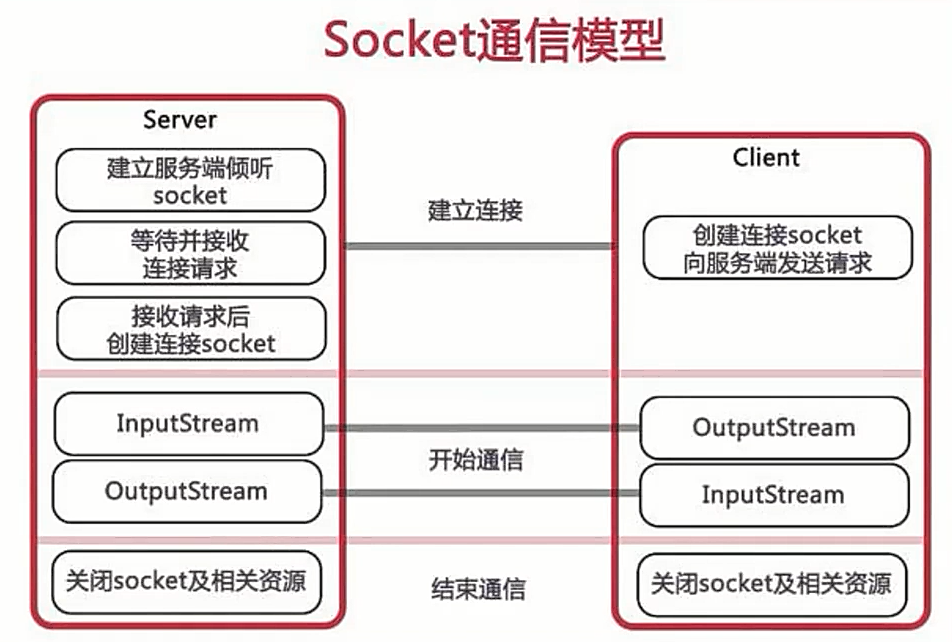
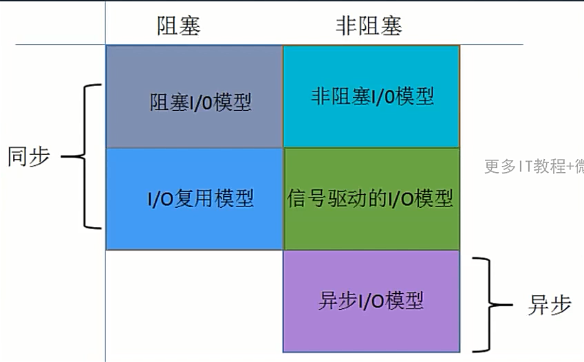
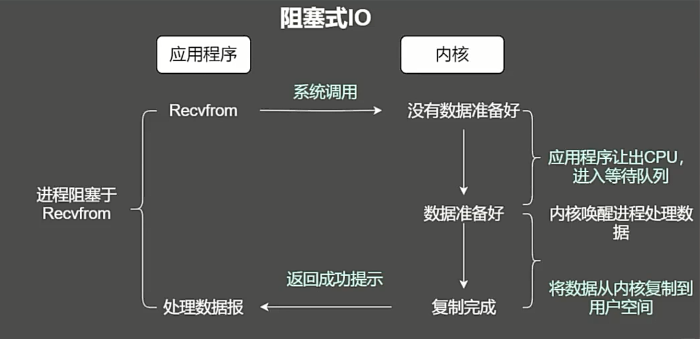
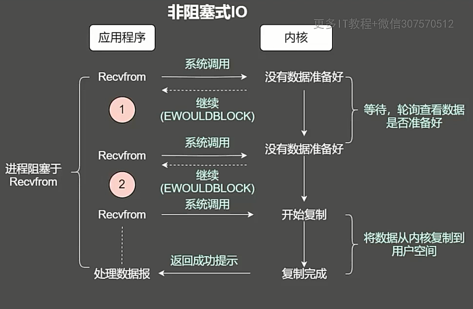
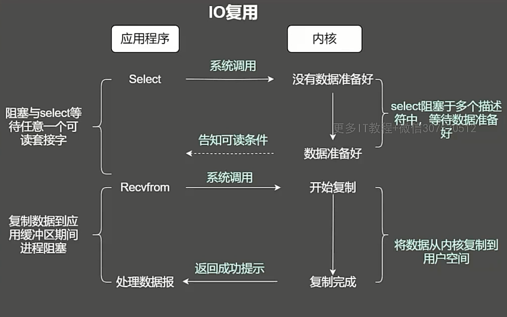

## 通信和IO模型

> [NIO从入门到踹门 (qq.com)](https://mp.weixin.qq.com/s/GfV9w2B0mbT7PmeBS45xLw)

传统服务器开发：

方式一：单线程一次处理一个socket、blockIO

方式二：多线程一个线程处理一个socket、blockIO

方式三：创建线程池，一个线程处理一个socket、blockIO

**同步异步是通信模式，阻塞、非阻塞是线程处理模式。**

**同步和异步，通俗点来讲就是调用方是否需要等待结果，如果需要等待结果，就是同步；如果不需要等待结果，就是异步**。

同步：代码是顺序执行的，下一步是确定的

异步：执行结果不同，调用的回调也不同，下一步是不确定的

阻塞式IO：只有一个线程处理 socket，处理完了才能接收下一个连接请求。

非阻塞IO：创建新线程去执行任务，原来的线程可以继续干其他事情。第一个阶段不是阻塞的，但是第二阶段需要不断轮询 kernel 数据好了没有，依然是阻塞的。

IO 多路复用：也称事件驱动IO，就是一个线程同时监控多个 socket，通过 select 和 poll 轮询负责的所有 socket，某个 socket 有数据到达了，就通知用户线程。IO 复用本质和非阻塞 IO 相同，只是由内核来负责轮询。看似比非阻塞 IO 还多了一个系统调用的开销，但是因为支持多路 IO，总体提高了效率。

epoll 目前代理了 select + poll 的方式：内核与用户空间共享一块内存，通过回调解决遍历的问题

## Netty

> [超详细Netty入门，看这篇就够了！ - 知乎 (zhihu.com)](https://zhuanlan.zhihu.com/p/181239748)

网络应用开发框架，支持几乎所有应用层协议

1. 异步
2. 事件驱动
3. 基于NIO