# 第1章 软件架构与需求分析方法

**学习目标**

- 能够掌握系统、子系统、模块、组件、服务、框架、架构等概念的含义
- 能够知道单体架构、分布式架构、微服务架构的适用场景、优势和劣势
- 能够知道微服务架构常见技术框架
- 能够了解组件化、服务化产生的原因、优势和问题，初步具备中台概念
- 了解常见的需求问题
- 掌握一个需求包含的要素
- 掌握如何做需求分析

# 1. 软件架构体系

## 1.1. 系统与子系统

**系统**：泛指由一群有关联的个体组成，根据某种规则运作，能完成个别元件不能单独完成的工作的群体。

- **关联**：系统是由一群有关联的个体组成的，没有关联的个体堆在一起不能成为一个系统。例如，把一个汽车发动机和一堆苹果放在一起不能称之为一个系统，把发动机、底盘、轮胎、车架组合起来才能成为一台汽车，构成一个系统。
- **规则**：系统内的个体需要按照指定的规则运作，而不是单个个体各自为政。规则规定了系统内个体分工和协作的方式。例如，汽车发动机负责产生动力，然后通过变速器和传动轴，将动力输出到车轮上，从而驱动汽车前进。
- **能力**：系统能力与个体能力有本质的差别，系统能力不是个体能力之和，而是产生了新的能力。例如，汽车能够载重前进，而发动机、变速器、传动轴、车轮本身都不具备这样的能力。

**子系统**：子系统也是由一群有关联的个体所组成的系统，多半会是更大系统中的一部分。 子系统的定义和系统定义是一样的，只是观察的角度有差异，一个系统可能是另外一个更大系统的子系统。

以微信为例来做一个分析：

- 微信本身是一个系统，包含聊天、登录、支付、朋友圈等子系统。
- 朋友圈这个系统又包括动态、评论、点赞等子系统。
- 评论这个系统可能又包括防刷子系统、审核子系统、发布子系统、存储子系统。
- 评论审核子系统不再包含业务意义上的子系统，而是包括各个模块或者组件，这些模块或者组件本身也是另外一个维度上的系统。例如，MySQL、Redis 等是存储系统，但不是业务子系统

## 1.2. 模块、组件、服务

- **模块**：是一套一致而互相有紧密关连的软件组织。它分别包含了程序和数据结构两部分。现代软件开发往往使用模块作为合成的单位
- **组件**：自包含的、可编程的、可重用的、与语言无关的软件单元，组件可以很容易被用于组装应用程序中

模块和组件都是系统的组成部分，只是从不同的角度拆分系统而已。例如：

- **从逻辑的角度来拆分系统后，得到的单元就是“模块”**；**从物理的角度来拆分系统后，得到的单元就是“组件”**。
- **划分模块的主要目的是职责分离；划分组件的主要目的是单元复用。**

例如我们要做一个学生信息管理系统，这个系统从逻辑的角度来拆分，可以分为：登录注册模块、个人信息模块、个人成绩模块；从物理的角度来拆分，可以拆分为应用程序、 Nginx、Web 服务器、MySQL等

- **服务：**服务和组件有某种相似之处：它们都将被外部的应用程序使用。两者之间最大的差异在于：组件是在本地使用的（例如Jar文件）；而服务是运行起来的，要通过同步或异步的远程接口来远程使用（例如RESTFul接口、web service、消息系统、RPC，或者socket）

服务是可以单独运行，并且对外提供功能的一种形式。可以将一个复杂的项目分解成多个服务。当某一个服务挂掉时不会拖垮整个系统。如果没有服务化，每当一个新的功能被添加到系统中就会影响到所有功能；如果采取服务化，每个服务只对其上下游的服务负责。 


## 1.3. 软件架构体系

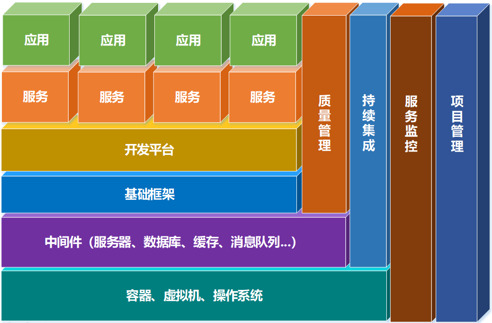 

# 2. 架构原则

## 2.1. 解耦

在软件工程中，耦合指的就是对象之间的依赖性。对象之间的耦合度越高，维护成本越高。因此对象的设计应使类和构件之间的耦合最小。软件设计中通常用耦合度和内聚度作为衡量模块独立程度的标准。**划分模块的一个准则就是高内聚低耦合。**

耦合性存在于各个领域，而非软件设计中独有的，理论上说绝对的零耦合是做不到的，但可以通过一些方法将耦合降至最低，降低耦合度即可理解为解耦，在设计上解耦的核心思想是【彼此独立，互不依赖】。

## 2.2. 分层

分层结构是最为流行、应用最广泛的应用软件的设计方式。在应用了分层结构的系统中，各个子系统按照层次的形式组织起来，上层使用下层的各种服务，而下层对上层一无所知。每一层都对自己的上层隐藏其下层的细节。 

**经典三层架构**：

在软件架构中，经典三层架构自顶向下由用户界面层、业务逻辑层、数据访问层组成。在提出该分层架构的时代，多数系统往往较为简单，本质上都是一个单体架构的数据库管理系统。这种分层架构有效地隔离了业务逻辑与数据访问逻辑，使得这两个不同关注点能够相对自由和独立地演化。经典的三层架构如下所示：

​	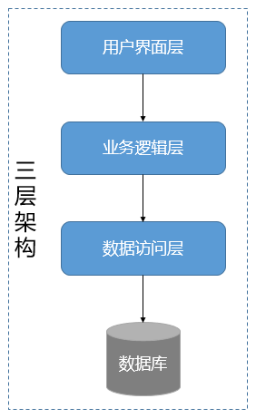 

**分层的设计原则是：保证同一层的组件处于同一个抽象层次**。即所谓的“单一抽象层次原则”。这一原则可以运用到分层架构中。比如下图所示：

 

## 2.3. 封装

假设我们有一个程序，它在逻辑上有一些不同的对象，并且这些对象彼此之间会相互交流。

**在一个类中，当每个对象的状态保持相对孤立，就实现了封装**。其余的对象并不能观察到这个对象的状态。他们能做到的只有调用一些被称作“方法”的通用功能。

因此，对象使用方法掌控着自己的状态，除非明确允许，没有其他人可以接触到它。如果你想和某个对象交流，你需要使用提供的方法。但在默认情况下，你无法改变对象的状态。

# 3. 架构的方法

架构图是为了表示软件系统的整体轮廓和各个组件之间的相互关系和约束边界，以及软件系统的物理部署和软件系统的演进方向的整体视图。要让干系人理解、遵循架构决策，就需要把架构信息传递出去，架构图就是一个很好的载体。不同的视角和角色，关注点也是不同的，看到的架构图是不一样的。   

## 3.1 业务架构

**使用者**：CEO、CIO、CTO、产品总监

**核心业务流程：**

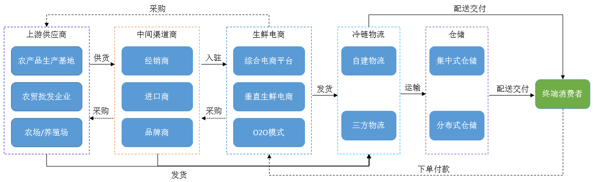 


 **核心能力:**

 

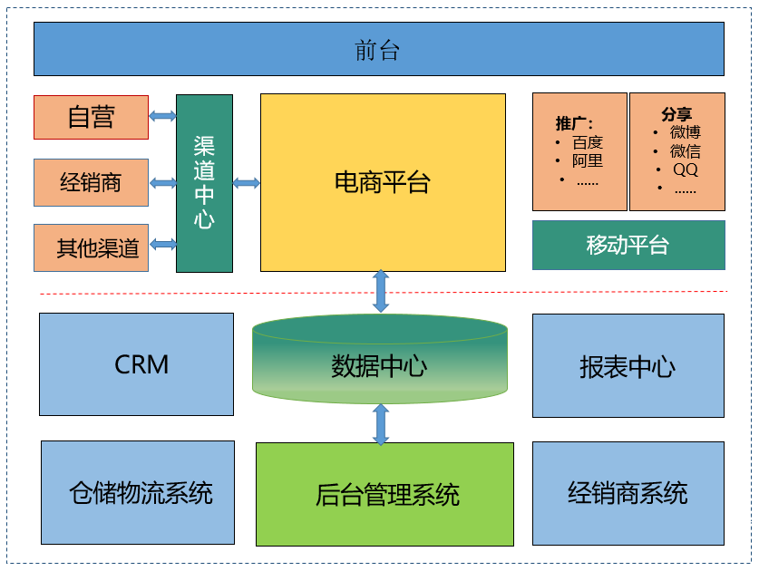  

## 3.2 功能架构

使用者：产品总监、产品经理

**示例：**黑马头条功能架构图

  

## 3.3 系统架构

使用者：系统架构师

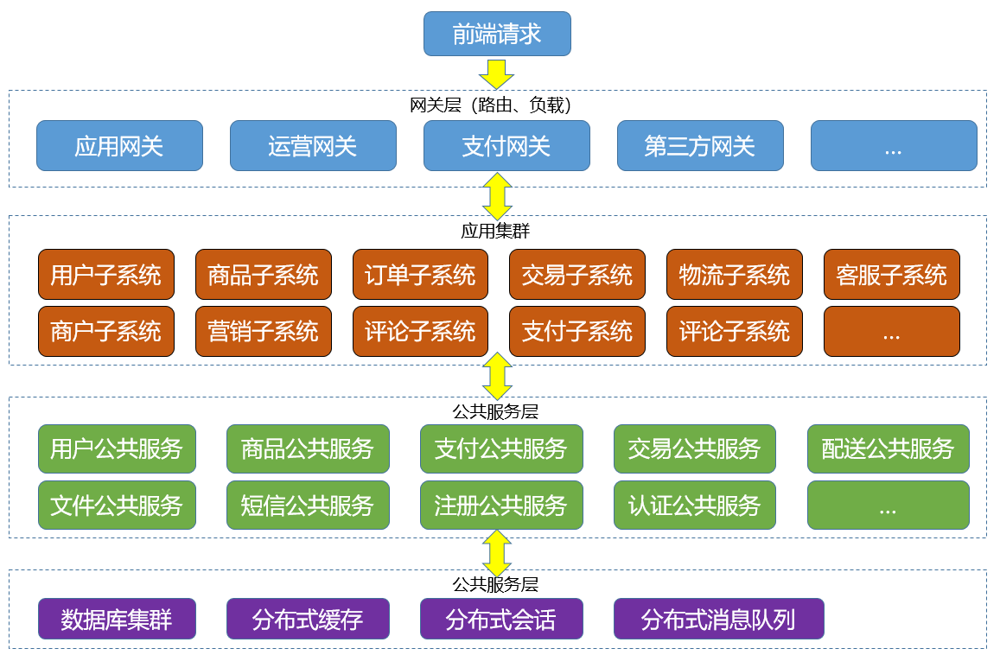 

## 3.4 技术架构

使用者：系统架构师

**示例一**：https://www.processon.com/view/5f2a0bfb1e08533a629b7ed3

**示例二**：冷链项目技术架构图

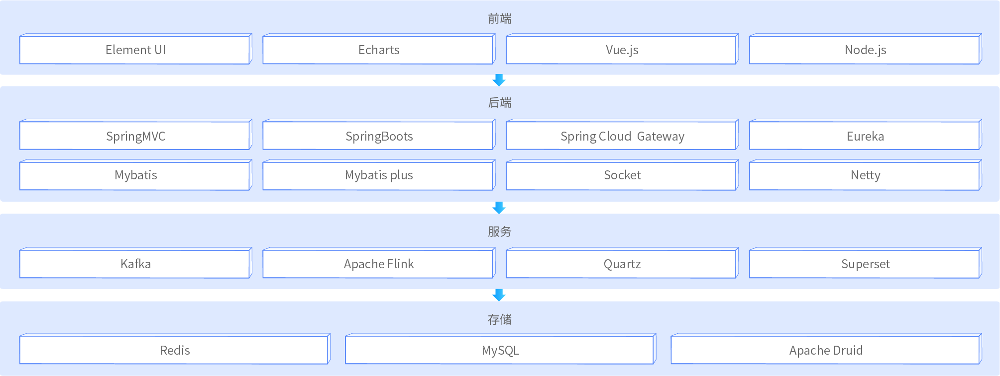 

## 3.5 数据架构

使用者：CTO、系统架构师、数据架构师

**示例一**：数据模型

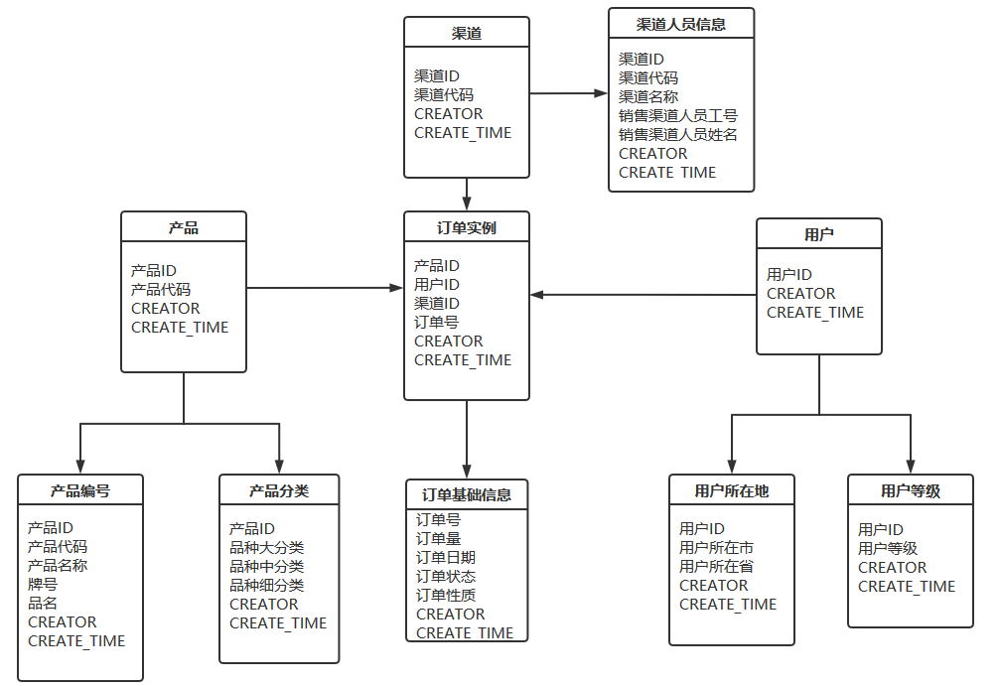 

**示例二**：大数据平台架构

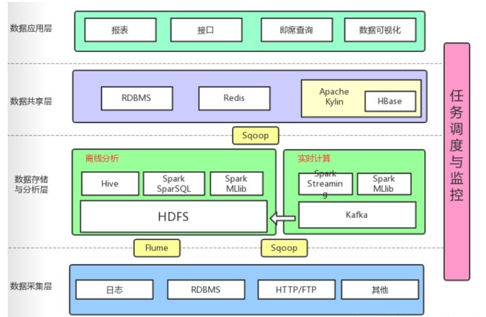 

## 3.6 部署架构

使用者：运维架构师

**示例一**：https://www.processon.com/view/5f2a03cf637689168e49e3fa

**示例二**：冷链项目部署架构图

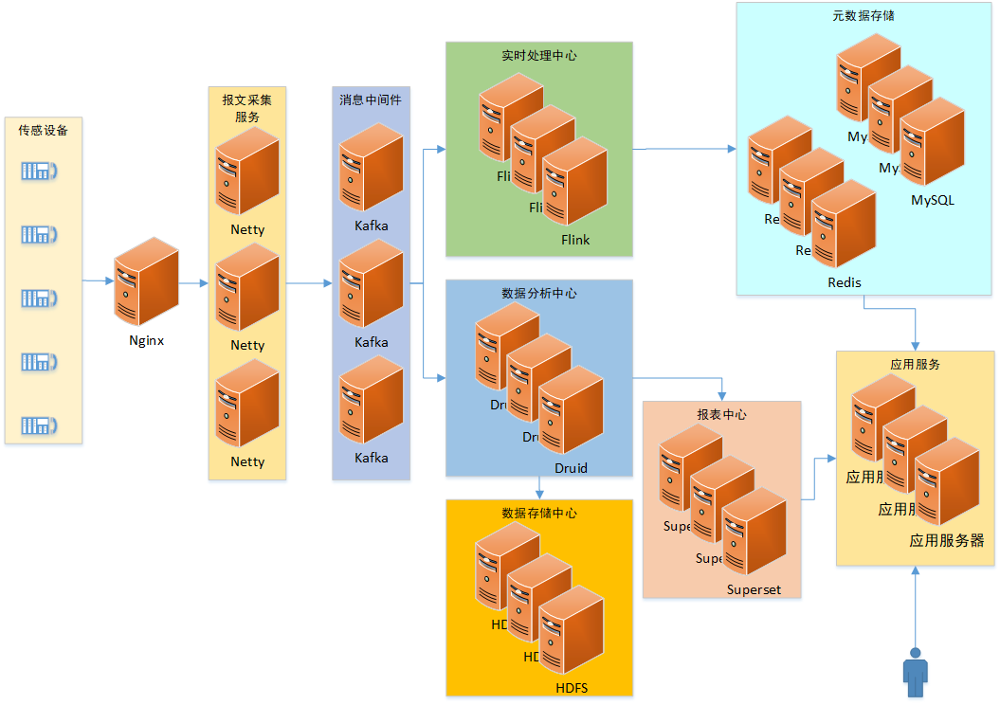

# 4. 架构演进之路

## 4.1. 单体架构

公司发展的初期，资金少、用户少，需要的软件产品的数据和并发量都比较小，这个时期大多数的软件系统只需要单一服务器就可以满足需求，所有的业务逻辑都在单一应用系统，单应用、单数据库。数据库部署在和应用相同的虚拟机或服务器上，或者放置在另外一台机器上。此时的架构图如下：

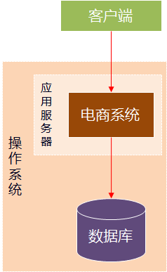          或      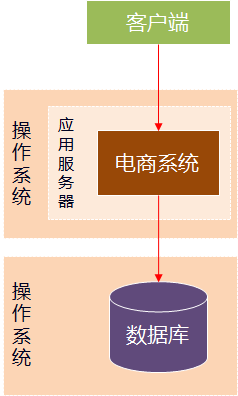 

- 操作系统：windows、linux
- 应用服务器：tomcat、jetty、jboos、apache、weblogic、websphere...
- 数据库：mysql、oracle、db2...
- 应用系统：可以用java、php、asp等各种语言开发

这种架构模式优点很明显：

- 节省服务器资源，投入少
- 管理简单：上线、部署、监控、问题排查等都比较简单
- 开发简单：软件系统功能整合在一起，不需要考虑太多服务依赖等问题，代码管理也比较简单明了。
- 测试简单

随着公司和业务进入快速发展时期，软件系统面临来自多方面的考验：

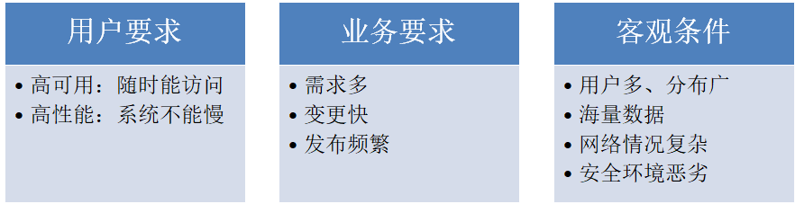 

单体架构的缺点也越发的凸显出来：

- 可用性差： 应用和数据库都是单点，无论应用还是数据库出现问题，整个系统的就会不可用了
- 稳定性差： 系统耦合度高，新增或者修改任何一个功能，哪怕只是一行代码，也需要重启服务器，此时系统是不可用的
- 性能差：单一的应用服务器和数据库服务器，性能总会有上限的，当用户变多或者准确的说相同时刻并发访问多时，系统就容易挂掉了

## 4.2. 分布式架构

单体架构有着明显的缺陷，随着系统访问量的增多，这些缺陷越来越凸显，为了解决这些缺陷，架构升级了，变成了分布式架构。分布式，就是多个实例提供服务。下面我们来简单介绍下常见的一些解决方案。

### 4.2.1 应用集群

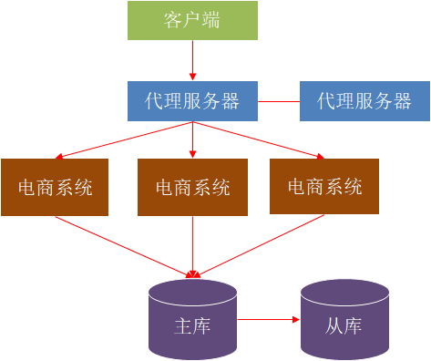  

- 反向代理服务器：把用户请求反向路由到应用服务器，常见的反向代理服务器是Nginx或HAProxy
- 应用服务器：集群化部署
- 数据库服务器：主从部署

架构优点：

- 可用性高：代理服务器、应用服务器、数据库服务器都是做了集群，当某台机器挂掉后，其他机器能够几乎无感的接替下任务
- 性能比单体架构高： 用户的请求分发到多个应用服务器上，整体性能接近单体结构的三倍
- 安全性高： 外网用户访问的是反向代理服务器，应用和数据库隔离在内网中

### 4.2.2 分布式缓存

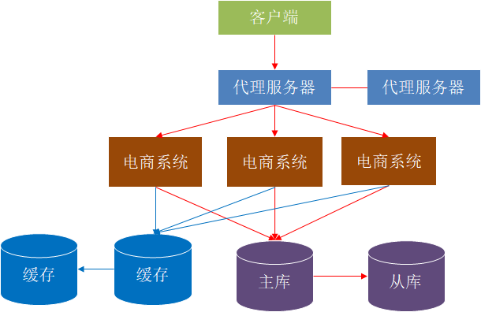 


缓存分为多级缓存，比如本地缓存（JVM中），分布式缓存服务器（Redis集群等）。本地缓存的访问速度更快一些，但是受应用服务器内存限制，其缓存数据量有限，而且会出现和应用程序争用内存的情况。远程分布式缓存可以使用集群的方式，部署大内存的服务器作为专门的缓存服务器，可以在理论上做到不受内存容量限制的缓存服务。常见缓存服务器包括Redis、Memcached等。使用缓存后，数据访问压力得到有效缓解。

### 4.3.3 业务拆分

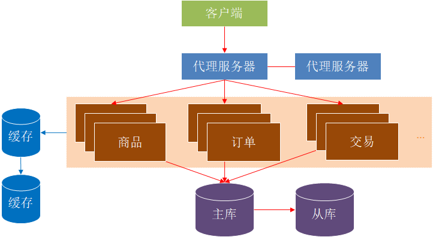   

业务进一步发展，用户越来越多，系统又出现了瓶颈，此时整个电商系统可以做系统拆分了，系统拆分分为水平拆分和垂直拆分。

**水平拆分：**

拆分成商品、订单、交易、用户、支付等多个系统，每个系统都都是多台服务器构成的集群。

**垂直拆分：**

将一些公共业务和服务，如用户中心拆分成注册登录中心和用户中心，短信、文件、消息等各种公共服务，从业务系统中拆分剥离出来。

这种架构的优势也比较明显，一方面，应用系统增加了，能够响应用户的请求也会变多，另一方面公共服务能够提供给所有的应用使用，达到服务复用的效果。但是大家需要注意的是数据库有可能只是一个，而单一数据库服务器的处理能力必然是有限的，随着用户并发量的持续增多，数据库将会是系统的瓶颈。

### 4.3.4 分库分表和读写分离

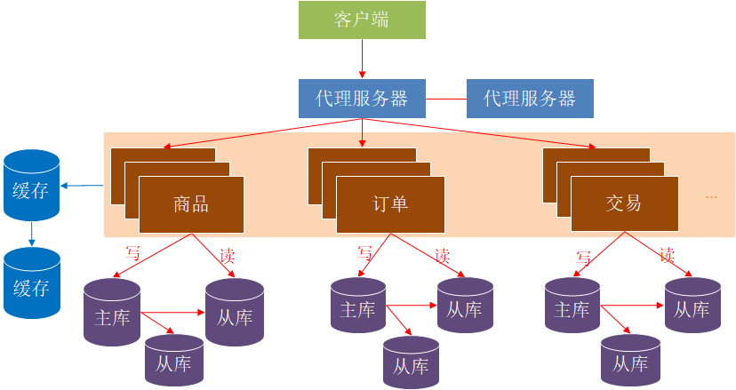  

**读写分离：**

在网站的用户达到一定规模后，数据库因为负载压力过高而成为网站的瓶颈。目前大部分的主流数据库都提供主从热备功能，通过配置数据库的主从关系，可以将一台数据库服务器的数据更新同步到另外的数据库服务器上。网站利用数据库的这一功能，实现数据库读写分离，从而改善数据库负载压力。

应用服务器在写数据的时候，访问主数据库，主数据库通过主从复制机制将数据更新同步到从数据库，这样当应用服务器读数据的时候，就可以通过从数据库获得数据。

**分库分表：**

随着数据库中的数据量越来越大，相应的，查询所需要的时间也越来越多，这个时候，相当于数据的处理遇到了瓶颈，另一方面单库发生意外的时候，需要修复的是所有的数据，而多库中的一个库发生意外的时候，只需要修复一个库。基于此，分库分表就成了必然。分库分表的策略很多，如按照用户、订单、交易、商品等进行分库，不同的数据库中按照时间进行分表。

分库分表带来性能上的显著提升，但相应的管理和维护成本也比较高，比如数据库服务器的维护、分表策略的维护。为了便于应用程序访问分库分表、读写分离后的数据库，通常在应用服务器端使用专门的数据访问模块，使数据库的分库分表和读写分离对应用透明。

### 4.3.5 静态化和CDN

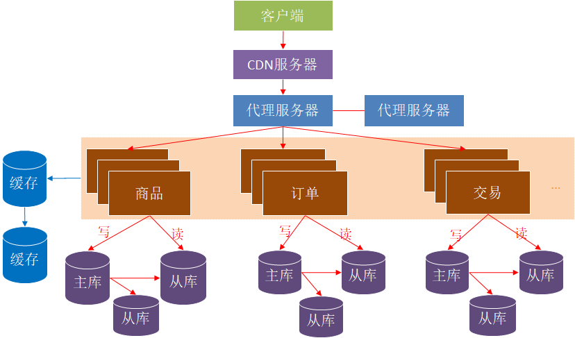 

随着网站业务不断发展，用户规模越来越大，和中国复杂的网络环境，不同地区的用户访问网站时，速度差别也极大。为了提供更好的用户体验，留住用户，网站需要加速网站访问速度。主要手段有使用页面的静态化和CDN。

操作方式上把一些页面，比如某些商品的详情信息，在发布商品时将页面静态化，静态化页面和静态资源可以放在CDN服务器，部署在网络服务提供商的机房，用户在访问静态资源时，可以很好的利用CDN的优点，从距离自己最近的网络提供商机房获取数据。

### 4.3.6 异步解耦

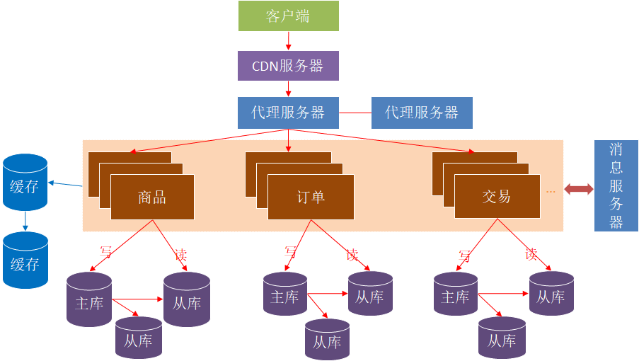 


应用之间的服务存在互相调用的情况，但有些场景下，并不需要同步调用，比如某个业务完成后，需要短信通知对方，而短信接收的时间晚几秒钟都是可以接受的，此时就不需要同步处理了，我们可以使用消息队列，把发送短信的内容扔到消息队列中，达到异步处理的效果，从而增强业务系统的性能，此时对于服务之间也达到了解耦的功能，服务之间的依赖减少了。

## 4.3. 微服务架构

微服务架构是分布式架构的深化，分布式架构偏向于部署和环境，比如上边提到的应用、数据库、缓存等，在多台机器上进行部署，就属于分布式。微服务架构通过**业务拆分**实现服务组件化，通过组件组合快速开发系统，业务单一的服务组件又可以独立部署，使得整个系统变得清晰灵活。

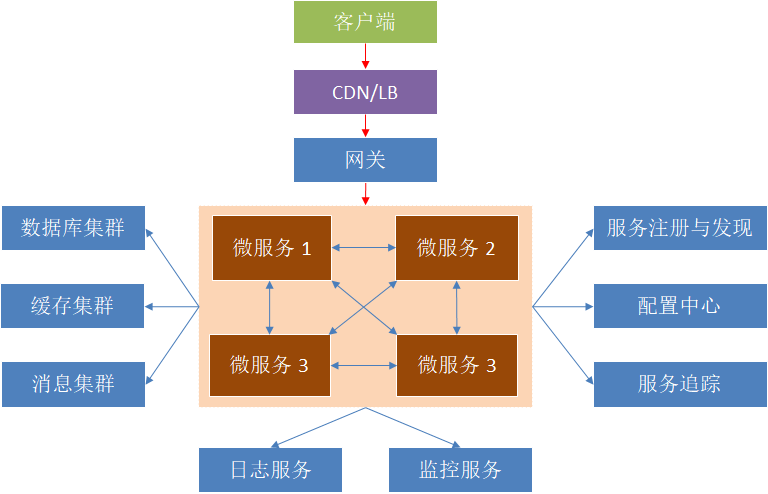 

大量的分布式服务又使得架构实现面临问题，如服务注册发现，服务统一接入和权限控制，服务的负载均衡，服务配置的集中管理，服务熔断，服务监控等。

所以微服务架构是由这些基础的服务组件和业务微服务组件共同组成：

- 服务注册发现组件： 进行服务治理
- 服务网关组件：提供统一入口和权限控制
- 负载均衡组件：提供客户端或服务器端的负载均衡
- 集中配置组件：提供服务集中管理
- 熔断器组件：提供服务熔断
- 服务追踪组件：提供服务监控	  

采用微服务架构后，项目可以快速迭代与持续交付。但是也带了一些弊端，开发人员除了需要关注业务逻辑实现外还需要考虑业务的一系列问题，比如服务注册，服务发现，服务通讯，负载均衡，服务熔断，服务超时等，这些是非常重要的。大多数时候，我们需要依赖第三方库或者组件来提供这些服务，例如Hystrix，Eureka、Zookeeper等组件，在其服务组织中起到了广泛的应用。 

# 5. 服务化

## 5.1 为什么需要服务化

传统企业或者很多企业的软件，大多不止一套系统，都是各个独立大系统的堆砌。整体存在的问题是：

- 扩展性差
- 可靠性不高
- 维护成本还很大
- 重复轮子很多

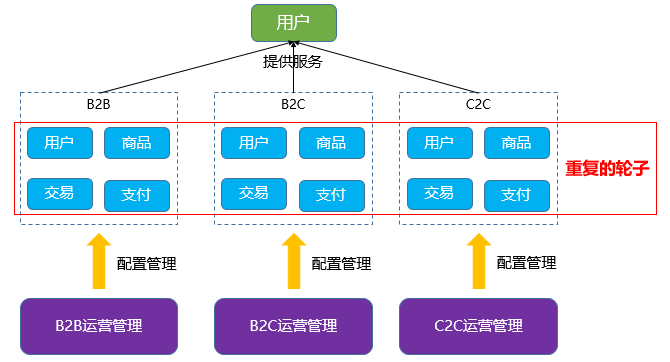 


非常容易能够想到，解决这些问题的方法是：**组件化、服务化**。

微服务架构，将各个组件或者模块分散到各个服务中，对整个系统实现解耦。那微服务架构强调的重中之重就是业务系统需要完善的组件化和服务化。什么是组件化？

组件化，即将一个大系统，按照一定的业务或者技术维度，拆分成独立的组件。目的是为了分而治之，为了可重用，为了减少耦合度。比如按照技术维度：文件上传下载组件、短信发送组件、搜索组件、缓存组件；按照业务维度：用户中心、商品中心、支付中心等。

阿里巴巴提出 大中台，小前台战略，就是把组件化、插件化、服务化解决方案到极致。通过产品线公共业务或者技术下沉，形成各种技术中台或者业务中台。

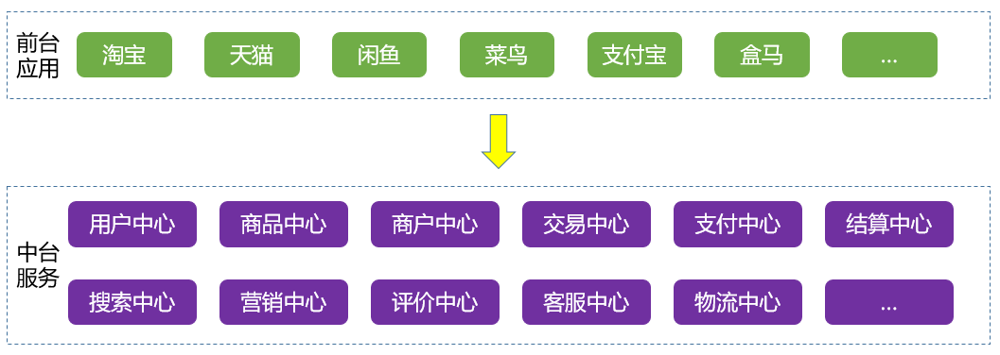 

## 5.2 服务化的好处

- 调用简单
- 代码复用
- 业务隔离
- 数据库解耦

## 5.3 服务化的问题

 有利必有弊，服务化也会面临很多问题：

- 本身不大的系统，业务不复杂的系统也不需要微服务架构
- 多个模块数据库，分布式事务是一个挑战
- 增加了测试、运维等事务的复杂性

# 6. 常见的需求问题

## 6.1. 需求不明确

- 盲人摸象，各阶段人员只掌握了一段
- 初期阶段，业务还在摸索
- 各部门目标和kpi不一致，需求有冲突

## 6.2. 需求理解不一致

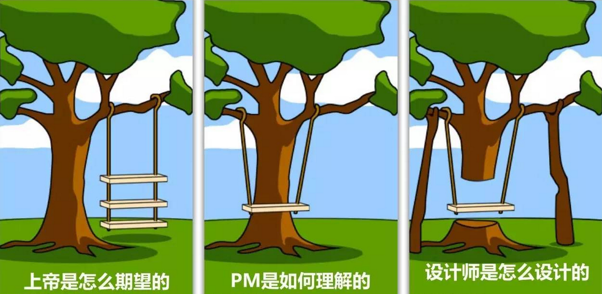

> **客户**：我家有三个小孩，我须要一个能三个人用的秋千。它是由一绳子吊在我园子里的树上。
>
> **项目经理**：秋千这东西太简单了，就是一块板子，两边用绳子吊起来，挂在树上的两个枝子上。
>
> **设计师**：这个无知的项目经理，两个树枝上挂上秋千哪还能荡漾起来吗？除非是把树从中截断再支起来，这样就满足要求了。

项目最重要的阶段是进行需求分析，明白真正的需求。项目需求指的是用户真正需要什么，而不是供应商假设用户需要什么和供应商能够供应什么。需求的准确定位就是要按用户要求，对目标系统提出完整、准确、清晰、具体要求。这对一个项目的成功来说非常重要，需求分析做得不好，就会造成需求不断变更，从而影响进度、费用，甚至会导致项目失败。

## 6.3. 需求自身经常变动

- 尽可能地分析清楚哪些是稳定的需求，哪些是易变的需求。以便在进行系统设计时，将软件的核心建筑在稳定的需求上，否则将会吃尽苦头。
- 在合同中一定要说清楚“做什么”和“不做什么”。如果合同含含糊糊，日后扯皮的事情就多。

# 7. 需求获取

## 7.1 需求来源

**干系人**

干系人（Stake holder）：对于系统有利益关系的个人，团队、组织和其他系统。

项目干系人包括但不限于：

- 投资方：系统的投资方
- 主管方：批准/管理系统的
- 最终用户：用户/系统受益方
- 操作方：操作/维护系统的
- 监管方：认证系统的
- 测试方：负责系统验收

示例：XX信贷管理系统

```
投资方：     资金部
主管方：  	 信息化部
用户代表：   市场部
最终用户：   营业员
监管方：     审计部
测试方：     信息化部
操作方：     信息化部
```

## 7.2 需求分类

软件需求的三个层次：

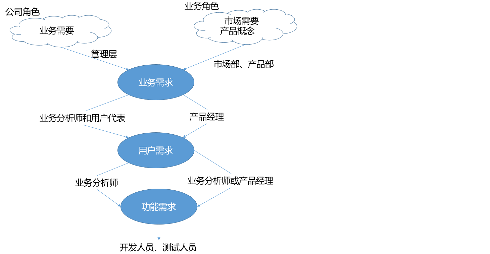

**1. 业务需求**

描述组织或客户的高层次目标，通常问题定义本身就是业务需求。业务需求就是系统目标，它必须是业务导向、可度量、合理、可行的。这类需求通常来自于高层，例如项目投资人、实际用户的管理者、市场营销部门或产品策划部门。

业务需求从总体上描述了为什么要开发系统**（why）**，希望达到什么目标。比如“希望实施CRM后公司的客户满意度达到80％以上”。

业务需求对之后的用户需求和功能需求起了限定作用，任何用户和功能需求都必须符合业务需求。

**2. 用户需求**

用户需求是指描述用户使用产品必须要完成什么任务，怎么完成需求，通常是进行用户访谈、调查，对用户使用的场景进行整理，从而建立从用户角度的需求。

用户需求必须能够体现软件系统将给**用户带来的业务价值** ，也就是说用户需求描述了用户能使用系统来做些什么（**what**），这个层次的需求是非常重要的。

用户需求可细分为：

- **基本型需求：**产品功能必须满足的用户需求。例如社交产品的加友功能；音乐产品的听歌功能。

- **期望型需求：**用户满意度随着此类需求的满足程度而线性提升或下降。当此类型需求越得到满足则用户满意度越高，反之则用户满意度越低。例如，音乐类产品的歌曲越多越好。

- **兴奋型需求：**是一种完全出乎用户意料的属性或功能。例如微信的摇一摇。

- **无差异型需求：**这类需求无论满足与否，用户满意度都不会受其影响，用户对此因素并不在意。例如产品的简介。

- **反向型需求：**用户没有此需求，提供后满意度适得其反。例如产品付费功能。

**3. 功能需求**

功能需求描述的是开发人员需要实现什么，是需求的主体，它描述的是开发人员如何设计具体的解决方案来实现这些需求（**how**），其数量往往比用户需求高一个数量级。 

这些需求记录在软件**需求规格说明（Software Requirments Specification）**中。 SRS完整地描述了软件系统的预期特性。开发、测试、质量保证、项目管理和其他相关的项目功能都要用到 SRS。

## 7.3 获取步骤

> 我们必须知道获取需求的具体步骤

1. 标识项目干系人： 干系人列表
2. 与项目干系人交流：沟通计划
3. 收集需求：  需求沟通纪要
4. 重要性排序：需求优先级
5. 选择需求：  根据资源和约束，选择实现的需求
6. 记录需求：编写文档

软件研发是一个团队性工作，各个角色协同工作，共同把项目完成。每个阶段和角色的产出，又是下一阶段和角色的输入。比如作为架构师，会根据产品经理编写的功能需求说明书，进行整体系统架构设计，而开发人员，也会根据产品经理的需求说明书和架构师的概要设计，做详细的设计和开发。

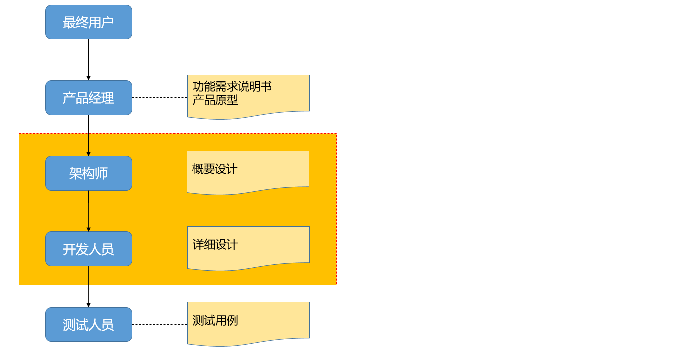

# 8. 需求要素

## 8.1 角色、场景

一般来说每个业务活动是对用户使用场景的抽象（例如电商购物活动），每个业务活动可能包含多个场景（例如商品浏览、购物车、下单、支付），分析使用场景时应按照业务活动为主线逐个进行分析，每个业务活动分析时应包含如下内容：

**1.明确活动执行角色**

**2.明确活动执行的前置条件**

**3.明确不同场景：**

一个业务活动可能包含正常的使用场景、备选使用场景和异常使用场景

**4.明确每个场景的执行步骤**

**5.业务规则和约束：**

明确在每个业务活动下应遵循的业务规则和约束，这里一般是与业务流程相关的行为规则，或与数据实体相关的数据规则（比如某个字段的长度）

## 8.2 业务流程

针对流程类需求必须进行业务流程分析。需求人员进行流程分析应遵循如下方法：

（1）业务流程确认

一个流程为一个业务事件，一般是外部角色发起或系统内部主动发起（比如时间事件或状态事件），发起后会触发一系列业务活动。

（2）角色及业务活动确认

流程图中的每个泳道都必须对应到角色，每个角色对应多个业务活动。需求人员在确认业务活动时一定要保证活动的粒度，一个业务活动一定是由一个角色完成且每个业务活动都是有价值的。

（3）业务活动间关系及数据确认

确定所有业务活动的前后关系，并明确流程间传递的数据实体。

（4）流程整体瓶颈分析

一般若某个角色业务活动工作量较大，或流程涉及高级领导，一般都会造成瓶颈，这种情况需求人员应想办法分散工作量提出流程优化建议。

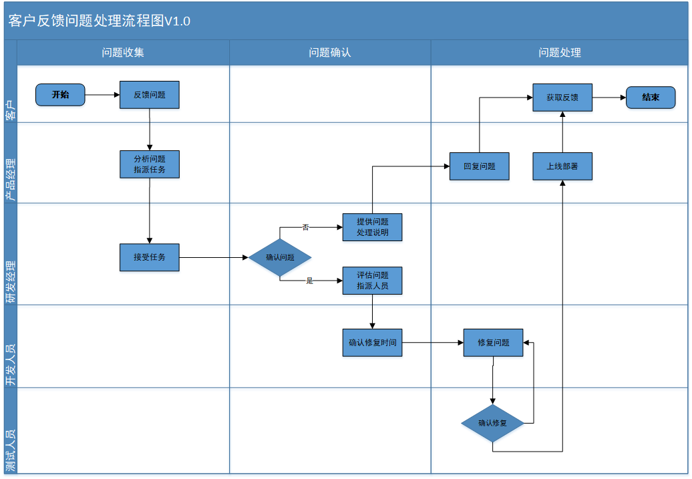

## 8.3 数据实体

针对流程类需求需要分析各业务活动传递的数据实体，统计分析类需求需要分析统计查询条件数据实体和展现数据实体，接口类需求需要分析接口传递数据实体，具体分析包含如下内容：

**1.明确数据实体**

确认需要分析的所有数据实体，明确哪些为系统原有实体、哪些为新增实体、哪些为改造实体。

**2.明确所有数据实体间关系**

实体间关系包含（1对1、1对多、多对多），另外需要分析数据实体变更是否需要保留版本，实体删除（逻辑删除、物理删除）是否影响其它数据实体。

**3.明确数据实体字段**

针对新增数据或改造数据实体需要明确新增字段的名称、字段类型、是否必填、字段取值方式（人工输入、系统自动继承自其它数据实体、系统自动计算需要明确计算公式）。

**4.数据权限分析**

需要分析不同角色在数据权限方面的差异，若涉及纵向多级用户，要说明对于集团/省/地市用户的数据隔离。

## 8.4 功能性需求

系统功能分析是结合系统现状和上述分析进一步明确实现相应用户场景的系统功能，主要还包含内容如下：

**1.功能列表**

分析得出实现上述业务活动对应的功能/接口列表，并明确新增功能、改造功能；

**2.功能/接口关联影响分析**

实现某个业务活动需要新增或改造的功能对其它关联功能/接口的影响分析。比如改造请购池受理功能，可能会影响采购项目创建功能；采购项目创建功能修改一个字段取值范围，会影响项目统计分析和同步ES系统接口。

**3.系统交互原型分析**

需求人员应遵循界面规范，并与研发沟通确定系统交互原型，帮助研发或用户更好的理解需求场景。

在交互原型中应包含如下内容：

- 原型界面的名称、入口，原型间关联关系和使用角色
- 页面内容、格式及排序方法
- 操作要点：比如交互的信息提示、界面规则和约束（比如界面以不同颜色显示不同的校验结果）。

**4.算法分析：**

在系统功能交互时涉及比较复杂的算法，需要单独对算法进行分析。

## 8.5 非功能性需求

包含需求的可行性分析、健壮性分析、可扩展性分析、执行效率分析，可行性分析从以下几个方面进行：

**1.技术可行性** 系统交互实现方式与研发确认是否可行，需求人员在与研发沟通过程中需要不断积累哪些功能实现在技术层面很难支撑。

**2.时间可行性** 根据用户的上线时间要求分析是否可满足要求。

**3.合法合规可行性** 分析用户需求是否满足国家法规或公司法规要求。

**4.数据安全性分析** 用户需求是否满足信息系统安全要求。

# 9. 案例：电商订单系统

## 9.1 概述

电商所有模块中，订单系统是非常核心的一个子系统，决定了整个流程能不能顺畅的执行，起着承上启下的作用，其他模块都是围绕订单系统进行构建的。订单系统出问题，或者功能流程设计不完善、不准确，将会造成整个电商系统整体或局部业务流转不顺畅，甚至导致项目的失败。

订单系统的作用是：管理订单类型、订单状态，收集关于商品、优惠、用户、收货信息、支付信息等一系列的订单实时数据，进行库存更新、订单下发等一系列动作。订单系统业务的基本模型涉及用户、商品（库存）、订单、付款。订单基本流程是下订单-->减库存，这两步必须同时完成，不能下了订单不减库存（超卖），或者减了库存没有生成订单（少卖）。

下面我们从需求分析的角度，来看一看B2C电商中先款后货模式下的订单系统设计的过程。

## 9.2 角色

一个订单系统，涉及到的角色包括：

**实体角色：**

- C端用户
- B端商户
- 电商平台
- 配送商
- 第三方平台

**系统关系：**

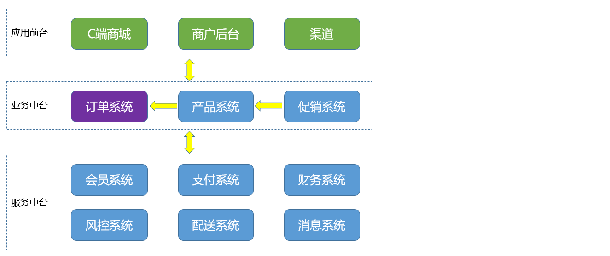

## 9.3 场景(用例)

从用户的角度，我们看到的用户场景如下：

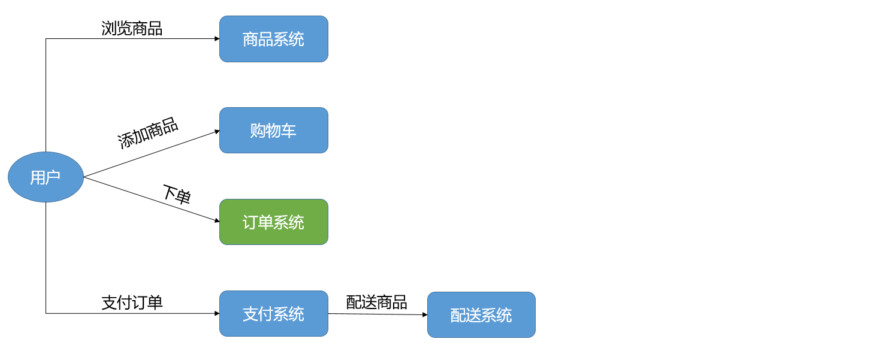

**用例图：**

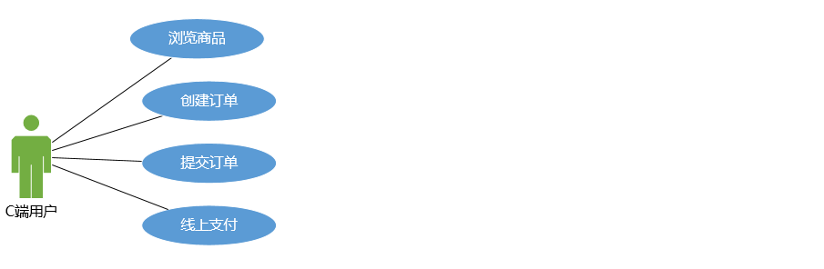

## 9.4 功能

**订单系统业务架构：**

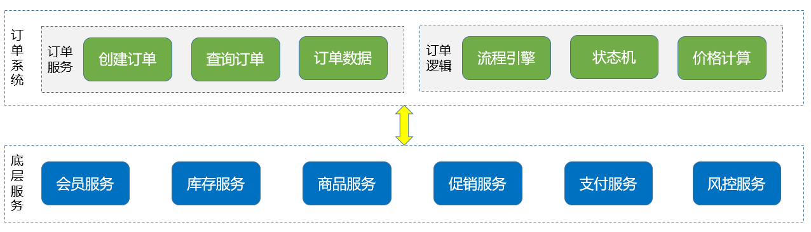

**（1）订单服务**

该模块的主要功能是用户日常使用的服务和页面，主要有订单列表、订单详情、在线下单等，还包括为公共业务模块提供的多维度订单数据服务。

**（2）订单逻辑**

订单系统的核心，起着至关重要的作用，在订单系统负责管理订单创建、订单支付、订单生产、订单确认、订单完成、取消订单等订单流程。还涉及到复杂的订单状态规则、订单金额计算规则以及增减库存规则等。在4节核心功能设计中会重点来说。

**（3）底层服务**

信息化建设达到一定程度的企业，一般会将公司公共服务模块化，比如：产品，会构建对应的产品系统，代码、数据库，接口等相对独立。但是，这也带来了一个问题，比如：订单创建的场景下需要获取的信息分散在各个系统。

如果需要从各个公共服务系统调用：一是会花费大量时间，二是代码的维护成本非常高。因此，订单系统接入所需的公共服务模块接口，在订单系统即可完成对接公共系统的服务。

## 9.5 实体

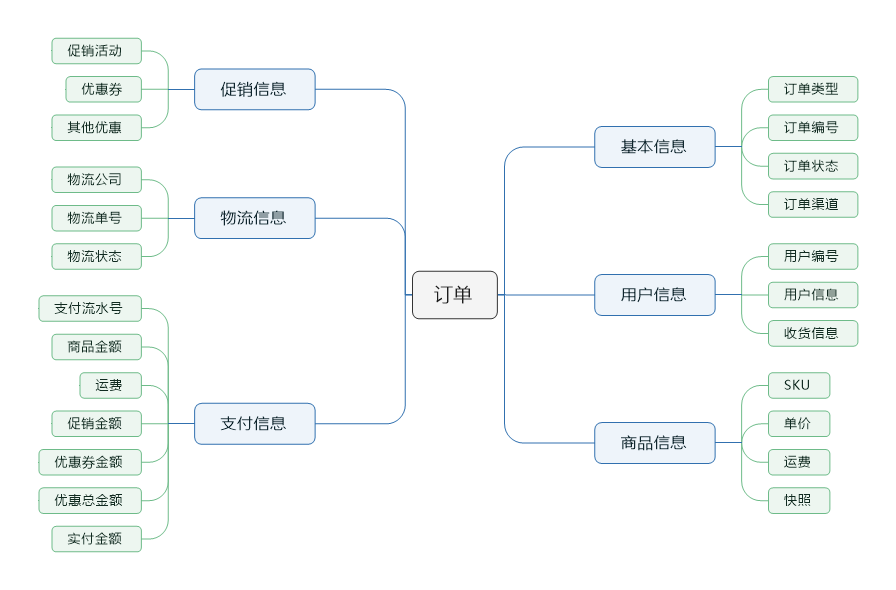

## 9.6 流程

流程是指从平台角度出发，将订单从创建到完成的整个流转过程进行抽象，从而形成了一套标准流程规则。每个流程触发的条件又可分为系统触发和人工触发两种场景。

下面以一个通用B2C商城的订单系统为例，根据其实际业务场景，其订单流程可抽象为5大步骤：**订单创建>订单支付>订单生产>订单确认>订单完成。** 如下图：

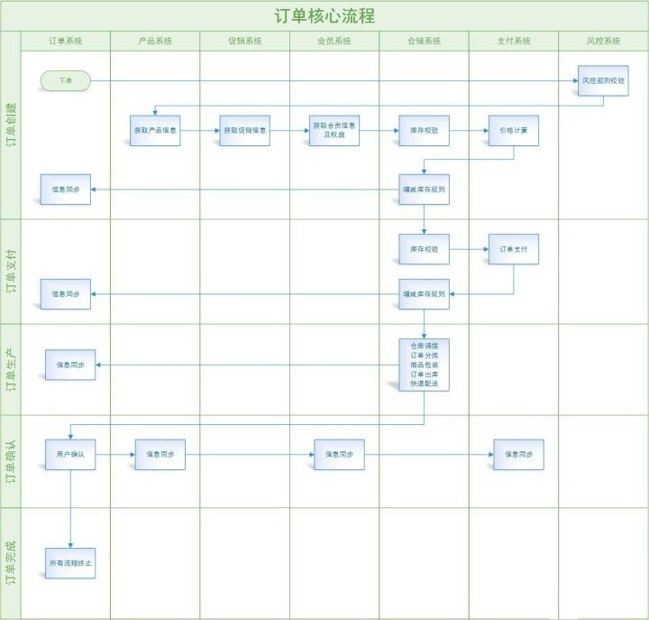


