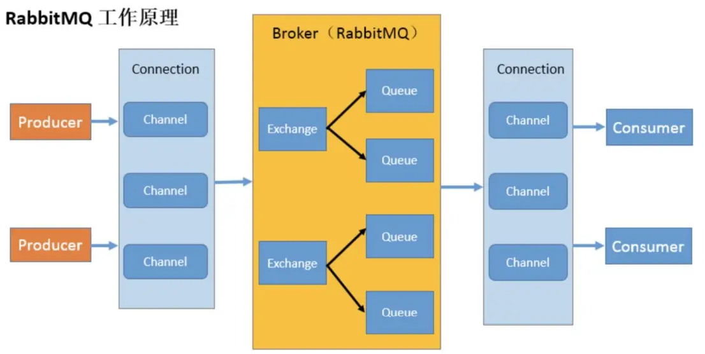

## MQ 的作用

1. 流量削峰
2. 异步解耦

## JMS

Java Message Service 是 Java 访问消息中间件（Message Oriented Middleware）的接口规范。常用的消息中间件基本都实现了 JMS 规范。

一些专业术语：

- provider：生产者
- consumer：消费者
- PTP：点对点消息模型
- Pub/Sub：发布/订阅消息模型
- Queue：消息队列，通常都会持久化保存
- Topic：主题
- Destination：消息的目的地

## AMQP

支持事务，数据一致性高，多用于银行等行业。典型实现是 RabbitMQ

专业术语：

1. queue
2. exchange 交换机：是 RabbitMQ 非常重要的一个部件，一方面它接收来自生产者的消息，另一方面它将消息推送到队列中。交换机必须确切知道如何处理它接收到的消息，是将这些消息推送到特定队列还是推送到多个队列，亦或者是把消息丢弃
3. binding

## Kafka

> [kafka-1hour: kafka一小时入门精讲笔记 B站配套视频：https://www.bilibili.com/video/BV1h94y1Q7Xg (gitee.com)](https://gitee.com/jeff-qiu/kafka-1hour)

同一类型的数据归为一个 topic，一个 topic 又可以分区（partition）存放在不同的服务器上。

放入分区中的消息有偏移量，偏移量是递增的。**消息只可以取出，不可以读取内容。**

消息是以 Key：value 方式存储的。默认 key 为 null，以轮询的方式将消息存入不同的分区中。如果指定了 key，则以 hash 的方式存入分区。

replication-factor=3：主分区 + 副本一共保存3份。主分区称为 leader、副本称为 follower。

## RabbitMQ



需要 erlang 语言的环境。默认浏览器访问端口 15672，Java 客户端 5601、5602。

> [RabbitMQ 安装 | xustudyxu's Blog (frxcat.fun)](https://frxcat.fun/middleware/RabbitMQ/RabbitMQ_install/)

添加可以远程访问的用户：

```shell
# 创建账号和密码
rabbitmqctl add_user 用户名 密码

# 设置用户角色
rabbitmqctl set_user_tags 用户名 角色

# 为用户添加资源权限，添加配置、写、读权限
# set_permissions [-p <vhostpath>] <user> <conf> <write> <read>
rabbitmqctl set_permissions -p "/" 用户名 ".*" ".*" ".*"
// Make sure to add code blocks to your code group
```

角色固定有四种级别：

- `administrator`：可以登录控制台、查看所有信息、并对rabbitmq进行管理
- `monToring`：监控者；登录控制台，查看所有信息
- `policymaker`：策略制定者；登录控制台指定策略
- `managment`：普通管理员；登录控制