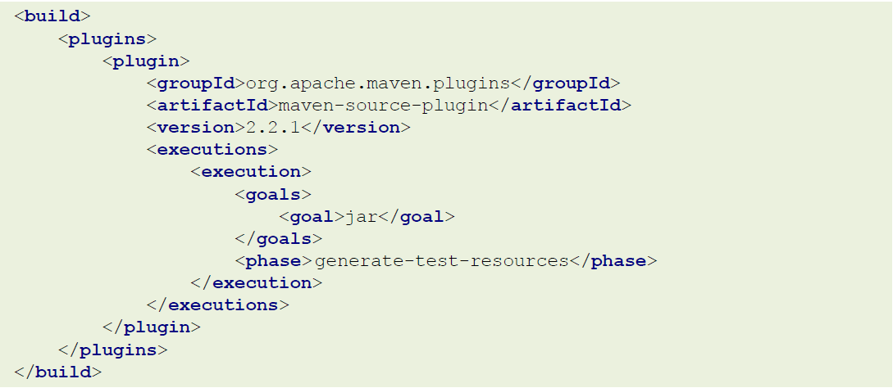

# Maven基础

## Maven简介

​**Maven的本质是一个项目管理工具，将项目开发和管理过程抽象成一个项目对象模型（POM）**

Maven是用Java语言编写的。他管理的东西统统以面向对象的形式进行设计，最终他把一个项目看成一个对象，而这个对象叫做POM(project  object model)，即项目对象模型。

Maven通过加载 pom.xml 配置文件就可以知道我们项目的相关信息。那Maven是如何帮我们进行项目资源管理的呢？这就需要用到Maven中的第二个东西：**依赖管理**。这也是它的第二个核心！

所谓依赖管理就是maven对项目所有依赖资源的一种管理，它和项目之间是一种双向关系，即当我们做项目的时候maven的依赖管理可以帮助你去管理你所需要的其他资源，当其他的项目需要依赖我们项目的时候，maven也会把我们的项目当作一种资源去进行管理，这就是一种双向关系。

Maven除了帮我们管理项目资源之外还能帮助我们对项目进行构建，管理项目的整个生命周期，当然它的这些功能需要使用一些相关的插件来完成，当然整个生命周期过程中插件是需要配合使用的，单独一个无法完成完整的生命周期。

Maven的作用我们可以分成三类：

（1）项目构建：提供标准的，跨平台的自动化构建项目的方式

（2）依赖管理：方便快捷的管理项目依赖的资源（jar包），避免资源间的版本冲突等问题

（3）统一开发结构：提供标准的，统一的项目开发结构，如下图所示：


各目录存放资源类型说明：

**src/main/java**：项目java源码

**src/main/resources**：项目的相关配置文件（比如mybatis配置，xml映射配置，自定义配置文件等）

**src/main/webapp**：web资源（比如html，css，js等）

src/test/java：测试代码

src/test/resources：测试相关配置文件

src/pom.xml：项目pom文件


## Maven基础概念

仓库：用于存储资源，主要是各种jar包

关于仓库，我们前面讲到了有三种：本地仓库，私服，中央仓库，其中私服和中央仓库都属于远程仓库

**中央仓库**：各种开源的包

**私服**：各公司/部门等小范围内存储资源的仓库，私服也可以从中央仓库获取资源

**本地仓库**：开发者自己电脑上存储资源的仓库，也可从远程仓库获取资源

坐标：jar包的唯一标识。maven坐标的主要组成如下：

**groupId**：定义当前资源隶属组织名称（通常是域名反写，如：org.mybatis；com.itheima）

**artifactId**：定义当前资源的名称（通常是项目或模块名称，如：crm，sms）

**version**：定义当前资源的版本号

>packaging：定义资源的打包方式，取值一般有如下三种
>
>（1）jar：该资源打成jar包，默认是jar
>
>（2）war：该资源打成war包
>
>（3）pom：该资源是一个父资源（表明使用maven分模块管理），打包时只生成一个pom.xml不生成jar或其他包结构

如果要查询maven某一个资源的坐标，我们通常可以去maven的仓库进行查询，

<https://mvnrepository.com/>，在该网站中可直接搜索想要的资源，然后就能得到该资源的坐标


仓库配置：

默认情况下maven本地仓库的位置在哪儿呢？

我们可以选择在全局进行配置，在maven的配置文件`conf/settings.xml`中可以找到它的说明

```xml
  <!-- localRepository
   | The path to the local repository maven will use to store artifacts.
   |
   | Default: ${user.home}/.m2/repository
  <localRepository>/path/to/local/repo</localRepository>
  -->
```

也就是在系统盘当前用户目录下的`.m2/repository`，比如我当前的系统用户是`zs`，则默认的本地仓库仓库位置在`C:\Users\zs\.m2\repository`

下面指定其他的目录作为本地仓库：

```xml
  <!-- localRepository
   | The path to the local repository maven will use to store artifacts.
   |
   | Default: ${user.home}/.m2/repository
  <localRepository>/path/to/local/repo</localRepository>
  -->
<localRepository>D:\maven-repository</localRepository>
```

如果是局部用户配置：在仓库的同级目录也可以包含一个`settings.xml`配置文件，在里面也可以进行指定。


我们在`conf/settings.xml`配置文件中找到`<mirrors>`标签，在这组标签下添加中央仓库镜像，如下

```xml
<mirror>
    <id>nexus-aliyun</id>
    <mirrorOf>central</mirrorOf>
    <name>Nexus aliyun</name>
    <url>http://maven.aliyun.com/nexus/content/groups/public</url>
</mirror>
```

## Maven项目搭建

maven的构建命令以`mvn`开头，后面添加功能参数，可以一次性执行多个命令，用空格分离

`mvn compile`：编译

`mvn clean`：清理

`mvn test`：测试

`mvn package`：打包

`mvn install`：安装到本地仓库

## Maven依赖管理

**依赖传递：**

依赖具有传递性，分两种

（1）直接依赖：在当前项目中通过依赖配置建立的依赖关系

（2）间接依赖：被依赖的资源如果依赖其他资源，则表明当前项目间接依赖其他资源

注意：直接依赖和间接依赖其实也是一个相对关系

**依赖传递的冲突问题：**

在依赖传递过程中产生了冲突，我们有三种优先法则

（1）路径优先：当依赖中出现相同资源时，层级越深，优先级越低，反之则越高

（2）声明优先：当资源在相同层级被依赖时，配置顺序靠前的覆盖靠后的

（3）特殊优先：当同级配置了相同资源的不同版本时，后配置的覆盖先配置的

**依赖范围**

依赖的jar默认情况可以在任何地方可用，可以通过`scope`标签设定其作用范围

这里的范围主要是指以下三种范围

（1）主程序范围有效（src/main目录范围内）

（2）测试程序范围内有效（src/test目录范围内）

（3）是否参与打包（package指令范围内）

此外：`scope`标签的取值有四种：`compile,test,provided,runtime`

这四种取值与范围的对应情况如下：


> https://mp.weixin.qq.com/s?src=11&timestamp=1675908692&ver=4339&signature=MK6iqI0YhaRE6IIksN1PprdXSZFRvpJhwYtOTijxsUIois9aHE8L-VvfDzy-xw1aClm5Dz3de9fGhb*9cDcovh*8D-dQsBbAN6O*0WMwbZ*wyKdyBqfx7yjNEcxp-4T3&new=1

## Maven生命周期与插件

maven的构建生命周期描述的是一次构建过程经历了多少个事件

比如我们项目最常用的一套流程如下：


当然maven的生命周期不止这一套，总共分为3套，每套里面包含的事件如下

（1）clean：清理工作

>pre-clean：执行一些在clean之前的工作
>
>clean：移除上一次构建产生的所有文件
>
>post-clean：执行一些在clean之后立刻完成的工作

（2）default：核心工作，例如编译，测试，打包，部署等

>这里面的事件非常的多，如下图
>
>

**对于default生命周期，每个事件在执行之前都会将之前的所有事件依次执行一遍**

（3）site：产生报告，发布站点等

>pre-site：执行一些在生成站点文档之前的工作
>
>site：生成项目的站点文档
>
>post-site：执行一些在生成站点文档之后完成的工作，为部署做准备
>
>site-deploy：将生成的站点文档部署到特定的服务器上

### 插件

前面我们讲了maven生命周期中的相关事件，那这些事件是谁来执行的呢？答案是maven的插件

**插件：**

- 插件与生命周期内的阶段绑定，在执行到对应生命周期时执行对应的插件
- maven默认在各个生命周期上都绑定了预先设定的插件来完成相应功能
- 插件还可以完成一些自定义功能

插件的配置方式如下：



在maven官网中有对插件的介绍：

http://maven.apache.org/plugins/index.html

