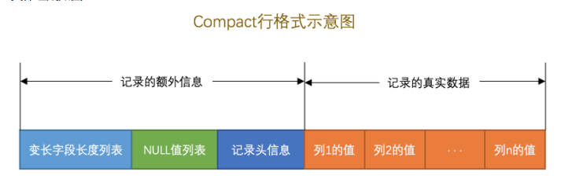
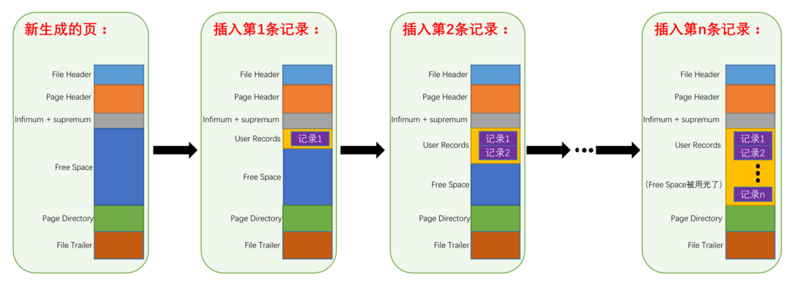
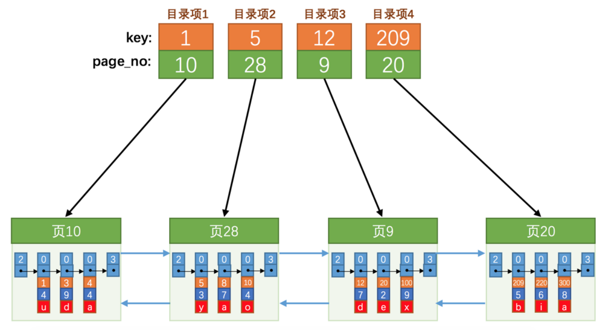
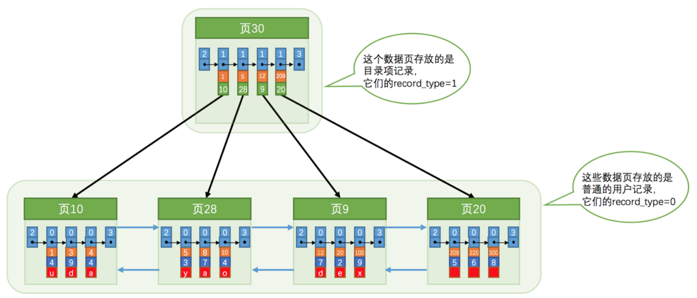
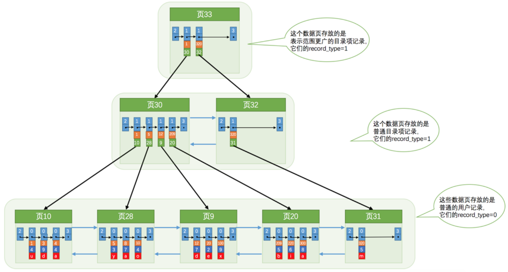
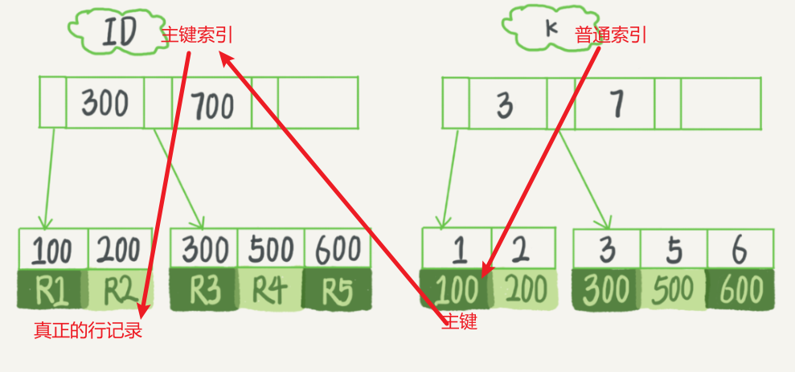
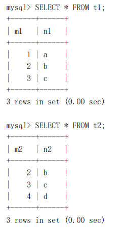
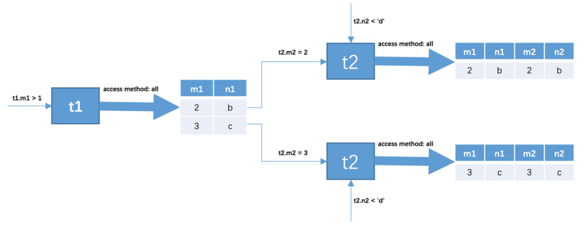

## 常见面试问题

B树和B+树的区别:

B+树:

1. 只有叶子节点存放真实的数据, 非叶子节点只存在key
2. 叶子节点通过双向链表相连, 顺序IO比较快

## 架构

MySQL采用CS架构，PC上安装的程序分成客户端程序和服务器程序。

MySQL安装目录的bin目录下存放了许多可执行文件，其中一些是服务器程序（mysqld、mysqld_safe)、另一些是客户端程序（mysql、mysqladmin)。

在UNIX上启动服务器程序的方式有：

* mysqld
* mysql_safe：会同时启动mysqld和监视进程
* mysql.server
* mysqld_multi

在Windows上启动服务器进程的方式有：

* mysqld
* 将mysqld注册为服务：`net start mysqld`

客户端进程和服务器进程通信的方式有：

* TCP/IP
* 命令管道或共享内存
* UNIX域套接字

### 登录参数

`mysql –h hostname|hostIP –P port –u username –p DatabaseName –e "SQL语句"  `

### 执行流程

`set profiling = 1;`开启SQL监控记录

`show profile;`查看最近执行的一条语句的详细信息。

```
mysql> show profile;
+--------------------------------+----------+
| Status                         | Duration |
+--------------------------------+----------+
| starting                       | 0.000063 |
| Executing hook on transaction  | 0.000005 |
| starting                       | 0.000008 |
| checking permissions           | 0.000008 |
| Opening tables                 | 0.000048 |
| init                           | 0.000010 |
| System lock                    | 0.000015 |
| optimizing                     | 0.000009 |
| statistics                     | 0.000019 |
| preparing                      | 0.000026 |
| executing                      | 0.000471 |
| end                            | 0.000008 |
| query end                      | 0.000004 |
| waiting for handler commit     | 0.000010 |
| closing tables                 | 0.000008 |
| freeing items                  | 0.000137 |
| cleaning up                    | 0.000012 |
+--------------------------------+----------+
```

`show profiles;`查看执行的所有sql语句，前面的id可以用来标识是第几条语句。`show profile for query 2;`查看第2条语句的详细执行过程。

`show profile cpu, block io for query 2;`

## 系统配置

### 启动选项

启动选项可以调整服务器启动后的一些行为。它们可以在命令行中指定，也可以将它们写入配置文件。

配置文件中的启动选项被划分为若干个组，每个组有一个组名。

对于启动选项来说，如果启动选项名由多个单词组成，各个单词之间用短划线 - 或者下划线 _ 连接起来都可以，但是对应的系统变量之间必须使用下划线 _ 连接起来。

### 系统变量和会话变量

系统变量影响服务器的行为，会话变量只影响某个连接的客户端。

```mysql
set [global|session] 变量名=值;
set [@@(global|session)].var_name=值;
show [global|session] variables [like 匹配的模式];
select [@@(global|session)].var_name;
```

如果省略了global或者session，默认是session。

### 状态变量

状态变量是用来显示服务器程序运行状态的，是只读变量，可以这样查看：`SHOW [GLOBAL|SESSION] STATUS [LIKE 匹配的模式];`

## 字符集

unicode是字符集，包含全世界的所有字符。utf8是一种变长的编码方案，是unicode最流行的实现方案。

utf-8编码，一个字符使用1~4个字节，但是最常用的字符使用1~3个字节即可表示。mysql里这种阉割了的utf-8字符集叫做utf8mb3。mysql中utf8是utf8mb3的别名，如果大家有使用4字节编码一个字符的情况，比如存储一些emoji表情啥的，那请使用utf8mb4。

MySQL中一个字符集对应多个比较规则。

查看字符集：`SHOW CHARSET;`

查看比较规则：`SHOW COLLATION [LIKE 匹配模式]`

mysql8默认使用 utf8mb4，默认的比较规则是  utf8mb3_general_ci，ci 代表 case insensitive，不区分大小写。

### 字符集的级别

MySQL有4个级别的字符集和比较规则：

1. 服务器级别，`character_set_server、collation_server`
2. 数据库级别，`character_set_database、collation_database`
3. 表级别，创建和修改表时指定，没有系统变量
4. 列级别

从发送请求到接收响应的过程中发生的字符集转换过程如下：

* 客户端发送的请求字节序列是采用哪种字符集进行编码的。这一步骤取决于操作系统当前使用的字符集，对于Windows来说，还与客户端启动时设置的 `default_character_set`有关
* 服务器接收到请求字节序列后会认为它是采用哪种字符集进行编码的。这一步骤取决于系统变量 `character_set_client`的值
* 服务器在运行过程中会把请求的字节序列转换为以哪种字符集编码的字节序列。这一步骤取决于系统变量 `character_set_connection`的值
* 服务器在向客户端返回字节序列时，是采用哪种字符集进行编码的。取决于系统变量 `character_set_results`
* 客户端在收到响应字节序列后，是如何解析的。取决于操作系统当前使用的字符集，对于windows来说还与启动选项`default_character_set`有关


windows下的mysql语句都是大小写不敏感的，linux要区分大小写。
`select @@lower_case_table_names;`可以看到windows返回1，linux返回0。

## InnoDB存储引擎

### 页

InnoDB将数据存储到磁盘上，处理数据时需要将数据读取到内存中，每次读取一页的大小，一般是16KB。页的大小存储在 `innodb_page_size`变量中。同样的，写数据时每次也写入一页。

### 行格式

表中的每一行在磁盘中保存的物理结构叫做行格式。InnoDB 支持4种行格式：`COMPACT、REDUNDANT、DYNAMIC、COMPRESSED`。默认使用 `dynamic`。

```sql
create table record_format
(
    c1 varchar(10),
    c2 varchar(10) not null,
    c3 char(10),
    c4 varchar(10)
)charset = ascii row_format = compact;
```

1. COMPACT：
   
2. REDUNDANT：在compact以前使用的，对于varchar类型分配存储空间不够灵活，占用的空间更大。
3. DYNAMIC 和 COMPRESSES：这两种行格式类似于COMPACT行格式，只不过在处理行溢出数据时有点儿分歧，它们不会在记录的真实数据处存储字符串的前768个字节，而是把所有的字节都存储到其他页面中，只在记录的真实数据处存储其他页面的地址。另外，Compressed 行格式会采用压缩算法对页面进行压缩。

### varchar(255)

为什么默认创建的变长字符列使用varchar(255)定义？因为通常使用的英文字符，每个字符占用一个byte，变长字段长度列表使用一个字节就能保存字段的长度。

如果列的定义是 char(10)，而且列的字符集是ascii这样的定长字符集，此列的长度就不需要保存到变长字段长度列表。但是如果使用的是utf8这样的变长字段长度列表，还是要在变长字段长度列表里保存占用的字节数。

### 记录头信息

记录头信息这部分是固定的5个字节，不同的为代表不同的信息，比如：

1. delete_mask：标记行是否被删除
2. min_rec_mask：B+树的每层非叶子节点中的最小记录都会添加该标记
3. heap_no：表示当前记录在记录堆的位置信息
4. record_type：记录的类型。0. 普通记录 1. 目录项记录 2. 最小记录 3. 最大记录
5. next_record：下一行的相对位置（当前记录到下一条记录的地址偏移量）。这里的下一行不是插入数据的顺序，而是按主键值排序的下一行。

### 行溢出

如果一行存放了很大的数据，就会发生行溢出。

MySQL 对一条记录占用的最大存储空间是有限制的，除了 BLOB 或者 TEXT 类型的列之外，其他所有的列（不包括隐藏列和记录头信息）占用的字节长度加起来不能超过 65535 个字节。

因为一页是16KB，小于每行能保存的最大字节数，所以如果一页放不下，mysql会将一行数据分别存放在多页里，然后在第一页里保存其他其他页的地址。

## 索引页

页是mysql管理存储空间的基本单位，InnoDB为了不同的目的设计了不同的页，比如存放表头的页、存放change buffer的页、存放undo日志的页。最重要的是存放表中记录的页——索引页。

页的格式：



- File Header ，表示页的一些通用信息。每个数据页的File Heade 部分都有上一个和下一个页的编号，所以所有的索引页会组成一个双链表 。 
- Page Header ，表示页专有的一些信息，占固定的56个字节。 
- Infimum + Supremum ，两个虚拟的伪记录，分别表示页中的最小和最大记录，占固定的 26 个字节。相当于链表的虚拟头结点和尾结点。
- User Records ：真实存储我们插入的记录的部分，大小不固定。
- Free Space ：页中尚未使用的部分，大小不确定。 
- Page Directory ：页中的某些记录相对位置，也就是各个槽在页面中的地址偏移量，大小不固定，插入的记录越多，这个部分占用的空间越多。 
- File Trailer ：用于检验页是否完整的部分，占用固定的8个字节。为保证从内存中同步到磁盘的页的完整性，在File Header和File Trailer都会存储页中数据的校验和和页面最后修改时对应的 LSN 值，如果首部和尾部的校验和和 LSN 值不同的话，就说明同步过程出现了问题。

### 槽

InnoDB 会为把页中的记录划分为若干个组，每个组的最后一个记录的地址偏移量作为一个槽 slot ，存放在 Page Directory 中，所以在一个页中根据主键查找记录是非常快的，分为两步： 

1. 通过二分法确定该记录所在的槽。
2. 通过记录的next_record属性遍历该槽所在的组中的各个记录。

## 索引和B+树

> B+ 树继承自 B 树，区别是 B 树的所有节点都会映射真实数据，而 B + 树只有叶子节点才会映射真实数据。所以 B + 树更新操作更快。而且因为所有真实数据都在叶子节点，可以用链表串起来，所以 B + 树还是有序的。

通过上面的slot，可以快速的找到需要的数据。但是对于有很多页的表来说，我们首先要确定数据在哪一页，这可以通过索引做到。

不过在使用索引之前，我们还需要做到：下一个页中的主键值必须大于上一个页中的主键值。这样才能确保通过索引定位到页之后，可以遍历得到所需的数据。

下面是一个简单地示意图：



以页28为例，它对应目录项2 ，这个目录项中包含着该页的页号 28 以及该页中用户记录的最小主键值 5。我们只需要把几个目录项在物理存储器上连续存储，比如把他们放到一个数组里（实际是B+树），就可以实现根据主键值快速查找某条记录的功能了。

比方说我们想找主键值为 20 的记录，具体查找过程分两步： 

1. 先从目录项中根据二分法快速确定出主键值为 20 的记录在目录项3 中（因为 12 < 20 < 209 ），它对应的页是页9 。
2. 进入页9，通过页里保存的slot再进行二分查找，找到对应的组，然后遍历组找到所需数据。

其实所有的目录项记录也放在页里，他们的record_type是1：



当数据非常多，就形成了树：



不论是存放用户记录的数据页，还是存放目录项记录的数据页，我们都把它们存放到 B+ 树这个数据结构中了，所以我们也称这些数据页为节点 。从图中可以看出来，我们的实际用户记录其实都存放在B+树的叶子节点上，其他的目录项都存放在非叶子节点上。

规定最下面的用户记录的那层为第 0 层，之后依次往上加。假设所有存放用户记录的叶子节点代表的页可以存放100条用户记录，所有存放目录项记录的内节点代表的数据页可以存放1000条目录项记录，那么，如果 B+ 树有3层，最多能存放1000×1000×100=1亿条记录。

一般情况下，我们用到的 B+ 树都不会超过4层，那我们通过主键值去查找某条记录最多只需要做4个页面内的查找（查找3个目录项页和一个用户记录页），又因为在每个页面内有的 Page Directory （页目录），所以在页面内也可以通过二分法实现快速定位记录。

### 聚簇索引和二级索引

可以发现上图中，主键的索引树的所有叶子节点都保存着真正的行记录，这就是`索引即数据`。

主键索引的叶子节点存的是整行数据。在 InnoDB 里，主键索引也被称为聚簇索引（clustered index）。

非主键索引的叶子节点存的是主键的值。在 InnoDB 里，非主键索引也被称为二级索引（secondary index）。



**基于主键索引和普通索引的查询有什么区别？**

- 如果语句是 select * from T where ID=500，即主键查询方式，则只需要搜索 ID 这棵 B+ 树；
- 如果语句是 select * from T where k=5，即普通索引查询方式，则需要先搜索 k 索引树，得到 ID 的值，再到 ID 索引树搜索一次。这个过程称为回表。

也就是说，基于非主键索引的查询需要多扫描一棵索引树。而且会发现第一次查询二级索引用的是顺序io，而之后的回表用的是随机io，速度慢的多。

因此，我们在应用中应该尽量使用主键查询，或者查询二级索引本身的列（索引覆盖，不使用 * ），也就不用回表了。

### 普通索引和唯一索引

唯一索引就是在普通索引的基础上加上唯一的限制，可以这么认为：

1. 主键索引 = 普通索引 + unique + not null
2. 唯一索引 = 普通索引 + unique

创建表时，mysql会自动为所有unique的列（包括主键列）创建索引。普通索引如果有多个索引值相同的行，则按照主键排序。

InnoDB 引擎的索引都是B+ tree类型的，MyISAM还可以创建Hash索引。

### 联合索引和最左匹配原则

假如使用 name 和 phone、birthday 建立联合索引，则页面和记录先按照联合索引前边的列排序，如果该列值相同，再按照联合索引后边的列排序。

那么当我们按照 name 查找的时候，索引就可以起作用。使用 phone 和 name、birthday 查询的时候索引也会起作用，而且优化器会把查询的顺序调整到更利于使用索引。使用 name、birthday也可以使用索引，不过这样只能定位到name，后面的birthday只能遍历去搜索。

但是只使用birthday查找的话，索引不会起作用。这就是联合索引的最左匹配原则。

对于字符串这样的列建立索引的话，也要注意最左匹配原则，比如：`select * from name where name like 'Ab%';`会使用索引，`select * from name where name like '%Ab';`不会使用索引。这是因为字符串排序时从前往后比较每个字符。

### 索引和排序

如果 order by 的列正好是索引列，执行的时候会省略排序这一步。比如有联合索引 idx_name_birthday_phone，则语句`SELECT * FROM person_info ORDER BY name, birthday, phone_number LIMIT 10;`直接取出数据，不会再排序。

## 表连接



假如有上图的两个表，那么语句`SELECT * FROM t1, t2 WHERE t1.m1 > 1 AND t1.m1 = t2.m2 AND t2.n2 < 'd';` 执行过程如图：



第一个表t1叫做驱动表，第二个表t2叫做被驱动表。首先查询驱动表，然后根据连接条件循环查询被驱动表。可以看到驱动表只需要访问一次，被驱动表需要访问多次，所以连接查询的优化关键在于减少被驱动表的访问次数。

## 事务

`SHOW ENGINES` 命令来查看当前 MySQL 支持的存储引擎。MySQL中只有InnoDB支持事务。

从理论上说，事务有着极其严格的定义，它必须同时满足4个特性，即通常所说事务的ACID特性。值得注意的是，虽然理论上定义了严格的事务要求，但是数据库厂商出于各种目的并没有严格满足事务的ACID标准。例如，对于MySQL的NDB Cluster引擎来说，虽然其支持事务，但是不满足D的要求，即持久性的要求。对于Oracle数据库来说，其默认的事务隔离级别为READ COMMITTED，不满足I的要求，即隔离性的要求。虽然在大多数情况下，这并不会导致严重的结果，甚至可能会带来性能的提升，但是用户首先需要了解严谨的事务标准，并在实际的生产应用中避免可能存在的潜在问题。对于InnoDB存储引擎而言，其默认的事务隔离级别为READ REPEATABLE，完全遵循和满足事务的ACID特性。


### 查看隔离级别

```
查看系统隔离级别：select @@global.tx_isolation;
show global variables like 'transaction_isolation';

查看会话隔离级别(5.0以上版本)：select @@tx_isolation;
查看会话隔离级别(8.0以上版本)：select @@transaction_isolation;
show variables like 'transaction_isolation';

设置全局的隔离级别
set @@transaction_isolation='read-committed';
set [global|session] transaction isolation level REPEATABLE READ;
set global transaction isolation level READ COMMITTED;
set global transaction isolation level READ UNCOMMITTED;
set global transaction isolation level SERIALIZABLE;
```

### 事务使用

1. `start transaction`或者`begin`，开启一个事务。`start transaction`相较于`begin`的优势在于，后边可以加几个修饰符：
   1. read only：只读事务
   2. read write：读写事务（默认）
   3. with consistent snapshot：启动一致性读
   4. read only, with consistent snapshot：读写事务和一致性读
2. 执行一系列DML语句
3. commit 或者 rollback

### 自动提交

MySQL有一个系统变量 autocommit：`show variables like 'autocommit'`。默认自动提交。`set autocommit = off`或者`set autocommmit = 0`这样就可以关闭自动提交。

### 隐式提交

当我们开启了一个事务，或者把系统变量 autocommit 的值设置为 OFF 时，事务就不会进行自动提交，但是如果我们输入了某些语句之后就会*悄悄的*提交掉，就像我们输入了COMMIT一样，这种因为某些特殊的语句而导致事务提交的情况称为*隐式提交*，这些会导致事务隐式提交的语句包括：

1. DDL
2. DCL
3. 上一个事务还没提交，又开启了一个新事务

### 保存点

定义保存点：`savepoint 保存点名称`

回滚到保存点：`rollback to 保存点名称`

删除保存点：`release savepoint 保存点名称`

## 日志

### redo log

当有一条记录需要更新的时候，InnoDB 引擎就会先把记录写到 redo log 里面，并更新内存，这个时候更新就算完成了。同时，InnoDB 引擎会在适当的时候，将这个操作记录更新到磁盘里面，而这个更新往往是在系统比较空闲的时候做。

redo log 写磁盘使用的是顺序 IO，直接更新索引页使用随机 IO，所以使用 redo log 速度更快。

有了 redo log，InnoDB 就可以保证即使数据库发生异常重启，之前提交的记录都不会丢失，这个能力称为**crash-safe**。

### binlog

redo log 是 InnoDB 引擎特有的日志，而 Server 层也有自己的日志，称为 binlog（归档日志）。

redo log 和 binlog 两种日志有以下三点不同。

1. redo log 是 InnoDB 引擎特有的；binlog 是 MySQL 的 Server 层实现的，所有引擎都可以使用。
2. redo log 是物理日志，记录的是“在某个数据页上做了什么修改”；binlog 是逻辑日志，记录的是这个语句的原始逻辑，比如“给 ID=2 这一行的 c 字段加 1 ”。
3. redo log 是循环写的，空间固定会用完；binlog 是可以追加写入的。
