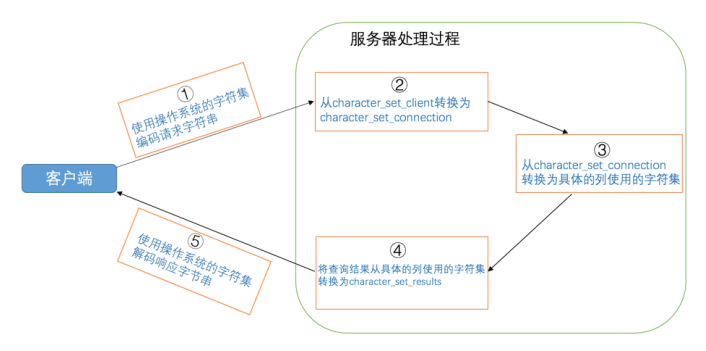

## 架构

MySQL采用CS架构，PC上安装的程序分成客户端程序和服务器程序。

MySQL安装目录的bin目录下存放了许多可执行文件，其中一些是服务器程序（mysqld、mysqld_safe)、另一些是客户端程序（mysql、mysqladmin)。

在UNIX上启动服务器程序的方式有：

* mysqld
* mysql_safe：会同时启动mysqld和监视进程
* mysql.server
* mysqld_multi

在Windows上启动服务器进程的方式有：

* mysqld
* 将mysqld注册为服务：`net start mysqld`

客户端进程和服务器进程通信的方式有：

* TCP/IP
* 命令管道或共享内存
* UNIX域套接字

## 启动

启动选项可以调整服务器启动后的一些行为。它们可以在命令行中指定，也可以将它们写入配置文件。

配置文件中的启动选项被划分为若干个组，每个组有一个组名。

系统变量是服务器程序中维护的一些变量，这些变量影响着服务器的行为。修改系统变量的方式如下：

* 在服务器启动时添加启动选项
* 在运行时使用SET语句修改，下面两种方式都行：
  * `SET [GLOBAL | SESSION] 系统变量名 = 值;`
  * `SET [@@(GLOBAL | SESSION).]系统变量名 = 值;`

查看系统变量的方式：`SHOW [GLOBAL|SESSION] VARIABLES [LIKE 匹配的模式];`

状态变量是用来显示服务器程序运行状态的，是只读变量，可以这样查看：`SHOW [GLOBAL|SESSION] STATUS [LIKE 匹配的模式];`

## 字符集

MySQL中一个字符集对应多个比较规则。

查看字符集：`SHOW CHARSET;`

查看比较规则：`SHOW COLLATION [LIKE 匹配模式]`

MySQL有4个级别的字符集和比较规则：

1. 服务器级别，`character_set_server、collation_server`
2. 数据库级别，`character_set_database、collation_database`
3. 表级别，创建和修改表时指定，没有系统变量
4. 列级别

从发送请求到接收响应的过程中发生的字符集转换过程如下：

* 客户端发送的请求字节序列是采用哪种字符集进行编码的。这一步骤取决于操作系统当前使用的字符集，对于Windows来说，还与客户端启动时设置的 `default_character_set`有关
* 服务器接收到请求字节序列后会认为它是采用哪种字符集进行编码的。这一步骤取决于系统变量 `character_set_client`的值
* 服务器在运行过程中会把请求的字节序列转换为以哪种字符集编码的字节序列。这一步骤取决于系统变量 `character_set_connection`的值
* 服务器在向客户端返回字节序列时，是采用哪种字符集进行编码的。取决于系统变量 `character_set_results`
* 客户端在收到响应字节序列后，是如何解析的。取决于操作系统当前使用的字符集，对于windows来说还与启动选项`default_character_set`有关



## InnoDB存储引擎

### 页

InnoDB将数据存储到磁盘上，处理数据时需要将数据读取到内存中，每次读取一页的大小，一般是16KB。页的大小存储在 `innodb_page_size`变量中。

### 行格式

表中的每一行在磁盘中保存的物理结构叫做行格式。InnoDB支持4种行格式：`COMPACT、REDUNDANT、DYNAMIC、COMPRESSED`。

```sql
create table record_format_demo (
     c1 varchar(10) not null, 
     c2 char(10) not null
     ) row_format=COMPACT;
     
alter table tb_name row_format=compact;
```

