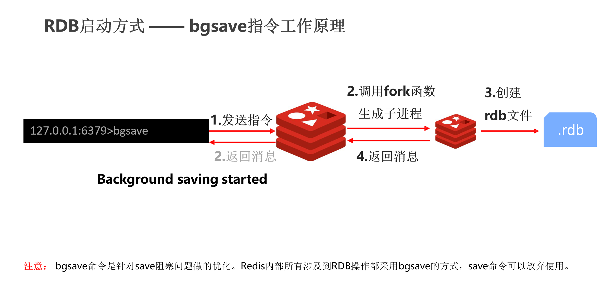
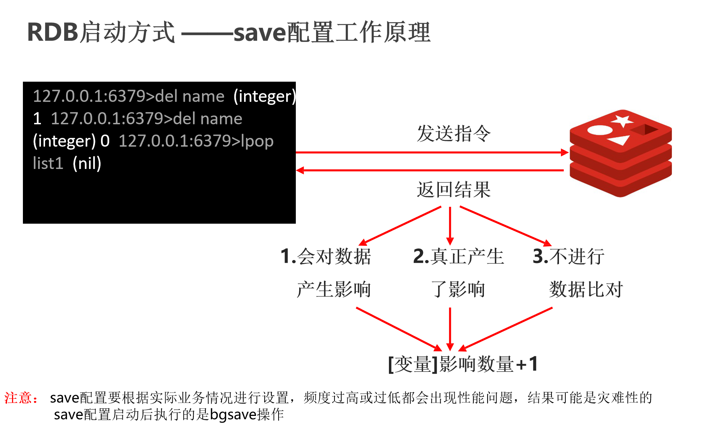
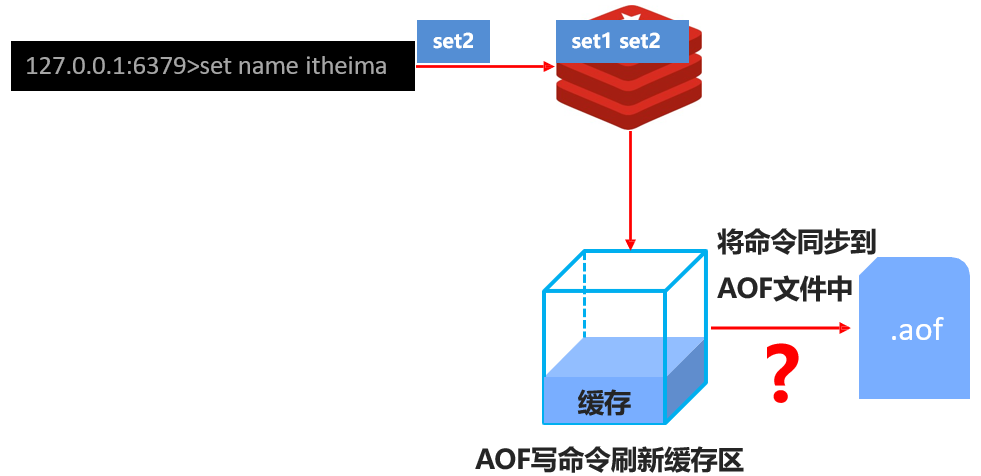
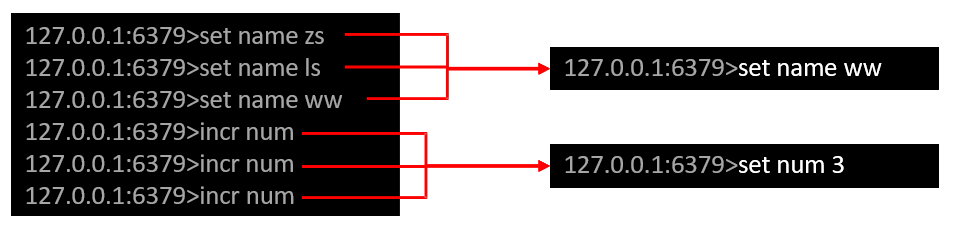
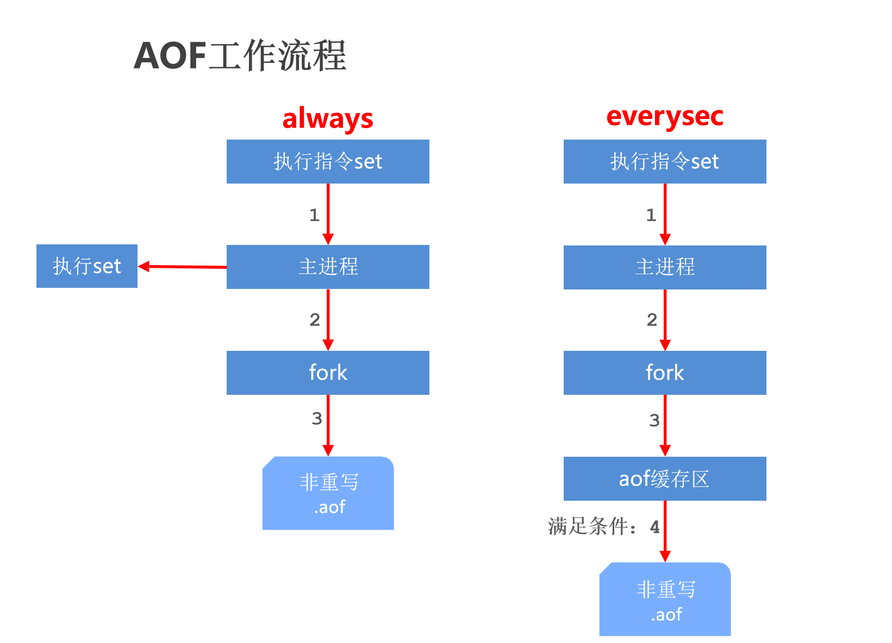
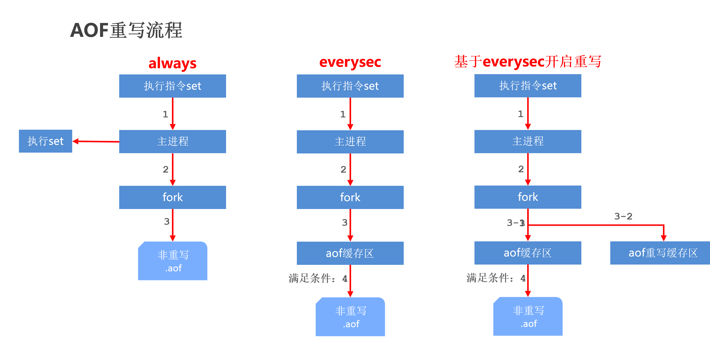

# Redis基础

**课程计划**

| 1. Redis 入 门         | **（了解）** | **（操作）** |              |
| ---------------------- | ------------ | ------------ | ------------ |
| 2. 数据类型            | **（重点）** | **（操作）** | **（理解）** |
| 3. 常用指令            |              | **（操作）** |              |
| 4. Jedis               | **（重点）** | **（操作）** |              |
| 5. 持 久 化            | **（重点）** |              | **（理解）** |
| 6. 数据删除与淘汰策略  |              |              | **（理解）** |
| 7. 主从复制            | **（重点）** | **（操作）** | **（理解）** |
| 8. 哨 兵               | **（重点）** | **（操作）** | **（理解）** |
| 9. Cluster集群方案     | **（重点）** | **（操作）** | **（理解）** |
| 10. 企业级缓存解决方案 | **（重点）** |              | **（理解）** |
| 11. 性能指标监控       | **（了解）** |              |              |

## 学习目标：

目标1：能够说出NoSQL的概念，redis的应用场景，能够完成redis的下载安装与启动以及一些常用的配置

目标2：能够说出redis常用的5种数据类型，对应这些数据类型的基本操作，应用场景及对应的解决方案

目标3：能够说出redis中常用的一些基本指令

目标4：能够使用jedis完成客户端应用程序的开发

目标5：能够说出redis数据持久化的两种方式，各自相关的操作配置及指令，以及两种方式的优缺点比较

## 1. Redis 简介

在这个部分，我们将学习以下3个部分的内容，分别是：

◆ Redis 简介（NoSQL概念、Redis概念）

◆ Redis 的下载与安装

◆ Redis 的基本操作

#### 1.1.2 NoSQL的概念

（1）概念

NoSQL：即 Not-Only SQL（ 泛指非关系型的数据库），作为关系型数据库的补充。 作用：应对基于海量用户和海量数据前提下的数据处理问题。

他说这句话说的非常客气，什么意思呢？就是我们数据存储要用SQL，但是呢可以不仅仅用SQL，还可以用别的东西，那别的东西叫什么呢？于是他定义了一句话叫做NoSQL。这个意思就是说我们存储数据，可以不光使用SQL，我们还可以使用非SQL的这种存储方案，这就是所谓的NoSQL。

（2）特征

可扩容，可伸缩。SQL数据关系过于复杂，你扩容一下难度很高，那我们Nosql 这种的，不存关系，所以它的扩容就简单一些。

大数据量下高性能。包数据非常多的时候，它的性能高，因为你不走磁盘IO，你走的是内存，性能肯定要比磁盘IO的性能快一些。

灵活的数据模型、高可用。他设计了自己的一些数据存储格式，这样能保证效率上来说是比较高的，最后一个高可用，我们等到集群内部分再去它！

（3）常见 Nosql 数据库

目前市面上常见的Nosql产品：Redis、memcache、HBase、MongoDB

（4）应用场景-电商为例

我们以电商为例，来看一看他在这里边起到的作用。

第一类，在电商中我们的基础数据一定要存储起来，比如说商品名称，价格，生产厂商，这些都属于基础数据，这些数据放在MySQL数据库。

第二类，我们商品的附加信息，比如说，你买了一个商品评价了一下，这个评价它不属于商品本身。就像你买一个苹果，“这个苹果很好吃”就是评论，但是你能说很好吃是这个商品的属性嘛？不能这么说，那只是一个人对他的评论而已。这一类数据呢，我们放在另外一个地方，我们放到MongoDB。它也可以用来加快我们的访问，他属于NoSQL的一种。

第三，图片内的信息。注意这种信息相对来说比较固定，他有专用的存储区，我们一般用文件系统来存储。至于是不是分布式，要看你的系统的一个整个   瓶颈   了？如果说你发现你需要做分布式，那就做，不需要的话，一台主机就搞定了。

第四，搜索关键字。为了加快搜索，我们会用到一些技术，有些人可能了解过，像分ES、Lucene、solr都属于搜索技术。那说的这么热闹，我们的电商解决方案中还没出现我们的redis啊！注意第五类信息。

第五，热点信息。访问频度比较高的信息，这种东西的第二特征就是它具有波段性。换句话说他不是稳定的，它具有一个时效性的。那么这类信息放哪儿了，放到我们的redis这个解决方案中来进行存储。

具体的我们从我们的整个数据存储结构的设计上来看一下。


我们的基础数据都存MySQL,在它的基础之上，我们把它连在一块儿，同时对外提供服务。向上走，有一些信息加载完以后,要放到我们的MongoDB中。还有一类信息，我们放到我们专用的文件系统中（比如图片），就放到我们的这个搜索专用的，如Lucene、solr及集群里边，或者用ES的这种技术里边。那么剩下来的热点信息，放到我们的redis里面。

### 1.2 Redis概念

#### 1.2.1 redis概念

概念：Redis (REmote DIctionary Server) 是用 C 语言开发的一个开源的高性能键值对（key-value）数据库。

特征：

（1）数据间没有必然的关联关系；

（2）内部采用单线程机制进行工作；

（3）高性能。官方提供测试数据，50个并发执行100000 个请求,读的速度是110000 次/s,写的速度是81000次/s。

（4）多数据类型支持

字符串类型，string  list

列表类型，hash  set

散列类型，zset/sorted_set

集合类型

有序集合类型

（5）支持持久化，可以进行数据灾难恢复

#### 1.2.2 redis的应用场景

（1）为热点数据加速查询（主要场景）。如热点商品、热点新闻、热点资讯、推广类等高访问量信息等。

（2）即时信息查询。如各位排行榜、各类网站访问统计、公交到站信息、在线人数信息（聊天室、网站）、设备信号等。

（3）时效性信息控制。如验证码控制、投票控制等。

（4）分布式数据共享。如分布式集群架构中的 session 分离
消息队列.

### 1.3 Redis 的下载与安装

本课程所示，均基于Center OS7安装Redis。

（1)下载Redis

下载安装包：

```bash
wget http://download.redis.io/releases/redis-5.0.0.tar.gz
```

解压安装包：

```bash
tar –xvf redis-5.0.0.tar.gz
```

编译（在解压的目录中执行）：

```bash
make
```

安装（在解压的目录中执行）：

```bash
make install
```

（2）安装 Redis

redis-server，服务器启动命令 客户端启动命令

redis-cli，redis核心配置文件

redis.conf，RDB文件检查工具（快照持久化文件）

redis-check-dump，AOF文件修复工具

redis-check-aof

### 1.4 Redis启动

#### 1.4.1 服务器启动

启动服务器——参数启动

```bash
redis-server [--port port]
```

范例

```bash
redis-server --port 6379
```

启动服务器——配置文件启动

```bash
redis-server config_file_name
```

范例

```bash
redis-server redis.conf
```

#### 1.4.2 客户端启动

启动客户端

```bash
redis-cli [-h host] [-p port]
```

范 例

```bash
redis-cli –h 61.129.65.248 –p 6384
```

注意：服务器启动指定端口使用的是--port，客户端启动指定端口使用的是-p。-的数量不同。

#### 1.4.3 Redis基础环境设置约定

创建配置文件存储目录

```bash
mkdir conf
```

创建服务器文件存储目录（包含日志、数据、临时配置文件等）

```bash
mkdir data
```

创建快速访问链接

```bash
ln -s redis-5.0.0 redis
```

### 1.5 配置文件启动与常用配置

#### 1.5.1 服务器端设定

设置服务器以守护进程的方式运行，开启后服务器控制台中将打印服务器运行信息（同日志内容相同）

```bash
daemonize yes
```

绑定主机地址，关闭保护模式，同时要设置密码。这样设置之后，远程客户端输入 auth 123456 就可以访问了。

```bash
bind 0.0.0.0
protected-mode no
requirepass 123456
```

设置服务器端口

```bash
port port
```

设置服务器文件保存地址

```bash
dir path
```

#### 1.5.2  客户端配置

 服务器允许客户端连接最大数量，默认0，表示无限制。当客户端连接到达上限后，Redis会拒绝新的连接

```bash
maxclients count
```

客户端闲置等待最大时长，达到最大值后关闭对应连接。如需关闭该功能，设置为 0

```bash
timeout seconds
```

#### 1.5.3  日志配置

设置服务器以指定日志记录级别

```bash
loglevel debug|verbose|notice|warning
```

日志记录文件名

```bash
logfile filename
```

注意：日志级别开发期设置为verbose即可，生产环境中配置为notice，简化日志输出量，降低写日志IO的频度。

### 1.6 Redis基本操作

设置 key，value 数据

```bash
set key value
```

根据 key 查询对应的 value，如果不存在，返回空（nil）

```bash
get key
```

获取命令帮助文档

```bash
help [command]
```

获取组中所有命令信息名称

```bash
help [@group-name]
```

```bash
help @string
```

退出客户端

````bash
quit
exit
````

## 2. 数据类型

string、hash、list、set、sorted_set/zset（应用性较低）

我们知道redis 自身是一个 Map，其中所有的数据都是采用 key : value 的形式存储。对于这种结构来说，我们用来存储数据一定是一个值前面对应一个名称。我们通过名称来访问后面的值。按照这种形势，我们可以对出来我们的存储格式。前面这一部分我们称为key。后面的一部分称为value，而我们的数据类型，他一定是修饰value的。


数据类型指的是存储的数据的类型，也就是 value 部分的类型，key 部分永远都是字符串。

### string

如果字符串以整数的形式展示，可以作为数字操作使用.

**基本操作**

添加/修改数据添加/修改数据

```
set key value
```

获取数据

```
get key
getrange key 0 -1
keys *
```

删除数据

```
del key
flushdb //清空库
```

查看数据类型 `type key`

判定性添加数据

```
setnx key value
```

添加/修改多个数据，比按个set节约一些网络的传输耗时

```
mset key1 value1 key2 value2 …
```

获取多个数据

```
mget key1 key2 …
```

获取数据字符个数（字符串长度）

```
strlen key
```

追加信息到原始信息后部（如果原始信息存在就追加，否则新建）

```
append key value
```

查看过期时间：`ttl key`。-1 代表永不过期、-2 代表已过期，单位是秒。

设置值的同时设置过期时间 `set key value ex time`

**拓展操作**

string的扩展操作，分成两大块：一块是对数字进行操作的，第二块是对我们的key的时间进行操作的。

设置数值数据增加指定范围的值

```bash
incr key
incrby key increment
incrbyfloat key increment
```

设置数值数据减少指定范围的值

```bash
decr key
decrby key increment
```

设置数据具有指定的生命周期

```bash
setex key seconds value
psetex key milliseconds value
```

**注意事项**

(1)数据操作不成功的反馈与数据正常操作之间的差异

表示运行结果是否成功

(integer) 0  → false                 失败

(integer) 1  → true                  成功

表示运行结果值

(integer) 3  → 3                        3个

(integer) 1  → 1                         1个

(2)数据未获取到时，对应的数据为（nil），等同于null

(3)数据最大存储量：512MB

(4)string在redis内部存储默认就是一个字符串，当遇到增减类操作incr，decr时会转成数值型进行计算

(5)按数值进行操作的数据，如果原始数据不能转成数值，或超越了redis 数值上限范围，将报错
9223372036854775807（java中Long型数据最大值，Long.MAX_VALUE）

(6)redis所有的操作都是原子性的，采用单线程处理所有业务，命令是一个一个执行的，因此无需考虑并发带来的数据影响.

### hash

可以直接把对象变成 JSON 格式的 string 存到 redis 中。但是这样更新单个字段会很麻烦。redis 提供了 hash 数据类型来存储一个对象，而且可以单独更改某个字段。


如上图所示，这种结构叫做hash，左边一个key，对右边一个存储空间。这里要明确一点，右边这块儿存储空间叫hash，也就是说hash是指的一个数据类型，他指的不是一个数据，是这里边的一堆数据，那么它底层呢，是用hash表的结构来实现的。

值得注意的是：

如果field数量较少，存储结构优化为类数组结构

如果field数量较多，存储结构使用HashMap结构

**基本操作**

```bash
//hset key field value
hset user1 name tom age 12
hset user2 name marry age 22

//hget key field
hget user1 name
hgetall user1
```

删除数据

```bash
hdel key field1 [field2]
```

设置field的值，如果该field存在则不做任何操作

```bash
hsetnx key field value
```

添加/修改多个数据

```bash
hmset key field1 value1 field2 value2 …
```

获取多个数据

```bash
hmget key field1 field2 …
```

获取哈希表中字段的数量

```bash
hlen key
```

获取哈希表中是否存在指定的字段

```bash
hexists key field
```

**拓展操作**

获取哈希表中所有的字段名或字段值

```
hkeys key
hvals key
```

设置指定字段的数值数据增加指定范围的值

```
hincrby key field increment
hincrbyfloat key field increment
```

**注意事项**

(1)hash类型中value只能存储字符串，不允许存储其他数据类型，不存在嵌套现象。如果数据未获取到，对应的值为（nil）。

(2）每个 hash 可以存储 232 - 1 个键值对
hash类型十分贴近对象的数据存储形式，并且可以灵活添加删除对象属性。但hash设计初衷不是为了存储大量对象而设计 的，切记不可滥用，更不可以将hash作为对象列表使用。

(3)hgetall 操作可以获取全部属性，如果内部field过多，遍历整体数据效率就很会低，有可能成为数据访问瓶颈。

**应用场景**

双11活动日，销售手机充值卡的商家对移动、联通、电信的30元、50元、100元商品推出抢购活动，每种商品抢购上限1000  张。


也就是商家有了，商品有了，数量有了。最终我们的用户买东西就是在改变这个数量。那你说这个结构应该怎么存呢？对应的商家的ID作为key，然后这些充值卡的ID作为field，最后这些数量作为value。而我们所谓的操作是其实就是increa这个操作，只不过你传负值就行了。看一看对应的解决方案：

以商家id作为key

将参与抢购的商品id作为field

将参与抢购的商品数量作为对应的value

抢购时使用降值的方式控制产品数量

### list

list 可以实现：存储多个数据，并对数据进入存储空间的顺序进行区分，底层使用双向链表存储结构实现

先来通过一张图，回忆一下顺序表、链表、双向链表。

**基本操作**

添加/修改数据

```bash
lpush key value1 [value2] ……
rpush key value1 [value2] ……
lset key index value
linsert key before|after value newValue
```

获取数据

```bash
lrange key start stop
lindex key index
llen key
```

获取并移除数据

```bash
lpop key
rpop key
```

**扩展操作**

移除指定数据

```
lrem key count value

ltrim key start end 
```

规定时间内获取并移除数据

```
blpop key1 [key2] timeout
brpop key1 [key2] timeout
brpoplpush source destination timeout
```

**注意事项**

（1）list中保存的数据都是string类型的，数据总容量是有限的，最多232 - 1 个元素(4294967295)。

（2）list具有索引的概念，但是操作数据时通常以队列的形式进行入队出队操作，或以栈的形式进行入栈出栈操作

（3）获取全部数据操作结束索引设置为-1

（4）list可以对数据进行分页操作，通常第一页的信息来自于list，第2页及更多的信息通过数据库的形式加载

**应用场景**

企业运营过程中，系统将产生出大量的运营数据，如何保障多台服务器操作日志的统一顺序输出？


假如现在你有多台服务器，每一台服务器都会产生它的日志，假设你是一个运维人员，你想看它的操作日志，你怎么看呢？打开A机器的日志看一看，打开B机器的日志再看一看吗？这样的话你会可能会疯掉的！因为左边看的有可能它的时间是11:01，右边11:02，然后再看左边11:03，它们本身是连续的，但是你在看的时候就分成四个文件了，这个时候你看起来就会很麻烦。能不能把他们合并呢？答案是可以的！怎么做呢？建立起redis服务器。当他们需要记日志的时候，记在哪儿,全部发给redis。等到你想看的时候，通过服务器访问redis获取日志。然后得到以后，就会得到一个完整的日志信息。那么这里面就可以获取到完整的日志了，依靠什么来实现呢？就依靠我们的list的模型的顺序来实现。进来一组数据就往里加，谁先进来谁先加进去，它是有一定的顺序的。

### set

set类型：与hash存储结构完全相同，仅存储键，不存储值（nil），并且值是不允许重复的


**基本操作**

添加数据

```bash
sadd key member1 [member2]
```

获取全部数据

```bash
smembers key
```

删除数据

```bash
srem key member1 [member2]
```

获取集合数据总量

```bash
scard key
```

判断集合中是否包含指定数据

```bash
sismember key member
```

随机获取集合中指定数量的数据

```bash
srandmember key [count]
```

随机获取集中的某个数据并将该数据移除集合

```bash
spop key [count]
```

**扩展操作**

求两个集合的交、并、差集

```
sinter key1 [key2 …]  
sunion key1 [key2 …]  
sdiff key1 [key2 …]
```

求两个集合的交、并、差集并存储到指定集合中

```
sinterstore destination key1 [key2 …]  
sunionstore destination key1 [key2 …]  
sdiffstore destination key1 [key2 …]
```

将指定数据从原始集合中移动到目标集合中

```
smove source destination member
```

**应用场景**

（1）黑名单

资讯类信息类网站追求高访问量，但是由于其信息的价值，往往容易被不法分子利用，通过爬虫技术，  快速获取信息，个别特种行业网站信息通过爬虫获取分析后，可以转换成商业机密进行出售。例如第三方火 车票、机票、酒店刷票代购软件，电商刷评论、刷好评。

同时爬虫带来的伪流量也会给经营者带来错觉，产生错误的决策，有效避免网站被爬虫反复爬取成为每个网站都要考虑的基本问题。在基于技术层面区分出爬虫用户后，需要将此类用户进行有效的屏蔽，这就是黑名单的典型应用。

ps:不是说爬虫一定做摧毁性的工作，有些小型网站需要爬虫为其带来一些流量。

（2）白名单

对于安全性更高的应用访问，仅仅靠黑名单是不能解决安全问题的，此时需要设定可访问的用户群体， 依赖白名单做更为苛刻的访问验证。

### zset

zset 是带有分数的 set。

### 实践案例

使用微信的过程中，当微信接收消息后，会默认将最近接收的消息置顶，当多个好友及关注的订阅号同时发送消息时，该排序会不停的进行交替。同时还可以将重要的会话设置为置顶。一旦用户离线后，再次打开微信时，消息该按照什么样的顺序显示。

我们分析一下：


100这台手机代表你。而200、300、400这三台代表你好友的手机。在这里有一些东西需要交代一下，因为我们每个人的都会对自己的微信中的一些比较重要的人设置会话置顶，将他的那条对话放在最上面。我们假定这个人有两个会话置顶的好友，分别是400和500，而这里边就包含400.

下面呢，我们就来发这个消息，第一个发消息的是300，他发了个消息给100。发完以后，这个东西应该怎么存储呢？在这里面一定要分开，记录置顶的这些人的会话，对应的会话显示顺序和非置顶的一定要分两。

这里面我们创建两个模型，一个是普通的，一个是置顶的，而上面的这个置顶的用户呢，我们用set来存储，因为不重复。而下面这些因为有顺序，很容易想到用list去存储,不然你怎么表达顺序呢？


那当300发给消息给100以后，这个时候我们先判定你在置顶人群中吗？不在,那好，300的消息对应的顺序就应该放在普通的列表里边。而在这里边，我们把300加进去。第一个数据也就是现在300。


接下来400，发了个消息。判断一下，他是需要置顶的，所以400将进入list的置顶里边放着。当前还没有特殊的地方。


再来200发消息了，和刚才的判定方法一样，先看在不在置顶里，不在的话进普通，然后在普通里边把200加入就行了，OK，到这里目前还没有顺序变化。

接下来200又发消息过来，同一个人给你连发了两条，那这个时候200的消息到达以后，先判断是否在置顶范围，不在，接下来他要放在list普通中，这里你要注意一点，因为这里边已经有200，所以进来以后先干一件事儿，把200杀掉，没有200，然后再把200加进来，那你想一下，现在这个位置顺序是什么呢？就是新的都在右边，对不对？

还记得我们说list模型，如果是一个双端队列，它是可以两头进两头出。当然我们双端从一头进一头出，这就是栈模型，现在咱们运用的就是list模型中的栈模型。


现在300发消息，先判定他在不在，不在，用普通的队列，接下来按照刚才的操作，不管你里边原来有没有300，我先把300杀掉，没了，200自然就填到300的位置了，他现在是list里面唯一一个，然后让300进来，注意是从右侧进来的，那么现在300就是最新的。


那么到这里呢，我们让100来读取消息。你觉得这个消息顺序应该是什么样的？首先置顶的400有一个，他跑在最上面，然后list普通如果出来的话，300是最新的消息，而200在他后面的。用这种形式，我们就可以做出来他的消息顺序来。

#### 解决方案

看一下最终的解决方案：

依赖list的数据具有顺序的特征对消息进行管理，将list结构作为栈使用

置顶与普通会话分别创建独立的list分别管理

当某个list中接收到用户消息后，将消息发送方的id从list的一侧加入list（此处设定左侧）

多个相同id发出的消息反复入栈会出现问题，在入栈之前无论是否具有当前id对应的消息，先删除对应id

推送消息时先推送置顶会话list，再推送普通会话list，推送完成的list清除所有数据
消息的数量，也就是微信用户对话数量采用计数器的思想另行记录，伴随list操作同步更新

## 常用指令

在这部分中呢，我们家学习两个知识，第一个是key的常用指令，第二个是数据库的常用指令。和前面我们学数据类型做一下区分，前面你学的那些指令呢，都是针对某一个数据类型操作的，现在学的都是对所有的操作的，来看一下，我们在学习Key的操作的时候，我们先想一下的操作我们应该学哪些东西:

### key 操作分析

**key应该设计哪些操作？**

key是一个字符串，通过key获取redis中保存的数据

对于key自身状态的相关操作，例如：删除，判定存在，获取类型等

对于key有效性控制相关操作，例如：有效期设定，判定是否有效，有效状态的切换等

对于key快速查询操作，例如：按指定策略查询key

**基本操作**

删除指定key

```bash
del key
```

获取key是否存在

```bash
exists key
```

获取key的类型

```bash
type key
```

**拓展操作**

排序

```bash
sort
```

改名

```bash
rename key newkey
renamenx key newkey
```

**时效性控制**

为指定key设置有效期

```bash
expire key seconds
pexpire key milliseconds
expireat key timestamp
pexpireat key milliseconds-timestamp
```

获取key的有效时间

```bash
ttl key
pttl key
```

切换key从时效性转换为永久性

```bash
persist key
```

**扩展操作（查询模式）**

查询key

```bash
keys pattern
```

查询模式规则

*匹配任意数量的任意符号      ?	配合一个任意符号	[]	匹配一个指定符号

```bash
keys *  keys    查询所有
it*  keys       查询所有以it开头
*heima          查询所有以heima结尾
keys ??heima    查询所有前面两个字符任意，后面以heima结尾 查询所有以
keys user:?     user:开头，最后一个字符任意
keys u[st]er:1  查询所有以u开头，以er:1结尾，中间包含一个字母，s或t
```

### 数据库指令

**key 的重复问题**

在这个地方我们来讲一下数据库的常用指令，在讲这个东西之前，我们先思考一个问题：

假如说你们十个人同时操作redis，会不会出现key名字命名冲突的问题。

一定会，为什么?因为你的key是由程序而定义的。你想写什么写什么，那在使用的过程中大家都在不停的加，早晚有一天他会冲突的。

redis在使用过程中，伴随着操作数据量的增加，会出现大量的数据以及对应的key。

那这个问题我们要不要解决？要！怎么解决呢？我们最好把数据进行一个分类，除了命名规范我们做统一以外，如果还能把它分开，这样是不是冲突的机率就会小一些了，这就是咱们下面要说的解决方案！

**解决方案**

redis为每个服务提供有16个数据库，编号从0到15，每个数据库之间的数据相互独立。这里边需要注意一点，他们这16个共用redis的内存。没有说谁大谁小，也就是说数字只是代表了一块儿区域，区域具体多大未知。这是数据库的一个分区的一个策略！

**数据库的基本操作**

切换数据库

```
select index
```

其他操作

```
ping
```

**数据库扩展操作**

数据移动

```
move key db
```

数据总量

```
dbsize
```

数据清除

```
flushdb  flushall
```

## 4. Jedis

在学习完redis后，我们现在就要用Java来连接redis了，也就是我们的这一章要学的Jedis了。在这个部分，我们主要讲解以下3个内容：

HelloWorld（Jedis版）

Jedis简易工具类开发

可视化客户端

### 4.1  Jedis简介

#### 4.1.1  编程语言与redis


对于我们现在的数据来说，它是在我们的redis中，而最终我们是要做程序。那么程序就要和我们的redis进行连接。干什么事情呢？两件事：程序中有数据的时候，我们要把这些数据全部交给redis管理。同时，redis中的数据还能取出来，回到我们的应用程序中。那在这个过程中，在Java与redis之间打交道的这个东西就叫做Jedis.简单说，Jedis就是提供了Java与redis的连接服务的，里边有各种各样的API接口，你可以去调用它。

除了Jedis外，还有没有其他的这种连接服务呢？其实还有很多，了解一下：

Java语言连接redis服务 Jedis（SpringData、Redis 、 Lettuce）

其它语言：C 、C++ 、C# 、Erlang、Lua 、Objective-C 、Perl 、PHP 、Python 、Ruby 、Scala

#### 4.1.2  准备工作

(1)jar包导入

下载地址：https://mvnrepository.com/artifact/redis.clients/jedis

基于maven

```xml
<dependency>
<groupId>redis.clients</groupId>
<artifactId>jedis</artifactId>
<version>2.9.0</version>
</dependency>
```

(2)客户端连接redis

连接redis

```
Jedis jedis = new Jedis("localhost", 6379);
```

操作redis

```
jedis.set("name", "itheima");  jedis.get("name");
```

关闭redis连接

```
jedis.close();
```

API文档

http://xetorthio.github.io/jedis/

#### 4.1.3 代码实现

创建：com.itheima.JedisTest

```java
public class JedisTest {

    public static void main(String[] args) {
        //1.获取连接对象
        Jedis jedis = new Jedis("192.168.40.130",6379);
        //2.执行操作
        jedis.set("age","39");
        String hello = jedis.get("hello");
        System.out.println(hello);
        jedis.lpush("list1","a","b","c","d");
        List<String> list1 = jedis.lrange("list1", 0, -1);
        for (String s:list1 ) {
            System.out.println(s);
        }
        jedis.sadd("set1","abc","abc","def","poi","cba");
        Long len = jedis.scard("set1");
        System.out.println(len);
        //3.关闭连接
        jedis.close();
    }
}
```

### 4.2  Jedis简易工具类开发

前面我们做的程序还是有点儿小问题，就是我们的Jedis对象的管理是我们自己创建的，真实企业开发中是不可能让你去new一个的，那接下来咱们就要做一个工具类，简单来说，就是做一个创建Jedis的这样的一个工具。

#### 4.2.1  基于连接池获取连接

JedisPool：Jedis提供的连接池技术 

poolConfig:连接池配置对象 

host:redis服务地址

port:redis服务端口号

JedisPool的构造器如下：

```java
public JedisPool(GenericObjectPoolConfig poolConfig, String host, int port) {
this(poolConfig, host, port, 2000, (String)null, 0, (String)null);
}
```

#### 4.2.2  封装连接参数

创建jedis的配置文件：jedis.properties

```properties
jedis.host=192.168.40.130  
jedis.port=6379  
jedis.maxTotal=50  
jedis.maxIdle=10
```

#### 4.2.3  加载配置信息

 创建JedisUtils：com.itheima.util.JedisUtils，使用静态代码块初始化资源

```java
public class JedisUtils {
    private static int maxTotal;
    private static int maxIdel;
    private static String host;
    private static int port;
    private static JedisPoolConfig jpc;
    private static JedisPool jp;

    static {
        ResourceBundle bundle = ResourceBundle.getBundle("redis");
        maxTotal = Integer.parseInt(bundle.getString("redis.maxTotal"));
        maxIdel = Integer.parseInt(bundle.getString("redis.maxIdel"));
        host = bundle.getString("redis.host");
        port = Integer.parseInt(bundle.getString("redis.port"));
        //Jedis连接池配置
        jpc = new JedisPoolConfig();
        jpc.setMaxTotal(maxTotal);
        jpc.setMaxIdle(maxIdel);
        jp = new JedisPool(jpc,host,port);
    }

}
```

#### 4.2.4  获取连接

 对外访问接口，提供jedis连接对象，连接从连接池获取，在JedisUtils中添加一个获取jedis的方法：getJedis

```java
public static Jedis getJedis(){
	Jedis jedis = jedisPool.getResource();
	return jedis;
}
```

### 4.3  可视化客户端

4.3.1  Redis Desktop Manager


## 5. 持久化

下面呢，进入到持久化的学习.这部分内容理解的东西多，操作的东西少。在这个部分，我们将讲解四个东西：

持久化简介

RDB

AOF

RDB与AOF区别

### 5.1  持久化简介

#### 5.1.1  场景-意外断电

不知道大家有没有遇见过，就是正工作的时候停电了，如果你用的是笔记本电脑还好，你有电池，但如果你用的是台式机呢，那恐怕就比较灾难了，假如你现在正在写一个比较重要的文档，如果你要使用的是word，这种办公自动化软件的话，他一旦遇到停电，其实你不用担心，因为它会给你生成一些其他的文件。


其实他们都在做一件事儿，帮你自动恢复，有了这个文件，你前面的东西就不再丢了。那什么是自动恢复呢？你要先了解他的整个过程。

我们说自动恢复，其实基于的一个前提就是他提前把你的数据给存起来了。你平常操作的所有信息都是在内存中的，而我们真正的信息是保存在硬盘中的，内存中的信息断电以后就消失了，硬盘中的信息断电以后还可以保留下来！


我们将文件由内存中保存到硬盘中的这个过程，我们叫做数据保存，也就叫做持久化。但是把它保存下来不是你的目的，最终你还要把它再读取出来，它加载到内存中这个过程，我们叫做数据恢复，这就是我们所说的word为什么断电以后还能够给你保留文件，因为它执行了一个自动备份的过程，也就是通过自动的形式，把你的数据存储起来，那么有了这种形式以后，我们的数据就可以由内存到硬盘上实现保存。

#### 5.1.2  什么是持久化

(1)什么是持久化

利用永久性存储介质将数据进行保存，在特定的时间将保存的数据进行恢复的工作机制称为持久化 。

持久化用于防止数据的意外丢失，确保数据安全性。

(2)持久化过程保存什么？

我们知道一点，计算机中的数据全部都是二进制，如果现在我要你给我保存一组数据的话，你有什么样的方式呢，其实最简单的就是现在长什么样，我就记下来就行了，那么这种是记录纯粹的数据，也叫做快照存储，也就是它保存的是某一时刻的数据状态。

还有一种形式，它不记录你的数据，它记录你所有的操作过程，比如说大家用idea的时候，有没有遇到过写错了ctrl+z撤销，然后ctrl+y还能恢复，这个地方它也是在记录，但是记录的是你所有的操作过程，那我想问一下，操作过程，我都给你留下来了，你说数据还会丢吗？肯定不会丢，因为你所有的操作过程我都保存了。这种保存操作过程的存储，用专业术语来说可以说是日志，这是两种不同的保存数据的形式啊。


总结一下：

第一种：将当前数据状态进行保存，快照形式，存储数据结果，存储格式简单，关注点在数据。

第二种：将数据的操作过程进行保存，日志形式，存储操作过程，存储格式复杂，关注点在数据的操作过程。

### 5.2  RDB

#### 5.2.1  save指令

手动执行一次保存操作

```
save
```

**save指令相关配置**

设置本地数据库文件名，默认值为 dump.rdb，通常设置为dump-端口号.rdb

```
dbfilename filename
```

设置存储.rdb文件的路径，通常设置成存储空间较大的目录中，目录名称data

```
dir path
```

设置存储至本地数据库时是否压缩数据，默认yes，设置为no，节省 CPU 运行时间，但存储文件变大

```
rdbcompression yes|no
```

设置读写文件过程是否进行RDB格式校验，默认yes，设置为no，节约读写10%时间消耗，单存在数据损坏的风险

```
rdbchecksum yes|no
```

**save指令工作原理**


需要注意一个问题，来看一下，现在有四个客户端各自要执行一个指令，把这些指令发送到redis服务器后，他们执行有一个先后顺序问题，假定就是按照1234的顺序放过去的话，那会是什么样的？

记得redis是个单线程的工作模式，它会创建一个任务队列，所有的命令都会进到这个队列里边，在这儿排队执行，执行完一个消失一个，当所有的命令都执行完了，OK，结果达到了。

但是如果现在我们执行的时候save指令保存的数据量很大会是什么现象呢？

他会非常耗时，以至于影响到它在执行的时候，后面的指令都要等，所以说这种模式是不友好的，这是save指令对应的一个问题，当cpu执行的时候会阻塞redis服务器，直到他执行完毕，所以说我们不建议大家在线上环境用save指令。

#### 5.2.2  bgsave指令

之前我们讲到了当save指令的数据量过大时，单线程执行方式造成效率过低，那应该如何处理？

此时我们可以使用：**bgsave**指令，bg其实是background的意思，后台执行的意思

手动启动后台保存操作，但不是立即执行

```properties
bgsave
```

**bgsave指令相关配置**

后台存储过程中如果出现错误现象，是否停止保存操作，默认yes

```properties
stop-writes-on-bgsave-error yes|no
```

其 他

```properties
dbfilename filename  
dir path  
rdbcompression yes|no  
rdbchecksum yes|no
```

**bgsave指令工作原理**



当执行bgsave的时候，客户端发出bgsave指令给到redis服务器。注意，这个时候服务器马上回一个结果告诉客户端后台已经开始了，与此同时它会创建一个子进程，使用Linux的fork函数创建一个子进程，让这个子进程去执行save相关的操作，此时我们可以想一下，我们主进程一直在处理指令，而子进程在执行后台的保存，它会不会干扰到主进程的执行吗？

答案是不会，所以说他才是主流方案。子进程开始执行之后，它就会创建啊RDB文件把它存起来，操作完以后他会把这个结果返回，也就是说bgsave的过程分成两个过程，第一个是服务端拿到指令直接告诉客户端开始执行了；另外一个过程是一个子进程在完成后台的保存操作，操作完以后回一个消息。

#### 5.2.3 save配置自动执行

设置自动持久化的条件，满足限定时间范围内key的变化数量达到指定数量即进行持久化

```properties
save second changes
```

参数

second：监控时间范围

changes：监控key的变化量

范例：

```markdown
save 900 1
save 300 10
save 60 10000
```

其他相关配置：

```markdown
dbfilename filename
dir path
rdbcompression yes|no
rdbchecksum yes|no
stop-writes-on-bgsave-error yes|no
```

**save配置工作原理**



#### 5.2.4 RDB三种启动方式对比

| 方式           | save指令 | bgsave指令 |
| -------------- | -------- | ---------- |
| 读写           | 同步     | 异步       |
| 阻塞客户端指令 | 是       | 否         |
| 额外内存消耗   | 否       | 是         |
| 启动新进程     | 否       | 是         |

**RDB特殊启动形式**

服务器运行过程中重启

```bash
debug reload
```

关闭服务器时指定保存数据

```bash
shutdown save
```

全量复制（在主从复制中详细讲解）


**RDB优点：**

- RDB是一个紧凑压缩的二进制文件，存储效率较高
- RDB内部存储的是redis在某个时间点的数据快照，非常适合用于数据备份，全量复制等场景
- RDB恢复数据的速度要比AOF快很多
- 应用：服务器中每X小时执行bgsave备份，并将RDB文件拷贝到远程机器中，用于灾难恢复。

**RDB缺点**

- RDB方式无论是执行指令还是利用配置，无法做到实时持久化，具有较大的可能性丢失数据
- bgsave指令每次运行要执行fork操作创建子进程，要牺牲掉一些性能
- Redis的众多版本中未进行RDB文件格式的版本统一，有可能出现各版本服务之间数据格式无法兼容现象


### 5.3  AOF

为什么要有AOF,这得从RDB的存储的弊端说起：

- 存储数据量较大，效率较低，基于快照思想，每次读写都是全部数据，当数据量巨大时，效率非常低
- 大数据量下的IO性能较低
- 基于fork创建子进程，内存产生额外消耗
- 宕机带来的数据丢失风险


那解决的思路是什么呢？

- 不写全数据，仅记录部分数据
- 降低区分数据是否改变的难度，改记录数据为记录操作过程
- 对所有操作均进行记录，排除丢失数据的风险

#### 5.3.1 AOF概念

**AOF**(append only file)持久化：以独立日志的方式记录每次写命令，重启时再重新执行AOF文件中命令 达到恢复数据的目的。**与RDB相比可以简单理解为由记录数据改为记录数据产生的变化**

AOF的主要作用是解决了数据持久化的实时性，目前已经是Redis持久化的主流方式

**AOF写数据过程**



**启动AOF相关配置**

开启AOF持久化功能，默认no，即不开启状态

```properties
appendonly yes|no
```

AOF持久化文件名，默认文件名为appendonly.aof，建议配置为appendonly-端口号.aof

```properties
appendfilename filename
```

AOF持久化文件保存路径，与RDB持久化文件保持一致即可

```properties
dir
```

AOF写数据策略，默认为everysec

```properties
appendfsync always|everysec|no
```


#### 5.3.2 AOF执行策略

AOF写数据三种策略(appendfsync)

- **always**(每次）：每次写入操作均同步到AOF文件中数据零误差，性能较低，不建议使用。


- **everysec**（每秒）：每秒将缓冲区中的指令同步到AOF文件中，在系统突然宕机的情况下丢失1秒内的数据 数据准确性较高，性能较高，建议使用，也是默认配置


- **no**（系统控制）：由操作系统控制每次同步到AOF文件的周期，整体过程不可控

#### 5.3.3 AOF重写

场景：AOF写数据遇到的问题，如果连续执行如下指令该如何处理



**什么叫AOF重写？**

随着命令不断写入AOF，文件会越来越大，为了解决这个问题，Redis引入了AOF重写机制压缩文件体积。AOF文件重 写是将Redis进程内的数据转化为写命令同步到新AOF文件的过程。简单说就是将对同一个数据的若干个条命令执行结 果转化成最终结果数据对应的指令进行记录。

**AOF重写作用**

- 降低磁盘占用量，提高磁盘利用率
- 提高持久化效率，降低持久化写时间，提高IO性能
- 降低数据恢复用时，提高数据恢复效率

**AOF重写规则**

- 进程内具有时效性的数据，并且数据已超时将不再写入文件


- 非写入类的无效指令将被忽略，只保留最终数据的写入命令

  如del key1、 hdel key2、srem key3、set key4 111、set key4 222等

  如select指令虽然不更改数据，但是更改了数据的存储位置，此类命令同样需要记录

- 对同一数据的多条写命令合并为一条命令

如lpushlist1 a、lpush list1 b、lpush list1 c可以转化为：lpush list1 a b c。

为防止数据量过大造成客户端缓冲区溢出，对list、set、hash、zset等类型，每条指令最多写入64个元素


**AOF重写方式**

- 手动重写

```properties
bgrewriteaof
```

**手动重写原理分析：**


- 自动重写

```properties
auto-aof-rewrite-min-size size
auto-aof-rewrite-percentage percentage
```

自动重写触发条件设置

```properties
auto-aof-rewrite-min-size size
auto-aof-rewrite-percentage percent
```

自动重写触发比对参数（ 运行指令info Persistence获取具体信息 ）

```properties
aof_current_size  
aof_base_size
```

 自动重写触发条件公式：


#### 5.3.4 AOF工作流程及重写流程







### 5.4  RDB与AOF区别

#### 5.4.1 RDB与AOF对比（优缺点）

| 持久化方式   | RDB                | AOF                |
| ------------ | ------------------ | ------------------ |
| 占用存储空间 | 小（数据级：压缩） | 大（指令级：重写） |
| 存储速度     | 慢                 | 快                 |
| 恢复速度     | 快                 | 慢                 |
| 数据安全性   | 会丢失数据         | 依据策略决定       |
| 资源消耗     | 高/重量级          | 低/轻量级          |
| 启动优先级   | 低                 | 高                 |

#### 5.4.2 RDB与AOF应用场景

RDB与AOF的选择之惑

- 对数据非常敏感，建议使用默认的AOF持久化方案

AOF持久化策略使用everysecond，每秒钟fsync一次。该策略redis仍可以保持很好的处理性能，当出 现问题时，最多丢失0-1秒内的数据。

注意：由于AOF文件存储体积较大，且恢复速度较慢

- 数据呈现阶段有效性，建议使用RDB持久化方案

数据可以良好的做到阶段内无丢失（该阶段是开发者或运维人员手工维护的），且恢复速度较快，阶段 点数据恢复通常采用RDB方案

注意：利用RDB实现紧凑的数据持久化会使Redis降的很低，慎重总结：


**综合比对**

- RDB与AOF的选择实际上是在做一种权衡，每种都有利有弊
- 如不能承受数分钟以内的数据丢失，对业务数据非常敏感，选用AOF
- 如能承受数分钟以内的数据丢失，且追求大数据集的恢复速度，选用RDB
- 灾难恢复选用RDB
- 双保险策略，同时开启 RDB和 AOF，重启后，Redis优先使用 AOF 来恢复数据，降低丢失数据的量

# RedisUtil

```java
package com.learnable.front.homework.common.utils;

import org.slf4j.Logger;
import org.slf4j.LoggerFactory;
import org.springframework.beans.factory.annotation.Autowired;
import org.springframework.data.redis.connection.StringRedisConnection;
import org.springframework.data.redis.core.RedisCallback;
import org.springframework.data.redis.core.StringRedisTemplate;
import org.springframework.stereotype.Component;

import java.util.*;
import java.util.concurrent.TimeUnit;

@Component
public class RedisUtil {
    private final Logger log = LoggerFactory.getLogger(getClass());

    @Autowired
    private StringRedisTemplate redisTemplate;

    public void set(String key,String value){
        try{
            redisTemplate.opsForValue().set(key,value);
        }catch (Exception e){
            log.error("redis set 失败 key：{}，value：{}", key, value);
        }
    }

    public void set(String key, String value, long expireTime){
        try{
            redisTemplate.opsForValue().set(key, value, expireTime, TimeUnit.SECONDS);
        }catch (Exception e){
            log.error("redis set 失败 key：{}，value：{}, expireTime:{}", key, value, expireTime);
        }
    }

    public String get(String key){
        try{
            String value = redisTemplate.opsForValue().get(key);
            return value;
        }catch (Exception e){
            log.error("redis get 失败 key：{}", key);
        }
        return null;
    }

    public Map<String, String> batchGet(List<String> keys){
        List<Object> redisResultList = redisTemplate.executePipelined((RedisCallback<?>) redisConnection -> {
            StringRedisConnection StringRedisConnection = (StringRedisConnection) redisConnection;
            keys.forEach(StringRedisConnection::get);
            return null;
        });
        Map<String, String> resultMap = Collections.synchronizedMap(new HashMap<String, String>());
        keys.forEach(key ->{
            resultMap.put(key, (String) redisResultList.get(keys.indexOf(key)));
        });
        return resultMap;
    }

    public void batchSet(Map<String, String> values, long expireTime){
        redisTemplate.executePipelined((RedisCallback<Object>) redisConnection -> {
            StringRedisConnection stringRedisConnection = (StringRedisConnection)redisConnection;
            values.forEach((key, value) -> {
                stringRedisConnection.set(key, value);
                stringRedisConnection.expire(key, expireTime);
            });
            return null;
        });
    }

    public void delete(String key){
        try{
            redisTemplate.delete(key);
        }catch (Exception e){
            log.error("redis delete 失败 key：{}", key);
        }
    }

    public boolean addLock(String key, long expireTime){
        try {
            boolean result = redisTemplate.opsForValue().setIfAbsent(key, "addLock", expireTime, TimeUnit.SECONDS);
            if(!result){
                addLock(key, expireTime);
            }
            return result;
        }catch (Exception e){
            log.error("获取锁失败 key:{}", key, e);
        }
        return true;
    }

    public boolean addLock(String key, String value, long expireTime){
        try {
            return redisTemplate.opsForValue().setIfAbsent(key, value, expireTime, TimeUnit.SECONDS);
        }catch (Exception e){
            log.error("获取锁失败 key:{}", key, e);
        }
        return false;
    }

    public void delete(String key, String value){
        try{
            String lockValue = redisTemplate.opsForValue().get(key);
            if(value.equals(lockValue)){
                redisTemplate.delete(key);
            }else{
                throw new RuntimeException();
            }
        }catch (Exception e){
            log.error("redis delete 失败 key：{}", key);
        }
    }

    public boolean addLock(String key, String value, long expireTime, int retryTime){
        boolean result = addLock(key, value, expireTime);
        while (!result && retryTime-- >0){
            try {
                Thread.sleep(1000);
                log.error("获取锁失败 key:{},重试剩余次数", key, retryTime);
            } catch (InterruptedException e) {
                log.error("获取锁失败 key:{}", key, e);
            }
            result = addLock(key, value, expireTime);
        }
        return result;
    }

    public void listLeftPush(String key, String value) {
        try {
            redisTemplate.opsForList().leftPush(key, value);
        } catch (Exception e) {
            log.error("redis listLeftPush 失败 key：{}，value：{}", key, value);
        }
    }

    public void listLeftPushAll(String key, List<String> valueList) {
        try {
            redisTemplate.opsForList().leftPushAll(key, valueList);
        } catch (Exception e) {
            log.error("redis listLeftPushAll 失败 key：{}，valueList：{}", key, valueList);
        }
    }

    public void listRightPush(String key, String value) {
        try {
            redisTemplate.opsForList().rightPush(key, value);
        } catch (Exception e) {
            log.error("redis rightPush 失败 key：{}，value：{}", key, value);
        }
    }

    public void listRightPushAll(String key, List<String> valueList) {
        try {
            redisTemplate.opsForList().rightPushAll(key, valueList);
        } catch (Exception e) {
            log.error("redis listRightPushAll 失败 key：{}，valueList：{}", key, valueList);
        }
    }

    public String listLeftPop(String key) {
        try {
            String value = redisTemplate.opsForList().leftPop(key);
            return value;
        } catch (Exception e) {
            log.error("redis leftPop 失败 key：{}", key);
        }
        return null;
    }

    public String listRightPop(String key) {
        try {
            String value = redisTemplate.opsForList().rightPop(key);
            return value;
        } catch (Exception e) {
            log.error("redis rightPop 失败 key：{}", key);
        }
        return null;
    }

    public Integer getListSize(String key) {
        try {
            Long value = redisTemplate.opsForList().size(key);
            return Integer.valueOf(value.toString());
        } catch (Exception e) {
            log.error("redis 获取队列长度 失败 key：{}", key);
        }
        return null;
    }

    public Set<String> keys(String pattern) {
        try {
            Set<String> keys = redisTemplate.keys(pattern);
            return keys;
        } catch (Exception e) {
            log.error("redis 获取keys 失败 pattern：{}", pattern);
        }
        return null;
    }

    public Long delete(Set<String> keys) {
        try {
            Long result = redisTemplate.delete(keys);
            return result;
        } catch (Exception e) {
            log.error("redis delete 失败 keys：{}", keys);
        }
        return null;
    }
}
```

