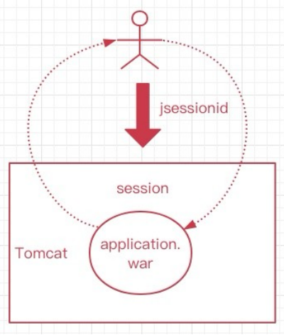
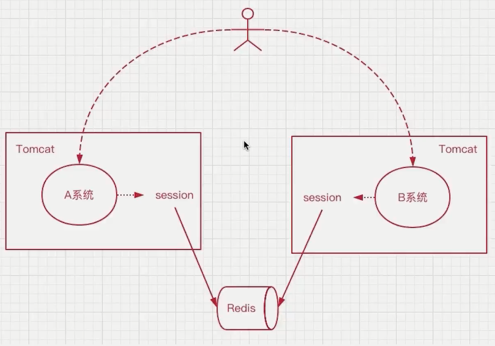
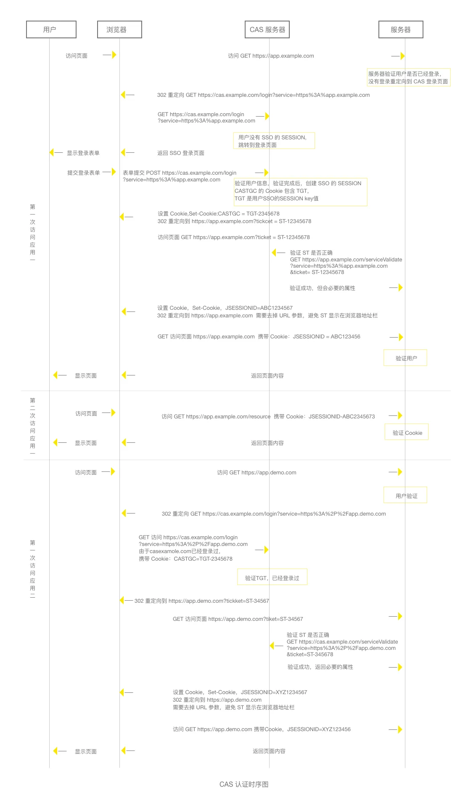

## 分布式会话

### 什么是会话

会话Session代表的是客户端与服务器的一次交互过程，这个过程可以是连续也可以是时断时续的。曾经的Servlet时代，一旦用户与服务端交互，tomcat会为用户创建一个session，同时前端会有一个jsessionid，每次交互都会携带。如此一来，服务器只要在接到用户请求时候，就可以拿到jsessionid，并根据这个ID在内存中找到对应的会话session，当拿到session会话后，那么我们就可以操作会话了。会话存活期间，我们就能认为用户一直处于正在使用着网站的状态，一旦session过期，就可以认为用户已经离开网站，停止交互了。用户的身份信息，我们也是通过session来判断的，在session中可以保存不同用户的信息。 session的使用之前在单体部分演示过，代码如下：

```java
@GetMapping("/setSession")
public Object setSession(HttpServletRequest request) {
    HttpSession session = request.getSession();
    session.setAttribute("userInfo", "new user");
    session.setMaxInactiveInterval(3600);
    session.getAttribute("userInfo");
    // session.removeAttribute("userInfo");
    return "ok";
}
```

### 无状态会话

HTTP请求是无状态的，用户向服务端发起多个请求，服务端并不会知道这多次请求都是来自同一用户，这个就是无状态的。cookie的出现就是为了有状态的记录用户。

常见的，ios与服务端交互，安卓与服务端交互，前后端分离，小程序与服务端交互，他们都是通过发起http来调用接口数据的，每次交互服务端都不会拿到客户端的状态，但是我们可以通过手段去处理，比如每次用户发起请求的时候携带一个userid或者user-token，如此一来，就能让服务端根据用户id或token来获得相应的数据。

### 有状态会话

Tomcat中的会话，就是有状态的，一旦用户和服务端交互，就有会话，会话保存了用户的信息，这样用户就“有状态”了，服务端会和每个客户端都保持着这样的一层关系，这个由容器来管理（也就是tomcat），这个session会话是保存到内存空间里的，如此一来，当不同的用户访问服务端，那么就能通过会话知道谁是谁了。如果用户不再和服务端交互，那么会话超时则消失，结束了他的生命周期。如此一来，每个用户其实都会有一个会话被维护，这就是有状态会话。 

场景：在传统项目或者jsp项目中是使用的最多的session都是有状态的，session的存在就是为了弥补http的无状态。

tomcat单机会话：



### 什么是分布式会话

使用中间件缓存不同微服务的会话。



## SSO

单点登录又称之为Single Sign On，简称SSO，单点登录可以通过基于用户会话的共享，他分为两种，第一种是通过分布式会话来实现。 

比如说现在有个一级域名为 www.imooc.com ，是教育类网站，但是慕课网有其他的产品线，可以通过构建二级域名提供服务给用户访问，比如： music.imooc.com,  blop.imooc.com等等，用户只需要在其中一个站点登录，那么其他站点也会随之而登录。也就是说，用户自始至终只在某一个网站下登录后，那么他所产生的会话，就共享给了其他的网站，实现了单点网站登录后，同时间接登录了其他的网站，那么单点登录，他们的会话是共享的，都是同一个用户会话。

### Cookie + Redis 实现 SSO

登录成功，后端返回一个 access_token，前端缓存在 Cookie 中。以后每次请求后端接口，都要带上 token，这样后端可以通过 token 拿到用户信息，维持用户的一个登录状态。

Cookie 可以在一定条件下共享：比如顶级域名 www.imooc.com 和 *.imooc.com 的 cookie 值是可以共享的。但是二级域名自己独立的 Cookie 是不能共享的，比如：music.imooc.com 的 Cookie 是不能被 mtv.imooc.com 共享，要共享必须设置为 `.imooc.com`。

### CAS

> [单点登录那些事儿（三）不同域下的单点登录 - 知乎 (zhihu.com)](https://zhuanlan.zhihu.com/p/203167741)
>
> [面试官：说说什么是单点登录？什么是SSO？什么是CAS？ - 掘金 (juejin.cn)](https://juejin.cn/post/7078257583995224094)
>
> [优化实战 第 25 期 - 基于Token前端实现SSO单点登录 - 掘金 (juejin.cn)](https://juejin.cn/post/7086343419626258445)

如果顶级域名都不一样，怎么办？比如 www.imooc.com 要和 www.mukewang.com，由于顶级域名不同，就不能实现cookie共享，无法单点登录。解决方案是使用  CAS（Central Authentication Service）系统。


假如有几个不同的应用，用户登录任何一个应用时都会跳转到 CAS 系统里，然后把登录的凭证保存到 CAS 的 Cookie中。也就是通过 CAS 这个中介的存在，间接的在几个不同的应用之间实现了 Cookie 的共享，从而实现单点登录。



CAS 涉及的几个概念：

1. 全局 ticket：保存到 CAS 服务器的 Cookie中，跳转 CAS 登录页时都要带上
2. 临时 ticket：应用（也叫做 CAS Client）可以通过临时 ticket 和 CAS 换取用户信息