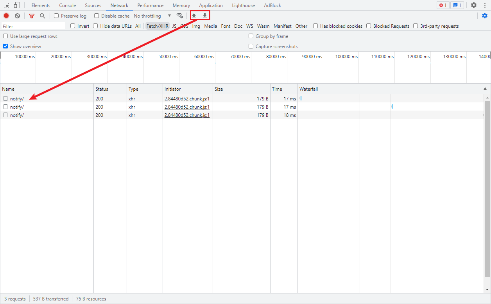

**打开Dev Tool**

F12

**打开命令菜单**

`Ctrl + Shift + p`

输入 dark，切换黑色主题。light：白色主题

screenshot 或 capture：截图。

dock：切换停靠位置

**element**

element tab 主要用来调试 css 样式。

在页面上的元素右键 -> 检查，就会在 element tab 中被选中。

`Ctrl + F`可以搜索 dom 元素

中间的 Styles 选项可以直接修改 css 样式，Computed 可以调试 flex、和 grid 布局。Layout 是分层样式，Event Listener 可以看事件

**console**

`$_`返回上一条语句的执行结果

**source**

在源文件中打断点调试

**network**

用于http调试。

initiator 表示请求是谁发起的。

左上角可以暂停监听网络请求和清空列表

preserve log，当在多个页面跳转的时候可以勾选，这样原来的页面的日志也会被保留。当勾选的时候，多次刷新一个页面可以发现日志都保留了下来

throttling：模拟网速对请求的影响

这两个上传/下载 HAR 文件可以查看浏览器和服务器交互的数据，当客户遇到问题时，可以导出 HAR 文件交给程序员来调试。

**application**

可以本地存储的一些数据。

在 console 中输入 `localStorage.setItem('name', 'jack')`，然后就可以在 application 中看到存储的数据了。

`localStorage.clear('name')`清除数据