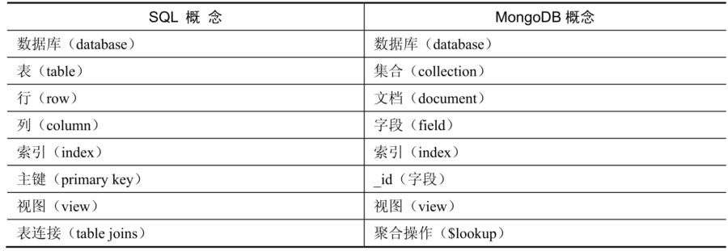

# 1. 概述

## 1.1 什么是 mongoDB 

MongoDB是NoSQL数据库中的佼佼者，目前是排名第一的文档型数据库。该数据库基于灵活的JSON文档模型，非常适合敏捷式的快速开发。与此同时，其与生俱来的高可用、高水平扩展能力使得它在处理海量、高并发的数据应用时颇具优势。

JSON具备无模式（schema 灵活）的特点，可以轻松地进行扩展。在访问MongoDB的“表”之前，并不需要事先对表模型进行声明（尽管你也可以这么做）。同时，当数据模型发生变更时，MongoDB不会强制要求你去执行表结构更新的相关操作，这提供了很大的便利性。

在MongoDB内部，BSON（一种二进制版本的JSON扩展）被真正用来存储这些JSON形式的文档数据。在JSON的基础之上，BSON进行了一些易用性方面的扩展，例如增加日期、二进制等类型的支持。

MongoDB 支持生命周期有限（TTL）集合，适用于保存将在特定时间过期的数据。

MongoDB通过副本集（replication set）来实现数据库的高可用，这点类似于MySQL的Master/Slave复制架构，不同的是，一个副本集可以由一个主节点和多个备节点组成，主节点和备节点基于 oplog 来实现数据同步。在主节点发生故障时，备节点将重新选举出新的主节点以继续提供服务，整个切换过程是自动完成的。

在海量数据处理方面，MongoDB原生就支持分布式计算能力。在一个分布式集群中，多个文档被划入一个逻辑数据块（chunk），这些数据块可以被存储于不同的计算节点（分片）上，在新的计算节点（分片）加入时，数据块可以借助自动均衡的算法机制被迁移到合适的位置（通常是压力较小的分片）。通过这种自动化的调度及均衡工作，整个集群的数据库读写压力可以被分摊到多个节点上，从而实现负载均衡和水平扩展。

MongoDB 并不具备关系数据库中的一些常见功能，特别是复杂的连接操作。MongoDB 通过使用 3.2 版本引入的 $lookup 聚合运算符以非常有限的方式支持连接操作。

## 1.2 基本概念



● 数据库（database）：最外层的概念，可以理解为逻辑上的名称空间，一个数据库包含多个不同名称的集合。

● 集合（collection）：相当于SQL中的表，一个集合可以存放多个不同的文档。

● 文档（document）：一个文档相当于数据表中的一行，由多个不同的字段组成。

● 字段（field）：文档中的一个属性，等同于列（column）。

● 索引（index）：独立的检索式数据结构，与SQL概念一致。

● _id：每个文档中都拥有一个唯一的_id字段，相当于SQL中的主键（primary key）。

● 视图（view）：可以看作一种虚拟的（非真实存在的）集合，与SQL中的视图类似。从MongoDB 3.4版本开始提供了视图功能，其通过聚合管道技术实现。

● 聚合操作（$lookup）：MongoDB用于实现“类似”表连接（table join）的聚合操作符。

MongoDB与传统RDBMS仍然存在不少差异，包括：

1. 半结构化，在一个集合中，文档所拥有的字段并不需要是相同的，而且也不需要对所用的字段进行声明。因此，MongoDB具有很明显的半结构化特点。除了松散的表结构，文档还可以支持多级的嵌套、数组等灵活的数据类型，非常契合面向对象的编程模型。
2. 弱关系，MongoDB没有外键的约束，也没有非常强大的表连接能力。类似的功能需要使用聚合管道技术来弥补。

MongoDB 自带了一个简单但功能强大的工具：mongo shell。它是一个功能齐全的 JavaScript 解释器，用户可以根据需求创建或加载自己的脚本。

### 1.2.1 文档

它是一组有序键值的集合。

文档中的键是字符串类型。`.` 和`$`是特殊字符，只能在某些特定情况下使用。通常来说，可以认为这两个字符属于保留字符，如果使用不当，那么驱动程序将无法正常工作。

MongoDB 中的文档不能包含重复的键。

### 1.2.2 集合

集合就是一组文档。

集合具有动态模式的特性。这意味着一个集合中的文档可以具有任意数量的不同“形状”。例如，以下两个文档可以存储在同一个集合中：

```json
{name: "Jack", age: 15}
{gender: "m"}
```

由于任何文档都可以放入集合中，因此经常会出现这样的问题：“为什么还需要多个集合呢？”既然不同类型的文档不需要区分模式，为什么还要使用多个集合呢？划分集合的作用主要是为了加速磁盘访问。