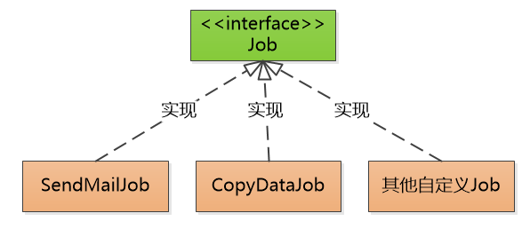
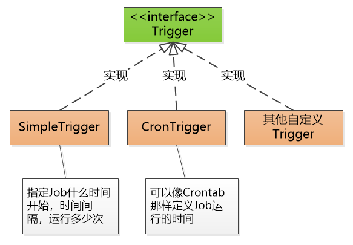
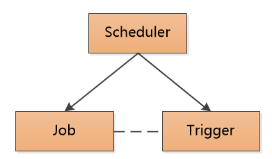
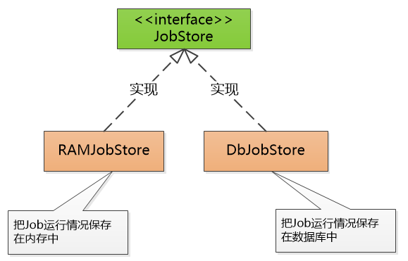
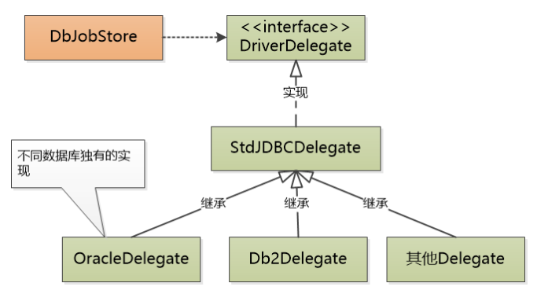

## 架构

任务抽象成 Job 接口：

触发的时间抽象成 Trigger 接口：

使用调度器将二者结合：

上面就是 Quartz 的核心。还有负责持久化任务的 JobStore 接口，确保断电恢复之后，任务的执行情况也不会丢失。

https://www.cnblogs.com/renzhuo/p/13539311.html

https://zhuanlan.zhihu.com/p/306591082