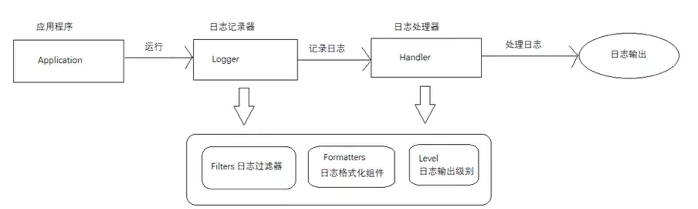

# 日志

https://mp.weixin.qq.com/s?__biz=MzAxOTc0NzExNg==&mid=2665513967&idx=1&sn=5586ce841a7e8b39adc2569f0eb5bb45&chksm=80d67bacb7a1f2ba38aa37620d273dfd7d7227667df556d36c84d125cafd73fef16464288cf9&scene=21#wechat_redirect


## 日志框架

1. 控制日志输出的内容和格式。
2. 控制日志输出的位置。
3. 日志文件文件相关的优化，如异步操作、归档、压缩..
4. 日志系统的维护
5. 面向接口开发-日志的门面

**日志框架的价值**

因为软件系统发展到了今天非常的复杂，特别是服务器的软件，涉及到的知识和内容问题非常的多。对于日志记录来讲，在某些方面使用别人研发好的成熟框架，这就相当于让别人帮你完成一些基础的工作。你只需要集中尽力去完成业务逻辑就可以了。

​	比如事物处理，日志记录等一些完全性的问题，我们使用框架去做不会影响业务的开发效率。	

​	同时框架是在不断升级的，我们可以不断的享受框架为我们带来的好处。

**市面流行的日志框架**

- JUL java util logging 
  - Java 原生日志框架

- Log4j
  - Apache 的一个开源项目。

- Logback
  - Log4j之父做的另一个开源项目
  - 业界称为log4j后浪
  - 一个可靠、通用且灵活的java日志框架
- log4j2
  - llog4j官方的第二个版本，各个放方面都是与logback及其相似具有插件式结构、备至文件优化等特征
  - springBoot1.4版本以后就不再支持log4j，所以第二个版本运营而成。
- JCL
- SLF4J 

**日志门面和日志实现的区别**

日志框架技JUL、logback、Log4j、Log4j2，用来方便有效地记录日志信息。

日志门面技术JCL、SLF4J。为什么要使用日志门面技术：

每一种日志框架都有自己单独的API，要使用对应的框架就要使用对应的API，这就大大的增加了应用成代码对日志框架的耦合性。我们使用日志门面技术之后，对于应用程序来说，无论底层的日志框架如何改变，应用程序不需要修改人意一行代码，就可以上线了。

## JUL



1. Logger：被叫做记录器，程序获取 Logger 对象，调用其 api 来发布日志信息。 Logger 通常被认为是访问日志系统的入口程序。
2. Handler：处理器，每个 Logger 都会关联一个或是一组 Handler，Logger 会将日志交给关联的 Handler 处理，由 Handler 负责将日志做记录。 Handler 决定日志的输出位置，调用哪个格式化组件。
3. Filter：决定哪些信息会被记录，哪些会被略过。
4. Formatter：格式化组件。决定了日志的输出格式。
5. Level：每条日志消息都有一个关联的级别，我们根据输出级别的设置，用来展现最终呈现的日志信息。

## log4j

1. Loggers：相当于 JUL 的 Logger 加上 Level
2. Appenders：相当于 JUL 的Handler
3. Layout：相当于Formatter，但是功能更强大

log4j 的 Loggers 也有父子关系，root 是所有 Logger 的父亲。

## logback

配置文件：

```xml
<configuration>
    # 控制台
    <appender name="stdout" class="ch.qos.logback.core.ConsoleAppender">
        <layout class="ch.qos.logback.classic.PatternLayout">
            # %d是日期 %p是级别 %m是日志消息 %n换行
            <Pattern>%d{yyyy-MM-dd HH:mm:ss} %-5p %m%n</Pattern>
        </layout>
    </appender>

    # 日志文件
    <appender name="fout" class="ch.qos.logback.core.FileAppender">
        <file>baeldung.log</file>
        <append>false</append>
        <encoder>
            <pattern>%d{yyyy-MM-dd HH:mm:ss} %-5p %m%n</pattern>
        </encoder>
    </appender>

    # 指定包的日志级别
    <logger name="org.mybatis" level="INFO"/>
    <logger name="org.springframework" level="INFO"/>

    # 启用的日志。默认级别info，低于此级别的不会输出
    # 级别: OFF > FATAL > ERROR > WARN > INFO > DEBUG > TRACE > ALL
    <root level="INFO">
        <appender-ref ref="stdout" />
        <appender-ref ref="fout" />
    </root>
</configuration>
```

logback一般和slf4j一起使用：

```java
import org.slf4j.Logger;
import org.slf4j.LoggerFactory;

public class Log4jExample {

    private static Logger logger = LoggerFactory.getLogger(Log4jExample.class);

    public static void main(String[] args) {
        logger.debug("Debug log message");
        logger.info("Info log message");
        logger.error("Error log message");
    }
}
```

