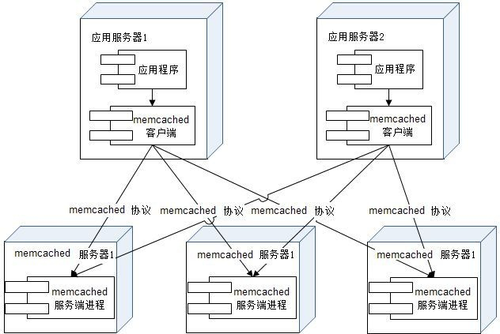

## 概述
网站架构关注的是网站性能、可用性、伸缩性、拓展性和安全性五个要素。如何打造一个高可用、高性能、易扩展、可伸缩且安全的网站？如何让网站随应用所需灵活变动，即使是山寨他人的产品，也可以山寨的更高、更快、更强，一年时间用户数从零过亿呢？

### 1.大型网站软件系统的特点
与传统企业应用系统相比，大型互联网应用系统有以下特点：

1. **高并发，大流量**：需要面对高并发用户，大流量访问。
2. **高可用**：系统7×24小时不间断服务。
3. **海量数据**：需要存储、管理海量数据，需要使用大量服务器。
4. **用户分布广泛，网络情况复杂**：许多大型互联网都是为全球用户提供服务的，用户分布范围广，各地网络情况千差万别。在国内，还有各个运营商网络互通难的问题。而中美光缆的数次故障，也让一些对国外用户依赖较大的网站不得不考虑在海外建立数据中心。
5. **安全环境恶劣**：由于互联网的开放性，使得互联网站更容易受到攻击，大型网站几乎每天都会被黑客攻击。
6. **需求快速变更，发布频繁**：和传统软件的版本发布频率不同，互联网产品为快速适应市场，满足用户需求，其产品发布频率是极高的。
7. **渐进式发展**：与传统软件产品或企业应用系统一开始就规划好全部的功能和非功能需求不同，几乎所有的大型互联网站都是从一个小网站开始，渐进地发展起来的。

### 2.大型网站架构演化发展历程

大型网站的技术挑战主要来自于庞大的用户，高并发的访问和海量的数据，任何简单的业务一旦需要处理数以P计的数据和面对数以亿计的用户，问题就会变得很棘手。大型网站架构主要就是解决这类问题。

**网站的初始架构**：

大型网站都是从小型网站发展而来，网站架构也是一样，是从小型网站架构逐步演化而来。小型网站最开始时没有太多人访问，只需要一台服务器就绰绰有余，这时的网站架构如图1.1所示。

.jpg)

应用程序、数据库、文件等所有的资源都在一台服务器上。通常服务器操作系统使用Linux，应用程序使用PHP开发，然后部署在Apache上，数据库使用MySQL，汇集各种免费开源软件及一台廉价服务器就可以开始网站的发展之路了。

**应用服务和数据服务分离：**

随着网站业务的发展，一台服务器逐渐不能满足需求：越来越多的用户访问导致性能越来越差，越来越多的数据导致存储空间不足。这时就需要将应用和数据分离。应用和数据分离后整个网站使用三台服务器：应用服务器、文件服务器和数据库服务器。这三台服务器对硬件资源的要求各不相同，应用服务器需要处理大量的业务逻辑，因此需要更快更强大的CPU；数据库服务器需要快速磁盘检索和数据缓存，因此需要更快的硬盘和更大的内存；文件服务器需要存储大量用户上传的文件，因此需要更大的硬盘。

**使用缓存改善网站性能：**

网站访问特点和现实世界的财富分配一样遵循二八定律：80%的业务访问集中在20%的数据上。既然大部分的业务访问集中在一小部分数据上，那么如果把这一小部分数据缓存在内存中，是不是就可以减少数据库的访问压力，提高整个网站的数据访问速度，改善数据库的写入性能了呢？

网站使用的缓存可以分为两种：缓存在应用服务器上的本地缓存和缓存在专门的分布式缓存服务器上的远程缓存。本地缓存的访问速度更快一些，但是受应用服务器内存限制，其缓存数据量有限，而且会出现和应用程序争用内存的情况。远程分布式缓存可以使用集群的方式，部署大内存的服务器作为专门的缓存服务器，可以在理论上做到不受内存容量限制的缓存服务，如图1.3所示。

使用缓存后，数据访问压力得到有效缓解，但是单一应用服务器能够处理的请求连接有限，在网站访问高峰期，应用服务器成为整个网站的瓶颈。

**应用服务器集群改善并发能力：**

使用集群是网站解决高并发、海量数据问题的常用手段。当一台服务器的处理能力、存储空间不足时，不要企图去换更强大的服务器，对大型网站而言，不管多么强大的服务器，都满足不了网站持续增长的业务需求。这种情况下，更恰当的做法是增加一台服务器分担原有服务器的访问及存储压力。

对网站架构而言，只要能通过增加一台服务器的方式改善负载压力，就可以以同样的方式持续增加服务器不断改善系统性能，从而实现系统的可伸缩性。应用服务器实现集群是网站可伸缩集群架构设计中较为简单成熟的一种，如图1.4所示。

**数据库读写分离：**

网站在使用缓存后，使绝大部分数据读操作访问都可以不通过数据库就能完成，但是仍有一部分读操作（缓存访问不命中、缓存过期）和全部的写操作需要访问数据库，在网站的用户达到一定规模后，数据库因为负载压力过高而成为网站的瓶颈。

目前大部分的主流数据库都提供主从热备功能，通过配置两台数据库主从关系，可以将一台数据库服务器的数据更新同步到另一台服务器上。网站利用数据库的这一功能，实现数据库读写分离，从而改善数据库负载压力，如图1.5所示。

**使用反向代理和CDN加速网络响应：**

有研究表明，网站访问延迟和用户流失率正相关，网站访问越慢，用户越容易失去耐心而离开。为了提供更好的用户体验，留住用户，网站需要加速网站访问速度。主要手段有使用CDN和反向代理，如图1.6所示。

CDN和反向代理的基本原理都是缓存，区别在于CDN部署在网络提供商的机房，使用户在请求网站服务时，可以从距离自己最近的网络提供商机房获取数据；而反向代理则部署在网站的中心机房，当用户请求到达中心机房后，首先访问的服务器是反向代理服务器，如果反向代理服务器中缓存着用户请求的资源，就将其直接返回给用户。

使用CDN和反向代理的目的都是尽早返回数据给用户，一方面加快用户访问速度，另一方面也减轻后端服务器的负载压力。

**使用分布式文件系统和分布式数据库系统：**

数据库经过读写分离后，从一台服务器拆分成两台服务器，但是随着网站业务的发展依然不能满足需求，这时需要使用分布式数据库。文件系统也是一样，需要使用分布式文件系统，如图1.7所示。

分布式数据库是网站数据库拆分的最后手段，只有在单表数据规模非常庞大的时候才使用。不到不得已时，网站更常用的数据库拆分手段是业务分库，将不同业务的数据库部署在不同的物理服务器上。

**使用NoSQL和搜索引擎：**

随着网站业务越来越复杂，对数据存储和检索的需求也越来越复杂，网站需要采用一些非关系数据库技术如NoSQL和非数据库查询技术如搜索引擎，如图1.8所示。

NoSQL和搜索引擎都是源自互联网的技术手段，对可伸缩的分布式特性具有更好的支持。应用服务器则通过一个统一数据访问模块访问各种数据，减轻应用程序管理诸多数据源的麻烦。

**业务拆分：**

大型网站为了应对日益复杂的业务场景，通过使用分而治之的手段将整个网站业务分成不同的产品线，如大型购物交易网站就会将首页、商铺、订单、买家、卖家等拆分成不同的产品线，分归不同的业务团队负责。

具体到技术上，也会根据产品线划分，将一个网站拆分成许多不同的应用，每个应用独立部署维护。应用之间可以通过一个超链接建立关系（在首页上的导航链接每个都指向不同的应用地址），也可以通过消息队列进行数据分发，当然最多的还是通过访问同一个数据存储系统来构成一个关联的完整系统，如图1.9所示。

**分布式服务：**

随着业务拆分越来越小，存储系统越来越庞大，应用系统的整体复杂度呈指数级增加，部署维护越来越困难。由于所有应用要和所有数据库系统连接，在数万台服务器规模的网站中，这些连接的数目是服务器规模的平方，导致存数据库接资源不足，拒绝服务。

既然每一个应用系统都需要执行许多相同的业务操作，比如用户管理、商品管理等，那么可以将这些共用的业务提取出来，独立部署。由这些可复用的业务连接数据库，提供共用业务服务，而应用系统只需要管理用户界面，通过分布式服务调用共用业务服务完成具体业务操作，如图1.10所示。

### 大型网站架构模式

为了解决大型网站面临的高并发访问、海量数据处理、高可靠运行等一系列问题与挑战，大型互联网公司在实践中提出了许多解决方案，以实现网站高性能、高可用、易伸缩、可扩展、安全等各种技术架构目标。

### 分层

分层是在横向对应用切分。最早的MVC模式，到阿里提出的中台组件。

#### 分割

分割是在纵向对应用切分。大型网站分割的粒度可能会很小。比如在应用层，将不同业务进行分割，例如将购物、论坛、搜索、广告分割成不同的应用，由独立的团队负责，部署在不同的服务器上；在同一个应用内部，如果规模庞大业务复杂，会继续进行分割，比如购物业务，可以进一步分割成机票酒店业务、3C业务，小商品业务等更细小的粒度。而即使在这个粒度上，还是可以继续分割成首页、搜索列表、商品详情等模块，这些模块不管在逻辑上还是物理部署上，都可以是独立的。同样在服务层也可以根据需要将服务分割成合适的模块。

#### 分布式

分布式提高了网站的可用性，但是也带来了更多的问题。

#### 集群

使用分布式虽然已经将分层和分割后的模块独立部署，但是对于用户访问集中的模块（比如网站的首页），还需要将独立部署的服务器集群化，即多台服务器部署相同应用构成一个集群，通过负载均衡设备共同对外提供服务。

因为服务器集群有更多服务器提供相同服务，因此可以提供更好的并发特性，当有更多用户访问的时候，只需要向集群中加入新的机器即可。同时因为一个应用由多台服务器提供，当某台服务器发生故障时，负载均衡设备或者系统的失效转移机制会将请求转发到集群中其他服务器上，使服务器故障不影响用户使用。所以在网站应用中，即使是访问量很小的分布式应用和服务，也至少要部署两台服务器构成一个小的集群，目的就是提高系统的可用性。

#### 缓存

缓存就是将数据存放在距离计算最近的位置以加快处理速度。缓存是改善软件性能的第一手段。

CDN、反向代理、本地缓存、分布式缓存都是常用的技术。

#### 异步

大型网站架构中，系统解耦合的手段除了前面提到的分层、分割、分布等，还有一个重要手段是异步，业务之间的消息传递不是同步调用，而是将一个业务操作分成多个阶段，每个阶段之间通过共享数据的方式异步执行进行协作。

### 大型网站重要指标

#### 1.性能

性能是网站的一个重要指标，除非是没得选择（比如只能到www.12306.cn这一个网站上买火车票），否则用户无法忍受一个响应缓慢的网站。一个打开缓慢的网站会导致严重的用户流失，很多时候网站性能问题是网站架构升级优化的触发器。可以说性能是网站架构设计的一个重要方面，任何软件架构设计方案都必须考虑可能会带来的性能问题。

也正是因为性能问题几乎无处不在，所以优化网站性能的手段也非常多，从用户浏览器到数据库，影响用户请求的所有环节都可以进行性能优化。

在浏览器端，可以通过浏览器缓存、使用页面压缩、合理布局页面、减少Cookie传输等手段改善性能。

还可以使用CDN，将网站静态内容分发至离用户最近的网络服务商机房，使用户通过最短访问路径获取数据。可以在网站机房部署反向代理服务器，缓存热点文件，加快请求响应速度，减轻应用服务器负载压力。

在应用服务器端，可以使用服务器本地缓存和分布式缓存，通过缓存在内存中的热点数据处理用户请求，加快请求处理过程，减轻数据库负载压力。

也可以通过异步操作将用户请求发送至消息队列等待后续任务处理，而当前请求直接返回响应给用户。

在网站有很多用户高并发请求的情况下，可以将多台应用服务器组成一个集群共同对外服务，提高整体处理能力，改善性能。

在代码层面，也可以通过使用多线程、改善内存管理等手段优化性能。在数据库服务器端，索引、缓存、SQL优化等性能优化手段都已经比较成熟。而方兴未艾的NoSQL数据库通过优化数据模型、存储结构、伸缩特性等手段在性能方面的优势也日趋明显。

衡量网站性能有一系列指标，重要的有响应时间、TPS、系统性能计数器等，通过测试这些指标以确定系统设计是否达到目标。这些指标也是网站监控的重要参数，通过监控这些指标可以分析系统瓶颈，预测网站容量，并对异常指标进行报警，保障系统可用性。

#### 2.可用性

对于大型网站而言，特别是知名网站，网站宕掉、服务不可用是一个重大的事故，轻则影响网站声誉，重则可能会摊上官司。对于电子商务类网站，网站不可用还意味着损失金钱和用户。因此几乎所有网站都承诺7724可用，但事实上任何网站都不可能达到完全的7724可用，总会有一些故障时间，扣除这些故障时间，就是网站的总可用时间，这个时间可以换算成网站的可用性指标，以此衡量网站的可用性，一些知名大型网站可以做到4个9以上的可用性，也就是可用性超过99.99％。

网站高可用的主要手段是冗余，应用部署在多台服务器上同时提供访问，数据存储在多台服务器上互相备份，任何一台服务器宕机都不会影响应用的整体可用，也不会导致数据丢失。

对于应用服务器而言，多台应用服务器通过负载均衡设备组成一个集群共同对外提供服务，任何一台服务器宕机，只需把请求切换到其他服务器就可实现应用的高可用，但是一个前提条件是应用服务器上不能保存请求的会话信息。否则服务器宕机，会话丢失，即使将用户请求转发到其他服务器上也无法完成业务处理。

对于存储服务器，由于其上存储着数据，需要对数据进行实时备份，当服务器宕机时需要将数据访问转移到可用的服务器上，并进行数据恢复以保证继续有服务器宕机的时候数据依然可用。

#### 3. 伸缩性

大型网站需要面对大量用户的高并发访问和存储海量数据，不可能只用一台服务器就处理全部用户请求，存储全部数据。网站通过集群的方式将多台服务器组成一个整体共同提供服务。所谓伸缩性是指通过不断向集群中加入服务器的手段来缓解不断上升的用户并发访问压力和不断增长的数据存储需求。

衡量架构伸缩性的主要标准就是是否可以用多台服务器构建集群，是否容易向集群中添加新的服务器。加入新的服务器后是否可以提供和原来的服务器无差别的服务。集群中可容纳的总的服务器数量是否有限制。

对于应用服务器集群，只要服务器上不保存数据，所有服务器都是对等的，通过使用合适的负载均衡设备就可以向集群中不断加入服务器。

对于缓存服务器集群，加入新的服务器可能会导致缓存路由失效，进而导致集群中大部分缓存数据都无法访问。虽然缓存的数据可以通过数据库重新加载，但是如果应用已经严重依赖缓存，可能会导致整个网站崩溃。需要改进缓存路由算法保证缓存数据的可访问性。

关系数据库虽然支持数据复制，主从热备等机制，但是很难做到大规模集群的可伸缩性，因此关系数据库的集群伸缩性方案必须在数据库之外实现，通过路由分区等手段将部署有多个数据库的服务器组成一个集群。

至于大部分NoSQL数据库产品，由于其先天就是为海量数据而生，因此其对伸缩性的支持通常都非常好，可以做到在较少运维参与的情况下实现集群规模的线性伸缩。

#### 4.拓展性

不同于其他架构要素主要关注非功能性需求，网站的扩展性架构直接关注网站的功能需求。网站快速发展，功能不断扩展，如何设计网站的架构使其能够快速响应需求变化，是网站可扩展架构主要的目的。

衡量网站架构扩展性好坏的主要标准就是在网站增加新的业务产品时，是否可以实现对现有产品透明无影响，不需要任何改动或者很少改动既有业务功能就可以上线新产品。不同产品之间是否很少耦合，一个产品改动对其他产品无影响，其他产品和功能不需要受牵连进行改动。

网站可伸缩架构的主要手段是事件驱动架构和分布式服务。

事件驱动架构在网站通常利用消息队列实现，将用户请求和其他业务事件构造成消息发布到消息队列，消息的处理者作为消费者从消息队列中获取消息进行处理。

通过这种方式将消息产生和消息处理分离开来，可以透明地增加新的消息生产者任务或者新的消息消费者任务。

分布式服务则是将业务和可复用服务分离开来，通过分布式服务框架调用。新增产品可以通过调用可复用的服务实现自身的业务逻辑，而对现有产品没有任何影响。可复用服务升级变更的时候，也可以通过提供多版本服务对应用实现透明升级，不需要强制应用同步变更。

大型网站为了保持市场地位，还会吸引第三方开发者，调用网站服务，使用网站数据开发周边产品，扩展网站业务。第三方开发者使用网站服务的主要途径是大型网站提供的开放平台接口。

#### 5.安全性

互联网是开放的，任何人在任何地方都可以访问网站。网站的安全架构就是保护网站不受恶意访问和攻击，保护网站的重要数据不被窃取。

衡量网站安全架构的标准就是针对现存和潜在的各种攻击与窃密手段，是否有可靠的应对策略。

## 性能

### 性能指标

1. 并发数
2. 响应时间
3. 吞吐量：对于网站，可以用“请求数/秒”或是“页面数/秒”来衡量，也可以用“访问人数/天”或是“处理的业务数/小时”等来衡量。TPS（每秒事务数）是吞吐量的一个常用量化指标，此外还有HPS（每秒HTTP请求数）、QPS（每秒查询数）等。
4. 性能计数器：它是描述服务器或操作系统性能的一些数据指标。包括System Load（系统负载，指当前使用的CPU资源占总CPU资源的比例）、对象与线程数、内存使用、CPU使用、磁盘与网络I/O等指标。这些指标也是系统监控的重要参数，对这些指标设置报警阈值，当监控系统发现性能计数器超过阈值时，就向运维和开发人员报警，及时发现处理系统异常。

### 性能分析

大型网站结构复杂，用户从浏览器发出请求直到数据库完成操作事务，中间需要经过很多环节，如果测试或者用户报告网站响应缓慢，存在性能问题，必须对请求经历的各个环节进行分析，排查可能出现性能瓶颈的地方，定位问题。

排查一个网站的性能瓶颈和排查一个程序的性能瓶颈的手法基本相同：检查请求处理的各个环节的日志，分析哪个环节响应时间不合理、超过预期；然后检查监控数据，分析影响性能的主要因素是内存、磁盘、网络、还是CPU，是代码问题还是架构设计不合理，或者系统资源确实不足。

### 性能优化

定位产生性能问题的具体原因后，就需要进行性能优化，根据网站分层架构，可分为Web前端性能优化、应用服务器性能优化、存储服务器性能优化3大类。

#### web前端性能优化

##### 浏览器访问优化

1. 减少http请求：在服务器端，每个HTTP都需要启动独立的线程去处理，减少HTTP请求的数目可有效提高访问性能。减少HTTP的主要手段是合并CSS、合并JavaScript、合并图片。多张图片合并成一张，如果每张图片都有不同的超链接，可通过CSS偏移响应鼠标点击操作，构造不同的URL。
2. 使用浏览器缓存：对一个网站而言，CSS、JavaScript、Logo、图标这些不经常更新的资源可以缓存在浏览器中，可以极好地改善性能。通过设置HTTP头中Cache-Control和Expires的属性，可设定浏览器缓存，缓存时间可以是数天，甚至是几个月。
3. 启用压缩：在服务器端对文件进行压缩，在浏览器端对文件解压缩，可有效减少通信传输的数据量，文本文件的压缩效率可达80％以上。但是压缩对服务器和浏览器产生一定的压力，在通信带宽良好，而服务器资源不足的情况下要权衡考虑。
4. CSS放在页面最上面，JavaScript放在页面最下面：浏览器会在下载完全部CSS之后才对整个页面进行渲染，因此最好的做法是将CSS放在页面最上面，让浏览器尽快下载。JavaScript则相反，浏览器在加载JavaScript后立即执行，有可能会阻塞整个页面，造成页面显示缓慢，因此JavaScript最好放在页面最下面。
5. 减少Cookie传输：一方面，Cookie包含在每次请求和响应中，太大的Cookie会严重影响数据传输，因此哪些数据需要写入Cookie需要慎重考虑，尽量减少Cookie中传输的数据量。另一方面，对于某些静态资源的访问，如CSS、Script等，发送Cookie没有意义，可以考虑静态资源使用独立域名访问，避免请求静态资源时发送Cookie，减少Cookie传输的次数。

##### CDN加速

##### 反向代理

传统代理在浏览器一侧，而反向代理在服务器一侧。

和传统代理服务器可以保护浏览器安全一样，反向代理服务器也具有保护网站安全的作用，来自互联网的访问请求必须经过代理服务器。

除了安全功能，代理服务器也可以通过配置缓存功能加速Web请求。当用户第一次访问静态内容的时候，静态内容就被缓存在反向代理服务器上，这样当其他用户访问该静态内容的时候，就可以直接从反向代理服务器返回，加速Web请求响应速度，减轻Web服务器负载压力。事实上，有些网站会把动态内容也缓存在代理服务器上，比如维基百科及某些博客论坛网站，把热门词条、帖子、博客缓存在反向代理服务器上加速用户访问速度，当这些动态内容有变化时，通过内部通知机制通知反向代理更新缓存。

此外，反向代理也可以实现负载均衡的功能。

#### 应用服务器性能优化

应用服务器就是处理网站业务的服务器，网站的业务代码都部署在这里，是网站开发最复杂，变化最多的地方，优化手段主要有缓存、集群、异步等。

##### 分布式缓存

缓存的合理使用：

1. 只保存频繁使用，但不频繁修改的数据。一般来说，数据的读写比应该在 2:1 以上，缓存才有意义。
2. 数据不一致：一般会对缓存设置失效时间，但是需要忍受一定时间的数据不一致。还可以设置在数据库更新时同步更新缓存的策略，但是带来了更多的系统开销。
3. 缓存可用性：当缓存会承担大部分数据访问的压力时，数据库已经习惯了有缓存的日子，所以当缓存服务崩溃时，数据库会因为完全不能承受如此大的压力而宕机，进而导致整个网站不可用。这种情况被称作缓存雪崩，发生这种故障，甚至不能简单地重启缓存服务器和数据库服务器来恢复网站访问。缓存集群可以解决此类问题。
4. 缓存预热：新启动的缓存系统如果没有任何数据，在重建缓存数据的过程中，系统的性能和数据库负载都不太好，那么最好在缓存系统启动时就把热点数据加载好，这个缓存预加载手段叫作缓存预热（warm up）。对于一些元数据如城市地名列表、类目信息，可以在启动时加载数据库中全部数据到缓存进行预热。
5. 缓存穿透：如果因为不恰当的业务、或者恶意攻击持续高并发地请求某个不存在的数据，由于缓存没有保存该数据，所有的请求都会落到数据库上，会对数据库造成很大压力，甚至崩溃。一个简单的对策是将不存在的数据也缓存起来（其value值为null）。

##### 分布式缓存架构

布式缓存指缓存部署在多个服务器组成的集群中，以集群方式提供缓存服务，其架构方式有两种，一种是以JBoss Cache为代表的需要更新同步的分布式缓存，一种是以Memcached为代表的不互相通信的分布式缓存。

JBoss Cache的分布式缓存在集群中所有服务器中保存相同的缓存数据，当某台服务器有缓存数据更新的时候，会通知集群中其他机器更新缓存数据或清除缓存数据，如图4.9所示。JBoss Cache通常将应用程序和缓存部署在同一台服务器上，应用程序可从本地快速获取缓存数据，但是这种方式带来的问题是缓存数据的数量受限于单一服务器的内存空间，而且当集群规模较大的时候，缓存更新信息需要同步到集群所有机器，其代价惊人。因而这种方案更多见于企业应用系统中，而很少在大型网站使用。

大型网站需要缓存的数据量一般都很庞大，可能会需要数TB的内存做缓存，这时候就需要另一种分布式缓存，如图4.10所示。Memcached采用一种集中式的缓存集群管理，也被称作互不通信的分布式架构方式。缓存与应用分离部署，缓存系统部署在一组专门的服务器上，应用程序通过一致性Hash等路由算法选择缓存服务器远程访问缓存数据，缓存服务器之间不通信，缓存集群的规模可以很容易地实现扩容，具有良好的可伸缩性。

##### Memcached

Memcached曾一度是网站分布式缓存的代名词，被大量网站使用。其简单的设计、优异的性能、互不通信的服务器集群、海量数据可伸缩的架构令网站架构师们趋之若鹜。

内存管理中一个令人头痛的问题就是内存碎片管理。操作系统、虚拟机垃圾回收在这方面想了许多办法：压缩、复制等。Memcached使用了一个非常简单的办法——固定空间分配。Memcached将内存空间分为一组slab，每个slab里又包含一组chunk，同一个slab里的每个chunk的大小是固定的，拥有相同大小chunk的slab被组织在一起，叫作slab_class，如图4.11所示。存储数据时根据数据的Size大小，寻找一个大于Size的最小chunk将数据写入。这种内存管理方式避免了内存碎片管理的问题，内存的分配和释放都是以chunk为单位的。和其他缓存一样，Memcached采用LRU算法释放最近最久未被访问的数据占用的空间，释放的chunk被标记为未用，等待下一个合适大小数据的写入。

集群内服务器互不通信使得集群可以做到几乎无限制的线性伸缩，这也正是目前流行的许多大数据技术的基本架构特点。

##### 异步操作

消息队列可以提高并发数量、加快响应速度、削峰添谷。

但需要注意的是，由于数据写入消息队列后立即返回给用户，数据在后续的业务校验、写数据库等操作可能失败，因此在使用消息队列进行业务异步处理后，需要适当修改业务流程进行配合，如订单提交后，订单数据写入消息队列，不能立即返回用户订单提交成功，需要在消息队列的订单消费者进程真正处理完成该订单，甚至商品出库后，再通过邮件或sms等方式通知用户。

##### 多线程

从资源利用的角度看，使用多线程的原因主要有两个：IO阻塞与多CPU。

多线程编程一个需要注意的问题是线程安全问题。编程上，解决线程安全的主要手段有如下几点：

1. 使用无状态对象：Java Web开发中常用的Servlet对象就设计为无状态对象，可以被应用服务器多线程并发调用处理用户请求。而Web开发中常用的贫血模型（https://blog.csdn.net/Veritas_C/article/details/103718315）对象都是些无状态对象。
2. 使用局部对象：即在方法内部创建对象，这些对象会被每个进入该方法的线程创建。
3. 使用锁：可以将对数据的访问转为串行。

##### 资源复用

系统运行时，要尽量减少那些开销很大的系统资源的创建和销毁，比如数据库连接、网络通信连接、线程、复杂对象等。从编程角度，资源复用主要有两种模式：单例（Singleton）和对象池（Object Pool）。

单例虽然是GoF经典设计模式中较多被诟病的一个模式，但由于目前Web开发中主要使用贫血模式，从Service到Dao都是些无状态对象，无需重复创建，使用单例模式也就自然而然了。事实上，Java开发常用的对象容器Spring默认构造的对象都是单例（需要注意的是Spring的单例是Spring容器管理的单例，而不是用单例模式构造的单例）。

对于数据库连接对象，都使用数据库连接池。前面说过，对于每个Web请求（HTTP Request），Web应用服务器都需要创建一个独立的线程去处理，这方面，应用服务器也采用线程池（Thread Pool）的方式。

#### 存储性能优化

虽然可以使用缓存，但是磁盘通常仍然是系统最严重的瓶颈。

##### B+树 vs. LSM树

由于传统的机械磁盘具有快速顺序读写、慢速随机读写的访问特性，这个特性对磁盘存储结构和算法的选择影响甚大。

为了改善数据访问特性，文件系统或数据库系统通常会对数据排序后存储，加快数据检索速度，这就需要保证数据在不断更新、插入、删除后依然有序，传统关系数据库的做法是使用B＋树，如图4.20所示。

B＋树是一种专门针对磁盘存储而优化的N叉排序树，以树节点为单位存储在磁盘中，从根开始查找所需数据所在的节点编号和磁盘位置，将其加载到内存中然后继续查找，直到找到所需的数据。

目前数据库多采用两级索引的B＋树，树的层次最多三层。因此可能需要5次磁盘访问才能更新一条记录（三次磁盘访问获得数据索引及行ID，然后再进行一次数据文件读操作及一次数据文件写操作）。

但是由于每次磁盘访问都是随机的，而传统机械硬盘在数据随机访问时性能较差，每次数据访问都需要多次访问磁盘影响数据访问性能。

目前许多NoSQL产品采用LSM树作为主要数据结构，如图4.21所示。

LSM树可以看作是一个N阶合并树。数据写操作（包括插入、修改、删除）都在内存中进行，并且都会创建一个新记录（修改会记录新的数据值，而删除会记录一个删除标志），这些数据在内存中仍然还是一棵排序树，当数据量超过设

定的内存阈值后，会将这棵排序树和磁盘上最新的排序树合并。当这棵排序树的数据量也超过设定阈值后，和磁盘上下一级的排序树合并。合并过程中，会用最新更新的数据覆盖旧的数据（或者记录为不同版本）。

在需要进行读操作时，总是从内存中的排序树开始搜索，如果没有找到，就从磁盘上的排序树顺序查找。

在LSM树上进行一次数据更新不需要磁盘访问，在内存即可完成，速度远快于B＋树。当数据访问以写操作为主，而读操作则集中在最近写入的数据上时，使用LSM树可以极大程度地减少磁盘的访问次数，加快访问速度。

作为存储结构，B＋树不是关系数据库所独有的，NoSQL数据库也可以使用B＋树。同理，关系数据库也可以使用LSM，而且随着SSD硬盘的日趋成熟及大容量持久存储的内存技术的出现，相信B＋树这一“古老”的存储结构会再次焕发青春。