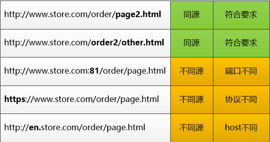
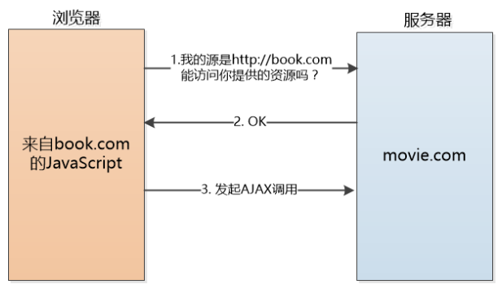
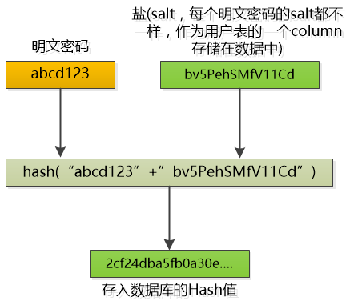

## 同源策略

概念：除非两个网页是来自于统一‘源头’， 否则不允许一个网页的JavaScript访问另外一个网页的内容，像Cookie，DOM，LocalStorage统统禁止访问！

来源：早期的恶意网站会去访问银行网站的cookie，伪装成用户的身份。或者在iframe里嵌入银行的登录页，通过js修改DOM，把登录接口指向自己的url，这样就盗取了用户的密码。同源策略限制了JavaScript的权限，提升了安全性。

什么是“同源”？指的是 protocol、host、port 三者必须一样。比如一个网页：`http://www.store.com/product/page.html`。

### 例外

对于使用`<script src='xxxxx'> `加载的JavaScript，不受同源策略的限制。这样就可以方便的引入外部的JS库了。其实这种嵌入式的跨域加载资源的方式还有``,`<link>`等，相当于我们浏览器发起了一次GET请求，取到相关资源，然后放到本地而已。

如果两个网页的一级域名是相同的，他们可以共享cookie, 不过cookie的domain一定要设置为那个一级域名才可以，例如：`document.cookie = 'test=true;path=/;domain=store.com`。这样 `login.store.com` 就可以和` www.store.com `共享cookie了。

因为现在大量使用 AJAX 异步获取资源，对于这种XMLHttpRequest的请求，浏览器不做同源限制，而是把限制交给了服务器。服务器可以设置一个白名单，列出允许那些服务器的 AJAX 请求。这个方法叫做Cross Origin Resource Sharing，简称**CORS**，需要服务器的配合。

### 攻击方法

> http://mp.weixin.qq.com/s?__biz=MzAxOTc0NzExNg==&mid=2665514169&idx=1&sn=f6f8dffdb29c4075d094dd7203189e5b&chksm=80d67cfab7a1f5ecb7daf768a0364879c0d26483fd2e595d67bcf82822c5fbb9525323956d51&scene=21#wechat_redirect

## 防止SQL注入

> http://mp.weixin.qq.com/s?__biz=MzAxOTc0NzExNg==&mid=2665514255&idx=1&sn=d187867dbd547351350b608a4810ab67&chksm=80d67d4cb7a1f45a227150ae0c4728ae2d23224de808308e735abf20b258decb30ac92ce9b34&scene=21#wechat_redirect

## 密文保存密码

> https://mp.weixin.qq.com/s?__biz=MzAxOTc0NzExNg==&mid=2665514752&idx=1&sn=f6e3c65d85d92c7988d167d4d3401be4&chksm=80d67f43b7a1f655a79163eaa08156fd604957a61622930d8bf0bae3caf3ddd4808cf8538e82&scene=21#wechat_redirect

## OAuth

> https://mp.weixin.qq.com/s?src=11&timestamp=1674981965&ver=4317&signature=VCyPS80CuMHuocFKK2A2D6hjDuEC0mbqH7RGXAVVmDM4XhBoR6HkqoKxHPUiJuA98*egbk3c84q9zEH7XSv4QSLO4Z0AYgJ4B9K7dyTojFFgmu-Dly41C*nWcrzqqkXJ&new=1